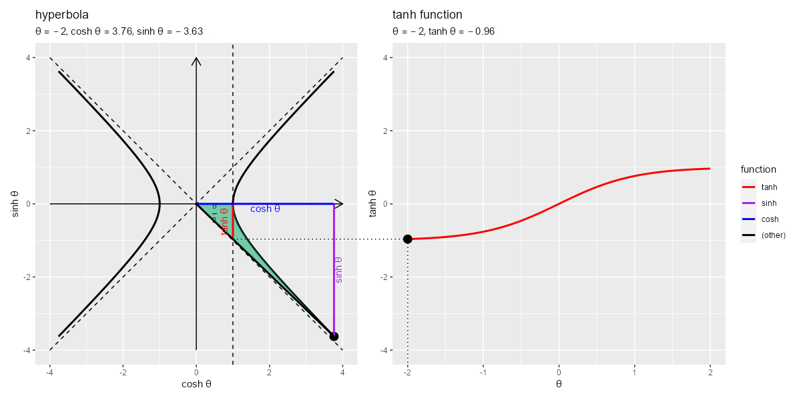
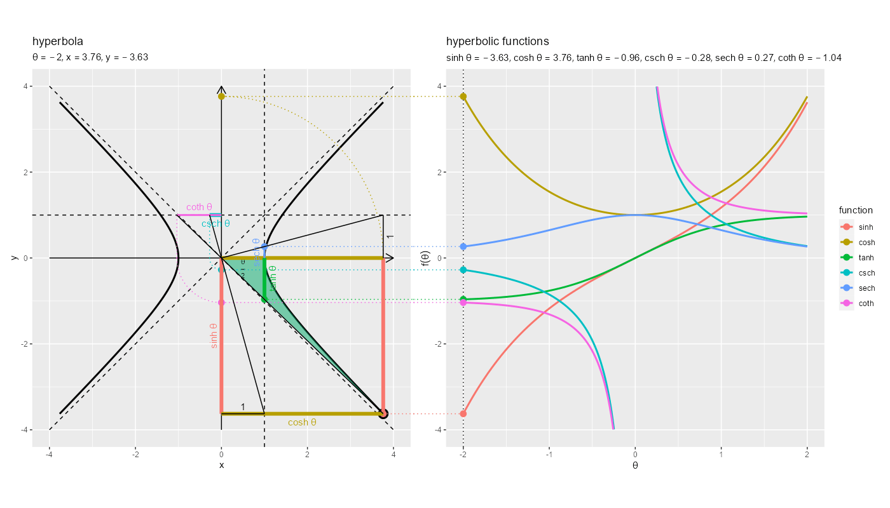

```{r setup, include=FALSE}
knitr::opts_chunk$set(
  echo = TRUE, 
  message = FALSE, error = FALSE, warning = FALSE # メッセージを非表示
)
```

----

【編集履歴】

- 2023/02/17：「双曲線の可視化」を追加
- 2023/02/18：「tanh関数の可視化」を追加
- 2023/02/22：「sinh関数の可視化」を追加
- 2023/02/23：「cosh関数の可視化」を追加
- 2023/02/24：「csch関数の可視化」「sech関数の可視化」「coth関数の可視化」を追加
- 2023/02/27：「双曲線関数の可視化」を追加

----


# 双曲線の作図

　横向きの双曲線(hyperbola)のグラフを作成します。\
\

　利用するパッケージを読み込みます。

```{r, eval=FALSE}
# 利用パッケージ
library(tidyverse)
```

```{r, echo=FALSE}
###資料作成用:(チェック用)

library(ggplot2)
```

　この記事では、基本的に`パッケージ名::関数名()`の記法を使うので、パッケージを読み込む必要はありません。ただし、作図コードがごちゃごちゃしないようにパッケージ名を省略しているため`ggplot2`を読み込む必要があります。\
　また、ネイティブパイプ演算子`|>`を使っています。`magrittr`パッケージのパイプ演算子`%>%`に置き換えても処理できますが、その場合は`magrittr`も読み込む必要があります。\
\


## 定義式の確認

　まずは、双曲線の定義式を確認します。\
\


### 双曲線

　双曲線は、次の式で定義されます。

$$
\frac{x^2}{a^2} + \frac{y^2}{b^2}
    = 1
$$

　座標(x軸とy軸の値)は、それぞれ次の式で計算できます。

$$
\begin{cases}
    x = \pm a \cosh \theta \\
    y = b \sinh \theta
\end{cases}
$$

　$\sinh \theta$はハイパボリックサイン関数、$\cosh \theta$はハイパボリックコサイン関数です。\

　双曲線の漸近線は、次の式です。

$$
\frac{x}{a} \pm \frac{y}{b}
    = 0
$$

　この式を$y$について解くと、次の式になります。

$$
y   = \pm \frac{b}{a} x
$$

\ 


### 単位双曲線

　また、単位双曲線は、次の式で定義されます。

$$
x^2 + y^2
    = 1
$$

　$a = 1, b = 1$のときの双曲線の式です。\
　座標は、それぞれ次の式で計算できます。

$$
\begin{cases}
    x = \pm \cosh \theta \\
    y = \sinh \theta
\end{cases}
$$

　単位双曲線の漸近線は、次の式です。

$$
x \pm y
    = 0
$$

　この式を$y$について解くと、次の式になります。

$$
y   = \pm x
$$

\ 

　これらの式を使ってグラフを作成します。\
\


## 単位双曲線の作図

　次は、単位双曲線のグラフを作成します。\
\


### 線ごとに描画

　双曲線を描画するためのデータフレームを作成します。

```{r}
# 双曲線の描画用
hyperbola_df <- tibble::tibble(
  theta = seq(from = -2, to = 2, by = 0.002), # 範囲を指定
  x = cosh(theta), 
  y = sinh(theta)
)
hyperbola_df
```

　変数$\theta$として用いる値を`theta`列として作成して、x軸の値としてcosh関数$\cosh \theta$、y軸の値としてsinh関数$\sinh \theta$を計算します。\

　グラフサイズ用の値を作成します。

```{r}
# 軸の最大値を設定
axis_max <- max(hyperbola_df[["x"]])
axis_max
```

　$\cosh \theta$の最大値を`axis_max`とします。\

　漸近線を描画するためのデータフレームを作成します。

```{r}
# 漸近線の描画用
asymptote_df <- tibble::tibble(
  x = seq(from = -axis_max, to = axis_max, length.out = 100), 
  y = x
)
asymptote_df
```

　`-axis_max`から`axis_max`の範囲を$x$として、$y = x$とあわせて格納します。\

　双曲線の間の領域を描画するためのデータフレームを作成します。

```{r}
# 正方形グリッドの描画用
square_df <- tibble::tibble(
  x = c(1, 1, -1, -1, 1), 
  y = c(1, -1, -1, 1, 1)
)
square_df
```

　$x = \pm 1$と$y = \pm 1$の直線の4つの交点の座標を格納します。\

　単位双曲線のグラフを作成します。

```{r, fig.width=7, fig.height=6, dpi=100}
# 単位双曲線を作図
ggplot() + 
  geom_segment(mapping = aes(x = -axis_max, y = 0, xend = axis_max, yend = 0), 
               arrow = arrow(length = unit(10, units = "pt"))) + # x軸線
  geom_segment(mapping = aes(x = 0, y = -axis_max, xend = 0, yend = axis_max), 
               arrow = arrow(length = unit(10, units = "pt"))) + # y軸線
  geom_path(data = square_df, 
            mapping = aes(x = x, y = y, linetype = "grid")) + # 正方形グリッド
  geom_line(data = asymptote_df, 
            mapping = aes(x = x, y = y, linetype = "asymptote")) + # 漸近線(正の傾き)
  geom_line(data = asymptote_df, 
            mapping = aes(x = x, y = -y, linetype = "asymptote")) + # 漸近線(負の傾き)
  geom_path(data = hyperbola_df, 
            mapping = aes(x = x, y = y, linetype = "hyperbola"), 
            size = 1) + # 双曲線(第1,2象限)
  geom_path(data = hyperbola_df, 
            mapping = aes(x = -x, y = y, linetype = "hyperbola"), 
            size = 1) + # 双曲線(第3,4象限)
  scale_linetype_manual(breaks = c("hyperbola", "asymptote", "grid"), 
                        values = c("solid", "dashed", "dotted"), 
                        labels = c(expression(x^2 - y^2 == 1), 
                                   expression(x %+-% y == 0), 
                                   expression(list(x == {} %+-% 1, y == {} %+-% 1))), 
                        name = "formula") + # 線の種類:(凡例表示用)
  guides(linetype = guide_legend(override.aes = list(size = c(0.5, 0.5, 0.5), 
                                                     linetype = c("solid", "dashed", "dotted")))) + # 凡例の体裁:(凡例表示用)
  theme(legend.text.align = 0.5) + # 凡例の体裁:(凡例表示用)
  coord_fixed(ratio = 1, 
              xlim = c(-axis_max, axis_max), ylim = c(-axis_max, axis_max), expand = FALSE) + # 表示範囲
  labs(title = "unit hyperbola", 
       x = "x", y = "y")
```

　横軸を$\cosh \theta$と$-\cosh \theta$、縦軸を$\sinh \theta$として、(`geom_line()`ではなく)`geom_path()`で双曲線を描画します。綺麗な双曲線を描画するには`coord_***()`のアスペクト比の引数`ratio`に`1`を指定します。\
　横軸を$x$、縦軸を$y$と$-y$として、`geom_line()`または`geom_path()`で漸近線を描画します。\
　x軸とy軸を`geom_segment()`で描画します。線分の始点の座標の引数`x, y`、終点の座標の引数`xend, yend`にそれぞれグラフサイズ`axis_max`を使って指定します。\
\


### まとめて描画

　先ほどは、線ごとに`geom_***()`を使って作図しました。次は、双曲線と漸近線について、それぞれ2つの線の値をデータフレームに格納しておき、1つの関数で作図します。\
\

　双曲線を描画するためのデータフレームを作成します。

```{r}
# 作図用の変数の値を指定
theta_vec <- seq(from = -2, to = 2, by = 0.002)

# 双曲線の描画用
hyperbola_df <- tibble::tibble(
  t = theta_vec, 
  sinh_t = sinh(theta_vec), 
  cosh_t_plus = cosh(theta_vec),  # 第1,2象限
  cosh_t_minus = -cosh(theta_vec) # 第3,4象限
) |> 
  tidyr::pivot_longer(
    cols = c(cosh_t_plus, cosh_t_minus), 
    names_to = "sign", # 符号
    names_prefix = "cosh_t_", 
    values_to = "cosh_t"
  ) # 列をまとめる
hyperbola_df
```

　$- \cos \theta$と$\cos \theta$を別の列として作成し、`pivot_longer()`で1列にまとめます。\
　あるいは、それぞれ複製して格納します。

```{r}
# 双曲線の描画用
hyperbola_df <- tibble::tibble(
  t = c(theta_vec, theta_vec), 
  sinh_t = c(sinh(theta_vec), sinh(theta_vec)), 
  cosh_t = c(cosh(theta_vec), -cosh(theta_vec)), 
  sign = rep(c("plus", "minus"), each = length(theta_vec))# 符号
)
hyperbola_df
```

　2つの曲線を区別するための符号列`sign`を作成します。\

　グラフサイズ用の値を作成します。

```{r}
# 軸の最大値を設定
axis_max <- hyperbola_df[["cosh_t"]] |> 
  max() |> 
  ceiling()
axis_max
```

\ 

　漸近線の描画用のデータフレームを作成します。

```{r}
# 漸近線の描画用
asymptote_df <- tibble::tibble(
  x = seq(from = -axis_max, to = axis_max, length.out = 100), 
  y_plus = x,  # 正の傾き
  y_minus = -x # 負の傾き
) |> 
  tidyr::pivot_longer(
    cols = c(y_plus, y_minus), 
    names_to = "slope", # 符号
    names_prefix = "y_", 
    values_to = "y"
  ) # 列をまとめる
asymptote_df
```

　$y = x$と$y = -x$を別の列として作成して1列にまとめます。\
　あるいは、それぞれ複製して格納します。

```{r}
# 漸近線の描画用
asymptote_df <- tibble::tibble(
  x = seq(from = -axis_max, to = axis_max, length.out = 100) |> 
    rep(times = 2), 
  y = rep(c(1, -1), each = 100) * x, 
  slope = rep(c("plus", "minus"), each = 100) # 符号
)
asymptote_df
```

　2つの直線を区別するための傾きの符号列`slope`を作成します。\

　x軸とy軸を描画するためのデータフレームを作成します。

```{r}
# 軸線の描画用
axis_df <- tibble::tibble(
  x_from = c(-axis_max, 0), 
  y_from = c(0, -axis_max), 
  x_to = c(axis_max, 0), 
  y_to = c(0, axis_max), 
  axis = c("x", "y") # 軸
)
axis_df
```

　始点の座標を`x_from, y_from`列、終点の座標を`x_to, y_to`列として格納します。\

　単位双曲線のグラフを作成します。

```{r, fig.width=6, fig.height=6, dpi=100}
# 単位双曲線を作図
ggplot() + 
  geom_segment(data = axis_df, 
               mapping = aes(x = x_from, y = y_from, xend = x_to, yend = y_to, group = "axis"), 
               arrow = arrow(length = unit(10, units = "pt"))) + # 軸線
  geom_path(data = square_df, 
            mapping = aes(x = x, y = y), 
            linetype = "dotted") + # 正方形グリッド
  geom_line(data = asymptote_df, 
            mapping = aes(x = x, y = y, group = slope), 
            linetype = "dashed") + # 漸近線
  geom_path(data = hyperbola_df, 
            mapping = aes(x = cosh_t, y = sinh_t, group = sign), 
            size = 1) + # 双曲線
  theme(legend.text.align = 0.5) + # 凡例の体裁:(凡例表示用)
  coord_fixed(ratio = 1, 
              xlim = c(-axis_max, axis_max), ylim = c(-axis_max, axis_max)) + # 表示範囲
  labs(title = "unit hyperbola", 
       x = "x", y = "y")
```

　双曲線と漸近線、軸線について、2つの線を別々に描画するために`group`引数に2つの線を区別するための列を指定します。\

　こちらの処理方法を別記事の双曲線関数の可視化で利用します。\
\


## 双曲線の作図

　最後に、(一般化した)双曲線のグラフを作成します。\
\

　定数を指定して、双曲線を描画するためのデータフレームを作成します。

```{r}
# 定数を指定
a <- 2
b <- 3

# 双曲線の描画用
hyperbola_df <- tibble::tibble(
  theta = seq(from = -2, to = 2, by = 0.002), # 範囲を指定
  x = a * cosh(theta), 
  y = b * sinh(theta)
)
hyperbola_df
```

　変数$\theta$として用いる値を`theta`列として作成して、x軸の値$a \cosh \theta$、y軸の値$b \sinh \theta$を計算します。\

　グラフサイズ用の値を作成します。

```{r}
# 軸の最大値を設定
x_max <- max(hyperbola_df[["x"]])
y_max <- max(hyperbola_df[["y"]])
x_max; y_max
```

　$a \cosh \theta$の最大値を`x_max`、$b \sinh \theta$の最大値を`y_max`とします。\

　漸近線を描画するためのデータフレームを作成します。

```{r}
# 漸近線の描画用
asymptote_df <- tibble::tibble(
  x = seq(from = -x_max, to = x_max, length.out = 100), 
  y = b * x / a
)
asymptote_df
```

　`-axis_max`から`axis_max`の範囲を$x$として、$y = \frac{b}{a} x$を計算します。\

　双曲線の間の領域を描画するためのデータフレームを作成します。

```{r}
# 長方形グリッドの描画用
square_df <- tibble::tibble(
  x = c(a, a, -a, -a, a), 
  y = c(b, -b, -b, b, b)
)
square_df
```

　$x = \pm a$と$y = \pm b$の直線の4つの交点の座標を格納します。\

　双極性のグラフを作成します。

```{r, fig.width=6, fig.height=6, dpi=100}
# 双曲線を作図
ggplot() + 
  geom_segment(mapping = aes(x = -x_max, y = 0, xend = x_max, yend = 0), 
               arrow = arrow(length = unit(10, units = "pt"))) + # x軸線
  geom_segment(mapping = aes(x = 0, y = -y_max, xend = 0, yend = y_max), 
               arrow = arrow(length = unit(10, units = "pt"))) + # y軸線
  geom_path(data = square_df, 
            mapping = aes(x = x, y = y, linetype = "grid")) + # 長方形グリッド
  geom_line(data = asymptote_df, 
            mapping = aes(x = x, y = y, linetype = "asymptote")) + # 漸近線(正の傾き)
  geom_line(data = asymptote_df, 
            mapping = aes(x = x, y = -y, linetype = "asymptote")) + # 漸近線(負の傾き)
  geom_path(data = hyperbola_df, 
            mapping = aes(x = x, y = y, linetype = "hyperbola"), 
            size = 1) + # 双曲線(第1,2象限)
  geom_path(data = hyperbola_df, 
            mapping = aes(x = -x, y = y, linetype = "hyperbola"), 
            size = 1) + # 双曲線(第3,4象限)
  scale_linetype_manual(breaks = c("hyperbola", "asymptote", "grid"), 
                        values = c("solid", "dashed", "dotted"), 
                        labels = c(expression(frac(x^2, a^2) - frac(y^2, b^2) == 1), 
                                   expression(frac(x, a) %+-% frac(y, b) == 0), 
                                   expression(list(x == {} %+-% a, y == {} %+-% b))), 
                        name = "formula") + # 線の種類:(凡例表示用)
  guides(linetype = guide_legend(override.aes = list(size = c(0.5, 0.5, 0.5), 
                                                     linetype = c("solid", "dashed", "dotted")))) + # 凡例の体裁:(凡例表示用)
  theme(legend.text.align = 0.5) + # 凡例の体裁:(凡例表示用)
  coord_fixed(ratio = 1, 
              xlim = c(-x_max, x_max), ylim = c(-y_max, y_max), expand = FALSE) + # 表示範囲
  labs(title = "hyperbola", 
       subtitle = parse(text = paste0("list(a==", a, ", b==", b, ")")), 
       x = "x", y = "y")
```

　「単位双曲線」のときと同様に処理します。(まとめて描画については、私に使う予定がないので省略します。)\
\

　この記事では、双曲線を可視化しました。次の記事からは、双曲線関数を可視化していきます。\
\


# sinh関数の可視化

　双曲線関数の1つであるsinh関数(双曲線正弦関数・ハイパボリックサイン関数・hyperbolic sine function)をグラフで確認します。\
\

　利用するパッケージを読み込みます。

```{r, eval=FALSE}
# 利用パッケージ
library(tidyverse)
library(patchwork)
library(gganimate)
library(magick)
```

```{r, echo=FALSE}
###資料作成用:(チェック用)

library(ggplot2)
```

　この記事では、基本的に`パッケージ名::関数名()`の記法を使うので、パッケージを読み込む必要はありません。ただし、作図コードがごちゃごちゃしないようにパッケージ名を省略しているため`ggplot2`を読み込む必要があります。\
　また、ネイティブパイプ演算子`|>`を使っています。`magrittr`パッケージのパイプ演算子`%>%`に置き換えても処理できますが、その場合は`magrittr`も読み込む必要があります。\
\


## 定義式の確認

　まずは、sinh関数の定義式を確認します。\
\

　sinh関数は、次の式で定義されます。

$$
\sinh x
    = \frac{
          e^x - e^{-x}
      }{
          2
      }
$$

　$e^x$はネイピア数$e$を底とする自然指数関数です。\
\


## sinh関数曲線の作図

　次に、sinh関数のグラフを作成します。\
\

　作図用の変数の値を作成します。

```{r}
# 作図用の変数の値を指定
theta_vec <- seq(from = -5, to = 5, by = 0.01)
head(theta_vec)
```

　作図に利用する変数$\theta$の範囲と間隔を指定して`theta_vec`とします。\

<details><summary>・作図コード(クリックで展開)</summary>

　sinh関数の曲線を描画するためのデータフレームを作成します。

```{r}
# sinh曲線の描画用
sinh_df <- tibble::tibble(
  t = theta_vec, 
  sinh_t = sinh(theta_vec)
)
sinh_df
```

　$\theta$の値と$\sinh \theta$の値をデータフレームに格納します。sinh関数は`sinh()`で計算できます。\

</details>

　sinh関数のグラフを作成します。

```{r, fig.width=8, fig.height=6, dpi=100}
# sinh関数曲線を作図
ggplot() + 
  geom_line(data = sinh_df, mapping = aes(x = t, y = sinh_t), 
            size = 1) + # sinh曲線
  labs(title = "sinh function", 
       x = expression(theta), y = expression(sinh~theta))
```

　x軸を$\theta$、y軸を$\sinh \theta$として、`geom_line()`で折れ線グラフを描画します。\

　変数$\theta$の値が小さいほど$\sinh \theta$も小さく、大きいほど大きくなるのを確認できます。\
\


## 双曲線の作図

　続いて、sinh関数の可視化に利用する単位双曲線(unit hyperbola)のグラフを作成します。双曲線については「双曲線の作図」を参照してください。\
\

<details><summary>・作図コード(クリックで展開)</summary>

　作図に利用するデータフレームを作成します。

```{r}
# 作図用の変数の値を指定
theta_vec <- seq(from = -2, to = 2, by = 0.002)

# 双曲線の描画用
hyperbola_df <- tibble::tibble(
  t = c(theta_vec, theta_vec), 
  sinh_t = c(sinh(theta_vec), sinh(theta_vec)), 
  cosh_t = c(cosh(theta_vec), -cosh(theta_vec)), 
  sign = rep(c("plus", "minus"), each = length(theta_vec))# 符号
)

# 軸の最大値を設定
axis_max <- hyperbola_df[["cosh_t"]] |> 
  max() |> 
  ceiling()

# 漸近線の描画用
asymptote_df <- tibble::tibble(
  x = seq(from = -axis_max, to = axis_max, length.out = 100) |> 
    rep(times = 2), 
  y = rep(c(1, -1), each = 100) * x, 
  slope = rep(c("plus", "minus"), each = 100) # 符号
)

# 正方形グリッドの描画用
square_df <- tibble::tibble(
  x = c(1, 1, -1, -1, 1), 
  y = c(1, -1, -1, 1, 1)
)

# 軸線の描画用
axis_df <- tibble::tibble(
  x_from = c(-axis_max, 0), 
  y_from = c(0, -axis_max), 
  x_to = c(axis_max, 0), 
  y_to = c(0, axis_max), 
  axis = c("x", "y")
)
```

\ 

</details>

　双曲線と補助線のグラフを作成します。

```{r, fig.width=6, fig.height=6, dpi=100}
# 単位双曲線を作図
ggplot() + 
  geom_segment(data = axis_df, 
               mapping = aes(x = x_from, y = y_from, xend = x_to, yend = y_to, group = "axis"), 
               arrow = arrow(length = unit(10, units = "pt"))) + # 軸線
  geom_path(data = square_df, 
            mapping = aes(x = x, y = y), linetype = "dashed") + # 正方形グリッド
  geom_line(data = asymptote_df, 
            mapping = aes(x = x, y = y, group = slope), linetype = "dashed") + # 漸近線
  geom_path(data = hyperbola_df, 
            mapping = aes(x = cosh_t, y = sinh_t, group = sign), 
            size = 1) + # 双曲線
  theme(legend.text.align = 0.5) + # 凡例の体裁:(凡例表示用)
  coord_fixed(ratio = 1, 
              xlim = c(-axis_max, axis_max), ylim = c(-axis_max, axis_max)) + # 表示範囲
  labs(title = "unit hyperbola", 
       x = "x", y = "y")
```

　このグラフ上に双曲線関数を描画します。\
\


## 双曲線上のsinh関数の可視化

　次は、単位双曲線上における双曲線関数(sinh・cosh)のグラフを作成します。\
\


### グラフの作成

　変数を固定したsinh関数をグラフで確認します。\
\

　変数の値を設定します。

```{r}
# 変数の値を指定
theta <- 1.5
```

　変数$\theta$の値を指定します。\

<details><summary>・作図コード(クリックで展開)</summary>

　曲線上の点を描画するためのデータフレームを作成します。

```{r}
# 曲線上の点の描画用
point_df <- tibble::tibble(
  t = theta, 
  sinh_t = sinh(theta), 
  cosh_t = cosh(theta)
)
point_df
```

　sinh曲線上の点のx軸の値$\theta$とy軸の値$\sinh \theta$、単位双曲線上の点のx軸の値$\cosh \theta$とy軸の値$\sinh \theta$を格納します。\

　変数の値(の半分)を面積(塗りつぶし領域)として描画するためのデータフレームを作成します。

```{r}
# 変数(面積)の描画用
variable_area_df <- tibble::tibble(
  x = seq(from = 0, to = cosh(theta), length.out = 50), 
  sign = dplyr::if_else(theta >= 0, true = 1, false = -1), # 符号
  curve = sign * sqrt(x^2 - 1), # x軸と双曲線上の線分
  straight = sinh(theta)/cosh(theta) * x # 原点と曲線上の点の線分
) |> 
  dplyr::mutate(
    curve = dplyr::if_else(is.na(curve), true = 0, false = curve)
  ) # 双曲線の範囲外を0に置換
variable_area_df
```

　「原点と双曲線上の点を結ぶ線分」と「$0 \leq x < 1$の範囲のx軸線($y = 0$の直線)と$1 \leq x \leq \cosh \theta$の範囲の双曲線」の範囲を塗りつぶします。ただし、双曲線について、$\theta > 0$のときは$y > 0$の範囲を塗りつぶすため$y = \sqrt{x^2 - 1}$、$\theta < 0$のときは$y < 0$の範囲を塗りつぶすため$y = - \sqrt{x^2 - 1}$を使います。\
　x軸の値として$0$から$\cosh \theta$の範囲の値を作成して`x`列とします。\
　`theta`の正負によって符号を変更して`sign`列としておき、双曲線を計算して`curve`列とします。ただし、$0$から$1$の範囲が`NaN`になるので`0`に置き換えます。\
　原点と点$(\cosh \theta, \sinh \theta)$を結ぶ直線の傾きは$a = \frac{\sinh \theta}{\cosh \theta}$です。$y = a x$を計算して`straight`列とします。\

　双曲線関数を直線として描画するためのデータフレームを作成します。

```{r}
# 関数ラベルのレベルを指定
fnc_level_vec <- c("sinh", "cosh")

# 双曲線関数の描画用
function_df <- tibble::tibble(
  x_from = c(0, cosh(theta), 0, 0), 
  y_from = c(0, 0, 0, sinh(theta)), 
  x_to = c(0, cosh(theta), cosh(theta), cosh(theta)), 
  y_to = c(sinh(theta), sinh(theta), 0, sinh(theta)), 
  fnc = c("sinh", "sinh", "cosh", "cosh") |> 
    factor(levels = fnc_level_vec) # 色分け用
)
function_df
```

　関数を区別するための`fnc`列の因子レベルを`fnc_level_vec`として指定しておきます。因子レベルは、辺(線分)の描画順(重なり順)や色付け順に影響します。\

　各線分の始点の座標を`x_from, y_from`列、終点の座標を`x_to, y_to`列とします。\
　sinh関数は点$(\cosh \theta, \sinh \theta)$からx軸線への垂線、cosh関数は点$(\cosh \theta, \sinh \theta)$からy軸線への垂線に対応します。この例では、関数ごとの対応関係を分かりやすくするために、それぞれ平行移動した座標も描画します。\

　関数名をラベルとして描画するためのデータフレームを作成します。

```{r}
# 双曲線関数ラベルの描画用
function_label_df <- tibble::tibble(
  x = c(0, 0.5*cosh(theta)), 
  y = c(0.5*sinh(theta), 0), 
  angle = c(90, 0), 
  v = c(-0.5, 1), 
  fnc = c("sinh", "cosh") |> 
    factor(levels = fnc_level_vec), # 色分け用
  fnc_label = c("sinh~theta", "cosh~theta") # 関数ラベル
)
function_label_df
```

　関数を示す線分の中点に関数名を配置します。ギリシャ文字などの記号や数式を表示する場合は、`expression()`の記法を使います。\
　ラベルの表示角度を`angle`列、上下の表示位置を`v`列として値を指定します。\

　関数の値を表示するための文字列を作成します。

```{r}
# 変数ラベルの描画用
function_label <- paste0(
  "list(", 
  "theta==", theta, 
  ", sinh~theta==", round(sinh(theta), digits = 2), 
  ", cosh~theta==", round(cosh(theta), digits = 2), 
  ")"
)
function_label
```

　等号は`==`、複数の(数式上の)変数を並べるには`list(変数1, 変数2)`とします。(プログラム上の)変数の値を使う場合は、文字列として作成しておき`parse()`の`text`引数に渡します。\

</details>

　双曲線上に双曲線関数を重ねたグラフを作成します。

```{r, fig.width=6, fig.height=6, dpi=100}
# 双曲線関数を作図
ggplot() + 
  geom_segment(data = axis_df, 
               mapping = aes(x = x_from, y = y_from, xend = x_to, yend = y_to, group = "axis"), 
               arrow = arrow(length = unit(10, units = "pt"))) + # 軸線
  geom_line(data = asymptote_df, 
            mapping = aes(x = x, y = y, group = slope), 
            linetype = "dashed") + # 漸近線
  geom_path(data = hyperbola_df, 
            mapping = aes(x = cosh_t, y = sinh_t, group = sign), 
            size = 1) + # 双曲線
  geom_point(data = point_df, 
             mapping = aes(x = cosh_t, y = sinh_t), 
             size = 4) + # 双曲線上の点
  geom_ribbon(data = variable_area_df, 
              mapping = aes(x = x, ymin = curve, ymax = straight), 
              fill = "#00A968", alpha = 0.5) + # 変数(面積)
  geom_text(mapping = aes(x = 0.5, y = 0.25*tanh(theta), label = "frac(theta, 2)"), parse = TRUE, 
            size = 3) + # 変数ラベル
  geom_segment(data = function_df, 
               mapping = aes(x = x_from, y = y_from, xend = x_to, yend = y_to, color = fnc), 
               size = 1) + # 双曲線関数直線
  geom_text(data = function_label_df, 
            mapping = aes(x = x, y = y, label = fnc_label, color = fnc, angle = angle, vjust = v), parse = TRUE, 
            show.legend = FALSE) + # 双曲線関数ラベル
  coord_fixed(ratio = 1, 
              xlim = c(-axis_max, axis_max), ylim = c(-axis_max, axis_max)) + # 表示範囲
  labs(title = "hyperbolic functions", 
       subtitle = parse(text = function_label), 
       color = "function", 
       x = expression(cosh~theta), y = expression(sinh~theta))
```

　`geom_segment()`で線分を描画して、各関数の値を可視化します。\
　`geom_ribbon()`で原点から曲線上の点の範囲を塗りつぶして、変数の値を可視化します。\
　`geom_label()`でラベル(文字列)を描画します。この例では、変数ラベルを$(0.5, 0.25 \tanh \theta)$の位置に配置します。\

　双曲線上の点の座標は$(\cosh \theta, \sinh \theta)$なので、点のy軸の値がsinh関数の値に対応します。\
\


### アニメーションの作成

　続いて、変数の値を変化させたアニメーションで確認します。\
\

　フレーム数を指定して、変数として用いる値を作成します。

```{r}
# フレーム数を指定
frame_num <- 101

# 変数の値を作成
theta_i <- seq(from = -2, to = 2, length.out = frame_num) # 範囲を指定
head(theta_i)
```

　フレーム数`frame_num`を指定して、`frame_num`個の$\theta$の値を作成します。\

<details><summary>・作図コード(クリックで展開)</summary>

　フレーム切替用のラベルとして使う文字列ベクトルを作成します。

```{r}
# フレーム切替用ラベルを作成
frame_label_vec <- paste0(
  "θ = ", round(theta_i, digits = 2), 
  ", sinh θ = ", round(sinh(theta_i), digits = 2), 
  ", cosh θ = ", round(cosh(theta_i), digits = 2)
)
head(frame_label_vec)
```

　この例では、変数と関数の値をグラフに表示するために、フレームごとの値をフレーム切替用のラベル列として使います。\
　`theta_i`の値と対応する関数の値を文字列結合します。\

　曲線上の点を描画するためのデータフレームを作成します。

```{r}
# 曲線上の点の描画用
anim_point_df <- tibble::tibble(
  t = theta_i, 
  sinh_t = sinh(theta_i), 
  cosh_t = cosh(theta_i), 
  frame_label = factor(frame_label_vec, levels = frame_label_vec) # フレーム切替用ラベル
)
anim_point_df
```

　変数$\theta$と関数$\sinh \theta, \cosh \theta$の値をフレーム切替用のラベルとあわせて格納します。\

　変数の値(の半分)を面積(塗りつぶし領域)として描画するためのデータフレームを作成します。

```{r}
# 変数(面積)の描画用
anim_variable_area_df <- tibble::tibble(
  t = theta_i, 
  frame_label = factor(frame_label_vec, levels = frame_label_vec) # フレーム切替用ラベル
) |> 
  dplyr::group_by(t, frame_label) |> # x軸の値の作成用
  dplyr::summarise(
    x = seq(from = 0, to = cosh(t), length.out = 50), .groups = "drop"
  ) |> # フレームごとにx軸の値を作成
  dplyr::mutate(
    sign = dplyr::if_else(t >= 0, true = 1, false = -1), # 符号
    curve = sign * sqrt(x^2 - 1), # x軸と双曲線上の線分
    curve = dplyr::if_else(is.na(curve), true = 0, false = curve), # 双曲線の範囲外を0に置換
    straight = sinh(t)/cosh(t) * x # 原点と曲線上の点の線分
  )
anim_variable_area_df
```

　変数の値とフレーム切替用のラベルを格納して、変数の値(フレーム)ごとに(`t, frame_label`列でグループ化して)、塗りつぶし範囲の曲線と直線(下限と上限)の値を計算します。\
　変数の値に応じてx軸の範囲($0 \leq x \leq \cosh \theta$)が変わるので、フレームごとに`summarise()`で`x`列の値を作成して計算に使います。\

　変数ラベルを描画するためのデータフレームを作成します。

```{r}
# 変数ラベルの描画用
anim_variable_label_df <- tibble::tibble(
  t = theta_i, 
  x = 0.5, 
  y = 0.25 * tanh(theta_i), 
  frame_label = factor(frame_label_vec, levels = frame_label_vec) # フレーム切替用ラベル
)
anim_variable_label_df
```

　この例では、$x = 0.5$の位置に変数ラベルを配置します。塗りつぶし範囲のy軸の中点は$\frac{x \tanh \theta}{2}$で計算できます。\

　双曲線関数を直線として描画するためのデータフレームを作成します。

```{r}
# 双曲線関数の描画用
anim_function_df <- tibble::tibble(
  x_from = c(
    rep(0, times = frame_num), cosh(theta_i), 
    rep(0, times = frame_num), rep(0, times = frame_num)
  ), 
  y_from = c(
    rep(0, times = frame_num), rep(0, times = frame_num), 
    rep(0, times = frame_num), sinh(theta_i)
  ), 
  x_to = c(
    rep(0, times = frame_num), cosh(theta_i), 
    cosh(theta_i), cosh(theta_i)
  ), 
  y_to = c(
    sinh(theta_i), sinh(theta_i), 
    rep(0, times = frame_num), sinh(theta_i)
  ), 
  fnc = c("sinh", "sinh", "cosh", "cosh") |> 
    rep(each = frame_num) |> 
    factor(levels = fnc_level_vec), # 色分け用
  label_flag = c(TRUE, FALSE, TRUE, FALSE) |> 
    rep(each = frame_num), # # 関数ラベル用
  frame_label = frame_label_vec |> 
    rep(times = 4) |> 
    factor(levels = frame_label_vec) # フレーム切替用ラベル
)
anim_function_df
```

　「グラフの作成」と同様に、`frame_num`個の座標を格納します。\
　関数ラベルを描画する辺(線分)を`label_flag`列に指定しておきます。\

　関数名をラベルとして描画するためのデータフレームを作成します。

```{r}
# 双曲線関数ラベルの描画用
anim_function_label_df <- anim_function_df |> 
  dplyr::filter(label_flag) |> # ラベル付けする辺を抽出
  dplyr::group_by(fnc, frame_label) |> # 中点の計算用
  dplyr::summarise(
    x = median(c(x_from, x_to)), 
    y = median(c(y_from, y_to)), .groups = "drop"
  ) |> # 線分の中点に配置
  tibble::add_column(
    angle = rep(c(90, 0), each = frame_num), 
    v = rep(c(-0.5, 1), each = frame_num), 
    fnc_label = rep(c("sinh~theta", "cosh~theta"), each = frame_num) # 関数ラベル
  )
anim_function_label_df
```

　`flag_label`列が`TRUE`の列を取り出して、関数とフレームごとに(`fnc, frame_label`列でグループ化して)、中点の座標を`median()`で計算します。\

</details>

　単位双曲線上の双曲線関数のアニメーションを作成します。

```{r}
# 双曲線関数のアニメーションを作図
anim <- ggplot() + 
  geom_segment(data = axis_df, 
               mapping = aes(x = x_from, y = y_from, xend = x_to, yend = y_to, group = "axis"), 
               arrow = arrow(length = unit(10, units = "pt"))) + # 軸線
  geom_line(data = asymptote_df, 
            mapping = aes(x = x, y = y, group = slope), 
            linetype = "dashed") + # 漸近線
  geom_path(data = hyperbola_df, 
            mapping = aes(x = cosh_t, y = sinh_t, group = sign), 
            size = 1) + # 双曲線
  geom_point(data = anim_point_df, 
             mapping = aes(x = cosh_t, y = sinh_t), 
             size = 4) + # 双曲線上の点
  geom_ribbon(data = anim_variable_area_df, 
              mapping = aes(x = x, ymin = curve, ymax = straight), 
              fill = "#00A968", alpha = 0.5) + # 変数(面積)
  geom_text(data = anim_variable_label_df, 
            mapping = aes(x = x, y = y), label = "frac(theta, 2)", parse = TRUE, 
            size = 3) + # 変数ラベル
  geom_segment(data = anim_function_df, 
               mapping = aes(x = x_from, y = y_from, xend = x_to, yend = y_to, color = fnc), 
               size = 1) + # 双曲線関数直線
  geom_text(data = anim_function_label_df, 
            mapping = aes(x = x, y = y, label = fnc_label, color = fnc, angle = angle, vjust = v), parse = TRUE, 
            show.legend = FALSE) + # 双曲線関数ラベル
  gganimate::transition_manual(frames = frame_label) + # フレーム
  coord_fixed(ratio = 1, 
              xlim = c(-axis_max, axis_max), ylim = c(-axis_max, axis_max)) + # 表示範囲
  labs(title = "hyperbolic functions", 
       subtitle = "{current_frame}", 
       color = "function", 
       x = "x", y = "y")

# gif画像を作成
gganimate::animate(plot = anim, nframes = frame_num, fps = 10, width = 600, height = 600)
```

　`gganimate`パッケージを利用して、アニメーション(gif画像)を作成します。\
　`transition_manual()`のフレーム制御の引数`frames`にフレーム(変数)ラベル列`frame_label`を指定して、グラフを作成します。\
　`animate()`の`plot`引数にグラフオブジェクト、`nframes`引数にフレーム数`frame_num`を指定して、gif画像を作成します。また、`fps`引数に1秒当たりのフレーム数を指定できます。\
\


## 双曲線上の点とsinh曲線の関係の可視化

　最後は、双曲線上におけるsinh関数の値(直線)と、sinh関数の曲線の関係をグラフで確認します。\
\


### グラフの作成

　変数を固定したグラフで確認します。\
\

<details><summary>・作図コード(クリックで展開)</summary>

　双曲線上の点とsinh曲線上の点を結ぶ補助線(の半分)を描画するためのデータフレームを作成します。

```{r}
# sinh曲線との対応用
l <- 0.5
segment_hyperbola_df <- tibble::tibble(
  x_from = cosh(theta), 
  x_to = axis_max+l, 
  y = sinh(theta)
)
segment_hyperbola_df
```

　曲線上の点からy軸の反対側への垂線を引くように座標を指定します。\

　双曲線のグラフを作成します。

```{r, fig.width=6, fig.height=6, dpi=100}
# 変数ラベルの描画用
hyperbola_label <- paste0(
  "list(", 
  "theta==", theta, 
  ", cosh~theta==", round(cosh(theta), digits = 2), 
  ", sinh~theta==", round(sinh(theta), digits = 2), 
  ")"
)

# 双曲線関数を作図
hyperbola_graph <- ggplot() + 
  geom_segment(data = axis_df, 
               mapping = aes(x = x_from, y = y_from, xend = x_to, yend = y_to, group = "axis"), 
               arrow = arrow(length = unit(10, units = "pt"))) + # 軸線
  geom_line(data = asymptote_df, 
            mapping = aes(x = x, y = y, group = slope), 
            linetype = "dashed") + # 漸近線
  geom_path(data = hyperbola_df, 
            mapping = aes(x = cosh_t, y = sinh_t, group = sign), 
            size = 1) + # 双曲線
  geom_point(data = point_df, 
             mapping = aes(x = cosh_t, y = sinh_t), 
             size = 4) + # 双曲線上の点
  geom_ribbon(data = variable_area_df, 
              mapping = aes(x = x, ymin = curve, ymax = straight), 
              fill = "#00A968", alpha = 0.5) + # 変数(面積)
  geom_text(mapping = aes(x = 0.5, y = 0.25*tanh(theta), label = "frac(theta, 2)"), parse = TRUE, 
            size = 3) + # 変数ラベル
  geom_segment(data = segment_hyperbola_df, 
               mapping = aes(x = x_from, y = y, xend = x_to, yend = y), 
               size = 1, linetype = "dotted") + # sinh曲線との対応線
  geom_segment(data = function_df, 
               mapping = aes(x = x_from, y = y_from, xend = x_to, yend = y_to, color = fnc), 
               size = 1) + # 双曲線関数直線
  geom_text(data = function_label_df, 
            mapping = aes(x = x, y = y, label = fnc_label, color = fnc, angle = angle, vjust = v), parse = TRUE, 
            show.legend = FALSE) + # 双曲線関数ラベル
  scale_color_manual(breaks = c("sinh", "cosh"), 
                     values = c("red", "blue")) + 
  coord_fixed(ratio = 1, clip = "off", 
              xlim = c(-axis_max, axis_max), ylim = c(-axis_max, axis_max)) + # 表示範囲
  labs(title = "hyperbola", 
       subtitle = parse(text = hyperbola_label), 
       color = "function", 
       x = expression(cosh~theta), y = expression(sinh~theta))
hyperbola_graph
```

\ 

　sinh曲線上の点と双曲線上の点を結ぶ補助線(の半分)を描画するためのデータフレームを作成します。

```{r}
# 双曲線との対応用
d <- 1.1
l <- 0.6
segment_sinh_df <- tibble::tibble(
  x_from = c(theta, theta), 
  y_from = c(sinh(theta), sinh(theta)), 
  x_to = c(theta, min(theta_vec)-l), 
  y_to = c(-axis_max*d, sinh(theta))
)
segment_sinh_df
```

　曲線上の点からx軸とy軸への垂線を引くように座標を指定します。\

　sinh関数曲線のグラフを作成します。

```{r, fig.width=6, fig.height=6, dpi=100}
# sinh曲線の描画用
sinh_df <- tibble::tibble(
  t = theta_vec, 
  sinh_t = sinh(theta_vec)
)

# 関数ラベルの描画用
sinh_label <- paste0(
  "list(", 
  "theta==", theta, 
  ", sinh~theta==", round(sinh(theta), digits = 2), 
  ")"
)

# sinh関数を作図
sinh_graph <- ggplot() + 
  geom_line(data = sinh_df, 
            mapping = aes(x = t, y = sinh_t), 
            color = "red", size = 1) + # sinh曲線
  geom_segment(data = segment_sinh_df, 
               mapping = aes(x = x_from, y = y_from, xend = x_to, yend = y_to), 
               size = 1, linetype = "dotted") + # 双曲線との対応線
  geom_point(data = point_df, 
             mapping = aes(x = t, y = sinh_t), 
             size = 4) + #sinh曲線上の点
  coord_cartesian(clip = "off", 
                  xlim = c(min(theta_vec), max(theta_vec)), ylim = c(-axis_max, axis_max)) + # 
  labs(title = "sinh function", 
       subtitle = parse(text = sinh_label), 
       x = expression(theta), y = expression(sinh~theta))
sinh_graph
```

\ 

</details>

　2つのグラフを並べて描画します。

```{r, fig.width=12, fig.height=6, dpi=100}
# 並べて描画
patchwork::wrap_plots(hyperbola_graph, sinh_graph, guides = "collect")
```

　`patchwork`パッケージの`wrap_plots()`を使ってグラフを並べます。\

　双曲線のグラフにおける高さがsinh関数の曲線に対応しているのを確認できます。\
\


### アニメーションの作成

　続いて、変数の値を変化させたアニメーションで確認します。\
\

　フレーム数を指定して、変数として用いる値を作成します。

```{r}
# フレーム数を指定
frame_num <- 101

# 変数の値を作成
theta_i <- seq(from = -2, to = 2, length.out = frame_num) # 範囲を指定
head(theta_i)
```

　フレーム数`frame_num`を指定して、`frame_num`個の$\theta$の値を作成します。\

<details><summary>・作図コード(クリックで展開)</summary>

　`theta_i`から順番に値を取り出して作図し、グラフを書き出します。

```{r, eval=FALSE}
# 一時保存フォルダを指定
dir_path <- "../figure/tmp_folder"

# 関数ラベルのレベルを指定
fnc_level_vec <- c("sinh", "cosh")

# 変数ごとに作図
for(i in 1:frame_num) {
  
  # i番目の値を取得
  theta <- theta_i[i]
  
  # 曲線上の点の描画用
  point_df <- tibble::tibble(
    t = theta, 
    sinh_t = sinh(theta), 
    cosh_t = cosh(theta)
  )
  
  # 変数(面積)の描画用
  variable_area_df <- tibble::tibble(
    x = seq(from = 0, to = cosh(theta), length.out = 50), 
    sign = dplyr::if_else(theta >= 0, true = 1, false = -1), # 符号
    curve = sign * sqrt(x^2 - 1), # x軸と双曲線上の線分
    straight = sinh(theta)/cosh(theta) * x # 原点と曲線上の点の線分
  ) |> 
    dplyr::mutate(
      curve = dplyr::if_else(is.na(curve), true = 0, false = curve)
    ) # 双曲線の範囲外を0に置換
  
  # 双曲線関数の描画用
  function_df <- tibble::tibble(
    x_from = c(0, cosh(theta), 0, 0), 
    y_from = c(0, 0, 0, sinh(theta)), 
    x_to = c(0, cosh(theta), cosh(theta), cosh(theta)), 
    y_to = c(sinh(theta), sinh(theta), 0, sinh(theta)), 
    fnc = c("sinh", "sinh", "cosh", "cosh") |> 
      factor(levels = fnc_level_vec) # 色分け用
  )
  
  # 双曲線関数ラベルの描画用
  function_label_df <- tibble::tibble(
    x = c(0, 0.5*cosh(theta)), 
    y = c(0.5*sinh(theta), 0), 
    angle = c(90, 0), 
    v = c(-0.5, 1), 
    fnc = c("sinh", "cosh") |> 
      factor(levels = fnc_level_vec), # 色分け用
    fnc_label = c("sinh~theta", "cosh~theta") # 関数ラベル
  )
  
  # sinh曲線との対応用
  l <- 0.5
  segment_hyperbola_df <- tibble::tibble(
    x_from = cosh(theta), 
    x_to = axis_max+l, 
    y = sinh(theta)
  )
  
  # 変数ラベルの描画用
  hyperbola_label <- paste0(
    "list(", 
    "theta==", theta, 
    ", cosh~theta==", round(cosh(theta), digits = 2), 
    ", sinh~theta==", round(sinh(theta), digits = 2), 
    ")"
  )
  
  # 双曲線関数を作図
  hyperbola_graph <- ggplot() + 
    geom_segment(data = axis_df, 
                 mapping = aes(x = x_from, y = y_from, xend = x_to, yend = y_to, group = "axis"), 
                 arrow = arrow(length = unit(10, units = "pt"))) + # 軸線
    geom_line(data = asymptote_df, 
              mapping = aes(x = x, y = y, group = slope), 
              linetype = "dashed") + # 漸近線
    geom_path(data = hyperbola_df, 
              mapping = aes(x = cosh_t, y = sinh_t, group = sign), 
              size = 1) + # 双曲線
    geom_point(data = point_df, 
               mapping = aes(x = cosh_t, y = sinh_t), 
               size = 4) + # 双曲線上の点
    geom_ribbon(data = variable_area_df, 
                mapping = aes(x = x, ymin = curve, ymax = straight), 
                fill = "#00A968", alpha = 0.5) + # 変数(面積)
    geom_text(mapping = aes(x = 0.5, y = 0.25*tanh(theta), label = "frac(theta, 2)"), parse = TRUE, 
              size = 3) + # 変数ラベル
    geom_segment(data = segment_hyperbola_df, 
                 mapping = aes(x = x_from, y = y, xend = x_to, yend = y), 
                 linetype = "dotted") + # sinh曲線との対応線
    geom_segment(data = function_df, 
                 mapping = aes(x = x_from, y = y_from, xend = x_to, yend = y_to, color = fnc), 
                 size = 1) + # 双曲線関数直線
    geom_text(data = function_label_df, 
              mapping = aes(x = x, y = y, label = fnc_label, color = fnc, angle = angle, vjust = v), parse = TRUE, 
              show.legend = FALSE) + # 双曲線関数ラベル
    scale_color_manual(breaks = c("sinh", "cosh"), 
                       values = c("red", "blue")) + 
    coord_fixed(ratio = 1, clip = "off", 
                xlim = c(-axis_max, axis_max), ylim = c(-axis_max, axis_max)) + # 表示範囲
    labs(title = "hyperbola", 
         subtitle = parse(text = hyperbola_label), 
         color = "function", 
         x = expression(cosh~theta), y = expression(sinh~theta))
  
  # sinh曲線の描画用
  sinh_df <- tibble::tibble(
    t = theta_vec, 
    sinh_t = sinh(theta_vec)
  )
  
  # 双曲線との対応用
  d <- 1.1
  l <- 0.6
  segment_sinh_df <- tibble::tibble(
    x_from = c(theta, theta), 
    y_from = c(sinh(theta), sinh(theta)), 
    x_to = c(theta, min(theta_vec)-l), 
    y_to = c(-axis_max*d, sinh(theta))
  )
  
  # 関数ラベルの描画用
  sinh_label <- paste0(
    "list(", 
    "theta==", theta, 
    ", sinh~theta==", round(sinh(theta), digits = 2), 
    ")"
  )
  
  # sinh関数を作図
  sinh_graph <- ggplot() + 
    geom_line(data = sinh_df, 
              mapping = aes(x = t, y = sinh_t), 
              color = "red", size = 1) + # sinh曲線
    geom_segment(data = segment_sinh_df, 
                 mapping = aes(x = x_from, y = y_from, xend = x_to, yend = y_to), 
                 linetype = "dotted") + # 双曲線との対応線
    geom_point(data = point_df, 
               mapping = aes(x = t, y = sinh_t), 
               size = 4) + #sinh曲線上の点
    coord_cartesian(clip = "off", 
                    xlim = c(min(theta_vec), max(theta_vec)), ylim = c(-axis_max, axis_max)) + # 
    labs(title = "sinh function", 
         subtitle = parse(text = sinh_label), 
         x = expression(theta), y = expression(sinh~theta))
  
  # 並べて描画
  graph <- patchwork::wrap_plots(hyperbola_graph, sinh_graph, guides = "collect")
  
  # ファイルを書き出し
  file_path <- paste0(dir_path, "/", stringr::str_pad(i, width = nchar(frame_num), pad = "0"), ".png")
  ggplot2::ggsave(filename = file_path, plot = graph, width = 1200, height = 600, units = "px", dpi = 100)
  
  # 途中経過を表示
  message("\r", i, " / ", frame_num, appendLF = FALSE)
}
```

　変数の値ごとに「グラフの作成」と同様に処理します。作成したグラフを`ggsave()`で保存します。\

　sinh関数のアニメーションを作成します。

```{r, eval=FALSE}
# gif画像を作成
paste0(dir_path, "/", stringr::str_pad(1:frame_num, width = nchar(frame_num), pad = "0"), ".png") |> # ファイルパスを作成
  magick::image_read() |> # 画像ファイルを読込
  magick::image_animate(fps = 1, dispose = "previous") |> # gif画像を作成
  magick::image_write_gif(path = "../figure/curves/sinh.gif", delay = 0.1) -> tmp_path # gifファイル書き出
```

　全てのファイルパスを作成して、`image_read()`で画像ファイルを読み込んで、`image_animate()`でgif画像に変換して、`image_write_gif()`でgifファイルを書き出します。`delay`引数に1秒当たりのフレーム数の逆数を指定します。\

</details>


　双曲線上の点の高さに応じて推移するのを確認できます。\
\

　この記事では、sinh関数を可視化しました。次の記事では、cosh関数を可視化します。\
\


# cosh関数の可視化

　双曲線関数の1つであるcosh関数(双曲線余弦関数・ハイパボリックコサイン関数・hyperbolic cosine function)をグラフで確認します。\
\

　利用するパッケージを読み込みます。

```{r, eval=FALSE}
# 利用パッケージ
library(tidyverse)
library(patchwork)
library(gganimate)
library(magick)
```

```{r, echo=FALSE}
###資料作成用:(チェック用)

library(ggplot2)
```

　この記事では、基本的に`パッケージ名::関数名()`の記法を使うので、パッケージを読み込む必要はありません。ただし、作図コードがごちゃごちゃしないようにパッケージ名を省略しているため`ggplot2`を読み込む必要があります。\
　また、ネイティブパイプ演算子`|>`を使っています。`magrittr`パッケージのパイプ演算子`%>%`に置き換えても処理できますが、その場合は`magrittr`も読み込む必要があります。\
\


## 定義式の確認

　まずは、cosh関数の定義式を確認します。\
\

　cosh関数は、次の式で定義されます。

$$
\cosh x
    = \frac{
          e^x + e^{-x}
      }{
          2
      }
$$

　$e^x$はネイピア数$e$を底とする自然指数関数です。\

　cosh関数は、$\cosh x \geq 1$の値をとります。\
\


## cosh関数曲線の作図

　次に、cosh関数のグラフを作成します。\
\

　作図用の変数の値を作成します。

```{r}
# 作図用の変数の値を指定
theta_vec <- seq(from = -5, to = 5, by = 0.01)
head(theta_vec)
```

　作図に利用する変数$\theta$の範囲と間隔を指定して`theta_vec`とします。\

<details><summary>・作図コード(クリックで展開)</summary>

　cosh関数の曲線を描画するためのデータフレームを作成します。

```{r}
# cosh曲線の描画用
cosh_df <- tibble::tibble(
  t = theta_vec, 
  cosh_t = cosh(theta_vec)
)
cosh_df
```

　$\theta$の値と$\cosh \theta$の値をデータフレームに格納します。cosh関数は`cosh()`で計算できます。\

</details>

　cosh関数のグラフを作成します。

```{r, fig.width=8, fig.height=6, dpi=100}
# cosh関数曲線を作図
ggplot() + 
  geom_line(data = cosh_df, mapping = aes(x = t, y = cosh_t), 
            size = 1) + # cosh曲線
  labs(title = "cosh function", 
       x = expression(theta), y = expression(cosh~theta))
```

　x軸を$\theta$、y軸を$\cosh \theta$として、`geom_line()`で折れ線グラフを描画します。\

　変数が$\theta = 0$のとき最小値$\cosh \theta = 1$になるのを確認できます。\
\


## 双曲線の作図

　続いて、cosh関数の可視化に利用する単位双曲線(unit hyperbola)のグラフを作成します。双曲線については「双曲線の作図」を参照してください。\
\

<details><summary>・作図コード(クリックで展開)</summary>

　作図に利用するデータフレームを作成します。

```{r}
# 作図用の変数の値を指定
theta_vec <- seq(from = -2, to = 2, by = 0.002)

# 双曲線の描画用
hyperbola_df <- tibble::tibble(
  t = c(theta_vec, theta_vec), 
  sinh_t = c(sinh(theta_vec), sinh(theta_vec)), 
  cosh_t = c(cosh(theta_vec), -cosh(theta_vec)), 
  sign = rep(c("plus", "minus"), each = length(theta_vec))# 符号
)

# 軸の最大値を設定
axis_max <- hyperbola_df[["cosh_t"]] |> 
  max() |> 
  ceiling()

# 漸近線の描画用
asymptote_df <- tibble::tibble(
  x = seq(from = -axis_max, to = axis_max, length.out = 100) |> 
    rep(times = 2), 
  y = rep(c(1, -1), each = 100) * x, 
  slope = rep(c("plus", "minus"), each = 100) # 符号
)

# 正方形グリッドの描画用
square_df <- tibble::tibble(
  x = c(1, 1, -1, -1, 1), 
  y = c(1, -1, -1, 1, 1)
)

# 軸線の描画用
axis_df <- tibble::tibble(
  x_from = c(-axis_max, 0), 
  y_from = c(0, -axis_max), 
  x_to = c(axis_max, 0), 
  y_to = c(0, axis_max), 
  axis = c("x", "y")
)
```

\ 

</details>

　双曲線と補助線のグラフを作成します。

```{r, fig.width=6, fig.height=6, dpi=100}
# 単位双曲線を作図
ggplot() + 
  geom_segment(data = axis_df, 
               mapping = aes(x = x_from, y = y_from, xend = x_to, yend = y_to, group = "axis"), 
               arrow = arrow(length = unit(10, units = "pt"))) + # 軸線
  geom_path(data = square_df, 
            mapping = aes(x = x, y = y), linetype = "dashed") + # 正方形グリッド
  geom_line(data = asymptote_df, 
            mapping = aes(x = x, y = y, group = slope), linetype = "dashed") + # 漸近線
  geom_path(data = hyperbola_df, 
            mapping = aes(x = cosh_t, y = sinh_t, group = sign), 
            size = 1) + # 双曲線
  theme(legend.text.align = 0.5) + # 凡例の体裁:(凡例表示用)
  coord_fixed(ratio = 1, 
              xlim = c(-axis_max, axis_max), ylim = c(-axis_max, axis_max)) + # 表示範囲
  labs(title = "unit hyperbola", 
       x = "x", y = "y")
```

　このグラフ上に双曲線関数を描画します。\
\


## 双曲線上のcosh関数の可視化

　次は、単位双曲線上における双曲線関数(cosh・sinh)のグラフを作成します。\
\


### グラフの作成

　変数を固定したcosh関数をグラフで確認します。\
\

　変数の値を設定します。

```{r}
# 変数の値を指定
theta <- 1.5
```

　変数$\theta$の値を指定します。\

<details><summary>・作図コード(クリックで展開)</summary>

　曲線上の点を描画するためのデータフレームを作成します。

```{r}
# 曲線上の点の描画用
point_df <- tibble::tibble(
  t = theta, 
  cosh_t = cosh(theta), 
  sinh_t = sinh(theta)
)
point_df
```

　cosh曲線上の点のx軸の値$\theta$とy軸の値$\cosh \theta$、単位双曲線上の点のx軸の値$\cosh \theta$とy軸の値$\sinh \theta$を格納します。\

　変数の値(の半分)を面積(塗りつぶし領域)として描画するためのデータフレームを作成します。

```{r}
# 変数(面積)の描画用
variable_area_df <- tibble::tibble(
  x = seq(from = 0, to = cosh(theta), length.out = 50), 
  sign = dplyr::if_else(theta >= 0, true = 1, false = -1), # 符号
  curve = sign * sqrt(x^2 - 1), # x軸と双曲線上の線分
  straight = sinh(theta)/cosh(theta) * x # 原点と曲線上の点の線分
) |> 
  dplyr::mutate(
    curve = dplyr::if_else(is.na(curve), true = 0, false = curve)
  ) # 双曲線の範囲外を0に置換
variable_area_df
```

　「原点と双曲線上の点を結ぶ線分」と「$0 \leq x < 1$の範囲のx軸線($y = 0$の直線)と$1 \leq x \leq \cosh \theta$の範囲の双曲線」の範囲を塗りつぶします。ただし、双曲線について、$\theta > 0$のときは$y > 0$の範囲を塗りつぶすため$y = \sqrt{x^2 - 1}$、$\theta < 0$のときは$y < 0$の範囲を塗りつぶすため$y = - \sqrt{x^2 - 1}$を使います。\
　x軸の値として$0$から$\cosh \theta$の範囲の値を作成して`x`列とします。\
　`theta`の正負によって符号を変更して`sign`列としておき、双曲線を計算して`curve`列とします。ただし、$0$から$1$の範囲が`NaN`になるので`0`に置き換えます。\
　原点と点$(\cosh \theta, \sinh \theta)$を結ぶ直線の傾きは$a = \frac{\sinh \theta}{\cosh \theta}$です。$y = a x$を計算して`straight`列とします。\

　双曲線関数を直線として描画するためのデータフレームを作成します。

```{r}
# 関数ラベルのレベルを指定
fnc_level_vec <- c("cosh", "sinh")

# 双曲線関数の描画用
function_df <- tibble::tibble(
  x_from = c(0, 0, 0, cosh(theta)), 
  y_from = c(0, sinh(theta), 0, 0), 
  x_to = c(cosh(theta), cosh(theta), 0, cosh(theta)), 
  y_to = c(0, sinh(theta), sinh(theta), sinh(theta)), 
  fnc = c("cosh", "cosh", "sinh", "sinh") |> 
    factor(levels = fnc_level_vec) # 色分け用
  )
function_df
```

　関数を区別するための`fnc`列の因子レベルを`fnc_level_vec`として指定しておきます。因子レベルは、辺(線分)の描画順(重なり順)や色付け順に影響します。\

　各線分の始点の座標を`x_from, y_from`列、終点の座標を`x_to, y_to`列とします。\
　cosh関数は点$(\cosh \theta, \sinh \theta)$からy軸線への垂線、sinh関数は点$(\cosh \theta, \sinh \theta)$からx軸線への垂線に対応します。この例では、関数ごとの対応関係を分かりやすくするために、それぞれ平行移動した座標も描画します。\

　関数名をラベルとして描画するためのデータフレームを作成します。

```{r}
# 双曲線関数ラベルの描画用
function_label_df <- tibble::tibble(
  x = c(0.5*cosh(theta), 0), 
  y = c(0, 0.5*sinh(theta)), 
  angle = c(0, 90), 
  v = c(1, -0.5), 
  fnc = c("cosh", "sinh") |> 
    factor(levels = fnc_level_vec), # 色分け用
  fnc_label = c("cosh~theta", "sinh~theta") # 関数ラベル
)
function_label_df
```

　関数を示す線分の中点に関数名を配置します。ギリシャ文字などの記号や数式を表示する場合は、`expression()`の記法を使います。\
　ラベルの表示角度を`angle`列、上下の表示位置を`v`列として値を指定します。\

　関数の値を表示するための文字列を作成します。

```{r}
# 変数ラベルの描画用
function_label <- paste0(
  "list(", 
  "theta==", theta, 
  ", cosh~theta==", round(cosh(theta), digits = 2), 
  ", sinh~theta==", round(sinh(theta), digits = 2), 
  ")"
)
function_label
```

　等号は`==`、複数の(数式上の)変数を並べるには`list(変数1, 変数2)`とします。(プログラム上の)変数の値を使う場合は、文字列として作成しておき`parse()`の`text`引数に渡します。\

</details>

　双曲線上に双曲線関数を重ねたグラフを作成します。

```{r, fig.width=6, fig.height=6, dpi=100}
# 双曲線関数を作図
ggplot() + 
  geom_segment(data = axis_df, 
               mapping = aes(x = x_from, y = y_from, xend = x_to, yend = y_to, group = "axis"), 
               arrow = arrow(length = unit(10, units = "pt"))) + # 軸線
  geom_line(data = asymptote_df, 
            mapping = aes(x = x, y = y, group = slope), 
            linetype = "dashed") + # 漸近線
  geom_path(data = hyperbola_df, 
            mapping = aes(x = cosh_t, y = sinh_t, group = sign), 
            size = 1) + # 双曲線
  geom_point(data = point_df, 
             mapping = aes(x = cosh_t, y = sinh_t), 
             size = 4) + # 双曲線上の点
  geom_ribbon(data = variable_area_df, 
              mapping = aes(x = x, ymin = curve, ymax = straight), 
              fill = "#00A968", alpha = 0.5) + # 変数(面積)
  geom_text(mapping = aes(x = 0.5, y = 0.25*tanh(theta), label = "frac(theta, 2)"), parse = TRUE, 
            size = 3) + # 変数ラベル
  geom_segment(data = function_df, 
               mapping = aes(x = x_from, y = y_from, xend = x_to, yend = y_to, color = fnc), 
               size = 1) + # 双曲線関数直線
  geom_text(data = function_label_df, 
            mapping = aes(x = x, y = y, label = fnc_label, color = fnc, angle = angle, vjust = v), parse = TRUE, 
            show.legend = FALSE) + # 双曲線関数ラベル
  coord_fixed(ratio = 1, 
              xlim = c(-axis_max, axis_max), ylim = c(-axis_max, axis_max)) + # 表示範囲
  labs(title = "hyperbolic functions", 
       subtitle = parse(text = function_label), 
       color = "function", 
       x = expression(cosh~theta), y = expression(sinh~theta))
```

　`geom_segment()`で線分を描画して、各関数の値を可視化します。\
　`geom_ribbon()`で原点から曲線上の点の範囲を塗りつぶして、変数の値を可視化します。\
　`geom_label()`でラベル(文字列)を描画します。この例では、変数ラベルを$(0.5, 0.25 \tanh \theta)$の位置に配置します。\

　双曲線上の点の座標は$(\cosh \theta, \sinh \theta)$なので、点のx軸の値がcosh関数の値に対応します。\
\


### アニメーションの作成

　続いて、変数の値を変化させたアニメーションで確認します。\
\

　フレーム数を指定して、変数として用いる値を作成します。

```{r}
# フレーム数を指定
frame_num <- 101

# 変数の値を作成
theta_i <- seq(from = -2, to = 2, length.out = frame_num) # 範囲を指定
head(theta_i)
```

　フレーム数`frame_num`を指定して、`frame_num`個の$\theta$の値を作成します。\

<details><summary>・作図コード(クリックで展開)</summary>

　フレーム切替用のラベルとして使う文字列ベクトルを作成します。

```{r}
# フレーム切替用ラベルを作成
frame_label_vec <- paste0(
  "θ = ", round(theta_i, digits = 2), 
  ", cosh θ = ", round(cosh(theta_i), digits = 2), 
  ", sinh θ = ", round(sinh(theta_i), digits = 2)
)
head(frame_label_vec)
```

　この例では、変数と関数の値をグラフに表示するために、フレームごとの値をフレーム切替用のラベル列として使います。\
　`theta_i`の値と対応する関数の値を文字列結合します。\

　曲線上の点を描画するためのデータフレームを作成します。

```{r}
# 曲線上の点の描画用
anim_point_df <- tibble::tibble(
  t = theta_i, 
  cosh_t = cosh(theta_i), 
  sinh_t = sinh(theta_i), 
  frame_label = factor(frame_label_vec, levels = frame_label_vec) # フレーム切替用ラベル
)
anim_point_df
```

　変数$\theta$と関数$\cosh \theta, \sinh \theta$の値をフレーム切替用のラベルとあわせて格納します。\

　変数の値(の半分)を面積(塗りつぶし領域)として描画するためのデータフレームを作成します。

```{r}
# 変数(面積)の描画用
anim_variable_area_df <- tibble::tibble(
  t = theta_i, 
  frame_label = factor(frame_label_vec, levels = frame_label_vec) # フレーム切替用ラベル
) |> 
  dplyr::group_by(t, frame_label) |> # x軸の値の作成用
  dplyr::summarise(
    x = seq(from = 0, to = cosh(t), length.out = 50), .groups = "drop"
  ) |> # フレームごとにx軸の値を作成
  dplyr::mutate(
    sign = dplyr::if_else(t >= 0, true = 1, false = -1), # 符号
    curve = sign * sqrt(x^2 - 1), # x軸と双曲線上の線分
    curve = dplyr::if_else(is.na(curve), true = 0, false = curve), # 双曲線の範囲外を0に置換
    straight = sinh(t)/cosh(t) * x # 原点と曲線上の点の線分
  )
anim_variable_area_df
```

　変数の値とフレーム切替用のラベルを格納して、変数の値(フレーム)ごとに(`t, frame_label`列でグループ化して)、塗りつぶし範囲の曲線と直線(下限と上限)の値を計算します。\
　変数の値に応じてx軸の範囲($0 \leq x \leq \cosh \theta$)が変わるので、フレームごとに`summarise()`で`x`列の値を作成して計算に使います。\

　変数ラベルを描画するためのデータフレームを作成します。

```{r}
# 変数ラベルの描画用
anim_variable_label_df <- tibble::tibble(
  t = theta_i, 
  x = 0.5, 
  y = 0.25 * tanh(theta_i), 
  frame_label = factor(frame_label_vec, levels = frame_label_vec) # フレーム切替用ラベル
)
anim_variable_label_df
```

　この例では、$x = 0.5$の位置に変数ラベルを配置します。塗りつぶし範囲のy軸の中点は$\frac{x \tanh \theta}{2}$で計算できます。\

　双曲線関数を直線として描画するためのデータフレームを作成します。

```{r}
# 双曲線関数の描画用
anim_function_df <- tibble::tibble(
  x_from = c(
    rep(0, times = frame_num), rep(0, times = frame_num), 
    rep(0, times = frame_num), cosh(theta_i)
  ), 
  y_from = c(
    rep(0, times = frame_num), sinh(theta_i), 
    rep(0, times = frame_num), rep(0, times = frame_num)
  ), 
  x_to = c(
    cosh(theta_i), cosh(theta_i), 
    rep(0, times = frame_num), cosh(theta_i)
  ), 
  y_to = c(
    rep(0, times = frame_num), sinh(theta_i), 
    sinh(theta_i), sinh(theta_i)
  ), 
  fnc = c("cosh", "cosh", "sinh", "sinh") |> 
    rep(each = frame_num) |> 
    factor(levels = fnc_level_vec), # 色分け用
  label_flag = c(TRUE, FALSE, TRUE, FALSE) |> 
    rep(each = frame_num), # # 関数ラベル用
  frame_label = frame_label_vec |> 
    rep(times = 4) |> 
    factor(levels = frame_label_vec) # フレーム切替用ラベル
)
anim_function_df
```

　「グラフの作成」と同様に、`frame_num`個の座標を格納します。\
　関数ラベルを描画する辺(線分)を`label_flag`列に指定しておきます。\

　関数名をラベルとして描画するためのデータフレームを作成します。

```{r}
# 双曲線関数ラベルの描画用
anim_function_label_df <- anim_function_df |> 
  dplyr::filter(label_flag) |> # ラベル付けする辺を抽出
  dplyr::group_by(fnc, frame_label) |> # 中点の計算用
  dplyr::summarise(
    x = median(c(x_from, x_to)), 
    y = median(c(y_from, y_to)), .groups = "drop"
  ) |> # 線分の中点に配置
  tibble::add_column(
    angle = rep(c(0, 90), each = frame_num), 
    v = rep(c(1, -0.5), each = frame_num), 
    fnc_label = rep(c("cosh~theta", "sinh~theta"), each = frame_num) # 関数ラベル
  )
anim_function_label_df
```

　`flag_label`列が`TRUE`の列を取り出して、関数とフレームごとに(`fnc, frame_label`列でグループ化して)、中点の座標を`median()`で計算します。\

</details>

　単位双曲線上の双曲線関数のアニメーションを作成します。

```{r}
# 双曲線関数のアニメーションを作図
anim <- ggplot() + 
  geom_segment(data = axis_df, 
               mapping = aes(x = x_from, y = y_from, xend = x_to, yend = y_to, group = "axis"), 
               arrow = arrow(length = unit(10, units = "pt"))) + # 軸線
  geom_line(data = asymptote_df, 
            mapping = aes(x = x, y = y, group = slope), 
            linetype = "dashed") + # 漸近線
  geom_path(data = hyperbola_df, 
            mapping = aes(x = cosh_t, y = sinh_t, group = sign), 
            size = 1) + # 双曲線
  geom_point(data = anim_point_df, 
             mapping = aes(x = cosh_t, y = sinh_t), 
             size = 4) + # 双曲線上の点
  geom_ribbon(data = anim_variable_area_df, 
              mapping = aes(x = x, ymin = curve, ymax = straight), 
              fill = "#00A968", alpha = 0.5) + # 変数(面積)
  geom_text(data = anim_variable_label_df, 
            mapping = aes(x = x, y = y), label = "frac(theta, 2)", parse = TRUE, 
            size = 3) + # 変数ラベル
  geom_segment(data = anim_function_df, 
               mapping = aes(x = x_from, y = y_from, xend = x_to, yend = y_to, color = fnc), 
               size = 1) + # 双曲線関数直線
  geom_text(data = anim_function_label_df, 
            mapping = aes(x = x, y = y, label = fnc_label, color = fnc, angle = angle, vjust = v), parse = TRUE, 
            show.legend = FALSE) + # 双曲線関数ラベル
  gganimate::transition_manual(frames = frame_label) + # フレーム
  coord_fixed(ratio = 1, 
              xlim = c(-axis_max, axis_max), ylim = c(-axis_max, axis_max)) + # 表示範囲
  labs(title = "hyperbolic functions", 
       subtitle = "{current_frame}", 
       color = "function", 
       x = "x", y = "y")

# gif画像を作成
gganimate::animate(plot = anim, nframes = frame_num, fps = 10, width = 600, height = 600)
```

　`gganimate`パッケージを利用して、アニメーション(gif画像)を作成します。\
　`transition_manual()`のフレーム制御の引数`frames`にフレーム(変数)ラベル列`frame_label`を指定して、グラフを作成します。\
　`animate()`の`plot`引数にグラフオブジェクト、`nframes`引数にフレーム数`frame_num`を指定して、gif画像を作成します。また、`fps`引数に1秒当たりのフレーム数を指定できます。\
\


## 双曲線上の点とcosh曲線の関係の可視化

　最後は、双曲線上におけるcosh関数の値(直線)と、cosh関数の曲線の関係をグラフで確認します。\
\


### グラフの作成

　変数を固定したグラフで確認します。\
\

<details><summary>・作図コード(クリックで展開)</summary>

　双曲線関数を直線として描画するためのデータフレームを作成します。

```{r}
# 双曲線関数の描画用
function_df <- tibble::tibble(
  x_from = c(0, 0, 0, 0, cosh(theta)), 
  y_from = c(0, sinh(theta), 0, 0, 0), 
  x_to = c(cosh(theta), cosh(theta), 0, 0, cosh(theta)), 
  y_to = c(0, sinh(theta), cosh(theta), sinh(theta), sinh(theta)), 
  fnc = c("cosh", "cosh", "cosh", "sinh", "sinh") |> 
    factor(levels = fnc_level_vec), # 色分け用
  type = c("main", "main", "sub", "main", "main") # 線の種類用
)
function_df
```

　「双曲線上のcosh関数の可視化」のときの座標に、cosh関数曲線と対応させるために、x軸線上のcosh関数直線を90度回転させた座標を追加します。\
　また、回転させた辺を区別するための`type`列を追加します。\

　90度回転させる軌道を描画するためのデータフレームを作成します。

```{r}
# 軸変換線の描画用
adapt_df <- tibble::tibble(
  t = seq(from = 0, to = 0.5*pi, length.out = 100), 
  x = cos(t) * cosh(theta), 
  y = sin(t) * cosh(theta)
)
adapt_df
```

　弧度法における角度$0 \leq t \leq \frac{\pi}{2}$を作成して、半径が$\cosh \theta$の弧(原点からの長さが$\cosh \theta$の点)の座標を計算します。この$t$は、度数法における$0^{\circ}$から$90^{\circ}$の角度に対応します。\
　半径が$a$の円のx軸の値は$x = a \cos t$、y軸の値は$y = a \sin t$で計算できます。\

　双曲線上の点とcosh曲線上の点を結ぶ補助線(の半分)を描画するためのデータフレームを作成します。

```{r}
# cosh曲線との対応用
l <- 0.5
segment_hyperbola_df <- tibble::tibble(
  x_from = 0, 
  x_to = axis_max+l, 
  y = cosh(theta)
)
segment_hyperbola_df
```

　曲線上の点からy軸の反対側への垂線を引くように座標を指定します。\

　双曲線のグラフを作成します。

```{r, fig.width=6, fig.height=6, dpi=100}
# 変数ラベルの描画用
hyperbola_label <- paste0(
  "list(", 
  "theta==", theta, 
  ", cosh~theta==", round(cosh(theta), digits = 2), 
  ", sinh~theta==", round(sinh(theta), digits = 2), 
  ")"
)

# 双曲線関数を作図
hyperbola_graph <- ggplot() + 
  geom_segment(data = axis_df, 
               mapping = aes(x = x_from, y = y_from, xend = x_to, yend = y_to, group = "axis"), 
               arrow = arrow(length = unit(10, units = "pt"))) + # 軸線
  geom_line(data = asymptote_df, 
            mapping = aes(x = x, y = y, group = slope), 
            linetype = "dashed") + # 漸近線
  geom_path(data = hyperbola_df, 
            mapping = aes(x = cosh_t, y = sinh_t, group = sign), 
            size = 1) + # 双曲線
  geom_point(data = point_df, 
             mapping = aes(x = cosh_t, y = sinh_t), 
             size = 4) + # 双曲線上の点
  geom_ribbon(data = variable_area_df, 
              mapping = aes(x = x, ymin = curve, ymax = straight), 
              fill = "#00A968", alpha = 0.5) + # 変数(面積)
  geom_text(mapping = aes(x = 0.5, y = 0.25*tanh(theta), label = "frac(theta, 2)"), parse = TRUE, 
            size = 3) + # 変数ラベル
  geom_path(data = adapt_df, 
            mapping = aes(x = x, y = y), 
            color = "red", size = 1, linetype = "dotted") + # x軸からy軸への変換線
  geom_segment(data = segment_hyperbola_df, 
               mapping = aes(x = x_from, y = y, xend = x_to, yend = y), 
               size = 1, linetype = "dotted") + # cosh曲線との対応線
  geom_segment(data = function_df, 
               mapping = aes(x = x_from, y = y_from, xend = x_to, yend = y_to, 
                             color = fnc, size = fnc, linetype = type)) + # 双曲線関数直線
  geom_text(data = function_label_df, 
            mapping = aes(x = x, y = y, label = fnc_label, color = fnc, angle = angle, vjust = v), parse = TRUE, 
            show.legend = FALSE) + # 双曲線関数ラベル
  scale_color_manual(breaks = c("cosh", "sinh"), 
                     values = c("red", "blue")) + 
  scale_size_manual(breaks = c("cosh", "sinh"), 
                     values = c(1, 0.5), guide = "none") + 
  scale_linetype_manual(breaks = c("main", "sub"), 
                    values = c("solid", "twodash"), guide = "none") + 
  coord_fixed(ratio = 1, clip = "off", 
            xlim = c(-axis_max, axis_max), ylim = c(-axis_max, axis_max)) + # 表示範囲
  labs(title = "hyperbola", 
       subtitle = parse(text = hyperbola_label), 
       color = "function", 
       x = expression(cosh~theta), y = expression(sinh~theta))
hyperbola_graph
```

\ 

　cosh曲線上の点と双曲線上の点を結ぶ補助線(の半分)を描画するためのデータフレームを作成します。

```{r}
# 双曲線との対応用
d <- 1.1
l <- 0.6
segment_cosh_df <- tibble::tibble(
  x_from = c(theta, theta), 
  y_from = c(cosh(theta), cosh(theta)), 
  x_to = c(theta, min(theta_vec)-l), 
  y_to = c(-axis_max*d, cosh(theta))
)
segment_cosh_df
```

　曲線上の点からx軸とy軸への垂線を引くように座標を指定します。\

　cosh関数曲線のグラフを作成します。

```{r, fig.width=6, fig.height=6, dpi=100}
# cosh曲線の描画用
cosh_df <- tibble::tibble(
  t = theta_vec, 
  cosh_t = cosh(theta_vec)
)

# 関数ラベルの描画用
cosh_label <- paste0(
  "list(", 
  "theta==", theta, 
  ", cosh~theta==", round(cosh(theta), digits = 2), 
  ")"
)

# cosh関数を作図
cosh_graph <- ggplot() + 
  geom_line(data = cosh_df, 
            mapping = aes(x = t, y = cosh_t), 
            color = "red", size = 1) + # cosh曲線
  geom_segment(data = segment_cosh_df, 
               mapping = aes(x = x_from, y = y_from, xend = x_to, yend = y_to), 
               size = 1, linetype = "dotted") + # 双曲線との対応線
  geom_point(data = point_df, 
             mapping = aes(x = t, y = cosh_t), 
             size = 4) + #cosh曲線上の点
  coord_cartesian(clip = "off", 
                  xlim = c(min(theta_vec), max(theta_vec)), ylim = c(-axis_max, axis_max)) + # 
  labs(title = "cosh function", 
       subtitle = parse(text = cosh_label), 
       x = expression(theta), y = expression(cosh~theta))
cosh_graph
```

\ 

</details>

　2つのグラフを並べて描画します。

```{r, fig.width=12, fig.height=6, dpi=100}
# 並べて描画
patchwork::wrap_plots(hyperbola_graph, cosh_graph, guides = "collect")
```

　`patchwork`パッケージの`wrap_plots()`を使ってグラフを並べます。\

　双曲線のグラフにおける横軸の高さ(何と呼べばいいんだ？)がcosh関数の曲線に対応しているのを確認できます。\
\


### アニメーションの作成

　続いて、変数の値を変化させたアニメーションで確認します。\
\

　フレーム数を指定して、変数として用いる値を作成します。

```{r}
# フレーム数を指定
frame_num <- 101

# 変数の値を作成
theta_i <- seq(from = -2, to = 2, length.out = frame_num) # 範囲を指定
head(theta_i)
```

　フレーム数`frame_num`を指定して、`frame_num`個の$\theta$の値を作成します。\

<details><summary>・作図コード(クリックで展開)</summary>

　`theta_i`から順番に値を取り出して作図し、グラフを書き出します。

```{r, eval=FALSE}
# 一時保存フォルダを指定
dir_path <- "../figure/tmp_folder"

# 関数ラベルのレベルを指定
fnc_level_vec <- c("cosh", "sinh")

# 変数ごとに作図
for(i in 1:frame_num) {
  
  # i番目の値を取得
  theta <- theta_i[i]
  
  # 曲線上の点の描画用
  point_df <- tibble::tibble(
    t = theta, 
    cosh_t = cosh(theta), 
    sinh_t = sinh(theta)
  )
  
  # 変数(面積)の描画用
  variable_area_df <- tibble::tibble(
    x = seq(from = 0, to = cosh(theta), length.out = 50), 
    sign = dplyr::if_else(theta >= 0, true = 1, false = -1), # 符号
    curve = sign * sqrt(x^2 - 1), # x軸と双曲線上の線分
    straight = sinh(theta)/cosh(theta) * x # 原点と曲線上の点の線分
  ) |> 
    dplyr::mutate(
      curve = dplyr::if_else(is.na(curve), true = 0, false = curve)
    ) # 双曲線の範囲外を0に置換
  
  # 双曲線関数の描画用
  function_df <- tibble::tibble(
    x_from = c(0, 0, 0, 0, cosh(theta)), 
    y_from = c(0, sinh(theta), 0, 0, 0), 
    x_to = c(cosh(theta), cosh(theta), 0, 0, cosh(theta)), 
    y_to = c(0, sinh(theta), cosh(theta), sinh(theta), sinh(theta)), 
    fnc = c("cosh", "cosh", "cosh", "sinh", "sinh") |> 
      factor(levels = fnc_level_vec), # 色分け用
    type = c("main", "main", "sub", "main", "main") # 線の種類用
  )
  
  # 双曲線関数ラベルの描画用
  function_label_df <- tibble::tibble(
    x = c(0.5*cosh(theta), 0), 
    y = c(0, 0.5*sinh(theta)), 
    angle = c(0, 90), 
    v = c(1, -0.5), 
    fnc = c("cosh", "sinh") |> 
      factor(levels = fnc_level_vec), # 色分け用
    fnc_label = c("cosh~theta", "sinh~theta") # 関数ラベル
  )
  
  # 軸変換線の描画用
  adapt_df <- tibble::tibble(
    t = seq(from = 0, to = 0.5*pi, length.out = 100), 
    x = cos(t) * cosh(theta), 
    y = sin(t) * cosh(theta)
  )
  
  # cosh曲線との対応用
  l <- 0.5
  segment_hyperbola_df <- tibble::tibble(
    x_from = 0, 
    x_to = axis_max+l, 
    y = cosh(theta)
  )
  
  # 変数ラベルの描画用
  hyperbola_label <- paste0(
    "list(", 
    "theta==", theta, 
    ", cosh~theta==", round(cosh(theta), digits = 2), 
    ", sinh~theta==", round(sinh(theta), digits = 2), 
    ")"
  )
  
  # 双曲線関数を作図
  hyperbola_graph <- ggplot() + 
    geom_segment(data = axis_df, 
                 mapping = aes(x = x_from, y = y_from, xend = x_to, yend = y_to, group = "axis"), 
                 arrow = arrow(length = unit(10, units = "pt"))) + # 軸線
    geom_line(data = asymptote_df, 
              mapping = aes(x = x, y = y, group = slope), 
              linetype = "dashed") + # 漸近線
    geom_path(data = hyperbola_df, 
              mapping = aes(x = cosh_t, y = sinh_t, group = sign), 
              size = 1) + # 双曲線
    geom_point(data = point_df, 
               mapping = aes(x = cosh_t, y = sinh_t), 
               size = 4) + # 双曲線上の点
    geom_ribbon(data = variable_area_df, 
                mapping = aes(x = x, ymin = curve, ymax = straight), 
                fill = "#00A968", alpha = 0.5) + # 変数(面積)
    geom_text(mapping = aes(x = 0.5, y = 0.25*tanh(theta), label = "frac(theta, 2)"), parse = TRUE, 
              size = 3) + # 変数ラベル
    geom_path(data = adapt_df, 
              mapping = aes(x = x, y = y), 
              color = "red", linetype = "dotted") + # x軸からy軸への変換線
    geom_segment(data = segment_hyperbola_df, 
                 mapping = aes(x = x_from, y = y, xend = x_to, yend = y), 
                 linetype = "dotted") + # cosh曲線との対応線
    geom_segment(data = function_df, 
                 mapping = aes(x = x_from, y = y_from, xend = x_to, yend = y_to, 
                               color = fnc, size = fnc, linetype = type)) + # 双曲線関数直線
    geom_text(data = function_label_df, 
              mapping = aes(x = x, y = y, label = fnc_label, color = fnc, angle = angle, vjust = v), 
              parse = TRUE, show.legend = FALSE) + # 双曲線関数ラベル
    scale_color_manual(breaks = c("cosh", "sinh"), 
                       values = c("red", "blue")) + 
    scale_size_manual(breaks = c("cosh", "sinh"), 
                       values = c(1, 0.5), guide = "none") + 
    scale_linetype_manual(breaks = c("main", "sub"), 
                      values = c("solid", "twodash"), guide = "none") + 
    coord_fixed(ratio = 1, clip = "off", 
                xlim = c(-axis_max, axis_max), ylim = c(-axis_max, axis_max)) + # 表示範囲
    labs(title = "hyperbola", 
         subtitle = parse(text = hyperbola_label), 
         color = "function", 
         x = expression(cosh~theta), y = expression(sinh~theta))
  
  # cosh曲線の描画用
  cosh_df <- tibble::tibble(
    t = theta_vec, 
    cosh_t = cosh(theta_vec)
  )
  
  # 双曲線との対応用
  d <- 1.1
  l <- 0.6
  segment_cosh_df <- tibble::tibble(
    x_from = c(theta, theta), 
    y_from = c(cosh(theta), cosh(theta)), 
    x_to = c(theta, min(theta_vec)-l), 
    y_to = c(-axis_max*d, cosh(theta))
  )
  
  # 関数ラベルの描画用
  cosh_label <- paste0(
    "list(", 
    "theta==", theta, 
    ", cosh~theta==", round(cosh(theta), digits = 2), 
    ")"
  )
  
  # cosh関数曲線の作図
  cosh_graph <- ggplot() + 
    geom_line(data = cosh_df, 
              mapping = aes(x = t, y = cosh_t), 
              color = "red", size = 1) + # cosh曲線
    geom_segment(data = segment_cosh_df, 
                 mapping = aes(x = x_from, y = y_from, xend = x_to, yend = y_to), 
                 linetype = "dotted") + # 双曲線との対応線
    geom_point(data = point_df, 
               mapping = aes(x = t, y = cosh_t), 
               size = 4) + # cosh曲線上の点
    coord_cartesian(clip = "off", 
                    xlim = c(min(theta_vec), max(theta_vec)), ylim = c(-axis_max, axis_max)) + # 
    labs(title = "cosh function", 
         subtitle = parse(text = cosh_label), 
         x = expression(theta), y = expression(cosh~theta))
  
  # 並べて描画
  graph <- patchwork::wrap_plots(hyperbola_graph, cosh_graph, guides = "collect")
  
  # ファイルを書き出し
  file_path <- paste0(dir_path, "/", stringr::str_pad(i, width = nchar(frame_num), pad = "0"), ".png")
  ggplot2::ggsave(filename = file_path, plot = graph, width = 1200, height = 600, units = "px", dpi = 100)
  
  # 途中経過を表示
  message("\r", i, " / ", frame_num, appendLF = FALSE)
}
```

　変数の値ごとに「グラフの作成」と同様に処理します。作成したグラフを`ggsave()`で保存します。\

　cosh関数のアニメーションを作成します。

```{r, eval=FALSE}
# gif画像を作成
paste0(dir_path, "/", stringr::str_pad(1:frame_num, width = nchar(frame_num), pad = "0"), ".png") |> # ファイルパスを作成
  magick::image_read() |> # 画像ファイルを読込
  magick::image_animate(fps = 1, dispose = "previous") |> # gif画像を作成
  magick::image_write_gif(path = "../figure/curves/cosh.gif", delay = 0.1) -> tmp_path # gifファイル書き出
```

　全てのファイルパスを作成して、`image_read()`で画像ファイルを読み込んで、`image_animate()`でgif画像に変換して、`image_write_gif()`でgifファイルを書き出します。`delay`引数に1秒当たりのフレーム数の逆数を指定します。\

</details>


　$\theta$が実数の範囲では(？)双曲線上の点が$x > 1$を推移するので、cosh関数も1以上を推移するのを確認できます。\
\

　この記事では、cosh関数を可視化しました。次の記事では、tanh関数を可視化します。\
\


# tanh関数の可視化

　双曲線関数の1つであるtanh関数(双曲線正接関数・ハイパボリックタンジェント関数・hyperbolic tangent function)をグラフで確認します。\
\

　利用するパッケージを読み込みます。

```{r, eval=FALSE}
# 利用パッケージ
library(tidyverse)
library(patchwork)
library(gganimate)
library(magick)
```

```{r, echo=FALSE}
###資料作成用:(チェック用)

library(ggplot2)
```

　この記事では、基本的に`パッケージ名::関数名()`の記法を使うので、パッケージを読み込む必要はありません。ただし、作図コードがごちゃごちゃしないようにパッケージ名を省略しているため`ggplot2`を読み込む必要があります。\
　また、ネイティブパイプ演算子`|>`を使っています。`magrittr`パッケージのパイプ演算子`%>%`に置き換えても処理できますが、その場合は`magrittr`も読み込む必要があります。\
\


## 定義式の確認

　まずは、tanh関数の定義式を確認します。\
\

　tanh関数は、次の式で定義されます。

$$
\tanh x
    = \frac{\sinh x}{\cosh x}
    = \frac{
          e^x - e^{-x}
      }{
          e^x + e^{-x}
      }
$$

　$\sinh x$はハイパボリックサイン関数、$\cosh x$はハイパボリックコサイン関数です。また、$e^x$はネイピア数$e$を底とする自然指数関数です。sinh関数については「sinh関数の可視化」、cosh関数については「cosh関数の可視化」を参照してください。\

　tanh関数は、$-1 < \tanh x < 1$の値をとります。深層学習(ニューラルネットワーク)における活性化関数として利用されます。\
\


## tanh関数曲線の作図

　次に、tanh関数のグラフを作成します。\
\

　作図用の変数の値を作成します。

```{r}
# 作図用の変数の値を指定
theta_vec <- seq(from = -5, to = 5, by = 0.01)
head(theta_vec)
```

　作図に利用する変数$\theta$の範囲と間隔を指定して`theta_vec`とします。\

<details><summary>・作図コード(クリックで展開)</summary>

　tanh関数の曲線を描画するためのデータフレームを作成します。

```{r}
# tanh曲線の描画用
tanh_df <- tibble::tibble(
  t = theta_vec, 
  tanh_t = tanh(theta_vec)
)
tanh_df
```

　$\theta$の値と$\tanh \theta$の値をデータフレームに格納します。tanh関数は`tanh()`で計算できます。(値が丸められて表示されているため`tanh_t`列の値が`-1.00`になっています。)\

</details>

　tanh関数のグラフを作成します。

```{r, fig.width=8, fig.height=6, dpi=100}
# tanh関数曲線を作図
ggplot() + 
  geom_line(data = tanh_df, mapping = aes(x = t, y = tanh_t), 
            size = 1) + # tanh曲線
  labs(title = "tanh function", 
       x = expression(theta), y = expression(tanh~theta))
```

　x軸を$\theta$、y軸を$\tanh \theta$として、`geom_line()`で折れ線グラフを描画します。\

　変数$\theta$の値が小さいほど$-1$、大きいほど$1$に漸近するのを確認できます。\
\


## 双曲線の作図

　続いて、tanh関数の可視化に利用する単位双曲線(unit hyperbola)のグラフを作成します。双曲線については「双曲線の作図」を参照してください。\
\

<details><summary>・作図コード(クリックで展開)</summary>

　作図に利用するデータフレームを作成します。

```{r}
# 作図用の変数の値を指定
theta_vec <- seq(from = -2, to = 2, by = 0.002)

# 双曲線の描画用
hyperbola_df <- tibble::tibble(
  t = c(theta_vec, theta_vec), 
  sinh_t = c(sinh(theta_vec), sinh(theta_vec)), 
  cosh_t = c(cosh(theta_vec), -cosh(theta_vec)), 
  sign = rep(c("plus", "minus"), each = length(theta_vec))# 符号
)

# 軸の最大値を設定
axis_max <- hyperbola_df[["cosh_t"]] |> 
  max() |> 
  ceiling()

# 漸近線の描画用
asymptote_df <- tibble::tibble(
  x = seq(from = -axis_max, to = axis_max, length.out = 100) |> 
    rep(times = 2), 
  y = rep(c(1, -1), each = 100) * x, 
  slope = rep(c("plus", "minus"), each = 100) # 符号
)

# 正方形グリッドの描画用
square_df <- tibble::tibble(
  x = c(1, 1, -1, -1, 1), 
  y = c(1, -1, -1, 1, 1)
)

# 軸線の描画用
axis_df <- tibble::tibble(
  x_from = c(-axis_max, 0), 
  y_from = c(0, -axis_max), 
  x_to = c(axis_max, 0), 
  y_to = c(0, axis_max), 
  axis = c("x", "y")
)
```

\ 

</details>

　双曲線と補助線のグラフを作成します。

```{r, fig.width=6, fig.height=6, dpi=100}
# 単位双曲線を作図
ggplot() + 
  geom_segment(data = axis_df, 
               mapping = aes(x = x_from, y = y_from, xend = x_to, yend = y_to, group = "axis"), 
               arrow = arrow(length = unit(10, units = "pt"))) + # 軸線
  geom_path(data = square_df, 
            mapping = aes(x = x, y = y), linetype = "dashed") + # 正方形グリッド
  geom_line(data = asymptote_df, 
            mapping = aes(x = x, y = y, group = slope), linetype = "dashed") + # 漸近線
  geom_path(data = hyperbola_df, 
            mapping = aes(x = cosh_t, y = sinh_t, group = sign), 
            size = 1) + # 双曲線
  theme(legend.text.align = 0.5) + # 凡例の体裁:(凡例表示用)
  coord_fixed(ratio = 1, 
              xlim = c(-axis_max, axis_max), ylim = c(-axis_max, axis_max)) + # 表示範囲
  labs(title = "unit hyperbola", 
       x = "x", y = "y")
```

　このグラフ上に双曲線関数を描画します。\
\


## 双曲線上のtanh関数の可視化

　次は、単位双曲線上における双曲線関数(tanh・sinh・cosh)のグラフを作成します。\
\


### グラフの作成

　変数を固定したtanh関数をグラフで確認します。\
\

　変数の値を設定します。

```{r}
# 変数の値を指定
theta <- 1.5
```

　変数$\theta$の値を指定します。\

<details><summary>・作図コード(クリックで展開)</summary>

　曲線上の点を描画するためのデータフレームを作成します。

```{r}
# 曲線上の点の描画用
point_df <- tibble::tibble(
  t = theta, 
  tanh_t = tanh(theta), 
  sinh_t = sinh(theta), 
  cosh_t = cosh(theta)
)
point_df
```

　tanh曲線上の点のx軸の値$\theta$とy軸の値$\tanh \theta$、単位双曲線上の点のx軸の値$\cosh \theta$とy軸の値$\sinh \theta$を格納します。\

　変数の値(の半分)を面積(塗りつぶし領域)として描画するためのデータフレームを作成します。

```{r}
# 変数(面積)の描画用
variable_area_df <- tibble::tibble(
  x = seq(from = 0, to = cosh(theta), length.out = 50), 
  sign = dplyr::if_else(theta >= 0, true = 1, false = -1), # 符号
  curve = sign * sqrt(x^2 - 1), # x軸と双曲線上の線分
  straight = sinh(theta)/cosh(theta) * x # 原点と曲線上の点の線分
) |> 
  dplyr::mutate(
    curve = dplyr::if_else(is.na(curve), true = 0, false = curve)
  ) # 双曲線の範囲外を0に置換
variable_area_df
```

　「原点と双曲線上の点を結ぶ線分」と「$0 \leq x < 1$の範囲のx軸線($y = 0$の直線)と$1 \leq x \leq \cosh \theta$の範囲の双曲線」の範囲を塗りつぶします。ただし、双曲線について、$\theta > 0$のときは$y > 0$の範囲を塗りつぶすため$y = \sqrt{x^2 - 1}$、$\theta < 0$のときは$y < 0$の範囲を塗りつぶすため$y = - \sqrt{x^2 - 1}$を使います。\
　x軸の値として$0$から$\cosh \theta$の範囲の値を作成して`x`列とします。\
　`theta`の正負によって符号を変更して`sign`列としておき、双曲線を計算して`curve`列とします。ただし、$0$から$1$の範囲が`NaN`になるので`0`に置き換えます。\
　原点と点$(\cosh \theta, \sinh \theta)$を結ぶ直線の傾きは$a = \frac{\sinh \theta}{\cosh \theta}$です。$y = a x$を計算して`straight`列とします。\

　双曲線関数を直線として描画するためのデータフレームを作成します。

```{r}
# 関数ラベルのレベルを指定
fnc_level_vec <- c("tanh", "sinh", "cosh", "(other)")

# 双曲線関数の描画用
function_df <- tibble::tibble(
  x_from = c(1, cosh(theta), 0, 0), 
  y_from = c(0, 0, 0, 0), 
  x_to = c(1, cosh(theta), cosh(theta), cosh(theta)), 
  y_to = c(tanh(theta), sinh(theta), 0, sinh(theta)), 
  fnc = c("tanh", "sinh", "cosh", "(other)") |> 
    factor(levels = fnc_level_vec) # 色分け用
)
function_df
```

　関数を区別するための`fnc`列の因子レベルを`fnc_level_vec`として指定しておきます。因子レベルは、辺(線分)の描画順(重なり順)や色付け順に影響します。\

　各線分の始点の座標を`x_from, y_from`列、終点の座標を`x_to, y_to`列とします。\
　tanh関数は点$(1, \tanh \theta)$からx軸線への垂線、sinh関数は点$(\cosh \theta, \sinh \theta)$からx軸線への垂線、cosh関数は点$(\cosh \theta, \sinh \theta)$からy軸線への垂線に対応します。この例では、関数ごとの対応関係を分かりやすくするために、平行移動した座標を指定しています。\
　また、原点と双曲線上の点を結ぶ座標も描画します。\

　関数名をラベルとして描画するためのデータフレームを作成します。

```{r}
# 双曲線関数ラベルの描画用
function_label_df <- tibble::tibble(
  x = c(1, cosh(theta), 0.5*cosh(theta)), 
  y = c(0.5*tanh(theta), 0.5*sinh(theta), 0), 
  angle = c(90, 90, 0), 
  v = c(-0.5, 1, 1), 
  fnc = c("tanh", "sinh", "cosh") |> 
    factor(levels = fnc_level_vec), # 色分け用
  fnc_label = c("tanh~theta", "sinh~theta", "cosh~theta") # 関数ラベル
)
function_label_df
```

　関数を示す線分の中点に関数名を配置します。ギリシャ文字などの記号や数式を表示する場合は、`expression()`の記法を使います。\
　ラベルの表示角度を`angle`列、上下の表示位置を`v`列として値を指定します。\

　関数の値を表示するための文字列を作成します。

```{r}
# 変数ラベルの描画用
function_label <- paste0(
  "list(", 
  "theta==", theta, 
  ", tanh~theta==", round(tanh(theta), digits = 2), 
  ", sinh~theta==", round(sinh(theta), digits = 2), 
  ", cosh~theta==", round(cosh(theta), digits = 2), 
  ")"
)
function_label
```

　等号は`==`、複数の(数式上の)変数を並べるには`list(変数1, 変数2)`とします。(プログラム上の)変数の値を使う場合は、文字列として作成しておき`parse()`の`text`引数に渡します。\

</details>

　双曲線上に双曲線関数を重ねたグラフを作成します。

```{r, fig.width=6, fig.height=6, dpi=100}
# 双曲線関数を作図
ggplot() + 
  geom_segment(data = axis_df, 
               mapping = aes(x = x_from, y = y_from, xend = x_to, yend = y_to, group = "axis"), 
               arrow = arrow(length = unit(10, units = "pt"))) + # 軸線
  geom_line(data = asymptote_df, 
            mapping = aes(x = x, y = y, group = slope), linetype = "dashed") + # 漸近線
  geom_vline(xintercept = 1, linetype = "dashed") + # tanh関数用の補助線
  geom_path(data = hyperbola_df, 
            mapping = aes(x = cosh_t, y = sinh_t, group = sign), 
            size = 1) + # 双曲線
  geom_point(data = point_df, 
             mapping = aes(x = cosh_t, y = sinh_t), 
             size = 4) + # 双曲線上の点
  geom_ribbon(data = variable_area_df, 
              mapping = aes(x = x, ymin = curve, ymax = straight), 
              fill = "#00A968", alpha = 0.5) + # 変数(面積)
  geom_text(mapping = aes(x = 0.5, y = 0.25*tanh(theta), label = "frac(theta, 2)"), parse = TRUE, 
            size = 3) + # 変数ラベル
  geom_segment(data = function_df, 
               mapping = aes(x = x_from, y = y_from, xend = x_to, yend = y_to, color = fnc), 
               size = 1) + # 双曲線関数直線
  geom_text(data = function_label_df, 
            mapping = aes(x = x, y = y, label = fnc_label, color = fnc, angle = angle, vjust = v), parse = TRUE, 
            show.legend = FALSE) + # 双曲線関数ラベル
  coord_fixed(ratio = 1, 
              xlim = c(-axis_max, axis_max), ylim = c(-axis_max, axis_max)) + # 表示範囲
  labs(title = "hyperbolic functions", 
       subtitle = parse(text = function_label), 
       color = "function", 
       x = "x", y = "y")
```

　`geom_segment()`で線分を描画して、各関数の値を可視化します。\
　`geom_ribbon()`で原点から曲線上の点の範囲を塗りつぶして、変数の値を可視化します。\
　`geom_label()`でラベル(文字列)を描画します。この例では、変数ラベルを$(0.5, 0.25 \tanh \theta)$の位置に配置します。\

　tanh関数の値は、「原点$(0, 0)$と双曲線上の点$(\cosh \theta, \sinh \theta)$を結ぶ線分」と「$x = 1$の直線」の交点の高さに対応します。\
\


### アニメーションの作成

　続いて、変数の値を変化させたアニメーションで確認します。\
\

　フレーム数を指定して、変数として用いる値を作成します。

```{r}
# フレーム数を指定
frame_num <- 101

# 変数の値を作成
theta_i <- seq(from = -2, to = 2, length.out = frame_num) # 範囲を指定
head(theta_i)
```

　フレーム数`frame_num`を指定して、`frame_num`個の$\theta$の値を作成します。\

<details><summary>・作図コード(クリックで展開)</summary>

　フレーム切替用のラベルとして使う文字列ベクトルを作成します。

```{r}
# フレーム切替用ラベルのレベルを作成
frame_label_vec <- paste0(
  "θ = ", round(theta_i, digits = 2), 
  ", tanh θ = ", round(tanh(theta_i), digits = 2), 
  ", sinh θ = ", round(sinh(theta_i), digits = 2), 
  ", cosh θ = ", round(cosh(theta_i), digits = 2)
)
head(frame_label_vec)
```

　この例では、変数と関数の値をグラフに表示するために、フレームごとの値をフレーム切替用のラベル列として使います。\
　`theta_i`の値と対応する関数の値を文字列結合します。\

　曲線上の点を描画するためのデータフレームを作成します。

```{r}
# 曲線上の点の描画用
anim_point_df <- tibble::tibble(
  t = theta_i, 
  sinh_t = sinh(theta_i), 
  cosh_t = cosh(theta_i), 
  frame_label = factor(frame_label_vec, levels = frame_label_vec) # フレーム切替用ラベル
)
anim_point_df
```

　変数$\theta$と関数$\sinh \theta, \cosh \theta$の値をフレーム切替用のラベルとあわせて格納します。\

　変数の値(の半分)を面積(塗りつぶし領域)として描画するためのデータフレームを作成します。

```{r}
# 変数(面積)の描画用
anim_variable_area_df <- tibble::tibble(
  t = theta_i, 
  frame_label = factor(frame_label_vec, levels = frame_label_vec) # フレーム切替用ラベル
) |> 
  dplyr::group_by(t, frame_label) |> # x軸の値の作成用
  dplyr::summarise(
    x = seq(from = 0, to = cosh(t), length.out = 50), .groups = "drop"
  ) |> # フレームごとにx軸の値を作成
  dplyr::mutate(
    sign = dplyr::if_else(t >= 0, true = 1, false = -1), # 符号
    curve = sign * sqrt(x^2 - 1), # x軸と双曲線上の線分
    curve = dplyr::if_else(is.na(curve), true = 0, false = curve), # 双曲線の範囲外を0に置換
    straight = sinh(t)/cosh(t) * x # 原点と曲線上の点の線分
  )
anim_variable_area_df
```

　変数の値とフレーム切替用のラベルを格納して、変数の値(フレーム)ごとに(`t, frame_label`列でグループ化して)、塗りつぶし範囲の曲線と直線(下限と上限)の値を計算します。\
　変数の値に応じてx軸の範囲($0 \leq x \leq \cosh \theta$)が変わるので、フレームごとに`summarise()`で`x`列の値を作成して計算に使います。\

　変数ラベルを描画するためのデータフレームを作成します。

```{r}
# 変数ラベルの描画用
anim_variable_label_df <- tibble::tibble(
  t = theta_i, 
  x = 0.5, 
  y = 0.25 * tanh(theta_i), 
  frame_label = factor(frame_label_vec, levels = frame_label_vec) # フレーム切替用ラベル
)
anim_variable_label_df
```

　この例では、$x = 0.5$の位置に変数ラベルを配置します。塗りつぶし範囲のy軸の中点は$\frac{x \tanh \theta}{2}$で計算できます。\

　双曲線関数を直線として描画するためのデータフレームを作成します。

```{r}
# 双曲線関数の描画用
anim_function_df <- tibble::tibble(
  x_from = c(
    rep(1, times = frame_num), cosh(theta_i), 
    rep(0, times = frame_num), rep(0, times = frame_num)
  ), 
  y_from = c(
    rep(0, times = frame_num), rep(0, times = frame_num), 
    rep(0, times = frame_num), rep(0, times = frame_num)
  ), 
  x_to = c(
    rep(1, times = frame_num), cosh(theta_i), 
    cosh(theta_i), cosh(theta_i)
  ), 
  y_to = c(
    tanh(theta_i), sinh(theta_i), 
    rep(0, times = frame_num), sinh(theta_i)
  ), 
  fnc = c("tanh", "sinh", "cosh", "(other)") |> 
    rep(each = frame_num) |> 
    factor(levels = fnc_level_vec), # 色分け用
  label_flag = c(TRUE, TRUE, TRUE, FALSE) |> 
    rep(each = frame_num), # # 関数ラベル用
  frame_label = frame_label_vec |> 
    rep(times = 4) |> 
    factor(levels = frame_label_vec) # フレーム切替用ラベル
)
anim_function_df
```

　「グラフの作成」と同様に、`frame_num`個の座標を格納します。\
　関数ラベルを描画する辺(線分)を`label_flag`列に指定しておきます。\

　関数名をラベルとして描画するためのデータフレームを作成します。

```{r}
# 双曲線関数ラベルの描画用
anim_function_label_df <- anim_function_df |> 
  dplyr::filter(label_flag) |> # ラベル付けする辺を抽出
  dplyr::group_by(fnc, frame_label) |> # 中点の計算用
  dplyr::summarise(
    # 線分の中点に配置
    x = median(c(x_from, x_to)), 
    y = median(c(y_from, y_to)), .groups = "drop"
  ) |> # 線分の中点に配置
  tibble::add_column(
    angle = rep(c(90, 90, 0), each = frame_num), 
    v = rep(c(-0.5, 1, 1), each = frame_num), 
    fnc_label = rep(c("tanh~theta", "sinh~theta", "cosh~theta"), each = frame_num) # 関数ラベル
  )
anim_function_label_df
```

　`flag_label`列が`TRUE`の列を取り出して、関数とフレームごとに(`fnc, frame_label`列でグループ化して)、中点の座標を`median()`で計算します。\

</details>

　単位双曲線上の双曲線関数のアニメーションを作成します。

```{r}
# 双曲線関数のアニメーションを作図
anim <- ggplot() + 
  geom_segment(data = axis_df, 
               mapping = aes(x = x_from, y = y_from, xend = x_to, yend = y_to, group = "axis"), 
               arrow = arrow(length = unit(10, units = "pt"))) + # 軸線
  geom_line(data = asymptote_df, 
            mapping = aes(x = x, y = y, group = slope), 
            linetype = "dashed") + # 漸近線
  geom_vline(xintercept = 1, linetype = "dashed") + # tanh関数用の補助線
  geom_path(data = hyperbola_df, 
            mapping = aes(x = cosh_t, y = sinh_t, group = sign), 
            size = 1) + # 双曲線
  geom_point(data = anim_point_df, 
             mapping = aes(x = cosh_t, y = sinh_t), 
             size = 4) + # 双曲線上の点
  geom_ribbon(data = anim_variable_area_df, 
              mapping = aes(x = x, ymin = curve, ymax = straight), 
              fill = "#00A968", alpha = 0.5) + # 変数(面積)
  geom_text(data = anim_variable_label_df, 
            mapping = aes(x = x, y = y), label = "frac(theta, 2)", parse = TRUE, 
            size = 3) + # 変数ラベル
  geom_segment(data = anim_function_df, 
               mapping = aes(x = x_from, y = y_from, xend = x_to, yend = y_to, color = fnc), 
               size = 1) + # 双曲線関数直線
  geom_text(data = anim_function_label_df, 
            mapping = aes(x = x, y = y, label = fnc_label, color = fnc, angle = angle, vjust = v), parse = TRUE, 
            show.legend = FALSE) + # 双曲線関数ラベル
  gganimate::transition_manual(frames = frame_label) + # フレーム
  coord_fixed(ratio = 1, 
              xlim = c(-axis_max, axis_max), ylim = c(-axis_max, axis_max)) + # 表示範囲
  labs(title = "hyperbolic functions", 
       subtitle = "{current_frame}", 
       color = "function", 
       x = "x", y = "y")

# gif画像を作成
gganimate::animate(plot = anim, nframes = frame_num, fps = 10, width = 600, height = 600)
```

　`gganimate`パッケージを利用して、アニメーション(gif画像)を作成します。\
　`transition_manual()`のフレーム制御の引数`frames`にフレーム(変数)ラベル列`frame_label`を指定して、グラフを作成します。\
　`animate()`の`plot`引数にグラフオブジェクト、`nframes`引数にフレーム数`frame_num`を指定して、gif画像を作成します。また、`fps`引数に1秒当たりのフレーム数を指定できます。\
\


## 双曲線上の点とtanh曲線の関係の可視化

　最後は、双曲線上におけるtanh関数の値(直線)と、tanh関数の曲線の関係をグラフで確認します。\
\


### グラフの作成

　変数を固定したグラフで確認します。\
\

<details><summary>・作図コード(クリックで展開)</summary>

　双曲線上の点とtanh曲線上の点を結ぶ補助線(の半分)を描画するためのデータフレームを作成します。

```{r}
# tanh曲線との対応用
l <- 0.5
segment_hyperbola_df <- tibble::tibble(
  x_from = 1, 
  x_to = axis_max+l, 
  y = tanh(theta)
)
segment_hyperbola_df
```

　曲線上の点からy軸の反対側への垂線を引くように座標を指定します。\

　双曲線のグラフを作成します。

```{r, fig.width=6, fig.height=6, dpi=100}
# 変数ラベルの描画用
hyperbola_label <- paste0(
  "list(", 
  "theta==", theta, 
  ", cosh~theta==", round(cosh(theta), digits = 2), 
  ", sinh~theta==", round(sinh(theta), digits = 2), 
  ")"
)

# 双曲線関数を作図
hyperbola_graph <- ggplot() + 
  geom_segment(data = axis_df, 
               mapping = aes(x = x_from, y = y_from, xend = x_to, yend = y_to, group = "axis"), 
               arrow = arrow(length = unit(10, units = "pt"))) + # 軸線
  geom_line(data = asymptote_df, 
            mapping = aes(x = x, y = y, group = slope), 
            linetype = "dashed") + # 漸近線
  geom_vline(xintercept = 1, linetype = "dashed") + # tanh関数用の補助線
  geom_path(data = hyperbola_df, 
            mapping = aes(x = cosh_t, y = sinh_t, group = sign), 
            size = 1) + # 双曲線
  geom_point(data = point_df, 
             mapping = aes(x = cosh_t, y = sinh_t), 
             size = 4) + # 双曲線上の点
  geom_ribbon(data = variable_area_df, 
              mapping = aes(x = x, ymin = curve, ymax = straight), 
              fill = "#00A968", alpha = 0.5) + # 変数(面積)
  geom_text(mapping = aes(x = 0.5, y = 0.25*tanh(theta), label = "frac(theta, 2)"), parse = TRUE, 
            size = 3) + # 変数ラベル
  geom_segment(data = segment_hyperbola_df, 
               mapping = aes(x = x_from, y = y, xend = x_to, yend = y), 
               size = 1, linetype = "dotted") + # tanh曲線との対応線
  geom_segment(data = function_df, 
               mapping = aes(x = x_from, y = y_from, xend = x_to, yend = y_to, color = fnc), 
               size = 1) + # 双曲線関数直線
  geom_text(data = function_label_df, 
            mapping = aes(x = x, y = y, label = fnc_label, color = fnc, angle = angle, vjust = v), parse = TRUE, 
            show.legend = FALSE) + # 双曲線関数ラベル
  scale_color_manual(breaks = c("tanh", "sinh", "cosh", "(other)"), 
                     values = c("red", "purple", "blue", "black")) + 
  coord_fixed(ratio = 1, clip = "off", 
              xlim = c(-axis_max, axis_max), ylim = c(-axis_max, axis_max)) + # 表示範囲
  labs(title = "hyperbola", 
       subtitle = parse(text = hyperbola_label), 
       color = "function", 
       x = expression(cosh~theta), y = expression(sinh~theta))
hyperbola_graph
```

\ 

　tanh曲線上の点と双曲線上の点を結ぶ補助線(の半分)を描画するためのデータフレームを作成します。

```{r}
# 双曲線との対応用
d <- 1.1
l <- 0.6
segment_tanh_df <- tibble::tibble(
  x_from = c(theta, theta), 
  y_from = c(tanh(theta), tanh(theta)), 
  x_to = c(theta, min(theta_vec)-l), 
  y_to = c(-axis_max*d, tanh(theta))
)
segment_tanh_df
```

　曲線上の点からx軸とy軸への垂線を引くように座標を指定します。\

　tanh関数曲線のグラフを作成します。

```{r, fig.width=6, fig.height=6, dpi=100}
# tanh曲線の描画用
tanh_df <- tibble::tibble(
  t = theta_vec, 
  tanh_t = tanh(theta_vec)
)

# 関数ラベルの描画用
tanh_label <- paste0(
  "list(", 
  "theta==", theta, 
  ", tanh~theta==", round(tanh(theta), digits = 2), 
  ")"
)

# tanh関数を作図
tanh_graph <- ggplot() + 
  geom_line(data = tanh_df, 
            mapping = aes(x = t, y = tanh_t), 
            color = "red", size = 1) + # tanh曲線
  geom_segment(data = segment_tanh_df, 
               mapping = aes(x = x_from, y = y_from, xend = x_to, yend = y_to), 
               size = 1, linetype = "dotted") + # 双曲線との対応線
  geom_point(data = point_df, 
             mapping = aes(x = t, y = tanh_t), 
             size = 4) + # tanh曲線上の点
  coord_cartesian(clip = "off", 
                  xlim = c(min(theta_vec), max(theta_vec)), ylim = c(-axis_max, axis_max)) + # 
  labs(title = "tanh function", 
       subtitle = parse(text = tanh_label), 
       x = expression(theta), y = expression(tanh~theta))
tanh_graph
```

\ 

</details>

　2つのグラフを並べて描画します。

```{r, fig.width=12, fig.height=6, dpi=100}
# 並べて描画
patchwork::wrap_plots(hyperbola_graph, tanh_graph, guides = "collect")
```

　`patchwork`パッケージの`wrap_plots()`を使ってグラフを並べます。\

　$x = 1$における高さがtanh関数の曲線に対応しているのを確認できます。\
\


### アニメーションの作成

　続いて、変数の値を変化させたアニメーションで確認します。\
\

　フレーム数を指定して、変数として用いる値を作成します。

```{r}
# フレーム数を指定
frame_num <- 101

# 変数の値を作成
theta_i <- seq(from = -2, to = 2, length.out = frame_num) # 範囲を指定
head(theta_i)
```

　フレーム数`frame_num`を指定して、`frame_num`個の$\theta$の値を作成します。\

<details><summary>・作図コード(クリックで展開)</summary>

　`theta_i`から順番に値を取り出して作図し、グラフを書き出します。

```{r, eval=FALSE}
# 一時保存フォルダを指定
dir_path <- "../figure/tmp_folder"

# 関数ラベルのレベルを指定
fnc_level_vec <- c("tanh", "sinh", "cosh", "(other)")

# 変数ごとに作図
for(i in 1:frame_num) {
  
  # i番目の値を取得
  theta <- theta_i[i]
  
  # 曲線上の点の描画用
  point_df <- tibble::tibble(
    t = theta, 
    tanh_t = tanh(theta), 
    sinh_t = sinh(theta), 
    cosh_t = cosh(theta)
  )
  
  # 変数(面積)の描画用
  variable_area_df <- tibble::tibble(
    x = seq(from = 0, to = cosh(theta), length.out = 50), 
    sign = dplyr::if_else(theta >= 0, true = 1, false = -1), # 符号
    curve = sign * sqrt(x^2 - 1), # x軸と双曲線上の線分
    straight = sinh(theta)/cosh(theta) * x # 原点と曲線上の点の線分
  ) |> 
  dplyr::mutate(
    curve = dplyr::if_else(is.na(curve), true = 0, false = curve)
  ) # 双曲線の範囲外を0に置換
  
  # 双曲線関数の描画用
  function_df <- tibble::tibble(
    x_from = c(1, cosh(theta), 0, 0), 
    y_from = c(0, 0, 0, 0), 
    x_to = c(1, cosh(theta), cosh(theta), cosh(theta)), 
    y_to = c(tanh(theta), sinh(theta), 0, sinh(theta)), 
    fnc = c("tanh", "sinh", "cosh", "(other)") |> 
      factor(levels = fnc_level_vec) # 色分け用
  )
  
  # 双曲線関数ラベルの描画用
  function_label_df <- tibble::tibble(
    x = c(1, cosh(theta), 0.5*cosh(theta)), 
    y = c(0.5*tanh(theta), 0.5*sinh(theta), 0), 
    angle = c(90, 90, 0), 
    v = c(-0.5, 1, 1), 
    fnc = c("tanh", "sinh", "cosh") |> 
      factor(levels = fnc_level_vec), # 色分け用
    fnc_label = c("tanh~theta", "sinh~theta", "cosh~theta") # 関数ラベル
  )
  
  # tanh曲線との対応用
  l <- 0.5
  segment_hyperbola_df <- tibble::tibble(
    x_from = 1, 
    x_to = axis_max+l, 
    y = tanh(theta)
  )
  
  # 変数ラベルの描画用
  hyperbola_label <- paste0(
    "list(", 
    "theta==", theta, 
    ", cosh~theta==", round(cosh(theta), digits = 2), 
    ", sinh~theta==", round(sinh(theta), digits = 2), 
    ")"
  )
  
  # 双曲線関数を作図
  hyperbola_graph <- ggplot() + 
    geom_segment(data = axis_df, 
               mapping = aes(x = x_from, y = y_from, xend = x_to, yend = y_to, group = "axis"), 
               arrow = arrow(length = unit(10, units = "pt"))) + # 軸線
    geom_line(data = asymptote_df, 
              mapping = aes(x = x, y = y, group = slope), linetype = "dashed") + # 漸近線
    geom_vline(xintercept = 1, linetype = "dashed") + # tanh関数用の補助線
    geom_path(data = hyperbola_df, 
              mapping = aes(x = cosh_t, y = sinh_t, group = sign), 
              size = 1) + # 双曲線
    geom_point(data = point_df, 
               mapping = aes(x = cosh_t, y = sinh_t), 
               size = 4) + # 双曲線上の点
    geom_ribbon(data = variable_area_df, 
                mapping = aes(x = x, ymin = curve, ymax = straight), 
                fill = "#00A968", alpha = 0.5) + # 変数(面積)
    geom_text(mapping = aes(x = 0.5, y = 0.25*tanh(theta), label = "frac(theta, 2)"), parse = TRUE, 
              size = 3) + # 変数ラベル
    geom_segment(data = segment_hyperbola_df, 
                 mapping = aes(x = x_from, y = y, xend = x_to, yend = y), 
                 linetype = "dotted") + # tanh曲線との対応線
    geom_segment(data = function_df, 
                 mapping = aes(x = x_from, y = y_from, xend = x_to, yend = y_to, color = fnc), 
                 size = 1) + # 双曲線関数直線
    geom_text(data = function_label_df, 
              mapping = aes(x = x, y = y, label = fnc_label, color = fnc, angle = angle, vjust = v), parse = TRUE, 
              show.legend = FALSE) + # 双曲線関数ラベル
    scale_color_manual(breaks = c("tanh", "sinh", "cosh", "(other)"), 
                       values = c("red", "purple", "blue", "black")) + 
    coord_fixed(ratio = 1, clip = "off", 
                xlim = c(-axis_max, axis_max), ylim = c(-axis_max, axis_max)) + # 表示範囲
    labs(title = "hyperbola", 
         subtitle = parse(text = hyperbola_label), 
         color = "function", 
         x = expression(cosh~theta), y = expression(sinh~theta))
  
  # tanh曲線の描画用
  tanh_df <- tibble::tibble(
    t = theta_vec, 
    tanh_t = tanh(theta_vec)
  )
  
  # 双曲線との対応用
  d <- 1.1
  l <- 0.6
  segment_tanh_df <- tibble::tibble(
    x_from = c(theta, theta), 
    y_from = c(tanh(theta), tanh(theta)), 
    x_to = c(theta, min(theta_vec)-l), 
    y_to = c(-axis_max*d, tanh(theta))
  )
  
  # 関数ラベルの描画用
  tanh_label <- paste0(
    "list(", 
    "theta==", theta, 
    ", tanh~theta==", round(tanh(theta), digits = 2), 
    ")"
  )
  
  # tanh関数を作図
  tanh_graph <- ggplot() + 
    geom_line(data = tanh_df, 
              mapping = aes(x = t, y = tanh_t), 
              color = "red", size = 1) + # tanh曲線
    geom_segment(data = segment_tanh_df, 
                 mapping = aes(x = x_from, y = y_from, xend = x_to, yend = y_to), 
                 linetype = "dotted") + # 双曲線との対応線
    geom_point(data = point_df, 
               mapping = aes(x = t, y = tanh_t), 
               size = 4) + # tanh曲線上の点
    coord_cartesian(clip = "off", 
                    xlim = c(min(theta_vec), max(theta_vec)), ylim = c(-axis_max, axis_max)) + # 
    labs(title = "tanh function", 
         subtitle = parse(text = tanh_label), 
         x = expression(theta), y = expression(tanh~theta))
  
  # 並べて描画
  graph <- patchwork::wrap_plots(hyperbola_graph, tanh_graph, guides = "collect")
  
  # ファイルを書き出し
  file_path <- paste0(dir_path, "/", stringr::str_pad(i, width = nchar(frame_num), pad = "0"), ".png") 
  ggplot2::ggsave(filename = file_path, plot = graph, width = 1200, height = 600, units = "px", dpi = 100)
  
  # 途中経過を表示
  message("\r", i, " / ", frame_num, appendLF = FALSE)
}
```

　変数の値ごとに「グラフの作成」と同様に処理します。作成したグラフを`ggsave()`で保存します。\

　tanh関数のアニメーションを作成します。

```{r, eval=FALSE}
# gif画像を作成
paste0(dir_path, "/", stringr::str_pad(1:frame_num, width = nchar(frame_num), pad = "0"), ".png") |> # ファイルパスを作成
  magick::image_read() |> # 画像ファイルを読込
  magick::image_animate(fps = 1, dispose = "previous") |> # gif画像を作成
  magick::image_write_gif(path = "../figure/curves/tanh.gif", delay = 0.1) -> tmp_path # gifファイル書き出
```

　全てのファイルパスを作成して、`image_read()`で画像ファイルを読み込んで、`image_animate()`でgif画像に変換して、`image_write_gif()`でgifファイルを書き出します。`delay`引数に1秒当たりのフレーム数の逆数を指定します。\

</details>



　-1から1の範囲で推移するのを確認できます。\
\

　この記事では、tanh関数を可視化しました。次の記事では、csch関数を可視化します。\
\


# csch関数の可視化

　双曲線関数の1つであるcsch関数(双曲線余割関数・ハイパボリックコセカント関数・hyperbolic cosecant function)をグラフで確認します。\
\

　利用するパッケージを読み込みます。

```{r, eval=FALSE}
# 利用パッケージ
library(tidyverse)
library(patchwork)
library(gganimate)
library(magick)
```

```{r, echo=FALSE}
###資料作成用:(チェック用)

library(ggplot2)
```

　この記事では、基本的に`パッケージ名::関数名()`の記法を使うので、パッケージを読み込む必要はありません。ただし、作図コードがごちゃごちゃしないようにパッケージ名を省略しているため`ggplot2`を読み込む必要があります。\
　また、ネイティブパイプ演算子`|>`を使っています。`magrittr`パッケージのパイプ演算子`%>%`に置き換えても処理できますが、その場合は`magrittr`も読み込む必要があります。\
\


## 定義式の確認

　まずは、csch関数の定義式を確認します。\
\

　csch関数は、sinh関数の逆数で定義されます。

$$
\mathrm{csch}\ x
    = \frac{1}{\sinh x}
    = \frac{
          2
      }{
          e^x - e^{-x}
      }
$$

　$\sinh x$はハイパボリックサイン関数です。また、$e^x$はネイピア数$e$を底とする自然指数関数です。sinh関数については「sinh関数の可視化」を参照してください。\
　$\mathrm{csch}\ x$を$\mathrm{cosech}\ x$と表記することもあります。\
\


## csch関数曲線の作図

　次に、csch関数のグラフを作成します。\
\

　作図用の変数の値を作成します。

```{r}
# 作図用の変数の値を指定
theta_vec <- seq(from = -5, to = 5, by = 0.01)
head(theta_vec)
```

　作図に利用する変数$\theta$の範囲と間隔を指定して`theta_vec`とします。\

<details><summary>・作図コード(クリックで展開)</summary>

　csch関数の曲線を描画するためのデータフレームを作成します。

```{r}
# 閾値を指定
threshold <- 20

# csch曲線の描画用
csch_df <- tibble::tibble(
  t = theta_vec, 
  csch_t = 1 / sinh(theta_vec)
) |> 
  dplyr::mutate(
    csch_t = dplyr::if_else(
      (csch_t >= -threshold & csch_t <= threshold), true = csch_t, false = as.numeric(NA)
    )
  ) # 閾値の範囲外を欠損値に置換
csch_df
```

　$\theta$の値と$\mathrm{csch}\ \theta$の値をデータフレームに格納します。csch関数は`sinh()`を使って計算できます。\
　0付近で$-\infty$または$\infty$に近付くので、閾値`threshold`を指定しておき、`-threshold`未満または`threshold`より大きい場合は(数値型の)欠損値`NA`に置き換えます。\

</details>

　csch関数のグラフを作成します。

```{r, fig.width=8, fig.height=6, dpi=100}
# csch関数曲線を作図
ggplot() + 
  geom_line(data = csch_df, mapping = aes(x = t, y = csch_t), 
            size = 1) + # csch曲線
  geom_vline(xintercept = 0, linetype = "dashed") + # 漸近線
  labs(title = "csch function", 
       x = expression(theta), y = expression(csch~theta))
```

　x軸を$\theta$、y軸を$\mathrm{csch}\ \theta$として、`geom_line()`で折れ線グラフを描画します。\
　また、$x = 0$の漸近線を`geom_vline()`で描画します。\

　変数が$\theta = 0$のとき$\sinh \theta = 0$なので、$\mathrm{csch}\ \theta = \frac{1}{\sinh \theta}$は0除算になるため定義されません。\
\


## 双曲線の作図

　続いて、csch関数の可視化に利用する単位双曲線(unit hyperbola)のグラフを作成します。双曲線については「双曲線の作図」を参照してください。\
\

<details><summary>・作図コード(クリックで展開)</summary>

　作図に利用するデータフレームを作成します。

```{r}
# 作図用の変数の値を指定
theta_vec <- seq(from = -2, to = 2, by = 0.002)

# 双曲線の描画用
hyperbola_df <- tibble::tibble(
  t = c(theta_vec, theta_vec), 
  sinh_t = c(sinh(theta_vec), sinh(theta_vec)), 
  cosh_t = c(cosh(theta_vec), -cosh(theta_vec)), 
  sign = rep(c("plus", "minus"), each = length(theta_vec))# 符号
)

# 軸の最大値を設定
axis_max <- hyperbola_df[["cosh_t"]] |> 
  max() |> 
  ceiling()

# 漸近線の描画用
asymptote_df <- tibble::tibble(
  x = seq(from = -axis_max, to = axis_max, length.out = 100) |> 
    rep(times = 2), 
  y = rep(c(1, -1), each = 100) * x, 
  slope = rep(c("plus", "minus"), each = 100) # 符号
)

# 正方形グリッドの描画用
square_df <- tibble::tibble(
  x = c(1, 1, -1, -1, 1), 
  y = c(1, -1, -1, 1, 1)
)

# 軸線の描画用
axis_df <- tibble::tibble(
  x_from = c(-axis_max, 0), 
  y_from = c(0, -axis_max), 
  x_to = c(axis_max, 0), 
  y_to = c(0, axis_max), 
  axis = c("x", "y")
)
```

\ 

</details>

　双曲線と補助線のグラフを作成します。

```{r, fig.width=6, fig.height=6, dpi=100}
# 単位双曲線を作図
ggplot() + 
  geom_segment(data = axis_df, 
               mapping = aes(x = x_from, y = y_from, xend = x_to, yend = y_to, group = "axis"), 
               arrow = arrow(length = unit(10, units = "pt"))) + # 軸線
  geom_path(data = square_df, 
            mapping = aes(x = x, y = y), linetype = "dashed") + # 正方形グリッド
  geom_line(data = asymptote_df, 
            mapping = aes(x = x, y = y, group = slope), linetype = "dashed") + # 漸近線
  geom_path(data = hyperbola_df, 
            mapping = aes(x = cosh_t, y = sinh_t, group = sign), 
            size = 1) + # 双曲線
  theme(legend.text.align = 0.5) + # 凡例の体裁:(凡例表示用)
  coord_fixed(ratio = 1, 
              xlim = c(-axis_max, axis_max), ylim = c(-axis_max, axis_max)) + # 表示範囲
  labs(title = "unit hyperbola", 
       x = "x", y = "y")
```

　このグラフ上に双曲線関数を描画します。\
\


## 双曲線上のcsch関数の可視化

　次は、単位双曲線上における双曲線関数(csch・sinh・cosh)のグラフを作成します。\
\


### グラフの作成

　変数を固定したcsch関数をグラフで確認します。\
\

　変数の値を設定します。

```{r}
# 変数の値を指定
theta <- 1.5
```

　変数$\theta$の値を指定します。\

<details><summary>・作図コード(クリックで展開)</summary>

　曲線上の点を描画するためのデータフレームを作成します。

```{r}
# 曲線上の点の描画用
point_df <- tibble::tibble(
  t = theta, 
  csch_t = 1 / sinh(theta), 
  sinh_t = sinh(theta), 
  cosh_t = cosh(theta)
)
point_df
```

　csch曲線上の点のx軸の値$\theta$とy軸の値$\mathrm{csch}\ \theta$、単位双曲線上の点のx軸の値$\cosh \theta$とy軸の値$\sinh \theta$を格納します。\

　変数の値(の半分)を面積(塗りつぶし領域)として描画するためのデータフレームを作成します。

```{r}
# 変数(面積)の描画用
variable_area_df <- tibble::tibble(
  x = seq(from = 0, to = cosh(theta), length.out = 50), 
  sign = dplyr::if_else(theta >= 0, true = 1, false = -1), # 符号
  curve = sign * sqrt(x^2 - 1), # x軸と双曲線上の線分
  straight = sinh(theta)/cosh(theta) * x # 原点と曲線上の点の線分
) |> 
  dplyr::mutate(
    curve = dplyr::if_else(is.na(curve), true = 0, false = curve)
  ) # 双曲線の範囲外を0に置換
variable_area_df
```

　「原点と双曲線上の点を結ぶ線分」と「$0 \leq x < 1$の範囲のx軸線($y = 0$の直線)と$1 \leq x \leq \cosh \theta$の範囲の双曲線」の範囲を塗りつぶします。ただし、双曲線について、$\theta > 0$のときは$y > 0$の範囲を塗りつぶすため$y = \sqrt{x^2 - 1}$、$\theta < 0$のときは$y < 0$の範囲を塗りつぶすため$y = - \sqrt{x^2 - 1}$を使います。\
　x軸の値として$0$から$\cosh \theta$の範囲の値を作成して`x`列とします。\
　`theta`の正負によって符号を変更して`sign`列としておき、双曲線を計算して`curve`列とします。ただし、$0$から$1$の範囲が`NaN`になるので`0`に置き換えます。\
　原点と点$(\cosh \theta, \sinh \theta)$を結ぶ直線の傾きは$a = \frac{\sinh \theta}{\cosh \theta}$です。$y = a x$を計算して`straight`列とします。\

　双曲線関数を直線として描画するためのデータフレームを作成します。

```{r}
# 関数ラベルのレベルを指定
fnc_level_vec <- c("csch", "sinh", "1", "(other)", "cosh")

# 双曲線関数の描画用
function_df <- tibble::tibble(
  x_from = c(
    0, 
    0, cosh(theta), 
    0, min(0, 1/sinh(theta)), 
    0, 0
  ), 
  y_from = c(
    1, 
    0, 0, 
    sinh(theta), ifelse(theta >= 0, yes = 0, no = 1), 
    0, sinh(theta)
  ), 
  x_to = c(
    1/sinh(theta), 
    0, cosh(theta), 
    1, max(1, 1/sinh(theta)), 
    cosh(theta), cosh(theta)
  ), 
  y_to = c(
    1, 
    sinh(theta), sinh(theta), 
    sinh(theta), ifelse(theta > 0, yes = max(1, sinh(theta)), no = sinh(theta)), 
    0, sinh(theta)
  ), 
  fnc = c(
    "csch", 
    "sinh", "sinh", 
    "1", "(other)", 
    "cosh", "cosh"
  ) |> 
    factor(levels = fnc_level_vec) # 色分け用
)
function_df
```

　関数を区別するための`fnc`列の因子レベルを`fnc_level_vec`として指定しておきます。因子レベルは、辺(線分)の描画順(重なり順)や色付け順に影響します。\

　各線分の始点の座標を`x_from, y_from`列、終点の座標を`x_to, y_to`列とします。\
　変数の値によって始点と終点の座標が変わるのでややこしいですが、頑張って指定します。\

　関数名をラベルとして描画するためのデータフレームを作成します。

```{r}
# 双曲線関数ラベルの描画用
function_label_df <- tibble::tibble(
  x = c(0.5/sinh(theta), cosh(theta), 0.5, 0.5*cosh(theta)), 
  y = c(1, 0.5*sinh(theta), sinh(theta), 0), 
  angle = c(0, 90, 0, 0), 
  v = c(-0.5, 1, -0.5, 1), 
  fnc = c("csch", "sinh", "1", "cosh") |> 
    factor(levels = fnc_level_vec), # 色分け用
  fnc_label = c("csch~theta", "sinh~theta", "1", "cosh~theta") # 関数ラベル
)
function_label_df
```

　関数を示す線分の中点に関数名を配置します。ギリシャ文字などの記号や数式を表示する場合は、`expression()`の記法を使います。\
　ラベルの表示角度を`angle`列、上下の表示位置を`v`列として値を指定します。\

　関数の値を表示するための文字列を作成します。

```{r}
# 変数ラベルの描画用
function_label <- paste0(
  "list(", 
  "theta==", theta, 
  ", csch~theta==", round(1/sinh(theta), digits = 2), 
  ", sinh~theta==", round(sinh(theta), digits = 2), 
  ", cosh~theta==", round(cosh(theta), digits = 2), 
  ")"
)
function_label
```

　等号は`==`、複数の(数式上の)変数を並べるには`list(変数1, 変数2)`とします。(プログラム上の)変数の値を使う場合は、文字列として作成しておき`parse()`の`text`引数に渡します。\

</details>

　双曲線上に双曲線関数を重ねたグラフを作成します。

```{r, fig.width=6, fig.height=6, dpi=100}
# 双曲線関数を作図
ggplot() + 
  geom_segment(data = axis_df, 
               mapping = aes(x = x_from, y = y_from, xend = x_to, yend = y_to, group = "axis"), 
               arrow = arrow(length = unit(10, units = "pt"))) + # 軸線
  geom_line(data = asymptote_df, 
            mapping = aes(x = x, y = y, group = slope), 
            linetype = "dashed") + # 漸近線
  geom_hline(yintercept = 1, linetype = "dashed") + # csch関数用の補助線
  geom_path(data = hyperbola_df, 
            mapping = aes(x = cosh_t, y = sinh_t, group = sign), 
            size = 1) + # 双曲線
  geom_point(data = point_df, 
             mapping = aes(x = cosh_t, y = sinh_t), 
             size = 4) + # 双曲線上の点
  geom_ribbon(data = variable_area_df, 
              mapping = aes(x = x, ymin = curve, ymax = straight), 
              fill = "#00A968", alpha = 0.5) + # 変数(面積)
  geom_text(mapping = aes(x = 0.5, y = 0.25*tanh(theta), label = "frac(theta, 2)"), parse = TRUE, 
            size = 3) + # 変数ラベル
  geom_segment(data = function_df, 
               mapping = aes(x = x_from, y = y_from, xend = x_to, yend = y_to, 
                             color = fnc, size = fnc)) + # 双曲線関数直線
  geom_text(data = function_label_df, 
            mapping = aes(x = x, y = y, label = fnc_label, 
                          color = fnc, angle = angle, vjust = v), parse = TRUE, 
            show.legend = FALSE) + # 双曲線関数ラベル
  scale_size_manual(breaks = c("csch", "sinh", "1", "(other)", "cosh"), 
                    values = c(1, 1, 1.5, 1, 0.5), guide = "none") + 
  coord_fixed(ratio = 1, 
              xlim = c(-axis_max, axis_max), ylim = c(-axis_max, axis_max)) + # 表示範囲
  labs(title = "hyperbolic functions", 
       subtitle = parse(text = function_label), 
       color = "function", 
       x = expression(cosh~theta), y = expression(sinh~theta))
```

　`geom_segment()`で線分を描画して、各関数の値を可視化します。\
　`geom_ribbon()`で原点から曲線上の点の範囲を塗りつぶして、変数の値を可視化します。\
　`geom_label()`でラベル(文字列)を描画します。この例では、変数ラベルを$(0.5, 0.25 \tanh \theta)$の位置に配置します。\

　csch関数の値は、「原点$(0, 0)$と点$(1, \sinh \theta)$を通る直線」と「$y = 1$の直線」の交点のx軸の値に対応します。\
\


### アニメーションの作成

　続いて、変数の値を変化させたアニメーションで確認します。\
\

　フレーム数を指定して、変数として用いる値を作成します。

```{r}
# フレーム数を指定
frame_num <- 101

# 変数の値を作成
theta_i <- seq(from = -2, to = 2, length.out = frame_num) # 範囲を指定
head(theta_i)
```

　フレーム数`frame_num`を指定して、`frame_num`個の$\theta$の値を作成します。\

<details><summary>・作図コード(クリックで展開)</summary>

　フレーム切替用のラベルとして使う文字列ベクトルを作成します。

```{r}
# フレーム切替用ラベルのレベルを作成
frame_label_vec <- paste0(
  "θ = ", round(theta_i, digits = 2), 
  ", csch θ = ", round(1/sinh(theta_i), digits = 2), 
  ", sinh θ = ", round(sinh(theta_i), digits = 2), 
  ", cosh θ = ", round(cosh(theta_i), digits = 2)
)
head(frame_label_vec)
```

　この例では、変数と関数の値をグラフに表示するために、フレームごとの値をフレーム切替用のラベル列として使います。\
　`theta_i`の値と対応する関数の値を文字列結合します。\

　曲線上の点を描画するためのデータフレームを作成します。

```{r}
# 曲線上の点の描画用
anim_point_df <- tibble::tibble(
  t = theta_i, 
  sinh_t = sinh(theta_i), 
  cosh_t = cosh(theta_i), 
  frame_label = factor(frame_label_vec, levels = frame_label_vec) # フレーム切替用ラベル
)
anim_point_df
```

　変数$\theta$と関数$\sinh \theta, \cosh \theta$の値をフレーム切替用のラベルとあわせて格納します。\

　変数の値(の半分)を面積(塗りつぶし領域)として描画するためのデータフレームを作成します。

```{r}
# 変数(面積)の描画用
anim_variable_area_df <- tibble::tibble(
  t = theta_i, 
  frame_label = factor(frame_label_vec, levels = frame_label_vec) # フレーム切替用ラベル
) |> 
  dplyr::group_by(t, frame_label) |> # x軸の値の作成用
  dplyr::summarise(
    x = seq(from = 0, to = cosh(t), length.out = 50), .groups = "drop"
  ) |> # フレームごとにx軸の値を作成
  dplyr::mutate(
    sign = dplyr::if_else(t >= 0, true = 1, false = -1), # 符号
    curve = sign * sqrt(x^2 - 1), # x軸と双曲線上の線分
    curve = dplyr::if_else(is.na(curve), true = 0, false = curve), # 双曲線の範囲外を0に置換
    straight = sinh(t)/cosh(t) * x # 原点と曲線上の点の線分
  )
anim_variable_area_df
```

　変数の値とフレーム切替用のラベルを格納して、変数の値(フレーム)ごとに(`t, frame_label`列でグループ化して)、塗りつぶし範囲の曲線と直線(下限と上限)の値を計算します。\
　変数の値に応じてx軸の範囲($0 \leq x \leq \cosh \theta$)が変わるので、フレームごとに`summarise()`で`x`列の値を作成して計算に使います。\

　変数ラベルを描画するためのデータフレームを作成します。

```{r}
# 変数ラベルの描画用
anim_variable_label_df <- tibble::tibble(
  t = theta_i, 
  x = 0.5, 
  y = 0.25 * tanh(theta_i), 
  frame_label = factor(frame_label_vec, levels = frame_label_vec) # フレーム切替用ラベル
)
anim_variable_label_df
```

　この例では、$x = 0.5$の位置に変数ラベルを配置します。塗りつぶし範囲のy軸の中点は$\frac{x \tanh \theta}{2}$で計算できます。\

　双曲線関数を直線として描画するためのデータフレームを作成します。

```{r}
# 双曲線関数の描画用
anim_function_df <- tibble::tibble(
  x_from = c(
    rep(0, times = frame_num), 
    rep(0, times = frame_num), cosh(theta_i), 
    rep(0, times = frame_num), apply(cbind(0, 1/sinh(theta_i)), MARGIN = 1, FUN = min), 
    rep(0, times = frame_num), rep(0, times = frame_num)
  ), 
  y_from = c(
    rep(1, times = frame_num), 
    rep(0, times = frame_num), rep(0, times = frame_num), 
    sinh(theta_i), ifelse(theta_i >= 0, yes = 0, no = 1), 
    rep(0, times = frame_num), sinh(theta_i)
  ), 
  x_to = c(
    1/sinh(theta_i), 
    rep(0, times = frame_num), cosh(theta_i), 
    rep(1, times = frame_num), apply(cbind(1, 1/sinh(theta_i)), MARGIN = 1, FUN = max), 
    cosh(theta_i), cosh(theta_i)
  ), 
  y_to = c(
    rep(1, times = frame_num), 
    sinh(theta_i), sinh(theta_i), 
    sinh(theta_i), ifelse(theta_i > 0, yes = apply(cbind(1, sinh(theta_i)), MARGIN = 1, FUN = max), no = sinh(theta_i)), 
    rep(0, times = frame_num), sinh(theta_i)
  ), 
  fnc = c(
    "csch", 
    "sinh", "sinh", 
    "1", "(other)", 
    "cosh", "cosh"
  ) |> 
    rep(each = frame_num) |> 
    factor(levels = fnc_level_vec), # 色分け用
  label_flag = c(TRUE, FALSE, TRUE, TRUE, FALSE, FALSE, TRUE) |> 
    rep(each = frame_num), # # 関数ラベル用
  frame_label = frame_label_vec |> 
    rep(times = 7) |> 
    factor(levels = frame_label_vec) # フレーム切替用ラベル
)
anim_function_df
```

　「グラフの作成」と同様に、`frame_num`個の座標を格納します。\
　関数ラベルを描画する辺(線分)を`label_flag`列に指定しておきます。\

　関数名をラベルとして描画するためのデータフレームを作成します。

```{r}
# 双曲線関数ラベルの描画用
anim_function_label_df <- anim_function_df |> 
  dplyr::filter(label_flag) |> # ラベル付けする辺を抽出
  dplyr::group_by(fnc, frame_label) |> # 中点の計算用
  dplyr::summarise(
    # 線分の中点に配置
    x = median(c(x_from, x_to)), 
    y = median(c(y_from, y_to)), .groups = "drop"
  ) |> # 線分の中点に配置
  tibble::add_column(
    angle = rep(c(0, 90, 0, 0), each = frame_num), 
    v = rep(c(-0.5, 1, -0.5, 1), each = frame_num), 
    fnc_label = rep(c("tanh~theta", "sinh~theta", "1", "cosh~theta"), each = frame_num) # 関数ラベル
  )
anim_function_label_df
```

　`flag_label`列が`TRUE`の列を取り出して、関数とフレームごとに(`fnc, frame_label`列でグループ化して)、中点の座標を`median()`で計算します。\

</details>

　単位双曲線上の双曲線関数のアニメーションを作成します。

```{r}
# 双曲線関数のアニメーションを作図
anim <- ggplot() + 
  geom_segment(data = axis_df, 
               mapping = aes(x = x_from, y = y_from, xend = x_to, yend = y_to, group = "axis"), 
               arrow = arrow(length = unit(10, units = "pt"))) + # 軸線
  geom_line(data = asymptote_df, 
            mapping = aes(x = x, y = y, group = slope), 
            linetype = "dashed") + # 漸近線
  geom_hline(yintercept = 1, linetype = "dashed") + # csch関数用の補助線
  geom_path(data = hyperbola_df, 
            mapping = aes(x = cosh_t, y = sinh_t, group = sign), 
            size = 1) + # 双曲線
  geom_point(data = anim_point_df, 
             mapping = aes(x = cosh_t, y = sinh_t), 
             size = 4) + # 双曲線上の点
  geom_ribbon(data = anim_variable_area_df, 
              mapping = aes(x = x, ymin = curve, ymax = straight), 
              fill = "#00A968", alpha = 0.5) + # 変数(面積)
  geom_text(data = anim_variable_label_df, 
            mapping = aes(x = x, y = y), label = "frac(theta, 2)", parse = TRUE, 
            size = 3) + # 変数ラベル
  geom_segment(data = anim_function_df, 
               mapping = aes(x = x_from, y = y_from, xend = x_to, yend = y_to, 
                             color = fnc, size = fnc)) + # 双曲線関数直線
  geom_text(data = anim_function_label_df, 
            mapping = aes(x = x, y = y, label = fnc_label, 
                          color = fnc, angle = angle, vjust = v), parse = TRUE, 
            show.legend = FALSE) + # 双曲線関数ラベル
  gganimate::transition_manual(frames = frame_label) + # フレーム
  scale_size_manual(breaks = c("csch", "sinh", "1", "(other)", "cosh"), 
                    values = c(1, 1, 1.5, 1, 0.5), guide = "none") + 
  coord_fixed(ratio = 1, 
              xlim = c(-axis_max, axis_max), ylim = c(-axis_max, axis_max)) + # 表示範囲
  labs(title = "hyperbolic functions", 
       subtitle = "{current_frame}", 
       color = "function", 
       x = "x", y = "y")

# gif画像を作成
gganimate::animate(plot = anim, nframes = frame_num, fps = 10, width = 600, height = 600)
```

　`gganimate`パッケージを利用して、アニメーション(gif画像)を作成します。\
　`transition_manual()`のフレーム制御の引数`frames`にフレーム(変数)ラベル列`frame_label`を指定して、グラフを作成します。\
　`animate()`の`plot`引数にグラフオブジェクト、`nframes`引数にフレーム数`frame_num`を指定して、gif画像を作成します。また、`fps`引数に1秒当たりのフレーム数を指定できます。\
\


## 双曲線上の点とcsch曲線の関係の可視化

　最後は、双曲線上におけるcsch関数の値(直線)と、csch関数の曲線の関係をグラフで確認します。\
\


### グラフの作成

　変数を固定したグラフで確認します。\
\

<details><summary>・作図コード(クリックで展開)</summary>

　双曲線関数を直線として描画するためのデータフレームを作成します。

```{r}
# 関数ラベルのレベルを指定
fnc_level_vec <- c("csch", "sinh", "1", "(other)", "cosh")

# 双曲線関数の描画用
function_df <- tibble::tibble(
  x_from = c(
    0, 0, 0, 
    0, cosh(theta), 
    0, 1/sinh(theta), min(0, 1/sinh(theta)), 
    0, 0
  ), 
  y_from = c(
    1, 0, 0, 
    0, 0, 
    sinh(theta), 0, ifelse(theta >= 0, yes = 0, no = 1), 
    0, sinh(theta)
  ), 
  x_to = c(
    1/sinh(theta), 1/sinh(theta), 0, 
    0, cosh(theta), 
    1, 1/sinh(theta), max(1, 1/sinh(theta)), 
    cosh(theta), cosh(theta)
  ), 
  y_to = c(
    1, 0, 1/sinh(theta), 
    sinh(theta), sinh(theta), 
    sinh(theta), 1, ifelse(theta > 0, yes = max(1, sinh(theta)), no = sinh(theta)), 
    0, sinh(theta)
  ), 
  fnc = c(
    "csch", "csch", "csch", 
    "sinh", "sinh", 
    "1", "1", "(other)", 
    "cosh", "cosh"
  ) |> 
    factor(levels = fnc_level_vec), # 色分け用
    type = c(
      "main", "main", "sub", 
      "main", "main", 
      "main", "main", "main", 
      "main", "main"
    ) # 線の種類用
)
function_df
```

　「双曲線上のcsch関数の可視化」のときの座標に、csch関数曲線と対応させるために、x軸線上に平行移動したcsch関数直線と、さらに90度回転させた座標を追加します。\
　また、回転させた辺を区別するための`type`列を追加します。\

　90度回転させる軌道を描画するためのデータフレームを作成します。

```{r}
# 軸変換線の描画用
adapt_df <- tibble::tibble(
  t = dplyr::case_when(
    theta > 0 ~ seq(from = 0, to = 0.5*pi, length.out = 100), 
    theta == 0 ~ 0, 
    theta < 0 ~ seq(from = pi, to = 1.5*pi, length.out = 100)
  ), 
  x = cos(t) / abs(sinh(theta)), 
  y = sin(t) / abs(sinh(theta))
)
adapt_df
```

　弧度法における角度を作成して、半径が$\mathrm{csch}\ \theta$の絶対値の弧(原点からの長さが$|\cosh \theta|$の点)の座標を計算します。$\theta > 0$のときは$0 \leq t \leq \frac{\pi}{2}$、$\theta = 0$のときは$t = 0$、$\theta < 0$のときは$\pi \leq t \leq \frac{3 \pi}{2}$の角度を使います。$\theta$が正の値のときの$t$は度数法における$0^{\circ}$から$90^{\circ}$の角度、$\theta$が$0$のときは$0^{\circ}$、$\theta$が負の値のときは$180^{\circ}$から$270^{\circ}$の角度に対応します。\
　半径が$a$の円のx軸の値は$x = a \cos t$、y軸の値は$y = a \sin t$で計算できます。\
　絶対値は`abs()`で計算できます。\

　双曲線上の点とcsch曲線上の点を結ぶ補助線(の半分)を描画するためのデータフレームを作成します。

```{r}
# csch曲線との対応用
l <- 0.5
segment_hyperbola_df <- tibble::tibble(
  x_from = 0, 
  x_to = axis_max+l, 
  y = 1 / sinh(theta)
)
segment_hyperbola_df
```

　曲線上の点からy軸の反対側への垂線を引くように座標を指定します。\

　双曲線のグラフを作成します。

```{r, fig.width=6, fig.height=6, dpi=100}
# 変数ラベルの描画用
hyperbola_label <- paste0(
  "list(", 
  "theta==", theta, 
  ", cosh~theta==", round(cosh(theta), digits = 2), 
  ", sinh~theta==", round(sinh(theta), digits = 2), 
  ")"
)

# 双曲線関数を作図
hyperbola_graph <- ggplot() + 
  geom_segment(data = axis_df, 
               mapping = aes(x = x_from, y = y_from, xend = x_to, yend = y_to, group = "axis"), 
               arrow = arrow(length = unit(10, units = "pt"))) + # 軸線
  geom_line(data = asymptote_df, 
            mapping = aes(x = x, y = y, group = slope), 
            linetype = "dashed") + # 漸近線
  geom_hline(yintercept = 1, linetype = "dashed") + # csch関数用の補助線
  geom_path(data = hyperbola_df, 
            mapping = aes(x = cosh_t, y = sinh_t, group = sign), 
            size = 1) + # 双曲線
  geom_point(data = point_df, 
             mapping = aes(x = cosh_t, y = sinh_t), 
             size = 4) + # 双曲線上の点
  geom_ribbon(data = variable_area_df, 
              mapping = aes(x = x, ymin = curve, ymax = straight), 
              fill = "#00A968", alpha = 0.5) + # 変数(面積)
  geom_text(mapping = aes(x = 0.5, y = 0.25*tanh(theta), label = "frac(theta, 2)"), parse = TRUE, 
            size = 3) + # 変数ラベル
  geom_path(data = adapt_df, 
            mapping = aes(x = x, y = y), 
            color = "red", size = 1, linetype = "dotted") + # x軸からy軸への変換線
  geom_segment(data = segment_hyperbola_df, 
               mapping = aes(x = x_from, y = y, xend = x_to, yend = y), 
               size = 1, linetype = "dotted") + # csch曲線との対応線
  geom_segment(data = function_df, 
               mapping = aes(x = x_from, y = y_from, xend = x_to, yend = y_to, 
                             color = fnc, size = fnc, linetype = type)) + # 双曲線関数直線
  geom_text(data = function_label_df, 
            mapping = aes(x = x, y = y, label = fnc_label, 
                          color = fnc, angle = angle, vjust = v), parse = TRUE, 
            show.legend = FALSE) + # 双曲線関数ラベル
  scale_color_manual(breaks = c("csch", "sinh", "1", "(other)", "cosh"), 
                     values = c("red", "blue", "purple", "black", "orange")) + 
  scale_size_manual(breaks = c("csch", "sinh", "1", "(other)", "cosh"), 
                    values = c(1.5, 0.5, 1.5, 0.5, 0.5), guide = "none") + 
  scale_linetype_manual(breaks = c("main", "sub"), 
                    values = c("solid", "twodash"), guide = "none") + 
  coord_fixed(ratio = 1, clip = "off", 
              xlim = c(-axis_max, axis_max), ylim = c(-axis_max, axis_max)) + # 表示範囲
  labs(title = "hyperbola", 
       subtitle = parse(text = hyperbola_label), 
       color = "function", 
       x = expression(cosh~theta), y = expression(sinh~theta))
hyperbola_graph
```

\ 

　csch曲線上の点と双曲線上の点を結ぶ補助線(の半分)を描画するためのデータフレームを作成します。

```{r}
# 双曲線との対応用
d <- 1.1
l <- 0.6
segment_csch_df <- tibble::tibble(
  x_from = c(theta, theta), 
  y_from = c(1/sinh(theta), 1/sinh(theta)), 
  x_to = c(theta, min(theta_vec)-l), 
  y_to = c(-axis_max*d, 1/sinh(theta))
)
segment_csch_df
```

　曲線上の点からx軸とy軸への垂線を引くように座標を指定します。\

　csch関数曲線のグラフを作成します。

```{r, fig.width=6, fig.height=6, dpi=100}
# csch曲線の描画用
csch_df <- tibble::tibble(
  t = theta_vec, 
  csch_t = 1/sinh(theta_vec)
) |> 
  dplyr::mutate(
    csch_t = dplyr::if_else(
     (csch_t >= -axis_max & csch_t <= axis_max), true = csch_t, false = as.numeric(NA)
    )
  ) # 描画範囲外を欠損値に置換

# 関数ラベルの描画用
csch_label <- paste0(
  "list(", 
  "theta==", theta, 
  ", csch~theta==", round(1/sinh(theta), digits = 2), 
  ")"
)

# csch関数を作図
csch_graph <- ggplot() + 
  geom_line(data = csch_df, 
            mapping = aes(x = t, y = csch_t), 
            color = "red", size = 1) + # csch曲線
  geom_segment(data = segment_csch_df, 
               mapping = aes(x = x_from, y = y_from, xend = x_to, yend = y_to), 
               size = 1, linetype = "dotted") + # 双曲線との対応線
  geom_point(data = point_df, 
             mapping = aes(x = t, y = csch_t), 
             size = 4) + # csch曲線上の点
  coord_cartesian(clip = "off", 
                  xlim = c(min(theta_vec), max(theta_vec)), ylim = c(-axis_max, axis_max)) + # 
  labs(title = "csch function", 
       subtitle = parse(text = csch_label), 
       x = expression(theta), y = expression(csch~theta))
csch_graph
```

\ 

</details>

　2つのグラフを並べて描画します。

```{r, fig.width=12, fig.height=6, dpi=100}
# 並べて描画
patchwork::wrap_plots(hyperbola_graph, csch_graph, guides = "collect")
```

　`patchwork`パッケージの`wrap_plots()`を使ってグラフを並べます。\

　$y = 1$における横軸の高さがcsch関数の曲線に対応しているのを確認できます。\
\


### アニメーションの作成

　続いて、変数の値を変化させたアニメーションで確認します。\
\

　フレーム数を指定して、変数として用いる値を作成します。

```{r}
# フレーム数を指定
frame_num <- 101

# 変数の値を作成
theta_i <- seq(from = -2, to = 2, length.out = frame_num) # 範囲を指定
head(theta_i)
```

　フレーム数`frame_num`を指定して、`frame_num`個の$\theta$の値を作成します。\

<details><summary>・作図コード(クリックで展開)</summary>

　`theta_i`から順番に値を取り出して作図し、グラフを書き出します。

```{r, eval=FALSE}
# 一時保存フォルダを指定
dir_path <- "../figure/tmp_folder"

# 関数ラベルのレベルを指定
fnc_level_vec <- c("csch", "sinh", "1", "(other)", "cosh")

# 変数ごとに作図
for(i in 1:frame_num) {
  
  # i番目の値を取得
  theta <- theta_i[i]
  
  # 曲線上の点の描画用
  point_df <- tibble::tibble(
    t = theta, 
    csch_t = 1 / sinh(theta), 
    cosh_t = cosh(theta), 
    sinh_t = sinh(theta)
  ) |> 
    dplyr::mutate(
      csch_t = dplyr::if_else(
        (csch_t >= -axis_max & csch_t <= axis_max), true = csch_t, false = as.numeric(NA)
      )
    ) # 描画範囲外を欠損値に置換
  
  # 変数(面積)の描画用
  variable_area_df <- tibble::tibble(
    x = seq(from = 0, to = cosh(theta), length.out = 50), 
    sign = dplyr::if_else(theta >= 0, true = 1, false = -1), # 符号
    curve = sign * sqrt(x^2 - 1), # x軸と双曲線上の線分
    straight = sinh(theta)/cosh(theta) * x # 原点と曲線上の点の線分
  ) |> 
    dplyr::mutate(
      curve = dplyr::if_else(is.na(curve), true = 0, false = curve)
    ) # 双曲線の範囲外を0に置換
  
  # 双曲線関数の描画用
  function_df <- tibble::tibble(
    x_from = c(
      0, 0, 0, 
      0, cosh(theta), 
      0, 1/sinh(theta), min(0, 1/sinh(theta)), 
      0, 0
    ), 
    y_from = c(
      1, 0, 0, 
      0, 0, 
      sinh(theta), 0, ifelse(theta >= 0, yes = 0, no = 1), 
      0, sinh(theta)
    ), 
    x_to = c(
      1/sinh(theta), 1/sinh(theta), 0, 
      0, cosh(theta), 
      1, 1/sinh(theta), max(1, 1/sinh(theta)), 
      cosh(theta), cosh(theta)
    ), 
    y_to = c(
      1, 0, 1/sinh(theta), 
      sinh(theta), sinh(theta), 
      sinh(theta), 1, ifelse(theta > 0, yes = max(1, sinh(theta)), no = sinh(theta)), 
      0, sinh(theta)
    ), 
    fnc = c(
      "csch", "csch", "csch", 
      "sinh", "sinh", 
      "1", "1", "(other)", 
      "cosh", "cosh"
    ) |> 
      factor(levels = fnc_level_vec), # 色分け用
    type = c(
      "main", "main", "sub", 
      "main", "main", 
      "main", "main", "main", 
      "main", "main"
    ) # 線の種類用
  ) |> 
    dplyr::mutate(
      x_from = dplyr::case_when(
        x_from < -axis_max ~ -Inf, 
        x_from > axis_max ~ Inf, 
        TRUE ~ x_from
      ), 
      x_to = dplyr::case_when(
        x_to < -axis_max ~ -Inf, 
        (x_to > axis_max & fnc != "(other)") ~ Inf, # ((other)の辺は滑らかに変化させるためにそのまま描画する)
        TRUE ~ x_to
      ), 
      y_to = dplyr::case_when(
        y_to < -axis_max ~ -Inf, 
        y_to > axis_max ~ Inf, 
        TRUE ~ y_to
      )
    ) # 描画範囲外を枠の最大値に置換
  
  # 双曲線関数ラベルの描画用
  function_label_df <- tibble::tibble(
    x = c(0.5/sinh(theta), cosh(theta), 0.5, 0.5*cosh(theta)), 
    y = c(1, 0.5*sinh(theta), sinh(theta), sinh(theta)), 
    angle = c(0, 90, 0, 0), 
    v = c(-0.5, 1, -0.5, 1), 
    fnc = c("csch", "sinh", "1", "cosh") |> 
      factor(levels = fnc_level_vec), # 色分け用
    fnc_label = c("csch~theta", "sinh~theta", "1", "cosh~theta") # 関数ラベル
  ) |> 
    dplyr::mutate(
      x = dplyr::case_when(
        x < -axis_max ~ -Inf, 
        x > axis_max ~ Inf, 
        TRUE ~ x
      )
    ) # 描画範囲外を枠の最大値に置換
  
  # 軸変換線の描画用
  adapt_df <- tibble::tibble(
    t = dplyr::case_when(
      theta > 0 ~ seq(from = 0, to = 0.5*pi, length.out = 100), 
      theta == 0 ~ 0, 
      theta < 0 ~ seq(from = pi, to = 1.5*pi, length.out = 100)
    ), 
    x = cos(t) / abs(sinh(theta)), 
    y = sin(t) / abs(sinh(theta))
  ) |> 
    dplyr::mutate(
      x = dplyr::if_else(
        (x >= -axis_max & x <= axis_max), true = x, false = as.numeric(NA)
      ), 
      y = dplyr::if_else(
        (y >= -axis_max & y <= axis_max), true = y, false = as.numeric(NA)
      )
    ) # 描画範囲外を欠損値に置換
  
  # csch曲線との対応用
  l <- 0.5
  segment_hyperbola_df <- tibble::tibble(
    x_from = 0, 
    x_to = axis_max+l, 
    y = 1 / sinh(theta)
  ) |> 
    dplyr::mutate(
      y = dplyr::if_else(
        (y >= -axis_max & y <= axis_max), true = y, false = as.numeric(NA)
      )
    ) # 描画範囲外を欠損値に置換
  
  # 関数ラベルの描画用
  hyperbola_label <- paste0(
    "list(", 
    "theta==", theta, 
    ", cosh~theta==", round(cosh(theta), digits = 2), 
    ", sinh~theta==", round(sinh(theta), digits = 2), 
    ")"
  )
  
  # 双曲線関数を作図
  hyperbola_graph <- ggplot() + 
    geom_segment(data = axis_df, 
                 mapping = aes(x = x_from, y = y_from, xend = x_to, yend = y_to, group = "axis"), 
                 arrow = arrow(length = unit(10, units = "pt"))) + # 軸線
    geom_line(data = asymptote_df, 
              mapping = aes(x = x, y = y, group = slope), 
              linetype = "dashed") + # 漸近線
    geom_hline(yintercept = 1, linetype = "dashed") + # csch関数用の補助線
    geom_path(data = hyperbola_df, 
              mapping = aes(x = cosh_t, y = sinh_t, group = sign), 
              size = 1) + # 双曲線
    geom_point(data = point_df, 
               mapping = aes(x = cosh_t, y = sinh_t), 
               size = 4) + # 双曲線上の点
    geom_ribbon(data = variable_area_df, 
                mapping = aes(x = x, ymin = curve, ymax = straight), 
                fill = "#00A968", alpha = 0.5) + # 変数(面積)
    geom_text(mapping = aes(x = 0.5, y = 0.25*tanh(theta), label = "frac(theta, 2)"), parse = TRUE, 
              size = 3) + # 変数ラベル
    geom_path(data = adapt_df, 
              mapping = aes(x = x, y = y), 
              color = "red", linetype = "dotted") + # x軸からy軸への変換線
    geom_segment(data = segment_hyperbola_df, 
                 mapping = aes(x = x_from, y = y, xend = x_to, yend = y), 
                 linetype = "dotted") + # csch曲線との対応線
    geom_segment(data = function_df, 
                 mapping = aes(x = x_from, y = y_from, xend = x_to, yend = y_to, 
                               color = fnc, size = fnc, linetype = type)) + # 双曲線関数直線
    geom_text(data = function_label_df, 
              mapping = aes(x = x, y = y, label = fnc_label, 
                            color = fnc, angle = angle, vjust = v), parse = TRUE, 
              show.legend = FALSE) + # 双曲線関数ラベル
    scale_color_manual(breaks = c("csch", "sinh", "1", "(other)", "cosh"), 
                       values = c("red", "blue", "purple", "black", "orange")) + 
    scale_size_manual(breaks = c("csch", "sinh", "1", "(other)", "cosh"), 
                      values = c(1.5, 0.5, 1.5, 0.5, 0.5), guide = "none") + 
    scale_linetype_manual(breaks = c("main", "sub"), 
                          values = c("solid", "twodash"), guide = "none") + 
    coord_fixed(ratio = 1, clip = "off", 
                xlim = c(-axis_max, axis_max), ylim = c(-axis_max, axis_max)) + # 表示範囲
    labs(title = "hyperbola", 
         subtitle = parse(text = hyperbola_label), 
         color = "function", 
         x = expression(cosh~theta), y = expression(sinh~theta))
  
  # csch曲線の描画用
  csch_df <- tibble::tibble(
    t = theta_vec, 
    csch_t = 1/sinh(theta_vec)
  ) |> 
    dplyr::mutate(
      csch_t = dplyr::if_else(
       (csch_t >= -axis_max & csch_t <= axis_max), true = csch_t, false = as.numeric(NA)
      )
    ) # 描画範囲外を欠損値に置換
  
  # 双曲線との対応用
  d <- 1.1
  l <- 0.6
  tmp_y <- ifelse((1/sinh(theta) >= -axis_max & 1/sinh(theta) <= axis_max), yes = 1/sinh(theta), no = as.numeric(NA)) # 描画範囲外の場合は欠損値
  segment_csch_df <- tibble::tibble(
    x_from = c(theta, theta), 
    y_from = c(tmp_y, tmp_y), 
    x_to = c(theta, min(theta_vec)-l), 
    y_to = c(-axis_max*d, tmp_y)
  )
  
  # 関数ラベルの描画用
  csch_label <- paste0(
    "list(", 
    "theta==", theta, 
    ", csch~theta==", round(1/sinh(theta), digits = 2), 
    ")"
  )
  
  # csch関数曲線の作図
  csch_graph <- ggplot() + 
    geom_line(data = csch_df, 
              mapping = aes(x = t, y = csch_t), 
              color = "red", size = 1) + # csch曲線
    geom_segment(data = segment_csch_df, 
                 mapping = aes(x = x_from, y = y_from, xend = x_to, yend = y_to), 
                 linetype = "dotted") + # 双曲線との対応線
    geom_point(data = point_df, 
               mapping = aes(x = t, y = csch_t), 
               size = 4) + # csch曲線上の点
    coord_cartesian(clip = "off", 
                    xlim = c(min(theta_vec), max(theta_vec)), ylim = c(-axis_max, axis_max)) + # 
    labs(title = "csch function", 
         subtitle = parse(text = csch_label), 
         x = expression(theta), y = expression(csch~theta))
  
  # 並べて描画
  graph <- patchwork::wrap_plots(hyperbola_graph, csch_graph, guides = "collect")
  
  # ファイルを書き出し
  file_path <- paste0(dir_path, "/", stringr::str_pad(i, width = nchar(frame_num), pad = "0"), ".png")
  ggplot2::ggsave(filename = file_path, plot = graph, width = 1200, height = 600, units = "px", dpi = 100)
  
  # 途中経過を表示
  message("\r", i, " / ", frame_num, appendLF = FALSE)
}
```

　変数の値ごとに「グラフの作成」と同様に処理します。ただし、グラフサイズ(`-axis_max`から`axis_max`)外の場合は表示しないように、欠損値などに置き換える処理を追加しています。\
　作成したグラフを`ggsave()`で保存します。\

　csch関数のアニメーションを作成します。

```{r, eval=FALSE}
# gif画像を作成
paste0(dir_path, "/", stringr::str_pad(1:frame_num, width = nchar(frame_num), pad = "0"), ".png") |> # ファイルパスを作成
  magick::image_read() |> # 画像ファイルを読込
  magick::image_animate(fps = 1, dispose = "previous") |> # gif画像を作成
  magick::image_write_gif(path = "../figure/curves/csch.gif", delay = 0.1) -> tmp_path # gifファイル書き出
```

　全てのファイルパスを作成して、`image_read()`で画像ファイルを読み込んで、`image_animate()`でgif画像に変換して、`image_write_gif()`でgifファイルを書き出します。`delay`引数に1秒当たりのフレーム数の逆数を指定します。\

</details>


　$\theta = 0$で不連続に推移するのを確認できます。\
\

　この記事では、csch関数を可視化しました。次の記事では、sech関数を可視化します。\
\


# sech関数の可視化

　双曲線関数の1つであるsech関数(双曲線正割関数・ハイパボリックセカント関数・hyperbolic secant function)をグラフで確認します。\
\

　利用するパッケージを読み込みます。

```{r, eval=FALSE}
# 利用パッケージ
library(tidyverse)
library(patchwork)
library(gganimate)
library(magick)
```

```{r, echo=FALSE}
###資料作成用:(チェック用)

library(ggplot2)
```

　この記事では、基本的に`パッケージ名::関数名()`の記法を使うので、パッケージを読み込む必要はありません。ただし、作図コードがごちゃごちゃしないようにパッケージ名を省略しているため`ggplot2`を読み込む必要があります。\
　また、ネイティブパイプ演算子`|>`を使っています。`magrittr`パッケージのパイプ演算子`%>%`に置き換えても処理できますが、その場合は`magrittr`も読み込む必要があります。\
\


## 定義式の確認

　まずは、sech関数の定義式を確認します。\
\

　sech関数は、cosh関数の逆数で定義されます。

$$
\mathrm{sech}\ x
    = \frac{1}{\cosh x}
    = \frac{
          2
      }{
          e^x + e^{-x}
      }
$$

　$\cosh x$はハイパボリックコサイン関数です。また、$e^x$はネイピア数$e$を底とする自然指数関数です。cosh関数については「cosh関数の可視化」を参照してください。\

　sech関数は、$0 < \mathrm{sech}\ x \leq 1$の値をとります。\
\


## sech関数曲線の作図

　次に、sech関数のグラフを作成します。\
\

　作図用の変数の値を作成します。

```{r}
# 作図用の変数の値を指定
theta_vec <- seq(from = -5, to = 5, by = 0.01)
head(theta_vec)
```

　作図に利用する変数$\theta$の範囲と間隔を指定して`theta_vec`とします。\

<details><summary>・作図コード(クリックで展開)</summary>

　sech関数の曲線を描画するためのデータフレームを作成します。

```{r}
# sech曲線の描画用
sech_df <- tibble::tibble(
  t = theta_vec, 
  sech_t = 1 / cosh(theta_vec)
)
sech_df
```

　$\theta$の値と$\mathrm{sech}\ \theta$の値をデータフレームに格納します。sech関数は`cosh()`を使って計算できます。\

</details>

　sech関数のグラフを作成します。

```{r, fig.width=8, fig.height=6, dpi=100}
# sech関数曲線を作図
ggplot() + 
  geom_line(data = sech_df, mapping = aes(x = t, y = sech_t), 
            size = 1) + # sech曲線
  labs(title = "sech function", 
       x = expression(theta), y = expression(sech~theta))
```

　x軸を$\theta$、y軸を$\mathrm{sech}\ \theta$として、`geom_line()`で折れ線グラフを描画します。\

　0より大きい値で、$\theta = 0$のとき最大値の$\mathrm{sech}\ \theta = 1$になるのを確認できます。\
\


## 双曲線の作図

　続いて、sech関数の可視化に利用する単位双曲線(unit hyperbola)のグラフを作成します。双曲線については「双曲線の作図」を参照してください。\
\

<details><summary>・作図コード(クリックで展開)</summary>

　作図に利用するデータフレームを作成します。

```{r}
# 作図用の変数の値を指定
theta_vec <- seq(from = -2, to = 2, by = 0.002)

# 双曲線の描画用
hyperbola_df <- tibble::tibble(
  t = c(theta_vec, theta_vec), 
  sinh_t = c(sinh(theta_vec), sinh(theta_vec)), 
  cosh_t = c(cosh(theta_vec), -cosh(theta_vec)), 
  sign = rep(c("plus", "minus"), each = length(theta_vec))# 符号
)

# 軸の最大値を設定
axis_max <- hyperbola_df[["cosh_t"]] |> 
  max() |> 
  ceiling()

# 漸近線の描画用
asymptote_df <- tibble::tibble(
  x = seq(from = -axis_max, to = axis_max, length.out = 100) |> 
    rep(times = 2), 
  y = rep(c(1, -1), each = 100) * x, 
  slope = rep(c("plus", "minus"), each = 100) # 符号
)

# 正方形グリッドの描画用
square_df <- tibble::tibble(
  x = c(1, 1, -1, -1, 1), 
  y = c(1, -1, -1, 1, 1)
)

# 軸線の描画用
axis_df <- tibble::tibble(
  x_from = c(-axis_max, 0), 
  y_from = c(0, -axis_max), 
  x_to = c(axis_max, 0), 
  y_to = c(0, axis_max), 
  axis = c("x", "y")
)
```

\ 

</details>

　双曲線と補助線のグラフを作成します。

```{r, fig.width=6, fig.height=6, dpi=100}
# 単位双曲線を作図
ggplot() + 
  geom_segment(data = axis_df, 
               mapping = aes(x = x_from, y = y_from, xend = x_to, yend = y_to, group = "axis"), 
               arrow = arrow(length = unit(10, units = "pt"))) + # 軸線
  geom_path(data = square_df, 
            mapping = aes(x = x, y = y), linetype = "dashed") + # 正方形グリッド
  geom_line(data = asymptote_df, 
            mapping = aes(x = x, y = y, group = slope), linetype = "dashed") + # 漸近線
  geom_path(data = hyperbola_df, 
            mapping = aes(x = cosh_t, y = sinh_t, group = sign), 
            size = 1) + # 双曲線
  theme(legend.text.align = 0.5) + # 凡例の体裁:(凡例表示用)
  coord_fixed(ratio = 1, 
              xlim = c(-axis_max, axis_max), ylim = c(-axis_max, axis_max)) + # 表示範囲
  labs(title = "unit hyperbola", 
       x = "x", y = "y")
```

　このグラフ上に双曲線関数を描画します。\
\


## 双曲線上のsech関数の可視化

　次は、単位双曲線上における双曲線関数(sech・cosh・sinh)のグラフを作成します。\
\


### グラフの作成

　変数を固定したsech関数をグラフで確認します。\
\

　変数の値を設定します。

```{r}
# 変数の値を指定
theta <- 1.5
```

　変数$\theta$の値を指定します。\

<details><summary>・作図コード(クリックで展開)</summary>

　曲線上の点を描画するためのデータフレームを作成します。

```{r}
# 曲線上の点の描画用
point_df <- tibble::tibble(
  t = theta, 
  sech_t = 1 / cosh(theta), 
  cosh_t = cosh(theta), 
  sinh_t = sinh(theta)
)
point_df
```

　cosh曲線上の点のx軸の値$\theta$とy軸の値$\mathrm{sech}\ \theta$、単位双曲線上の点のx軸の値$\cosh \theta$とy軸の値$\sinh \theta$を格納します。\

　変数の値(の半分)を面積(塗りつぶし領域)として描画するためのデータフレームを作成します。

```{r}
# 変数(面積)の描画用
variable_area_df <- tibble::tibble(
  x = seq(from = 0, to = cosh(theta), length.out = 50), 
  sign = dplyr::if_else(theta >= 0, true = 1, false = -1), # 符号
  curve = sign * sqrt(x^2 - 1), # x軸と双曲線上の線分
  straight = sinh(theta)/cosh(theta) * x # 原点と曲線上の点の線分
) |> 
  dplyr::mutate(
    curve = dplyr::if_else(is.na(curve), true = 0, false = curve)
  ) # 双曲線の範囲外を0に置換
variable_area_df
```

　「原点と双曲線上の点を結ぶ線分」と「$0 \leq x < 1$の範囲のx軸線($y = 0$の直線)と$1 \leq x \leq \cosh \theta$の範囲の双曲線」の範囲を塗りつぶします。ただし、双曲線について、$\theta > 0$のときは$y > 0$の範囲を塗りつぶすため$y = \sqrt{x^2 - 1}$、$\theta < 0$のときは$y < 0$の範囲を塗りつぶすため$y = - \sqrt{x^2 - 1}$を使います。\
　x軸の値として$0$から$\cosh \theta$の範囲の値を作成して`x`列とします。\
　`theta`の正負によって符号を変更して`sign`列としておき、双曲線を計算して`curve`列とします。ただし、$0$から$1$の範囲が`NaN`になるので`0`に置き換えます。\
　原点と点$(\cosh \theta, \sinh \theta)$を結ぶ直線の傾きは$a = \frac{\sinh \theta}{\cosh \theta}$です。$y = a x$を計算して`straight`列とします。\

　双曲線関数を直線として描画するためのデータフレームを作成します。

```{r}
# 関数ラベルのレベルを指定
fnc_level_vec <- c("sech", "cosh", "1", "(other)", "sinh")

# 双曲線関数の描画用
function_df <- tibble::tibble(
  x_from = c(1, 0, 0, cosh(theta), 0, 0, cosh(theta)), 
  y_from = c(0, 0, sinh(theta), 0, 0, 0, 0), 
  x_to = c(1, cosh(theta), cosh(theta), cosh(theta), cosh(theta), 0, cosh(theta)), 
  y_to = c(1/cosh(theta), 0, sinh(theta), 1, 1, sinh(theta), sinh(theta)), 
  fnc = c("sech", "cosh", "cosh", "1", "(other)", "sinh", "sinh") |> 
    factor(levels = fnc_level_vec) # 色分け用
)
function_df
```

　関数を区別するための`fnc`列の因子レベルを`fnc_level_vec`として指定しておきます。因子レベルは、辺(線分)の描画順(重なり順)や色付け順に影響します。\

　各線分の始点の座標を`x_from, y_from`列、終点の座標を`x_to, y_to`列とします。\
　これまでの記事を参考にして、それぞれ頑張って指定します。\

　関数名をラベルとして描画するためのデータフレームを作成します。

```{r}
# 双曲線関数ラベルの描画用
function_label_df <- tibble::tibble(
  x = c(1, 0.5*cosh(theta), cosh(theta), 0), 
  y = c(0.5/cosh(theta), sinh(theta), 0.5, 0.5*sinh(theta)), 
  angle = c(90, 0, 90, 90), 
  v = c(-0.5, -0.5, 1, -0.5), 
  fnc = c("sech", "cosh", "1", "sinh") |> 
    factor(levels = fnc_level_vec), # 色分け用
  fnc_label = c("sech~theta", "cosh~theta", "1", "sinh~theta") # 関数ラベル
)
function_label_df
```

　関数を示す線分の中点に関数名を配置します。ギリシャ文字などの記号や数式を表示する場合は、`expression()`の記法を使います。\
　ラベルの表示角度を`angle`列、上下の表示位置を`v`列として値を指定します。\

　関数の値を表示するための文字列を作成します。

```{r}
# 変数ラベルの描画用
function_label <- paste0(
  "list(", 
  "theta==", theta, 
  ", sech~theta==", round(1/cosh(theta), digits = 2), 
  ", cosh~theta==", round(cosh(theta), digits = 2), 
  ", sinh~theta==", round(sinh(theta), digits = 2), 
  ")"
)
function_label
```

　等号は`==`、複数の(数式上の)変数を並べるには`list(変数1, 変数2)`とします。(プログラム上の)変数の値を使う場合は、文字列として作成しておき`parse()`の`text`引数に渡します。\

</details>

　双曲線上に双曲線関数を重ねたグラフを作成します。

```{r, fig.width=6, fig.height=6, dpi=100}
# 双曲線関数を作図
ggplot() + 
  geom_segment(data = axis_df, 
               mapping = aes(x = x_from, y = y_from, xend = x_to, yend = y_to, group = "axis"), 
               arrow = arrow(length = unit(10, units = "pt"))) + # 軸線
  geom_line(data = asymptote_df, 
            mapping = aes(x = x, y = y, group = slope), 
            linetype = "dashed") + # 漸近線
  geom_path(data = hyperbola_df, 
            mapping = aes(x = cosh_t, y = sinh_t, group = sign), 
            size = 1) + # 双曲線
  geom_point(data = point_df, 
             mapping = aes(x = cosh_t, y = sinh_t), 
             size = 4) + # 双曲線上の点
  geom_ribbon(data = variable_area_df, 
              mapping = aes(x = x, ymin = curve, ymax = straight), 
              fill = "#00A968", alpha = 0.5) + # 変数(面積)
  geom_text(mapping = aes(x = 0.5, y = 0.25*tanh(theta), label = "frac(theta, 2)"), parse = TRUE, 
            size = 3) + # 変数ラベル
  geom_segment(data = function_df, 
               mapping = aes(x = x_from, y = y_from, xend = x_to, yend = y_to, 
                             color = fnc, size = fnc)) + # 双曲線関数直線
  geom_text(data = function_label_df, 
            mapping = aes(x = x, y = y, label = fnc_label, 
                          color = fnc, angle = angle, vjust = v), parse = TRUE, 
            show.legend = FALSE) + # 双曲線関数ラベル
  scale_size_manual(breaks = c("sech", "cosh", "1", "(other)", "sinh"), 
                    values = c(1, 1, 1.5, 0.5, 0.5), guide = "none") + 
  coord_fixed(ratio = 1, clip = "off", 
              xlim = c(-axis_max, axis_max), ylim = c(-axis_max, axis_max)) + # 表示範囲
  labs(title = "hyperbolic functions", 
       subtitle = parse(text = function_label), 
       color = "function", 
       x = expression(cosh~theta), y = expression(sinh~theta))
```

　`geom_segment()`で線分を描画して、各関数の値を可視化します。\
　`geom_ribbon()`で原点から曲線上の点の範囲を塗りつぶして、変数の値を可視化します。\
　`geom_label()`でラベル(文字列)を描画します。この例では、変数ラベルを$(0.5, 0.25 \tanh \theta)$の位置に配置します。\

　sech関数の値は、「原点$(0, 0)$と点$(\cosh \theta, 1)$を通る直線」と「$x = 1$の直線」の交点のy軸の値に対応します。\
\


### アニメーションの作成

　続いて、変数の値を変化させたアニメーションで確認します。\
\

　フレーム数を指定して、変数として用いる値を作成します。

```{r}
# フレーム数を指定
frame_num <- 101

# 変数の値を作成
theta_i <- seq(from = -2, to = 2, length.out = frame_num) # 範囲を指定
head(theta_i)
```

　フレーム数`frame_num`を指定して、`frame_num`個の$\theta$の値を作成します。\

<details><summary>・作図コード(クリックで展開)</summary>

　フレーム切替用のラベルとして使う文字列ベクトルを作成します。

```{r}
# フレーム切替用ラベルを作成
frame_label_vec <- paste0(
  "θ = ", round(theta_i, digits = 2), 
  ", sech θ = ", round(1/cosh(theta_i), digits = 2), 
  ", cosh θ = ", round(cosh(theta_i), digits = 2), 
  ", sinh θ = ", round(sinh(theta_i), digits = 2)
)
head(frame_label_vec)
```

　この例では、変数と関数の値をグラフに表示するために、フレームごとの値をフレーム切替用のラベル列として使います。\
　`theta_i`の値と対応する関数の値を文字列結合します。\

　曲線上の点を描画するためのデータフレームを作成します。

```{r}
# 曲線上の点の描画用
anim_point_df <- tibble::tibble(
  t = theta_i, 
  cosh_t = cosh(theta_i), 
  sinh_t = sinh(theta_i), 
  frame_label = factor(frame_label_vec, levels = frame_label_vec) # フレーム切替用ラベル
)
anim_point_df
```

　変数$\theta$と関数$\cosh \theta, \sinh \theta$の値をフレーム切替用のラベルとあわせて格納します。\

　変数の値(の半分)を面積(塗りつぶし領域)として描画するためのデータフレームを作成します。

```{r}
# 変数(面積)の描画用
anim_variable_area_df <- tibble::tibble(
  t = theta_i, 
  frame_label = factor(frame_label_vec, levels = frame_label_vec) # フレーム切替用ラベル
) |> 
  dplyr::group_by(t, frame_label) |> # x軸の値の作成用
  dplyr::summarise(
    x = seq(from = 0, to = cosh(t), length.out = 50), .groups = "drop"
  ) |> # フレームごとにx軸の値を作成
  dplyr::mutate(
    sign = dplyr::if_else(t >= 0, true = 1, false = -1), # 符号
    curve = sign * sqrt(x^2 - 1), # x軸と双曲線上の線分
    curve = dplyr::if_else(is.na(curve), true = 0, false = curve), # 双曲線の範囲外を0に置換
    straight = sinh(t)/cosh(t) * x # 原点と曲線上の点の線分
  )
anim_variable_area_df
```

　変数の値とフレーム切替用のラベルを格納して、変数の値(フレーム)ごとに(`t, frame_label`列でグループ化して)、塗りつぶし範囲の曲線と直線(下限と上限)の値を計算します。\
　変数の値に応じてx軸の範囲($0 \leq x \leq \cosh \theta$)が変わるので、フレームごとに`summarise()`で`x`列の値を作成して計算に使います。\

　変数ラベルを描画するためのデータフレームを作成します。

```{r}
# 変数ラベルの描画用
anim_variable_label_df <- tibble::tibble(
  t = theta_i, 
  x = 0.5, 
  y = 0.25 * tanh(theta_i), 
  frame_label = factor(frame_label_vec, levels = frame_label_vec) # フレーム切替用ラベル
)
anim_variable_label_df
```

　この例では、$x = 0.5$の位置に変数ラベルを配置します。塗りつぶし範囲のy軸の中点は$\frac{x \tanh \theta}{2}$で計算できます。\

　双曲線関数を直線として描画するためのデータフレームを作成します。

```{r}
# 双曲線関数の描画用
anim_function_df <- tibble::tibble(
  x_from = c(
    rep(1, times = frame_num), 
    rep(0, times = frame_num), rep(0, times = frame_num), 
    cosh(theta_i), rep(0, times = frame_num), 
    rep(0, times = frame_num), cosh(theta_i)
  ), 
  y_from = c(
    rep(0, times = frame_num), 
    rep(0, times = frame_num), sinh(theta_i), 
    rep(0, times = frame_num), rep(0, times = frame_num), 
    rep(0, times = frame_num), rep(0, times = frame_num)
  ), 
  x_to = c(
    rep(1, times = frame_num), 
    cosh(theta_i), cosh(theta_i), 
    cosh(theta_i), cosh(theta_i), 
    rep(0, times = frame_num), cosh(theta_i)
  ), 
  y_to = c(
    1/cosh(theta_i), 
    rep(0, times = frame_num), sinh(theta_i), rep(1, times = frame_num), 
    rep(1, times = frame_num), sinh(theta_i), sinh(theta_i)
  ), 
  fnc = c(
    "sech", 
    "cosh", "cosh", 
    "1", "(other)", 
    "sinh", "sinh"
  ) |> 
    rep(each = frame_num) |> 
    factor(levels = fnc_level_vec), # 色分け用
  label_flag = c(TRUE, FALSE, TRUE, TRUE, FALSE, TRUE, FALSE) |> 
    rep(each = frame_num), # # 関数ラベル用
  frame_label = frame_label_vec |> 
    rep(times = 7) |> 
    factor(levels = frame_label_vec) # フレーム切替用ラベル
)
anim_function_df
```

　「グラフの作成」と同様に、`frame_num`個の座標を格納します。\
　関数ラベルを描画する辺(線分)を`label_flag`列に指定しておきます。\

　関数名をラベルとして描画するためのデータフレームを作成します。

```{r}
# 双曲線関数ラベルの描画用
anim_function_label_df <- anim_function_df |> 
  dplyr::filter(label_flag) |> # ラベル付けする辺を抽出
  dplyr::group_by(fnc, frame_label) |> # 中点の計算用
  dplyr::summarise(
    x = median(c(x_from, x_to)), 
    y = median(c(y_from, y_to)), .groups = "drop"
  ) |> # 線分の中点に配置
  tibble::add_column(
    angle = rep(c(90, 0, 90, 90), each = frame_num), 
    v = rep(c(-0.5, -0.5, 1, -0.5), each = frame_num), 
    fnc_label = rep(c("sech~theta", "cosh~theta", "1", "sinh~theta"), each = frame_num) # 関数ラベル
  )
anim_function_label_df
```

　`flag_label`列が`TRUE`の列を取り出して、関数とフレームごとに(`fnc, frame_label`列でグループ化して)、中点の座標を`median()`で計算します。\

</details>

　単位双曲線上の双曲線関数のアニメーションを作成します。

```{r}
# 双曲線関数のアニメーションを作図
anim <- ggplot() + 
  geom_segment(data = axis_df, 
               mapping = aes(x = x_from, y = y_from, xend = x_to, yend = y_to, group = "axis"), 
               arrow = arrow(length = unit(10, units = "pt"))) + # 軸線
  geom_line(data = asymptote_df, 
            mapping = aes(x = x, y = y, group = slope), 
            linetype = "dashed") + # 漸近線
  geom_path(data = hyperbola_df, 
            mapping = aes(x = cosh_t, y = sinh_t, group = sign), 
            size = 1) + # 双曲線
  geom_point(data = anim_point_df, 
             mapping = aes(x = cosh_t, y = sinh_t), 
             size = 4) + # 双曲線上の点
  geom_ribbon(data = anim_variable_area_df, 
              mapping = aes(x = x, ymin = curve, ymax = straight), 
              fill = "#00A968", alpha = 0.5) + # 変数(面積)
  geom_text(data = anim_variable_label_df, 
            mapping = aes(x = x, y = y), label = "frac(theta, 2)", parse = TRUE, 
            size = 3) + # 変数ラベル
  geom_segment(data = anim_function_df, 
               mapping = aes(x = x_from, y = y_from, xend = x_to, yend = y_to, 
                             color = fnc, size = fnc)) + # 双曲線関数直線
  geom_text(data = anim_function_label_df, 
            mapping = aes(x = x, y = y, label = fnc_label, color = fnc, angle = angle, vjust = v), parse = TRUE, 
            show.legend = FALSE) + # 双曲線関数ラベル
  gganimate::transition_manual(frames = frame_label) + # フレーム
  scale_size_manual(breaks = c("sech", "cosh", "1", "(other)", "sinh"), 
                    values = c(1, 1, 1.5, 0.5, 0.5), guide = "none") + 
  coord_fixed(ratio = 1, 
              xlim = c(-axis_max, axis_max), ylim = c(-axis_max, axis_max)) + # 表示範囲
  labs(title = "hyperbolic functions", 
       subtitle = "{current_frame}", 
       color = "function", 
       x = "x", y = "y")

# gif画像を作成
gganimate::animate(plot = anim, nframes = frame_num, fps = 10, width = 600, height = 600)
```

　`gganimate`パッケージを利用して、アニメーション(gif画像)を作成します。\
　`transition_manual()`のフレーム制御の引数`frames`にフレーム(変数)ラベル列`frame_label`を指定して、グラフを作成します。\
　`animate()`の`plot`引数にグラフオブジェクト、`nframes`引数にフレーム数`frame_num`を指定して、gif画像を作成します。また、`fps`引数に1秒当たりのフレーム数を指定できます。\
\


## 双曲線上の点とsech曲線の関係の可視化

　最後は、双曲線上におけるsech関数の値(直線)と、sech関数の曲線の関係をグラフで確認します。\
\


### グラフの作成

　変数を固定したグラフで確認します。\
\

<details><summary>・作図コード(クリックで展開)</summary>

　双曲線上の点とcosh曲線上の点を結ぶ補助線(の半分)を描画するためのデータフレームを作成します。

```{r}
# cosh曲線との対応用
l <- 0.5
segment_hyperbola_df <- tibble::tibble(
  x_from = 1, 
  x_to = axis_max+l, 
  y = 1 / cosh(theta)
)
segment_hyperbola_df
```

　点$(1, \mathrm{sech}\ \theta)$からy軸の反対側への垂線を引くように座標を指定します。\

　双曲線のグラフを作成します。

```{r, fig.width=6, fig.height=6, dpi=100}
# 変数ラベルの描画用
hyperbola_label <- paste0(
  "list(", 
  "theta==", theta, 
  ", cosh~theta==", round(cosh(theta), digits = 2), 
  ", sinh~theta==", round(sinh(theta), digits = 2), 
  ")"
)

# 双曲線関数を作図
hyperbola_graph <- ggplot() + 
  geom_segment(data = axis_df, 
               mapping = aes(x = x_from, y = y_from, xend = x_to, yend = y_to, group = "axis"), 
               arrow = arrow(length = unit(10, units = "pt"))) + # 軸線
  geom_line(data = asymptote_df, 
            mapping = aes(x = x, y = y, group = slope), 
            linetype = "dashed") + # 漸近線
  geom_path(data = hyperbola_df, 
            mapping = aes(x = cosh_t, y = sinh_t, group = sign), 
            size = 1) + # 双曲線
  geom_point(data = point_df, 
             mapping = aes(x = cosh_t, y = sinh_t), 
             size = 4) + # 双曲線上の点
  geom_ribbon(data = variable_area_df, 
              mapping = aes(x = x, ymin = curve, ymax = straight), 
              fill = "#00A968", alpha = 0.5) + # 変数(面積)
  geom_text(mapping = aes(x = 0.5, y = 0.25*tanh(theta), label = "frac(theta, 2)"), parse = TRUE, 
            size = 3) + # 変数ラベル
  geom_segment(data = segment_hyperbola_df, 
               mapping = aes(x = x_from, y = y, xend = x_to, yend = y), 
               size = 1, linetype = "dotted") + # sech曲線との対応線
  geom_segment(data = function_df, 
               mapping = aes(x = x_from, y = y_from, xend = x_to, yend = y_to, 
                             color = fnc, size = fnc)) + # 双曲線関数直線
  geom_text(data = function_label_df, 
            mapping = aes(x = x, y = y, label = fnc_label, 
                          color = fnc, angle = angle, vjust = v), parse = TRUE, 
            show.legend = FALSE) + # 双曲線関数ラベル
  scale_color_manual(breaks = c("sech", "cosh", "1", "(other)", "sinh"), 
                     values = c("red", "blue", "purple", "black", "orange")) + 
  scale_size_manual(breaks = c("sech", "cosh", "1", "(other)", "sinh"), 
                    values = c(1, 1, 1.5, 0.5, 0.5), guide = "none") + 
  coord_fixed(ratio = 1, clip = "off", 
              xlim = c(-axis_max, axis_max), ylim = c(-axis_max, axis_max)) + # 表示範囲
  labs(title = "hyperbola", 
       subtitle = parse(text = hyperbola_label), 
       color = "function", 
       x = expression(cosh~theta), y = expression(sinh~theta))
hyperbola_graph
```

\ 

　sech曲線上の点と双曲線上の点を結ぶ補助線(の半分)を描画するためのデータフレームを作成します。

```{r}
# 双曲線との対応用
d <- 1.1
l <- 0.6
segment_sech_df <- tibble::tibble(
  x_from = c(theta, theta), 
  y_from = c(1/cosh(theta), 1/cosh(theta)), 
  x_to = c(theta, min(theta_vec)-l), 
  y_to = c(-axis_max*d, 1/cosh(theta))
)
segment_sech_df
```

　曲線上の点からx軸とy軸への垂線を引くように座標を指定します。\

　sech関数曲線のグラフを作成します。

```{r, fig.width=6, fig.height=6, dpi=100}
# sech曲線の描画用
sech_df <- tibble::tibble(
  t = theta_vec, 
  sech_t = 1 / cosh(theta_vec)
)

# 関数ラベルの描画用
sech_label <- paste0(
  "list(", 
  "theta==", theta, 
  ", sech~theta==", round(1/cosh(theta), digits = 2), 
  ")"
)

# sech関数を作図
sech_graph <- ggplot() + 
  geom_line(data = sech_df, 
            mapping = aes(x = t, y = sech_t), 
            color = "red", size = 1) + # sech曲線
  geom_segment(data = segment_sech_df, 
               mapping = aes(x = x_from, y = y_from, xend = x_to, yend = y_to), 
               size = 1, linetype = "dotted") + # 双曲線との対応線
  geom_point(data = point_df, 
             mapping = aes(x = t, y = sech_t), 
             size = 4) + #sech曲線上の点
  coord_cartesian(clip = "off", 
                  xlim = c(min(theta_vec), max(theta_vec)), ylim = c(-axis_max, axis_max)) + # 
  labs(title = "sech function", 
       subtitle = parse(text = sech_label), 
       x = expression(theta), y = expression(sech~theta))
sech_graph
```

\ 

</details>

　2つのグラフを並べて描画します。

```{r, fig.width=12, fig.height=6, dpi=100}
# 並べて描画
patchwork::wrap_plots(hyperbola_graph, sech_graph, guides = "collect")
```

　`patchwork`パッケージの`wrap_plots()`を使ってグラフを並べます。\

　$x = 1$における高さがsech関数の曲線に対応しているのを確認できます。\
\


### アニメーションの作成

　続いて、変数の値を変化させたアニメーションで確認します。\
\

　フレーム数を指定して、変数として用いる値を作成します。

```{r}
# フレーム数を指定
frame_num <- 101

# 変数の値を作成
theta_i <- seq(from = -2, to = 2, length.out = frame_num) # 範囲を指定
head(theta_i)
```

　フレーム数`frame_num`を指定して、`frame_num`個の$\theta$の値を作成します。\

<details><summary>・作図コード(クリックで展開)</summary>

　`theta_i`から順番に値を取り出して作図し、グラフを書き出します。

```{r, eval=FALSE}
# 一時保存フォルダを指定
dir_path <- "../figure/tmp_folder"

# 関数ラベルのレベルを指定
fnc_level_vec <- c("sech", "cosh", "1", "(other)", "sinh")

# 変数ごとに作図
for(i in 1:frame_num) {
  
  # i番目の値を取得
  theta <- theta_i[i]
  
  # 曲線上の点の描画用
  point_df <- tibble::tibble(
    t = theta, 
    sech_t = 1 / cosh(theta), 
    cosh_t = cosh(theta), 
    sinh_t = sinh(theta)
  )
  
  # 変数(面積)の描画用
  variable_area_df <- tibble::tibble(
    x = seq(from = 0, to = cosh(theta), length.out = 50), 
    sign = dplyr::if_else(theta >= 0, true = 1, false = -1), # 符号
    curve = sign * sqrt(x^2 - 1), # x軸と双曲線上の線分
    straight = sinh(theta)/cosh(theta) * x # 原点と曲線上の点の線分
  ) |> 
    dplyr::mutate(
      curve = dplyr::if_else(is.na(curve), true = 0, false = curve)
    ) # 双曲線の範囲外を0に置換
  
  # 双曲線関数の描画用
  function_df <- tibble::tibble(
    x_from = c(1, 0, 0, cosh(theta), 0, 0, cosh(theta)), 
    y_from = c(0, 0, sinh(theta), 0, 0, 0, 0), 
    x_to = c(1, cosh(theta), cosh(theta), cosh(theta), cosh(theta), 0, cosh(theta)), 
    y_to = c(1/cosh(theta), 0, sinh(theta), 1, 1, sinh(theta), sinh(theta)), 
    fnc = c("sech", "cosh", "cosh", "1", "(other)", "sinh", "sinh") |> 
      factor(levels = fnc_level_vec) # 色分け用
  )
  
  # 双曲線関数ラベルの描画用
  function_label_df <- tibble::tibble(
    x = c(1, 0.5*cosh(theta), cosh(theta), 0), 
    y = c(0.5/cosh(theta), sinh(theta), 0.5, 0.5*sinh(theta)), 
    angle = c(90, 0, 90, 90), 
    v = c(-0.5, -0.5, 1.5, -0.5), 
    fnc = c("sech", "cosh", "1", "sinh") |> 
      factor(levels = fnc_level_vec), # 色分け用
    fnc_label = c("sech~theta", "cosh~theta", "1", "sinh~theta") # 関数ラベル
  )
  
  # sech曲線との対応用
  l <- 0.5
  segment_hyperbola_df <- tibble::tibble(
    x_from = 1, 
    x_to = axis_max+l, 
    y = 1 / cosh(theta)
  )
  
  # 関数ラベルの描画用
  hyperbola_label <- paste0(
    "list(", 
    "theta==", theta, 
    ", cosh~theta==", round(cosh(theta), digits = 2), 
    ", sinh~theta==", round(sinh(theta), digits = 2), 
    ")"
  )
  
  # 双曲線関数を作図
  hyperbola_graph <- ggplot() + 
    geom_segment(data = axis_df, 
                 mapping = aes(x = x_from, y = y_from, xend = x_to, yend = y_to, group = "axis"), 
                 arrow = arrow(length = unit(10, units = "pt"))) + # 軸線
    geom_line(data = asymptote_df, 
              mapping = aes(x = x, y = y, group = slope), 
              linetype = "dashed") + # 漸近線
    geom_path(data = hyperbola_df, 
              mapping = aes(x = cosh_t, y = sinh_t, group = sign), 
              size = 1) + # 双曲線
    geom_point(data = point_df, 
               mapping = aes(x = cosh_t, y = sinh_t), 
               size = 4) + # 双曲線上の点
    geom_ribbon(data = variable_area_df, 
                mapping = aes(x = x, ymin = curve, ymax = straight), 
                fill = "#00A968", alpha = 0.5) + # 変数(面積)
    geom_text(mapping = aes(x = 0.5, y = 0.25*tanh(theta), label = "frac(theta, 2)"), parse = TRUE, 
              size = 3) + # 変数ラベル
    geom_segment(data = segment_hyperbola_df, 
                 mapping = aes(x = x_from, y = y, xend = x_to, yend = y), 
                 linetype = "dotted") + # sech曲線との対応線
    geom_segment(data = function_df, 
                 mapping = aes(x = x_from, y = y_from, xend = x_to, yend = y_to, 
                               color = fnc, size = fnc)) + # 双曲線関数直線
    geom_text(data = function_label_df, 
              mapping = aes(x = x, y = y, label = fnc_label, 
                            color = fnc, angle = angle, vjust = v), parse = TRUE, 
              show.legend = FALSE) + # 双曲線関数ラベル
    scale_color_manual(breaks = c("sech", "cosh", "1", "(other)", "sinh"), 
                       values = c("red", "blue", "purple", "black", "orange")) + 
    scale_size_manual(breaks = c("sech", "cosh", "1", "(other)", "sinh"), 
                      values = c(1, 1, 1.5, 0.5, 0.5), guide = "none") + 
    coord_fixed(ratio = 1, clip = "off", 
                xlim = c(-axis_max, axis_max), ylim = c(-axis_max, axis_max)) + # 表示範囲
    labs(title = "hyperbola", 
         subtitle = parse(text = hyperbola_label), 
         color = "function", 
         x = expression(cosh~theta), y = expression(sinh~theta))
  
  # sech曲線の描画用
  sech_df <- tibble::tibble(
    t = theta_vec, 
    sech_t = 1 / cosh(theta_vec)
  )
  
  # 双曲線との対応用
  d <- 1.1
  l <- 0.6
  segment_sech_df <- tibble::tibble(
    x_from = c(theta, theta), 
    y_from = c(1/cosh(theta), 1/cosh(theta)), 
    x_to = c(theta, min(theta_vec)-l), 
    y_to = c(-axis_max*d, 1/cosh(theta))
  )
  
  # 関数ラベルの描画用
  sech_label <- paste0(
    "list(", 
    "theta==", theta, 
    ", sech~theta==", round(1/cosh(theta), digits = 2), 
    ")"
  )
  
  # sech関数曲線の作図
  sech_graph <- ggplot() + 
    geom_line(data = sech_df, 
              mapping = aes(x = t, y = sech_t), 
              color = "red", size = 1) + # sech曲線
    geom_segment(data = segment_sech_df, 
                 mapping = aes(x = x_from, y = y_from, xend = x_to, yend = y_to), 
                 linetype = "dotted") + # 双曲線との対応線
    geom_point(data = point_df, 
               mapping = aes(x = t, y = sech_t), 
               size = 4) + # sech曲線上の点
    coord_cartesian(clip = "off", 
                    xlim = c(min(theta_vec), max(theta_vec)), ylim = c(-axis_max, axis_max)) + # 表示範囲
    labs(title = "sech function", 
         subtitle = parse(text = sech_label), 
         x = expression(theta), y = expression(sech~theta))
  
  # 並べて描画
  graph <- patchwork::wrap_plots(hyperbola_graph, sech_graph, guides = "collect")
  
  # ファイルを書き出し
  file_path <- paste0(dir_path, "/", stringr::str_pad(i, width = nchar(frame_num), pad = "0"), ".png")
  ggplot2::ggsave(filename = file_path, plot = graph, width = 1200, height = 600, units = "px", dpi = 100)
  
  # 途中経過を表示
  message("\r", i, " / ", frame_num, appendLF = FALSE)
}
```

　変数の値ごとに「グラフの作成」と同様に処理します。作成したグラフを`ggsave()`で保存します。\

　sech関数のアニメーションを作成します。

```{r, eval=FALSE}
# gif画像を作成
paste0(dir_path, "/", stringr::str_pad(1:frame_num, width = nchar(frame_num), pad = "0"), ".png") |> # ファイルパスを作成
  magick::image_read() |> # 画像ファイルを読込
  magick::image_animate(fps = 1, dispose = "previous") |> # gif画像を作成
  magick::image_write_gif(path = "../figure/curves/sech.gif", delay = 0.1) -> tmp_path # gifファイル書き出
```

　全てのファイルパスを作成して、`image_read()`で画像ファイルを読み込んで、`image_animate()`でgif画像に変換して、`image_write_gif()`でgifファイルを書き出します。`delay`引数に1秒当たりのフレーム数の逆数を指定します。\

</details>


　$\cosh \theta$が1以上の値をとるので、sech関数も0より大きく1以下の値を推移するのを確認できます。\
\

　この記事では、sech関数を可視化しました。次の記事では、coth関数を可視化します。\
\


# coth関数の可視化

　双曲線関数の1つであるcoth関数(双曲線余接関数・ハイパボリックコタンジェント関数・hyperbolic cotangent function)をグラフで確認します。\
\

　利用するパッケージを読み込みます。

```{r, eval=FALSE}
# 利用パッケージ
library(tidyverse)
library(patchwork)
library(gganimate)
library(magick)
```

```{r, echo=FALSE}
###資料作成用:(チェック用)

library(ggplot2)
```

　この記事では、基本的に`パッケージ名::関数名()`の記法を使うので、パッケージを読み込む必要はありません。ただし、作図コードがごちゃごちゃしないようにパッケージ名を省略しているため`ggplot2`を読み込む必要があります。\
　また、ネイティブパイプ演算子`|>`を使っています。`magrittr`パッケージのパイプ演算子`%>%`に置き換えても処理できますが、その場合は`magrittr`も読み込む必要があります。\
\


## 定義式の確認

　まずは、coth関数の定義式を確認します。\
\

　coth関数は、tanh関数の逆数で定義されます。

$$
\mathrm{coth}\ x
    = \frac{1}{\tanh x}
    = \frac{\cosh x}{\sinh x}
    = \frac{
          e^x + e^{-x}
      }{
          e^x - e^{-x}
      }
$$

　tanh関数はハイパボリックタンジェント関数、$\sinh x$はハイパボリックサイン関数、$\cosh x$はハイパボリックコサイン関数です。また、$e^x$はネイピア数$e$を底とする自然指数関数です。tanh関数については「tanh関数の可視化」を参照してください。\

　$x < 0$のとき$\mathrm{coth}\ x < -1$、$x > 0$のとき$\mathrm{coth}\ x > 1$の値をとります。\
\


## coth関数曲線の作図

　次に、coth関数のグラフを作成します。\
\

　作図用の変数の値を作成します。

```{r}
# 作図用の変数の値を指定
theta_vec <- seq(from = -5, to = 5, by = 0.01)
head(theta_vec)
```

　作図に利用する変数$\theta$の範囲と間隔を指定して`theta_vec`とします。\

<details><summary>・作図コード(クリックで展開)</summary>

　coth関数の曲線を描画するためのデータフレームを作成します。

```{r}
# 閾値を指定
threshold <- 20

# coth曲線の描画用
coth_df <- tibble::tibble(
  t = theta_vec, 
  coth_t = 1 / sinh(theta_vec)
) |> 
  dplyr::mutate(
    coth_t = dplyr::if_else(
      (coth_t >= -threshold & coth_t <= threshold), true = coth_t, false = as.numeric(NA)
    )
  ) # 閾値の範囲外を欠損値に置換
coth_df
```

　$\theta$の値と$\mathrm{coth}\ \theta$の値をデータフレームに格納します。coth関数は`tanh()`を使って計算できます。\
　0付近で$-\infty$または$\infty$に近付くので、閾値`threshold`を指定しておき、`-threshold`未満または`threshold`より大きい場合は(数値型の)欠損値`NA`に置き換えます。\

</details>

　coth関数のグラフを作成します。

```{r, fig.width=8, fig.height=6, dpi=100}
# coth関数曲線を作図
ggplot() + 
  geom_line(data = coth_df, mapping = aes(x = t, y = coth_t), 
            size = 1) + # coth曲線
  geom_vline(xintercept = 0, linetype = "dashed") + # 漸近線
  labs(title = "coth function", 
       x = expression(theta), y = expression(coth~theta))
```

　x軸を$\theta$、y軸を$\mathrm{coth}\ \theta$として、`geom_line()`で折れ線グラフを描画します。\
　また、$x = 0$の漸近線を`geom_vline()`で描画します。\

　変数が$\theta = 0$のとき$\tanh \theta = 0$なので、$\mathrm{coth}\ \theta = \frac{1}{\tanh \theta}$は0除算になるため定義されません。\
\


## 双曲線の作図

　続いて、coth関数の可視化に利用する単位双曲線(unit hyperbola)のグラフを作成します。双曲線については「双曲線の作図」を参照してください。\
\

<details><summary>・作図コード(クリックで展開)</summary>

　作図に利用するデータフレームを作成します。

```{r}
# 作図用の変数の値を指定
theta_vec <- seq(from = -2, to = 2, by = 0.002)

# 双曲線の描画用
hyperbola_df <- tibble::tibble(
  t = c(theta_vec, theta_vec), 
  sinh_t = c(sinh(theta_vec), sinh(theta_vec)), 
  cosh_t = c(cosh(theta_vec), -cosh(theta_vec)), 
  sign = rep(c("plus", "minus"), each = length(theta_vec))# 符号
)

# 軸の最大値を設定
axis_max <- hyperbola_df[["cosh_t"]] |> 
  max() |> 
  ceiling()

# 漸近線の描画用
asymptote_df <- tibble::tibble(
  x = seq(from = -axis_max, to = axis_max, length.out = 100) |> 
    rep(times = 2), 
  y = rep(c(1, -1), each = 100) * x, 
  slope = rep(c("plus", "minus"), each = 100) # 符号
)

# 正方形グリッドの描画用
square_df <- tibble::tibble(
  x = c(1, 1, -1, -1, 1), 
  y = c(1, -1, -1, 1, 1)
)

# 軸線の描画用
axis_df <- tibble::tibble(
  x_from = c(-axis_max, 0), 
  y_from = c(0, -axis_max), 
  x_to = c(axis_max, 0), 
  y_to = c(0, axis_max), 
  axis = c("x", "y")
)
```

\ 

</details>

　双曲線と補助線のグラフを作成します。

```{r, fig.width=6, fig.height=6, dpi=100}
# 単位双曲線を作図
ggplot() + 
  geom_segment(data = axis_df, 
               mapping = aes(x = x_from, y = y_from, xend = x_to, yend = y_to, group = "axis"), 
               arrow = arrow(length = unit(10, units = "pt"))) + # 軸線
  geom_path(data = square_df, 
            mapping = aes(x = x, y = y), linetype = "dashed") + # 正方形グリッド
  geom_line(data = asymptote_df, 
            mapping = aes(x = x, y = y, group = slope), linetype = "dashed") + # 漸近線
  geom_path(data = hyperbola_df, 
            mapping = aes(x = cosh_t, y = sinh_t, group = sign), 
            size = 1) + # 双曲線
  theme(legend.text.align = 0.5) + # 凡例の体裁:(凡例表示用)
  coord_fixed(ratio = 1, 
              xlim = c(-axis_max, axis_max), ylim = c(-axis_max, axis_max)) + # 表示範囲
  labs(title = "unit hyperbola", 
       x = "x", y = "y")
```

　このグラフ上に双曲線関数を描画します。\
\


## 双曲線上のcoth関数の可視化

　次は、単位双曲線上における双曲線関数(coth・sinh・cosh)のグラフを作成します。\
\


### グラフの作成

　変数を固定したcoth関数をグラフで確認します。\
\

　変数の値を設定します。

```{r}
# 変数の値を指定
theta <- 1.5
```

　変数$\theta$の値を指定します。\

<details><summary>・作図コード(クリックで展開)</summary>

　曲線上の点を描画するためのデータフレームを作成します。

```{r}
# 曲線上の点の描画用
point_df <- tibble::tibble(
  t = theta, 
  coth_t = 1 / tanh(theta), 
  sinh_t = sinh(theta), 
  cosh_t = cosh(theta)
)
point_df
```

　coth曲線上の点のx軸の値$\theta$とy軸の値$\mathrm{coth}\ \theta$、単位双曲線上の点のx軸の値$\cosh \theta$とy軸の値$\sinh \theta$を格納します。\

　変数の値(の半分)を面積(塗りつぶし領域)として描画するためのデータフレームを作成します。

```{r}
# 変数(面積)の描画用
variable_area_df <- tibble::tibble(
  x = seq(from = 0, to = cosh(theta), length.out = 50), 
  sign = dplyr::if_else(theta >= 0, true = 1, false = -1), # 符号
  curve = sign * sqrt(x^2 - 1), # x軸と双曲線上の線分
  straight = sinh(theta)/cosh(theta) * x # 原点と曲線上の点の線分
) |> 
  dplyr::mutate(
    curve = dplyr::if_else(is.na(curve), true = 0, false = curve)
  ) # 双曲線の範囲外を0に置換
variable_area_df
```

　「原点と双曲線上の点を結ぶ線分」と「$0 \leq x < 1$の範囲のx軸線($y = 0$の直線)と$1 \leq x \leq \cosh \theta$の範囲の双曲線」の範囲を塗りつぶします。ただし、双曲線について、$\theta > 0$のときは$y > 0$の範囲を塗りつぶすため$y = \sqrt{x^2 - 1}$、$\theta < 0$のときは$y < 0$の範囲を塗りつぶすため$y = - \sqrt{x^2 - 1}$を使います。\
　x軸の値として$0$から$\cosh \theta$の範囲の値を作成して`x`列とします。\
　`theta`の正負によって符号を変更して`sign`列としておき、双曲線を計算して`curve`列とします。ただし、$0$から$1$の範囲が`NaN`になるので`0`に置き換えます。\
　原点と点$(\cosh \theta, \sinh \theta)$を結ぶ直線の傾きは$a = \frac{\sinh \theta}{\cosh \theta}$です。$y = a x$を計算して`straight`列とします。\

　双曲線関数を直線として描画するためのデータフレームを作成します。

```{r}
# 関数ラベルのレベルを指定
fnc_level_vec <- c("coth", "sinh", "cosh", "(other)")

# 双曲線関数の描画用
function_df <- tibble::tibble(
  x_from = c(
    0, 
    0, cosh(theta), 
    0, 0, 
    min(0, 1/tanh(theta))
  ), 
  y_from = c(
    1, 
    0, 0, 
    0, sinh(theta), 
    ifelse(theta >= 0, yes = 0, no = 1)
  ), 
  x_to = c(
    1/tanh(theta), 
    0, cosh(theta), 
    cosh(theta), cosh(theta), 
    ifelse((sinh(theta) > 0 & sinh(theta) < 1), yes = 1/tanh(theta), no = cosh(theta))
  ), 
  y_to = c(
    1, 
    sinh(theta), sinh(theta), 
    0, sinh(theta), 
    ifelse((sinh(theta) > 0 & sinh(theta) < 1), yes = 1, no = sinh(theta))
  ), 
  fnc = c(
    "coth", 
    "sinh", "sinh", 
    "cosh", "cosh", 
    "(other)"
  ) |> 
    factor(levels = fnc_level_vec) # 色分け用
)
function_df
```

　関数を区別するための`fnc`列の因子レベルを`fnc_level_vec`として指定しておきます。因子レベルは、辺(線分)の描画順(重なり順)や色付け順に影響します。\

　各線分の始点の座標を`x_from, y_from`列、終点の座標を`x_to, y_to`列とします。\
　変数の値によって始点と終点の座標が変わるのでややこしいですが、頑張って指定します。\

　関数名をラベルとして描画するためのデータフレームを作成します。

```{r}
# 双曲線関数ラベルの描画用
function_label_df <- tibble::tibble(
  x = c(0.5/tanh(theta), 0, 0.5*cosh(theta)), 
  y = c(1, 0.5*sinh(theta), sinh(theta)), 
  angle = c(0, 90, 0), 
  v = c(-0.5, -0.5, 1), 
  fnc = c("coth", "sinh", "cosh") |> 
    factor(levels = fnc_level_vec), # 色分け用
  fnc_label = c("coth~theta", "sinh~theta", "cosh~theta") # 関数ラベル
)
function_label_df
```

　関数を示す線分の中点に関数名を配置します。ギリシャ文字などの記号や数式を表示する場合は、`expression()`の記法を使います。\
　ラベルの表示角度を`angle`列、上下の表示位置を`v`列として値を指定します。\

　関数の値を表示するための文字列を作成します。

```{r}
# 変数ラベルの描画用
function_label <- paste0(
  "list(", 
  "theta==", theta, 
  ", coth~theta==", round(1/tanh(theta), digits = 2), 
  ", sinh~theta==", round(sinh(theta), digits = 2), 
  ", cosh~theta==", round(cosh(theta), digits = 2), 
  ")"
)
function_label
```

　等号は`==`、複数の(数式上の)変数を並べるには`list(変数1, 変数2)`とします。(プログラム上の)変数の値を使う場合は、文字列として作成しておき`parse()`の`text`引数に渡します。\

</details>

　双曲線上に双曲線関数を重ねたグラフを作成します。

```{r, fig.width=6, fig.height=6, dpi=100}
# 双曲線関数を作図
ggplot() + 
  geom_segment(data = axis_df, 
               mapping = aes(x = x_from, y = y_from, xend = x_to, yend = y_to, group = "axis"), 
               arrow = arrow(length = unit(10, units = "pt"))) + # 軸線
  geom_line(data = asymptote_df, 
            mapping = aes(x = x, y = y, group = slope), 
            linetype = "dashed") + # 漸近線
  geom_hline(yintercept = 1, linetype = "dashed") + # coth関数用の補助線
  geom_path(data = hyperbola_df, 
            mapping = aes(x = cosh_t, y = sinh_t, group = sign), 
            size = 1) + # 双曲線
  geom_point(data = point_df, 
             mapping = aes(x = cosh_t, y = sinh_t), 
             size = 4) + # 双曲線上の点
  geom_ribbon(data = variable_area_df, 
              mapping = aes(x = x, ymin = curve, ymax = straight), 
              fill = "#00A968", alpha = 0.5) + # 変数(面積)
  geom_text(mapping = aes(x = 0.5, y = 0.25*tanh(theta), label = "frac(theta, 2)"), parse = TRUE, 
            size = 3) + # 変数ラベル
  geom_segment(data = function_df, 
               mapping = aes(x = x_from, y = y_from, xend = x_to, yend = y_to, color = fnc), 
               size = 1) + # 双曲線関数直線
  geom_text(data = function_label_df, 
            mapping = aes(x = x, y = y, label = fnc_label, color = fnc, angle = angle, vjust = v), parse = TRUE, 
            show.legend = FALSE) + # 双曲線関数ラベル
  coord_fixed(ratio = 1, 
              xlim = c(-axis_max, axis_max), ylim = c(-axis_max, axis_max)) + # 表示範囲
  labs(title = "hyperbolic functions", 
       subtitle = parse(text = function_label), 
       color = "function", 
       x = expression(cosh~theta), y = expression(sinh~theta))
```

　`geom_segment()`で線分を描画して、各関数の値を可視化します。\
　`geom_ribbon()`で原点から曲線上の点の範囲を塗りつぶして、変数の値を可視化します。\
　`geom_label()`でラベル(文字列)を描画します。この例では、変数ラベルを$(0.5, 0.25 \tanh \theta)$の位置に配置します。\

　csch関数の値は、「原点$(0, 0)$と双曲線上の点$(\cosh \theta, \sinh \theta)$を通る直線」と「$y = 1$の直線」の交点のx軸の値に対応します。\
\


### アニメーションの作成

　続いて、変数の値を変化させたアニメーションで確認します。\
\

　フレーム数を指定して、変数として用いる値を作成します。

```{r}
# フレーム数を指定
frame_num <- 101

# 変数の値を作成
theta_i <- seq(from = -2, to = 2, length.out = frame_num) # 範囲を指定
head(theta_i)
```

　フレーム数`frame_num`を指定して、`frame_num`個の$\theta$の値を作成します。\

<details><summary>・作図コード(クリックで展開)</summary>

　フレーム切替用のラベルとして使う文字列ベクトルを作成します。

```{r}
# フレーム切替用ラベルのレベルを作成
frame_label_vec <- paste0(
  "θ = ", round(theta_i, digits = 2), 
  ", coth θ = ", round(1/tanh(theta_i), digits = 2), 
  ", sinh θ = ", round(sinh(theta_i), digits = 2), 
  ", cosh θ = ", round(cosh(theta_i), digits = 2)
)
head(frame_label_vec)
```

　この例では、変数と関数の値をグラフに表示するために、フレームごとの値をフレーム切替用のラベル列として使います。\
　`theta_i`の値と対応する関数の値を文字列結合します。\

　曲線上の点を描画するためのデータフレームを作成します。

```{r}
# 曲線上の点の描画用
anim_point_df <- tibble::tibble(
  t = theta_i, 
  sinh_t = sinh(theta_i), 
  cosh_t = cosh(theta_i), 
  frame_label = factor(frame_label_vec, levels = frame_label_vec) # フレーム切替用ラベル
)
anim_point_df
```

　変数$\theta$と関数$\sinh \theta, \cosh \theta$の値をフレーム切替用のラベルとあわせて格納します。\

　変数の値(の半分)を面積(塗りつぶし領域)として描画するためのデータフレームを作成します。

```{r}
# 変数(面積)の描画用
anim_variable_area_df <- tibble::tibble(
  t = theta_i, 
  frame_label = factor(frame_label_vec, levels = frame_label_vec) # フレーム切替用ラベル
) |> 
  dplyr::group_by(t, frame_label) |> # x軸の値の作成用
  dplyr::summarise(
    x = seq(from = 0, to = cosh(t), length.out = 50), .groups = "drop"
  ) |> # フレームごとにx軸の値を作成
  dplyr::mutate(
    sign = dplyr::if_else(t >= 0, true = 1, false = -1), # 符号
    curve = sign * sqrt(x^2 - 1), # x軸と双曲線上の線分
    curve = dplyr::if_else(is.na(curve), true = 0, false = curve), # 双曲線の範囲外を0に置換
    straight = sinh(t)/cosh(t) * x # 原点と曲線上の点の線分
  )
anim_variable_area_df
```

　変数の値とフレーム切替用のラベルを格納して、変数の値(フレーム)ごとに(`t, frame_label`列でグループ化して)、塗りつぶし範囲の曲線と直線(下限と上限)の値を計算します。\
　変数の値に応じてx軸の範囲($0 \leq x \leq \cosh \theta$)が変わるので、フレームごとに`summarise()`で`x`列の値を作成して計算に使います。\

　変数ラベルを描画するためのデータフレームを作成します。

```{r}
# 変数ラベルの描画用
anim_variable_label_df <- tibble::tibble(
  t = theta_i, 
  x = 0.5, 
  y = 0.25 * tanh(theta_i), 
  frame_label = factor(frame_label_vec, levels = frame_label_vec) # フレーム切替用ラベル
)
anim_variable_label_df
```

　この例では、$x = 0.5$の位置に変数ラベルを配置します。塗りつぶし範囲のy軸の中点は$\frac{x \tanh \theta}{2}$で計算できます。\

　双曲線関数を直線として描画するためのデータフレームを作成します。

```{r}
# 双曲線関数の描画用
anim_function_df <- tibble::tibble(
  x_from = c(
    rep(0, times = frame_num), 
    rep(0, times = frame_num), cosh(theta_i), 
    rep(0, times = frame_num), rep(0, times = frame_num), 
    apply(cbind(0, 1/tanh(theta_i)), MARGIN = 1, FUN = min)
  ), 
  y_from = c(
    rep(1, times = frame_num), 
    rep(0, times = frame_num), rep(0, times = frame_num), 
    rep(0, times = frame_num), sinh(theta_i), 
    ifelse(theta_i >= 0, yes = 0, no = 1)
  ), 
  x_to = c(
    1/tanh(theta_i), 
    rep(0, times = frame_num), cosh(theta_i), 
    cosh(theta_i), cosh(theta_i), 
    ifelse((sinh(theta_i) > 0 & sinh(theta_i) < 1), yes = 1/tanh(theta_i), no = cosh(theta_i))
  ), 
  y_to = c(
    rep(1, times = frame_num), 
    sinh(theta_i), sinh(theta_i), 
    rep(0, times = frame_num), sinh(theta_i), 
    ifelse((sinh(theta_i) > 0 & sinh(theta_i) < 1), yes = 1, no = sinh(theta_i))
  ), 
  fnc = c(
    "coth", 
    "sinh", "sinh", 
    "cosh", "cosh", 
    "(other)"
  ) |> 
    rep(each = frame_num) |> 
    factor(levels = fnc_level_vec), # 色分け用
  label_flag = c(TRUE, TRUE, FALSE, TRUE, FALSE, FALSE) |> 
    rep(each = frame_num), # 関数ラベル用
  frame_label = frame_label_vec |> 
    rep(times = 6) |> 
    factor(levels = frame_label_vec) # フレーム切替用ラベル
)
anim_function_df
```

　「グラフの作成」と同様に、`frame_num`個の座標を格納します。\
　関数ラベルを描画する辺(線分)を`label_flag`列に指定しておきます。\

　関数名をラベルとして描画するためのデータフレームを作成します。

```{r}
# 双曲線関数ラベルの描画用
anim_function_label_df <- anim_function_df |> 
  dplyr::filter(label_flag) |> # ラベル付けする辺を抽出
  dplyr::group_by(fnc, frame_label) |> # 中点の計算用
  dplyr::summarise(
    # 線分の中点に配置
    x = median(c(x_from, x_to)), 
    y = median(c(y_from, y_to)), .groups = "drop"
  ) |> # 線分の中点に配置
  tibble::add_column(
    angle = rep(c(0, 90, 0), each = frame_num), 
    v = rep(c(-0.5, -0.5, 1), each = frame_num), 
    fnc_label = rep(c("coth~theta", "sinh~theta", "cosh~theta"), each = frame_num) # 関数ラベル
  )
anim_function_label_df
```

　`flag_label`列が`TRUE`の列を取り出して、関数とフレームごとに(`fnc, frame_label`列でグループ化して)、中点の座標を`median()`で計算します。\

</details>

　単位双曲線上の双曲線関数のアニメーションを作成します。

```{r}
# 双曲線関数のアニメーションを作図
anim <- ggplot() + 
  geom_segment(data = axis_df, 
               mapping = aes(x = x_from, y = y_from, xend = x_to, yend = y_to, group = "axis"), 
               arrow = arrow(length = unit(10, units = "pt"))) + # 軸線
  geom_line(data = asymptote_df, 
            mapping = aes(x = x, y = y, group = slope), 
            linetype = "dashed") + # 漸近線
  geom_hline(yintercept = 1, linetype = "dashed") + # coth関数用の補助線
  geom_path(data = hyperbola_df, 
            mapping = aes(x = cosh_t, y = sinh_t, group = sign), 
            size = 1) + # 双曲線
  geom_point(data = anim_point_df, 
             mapping = aes(x = cosh_t, y = sinh_t), 
             size = 4) + # 双曲線上の点
  geom_ribbon(data = anim_variable_area_df, 
              mapping = aes(x = x, ymin = curve, ymax = straight), 
              fill = "#00A968", alpha = 0.5) + # 変数(面積)
  geom_text(data = anim_variable_label_df, 
            mapping = aes(x = x, y = y), label = "frac(theta, 2)", parse = TRUE, 
            size = 3) + # 変数ラベル
  geom_segment(data = anim_function_df, 
               mapping = aes(x = x_from, y = y_from, xend = x_to, yend = y_to, color = fnc), 
               size = 1) + # 双曲線関数直線
  geom_text(data = anim_function_label_df, 
            mapping = aes(x = x, y = y, label = fnc_label, 
                          color = fnc, angle = angle, vjust = v), parse = TRUE, 
            show.legend = FALSE) + # 双曲線関数ラベル
  gganimate::transition_manual(frames = frame_label) + # フレーム
  coord_fixed(ratio = 1, 
              xlim = c(-axis_max, axis_max), ylim = c(-axis_max, axis_max)) + # 表示範囲
  labs(title = "hyperbolic functions", 
       subtitle = "{current_frame}", 
       color = "function", 
       x = "x", y = "y")

# gif画像を作成
gganimate::animate(plot = anim, nframes = frame_num, fps = 10, width = 600, height = 600)
```

　`gganimate`パッケージを利用して、アニメーション(gif画像)を作成します。\
　`transition_manual()`のフレーム制御の引数`frames`にフレーム(変数)ラベル列`frame_label`を指定して、グラフを作成します。\
　`animate()`の`plot`引数にグラフオブジェクト、`nframes`引数にフレーム数`frame_num`を指定して、gif画像を作成します。また、`fps`引数に1秒当たりのフレーム数を指定できます。\
\


## 双曲線上の点とcoth曲線の関係の可視化

　最後は、双曲線上におけるcoth関数の値(直線)と、coth関数の曲線の関係をグラフで確認します。\
\


### グラフの作成

　変数を固定したグラフで確認します。\
\

<details><summary>・作図コード(クリックで展開)</summary>

　双曲線関数を直線として描画するためのデータフレームを作成します。

```{r}
# 関数ラベルのレベルを指定
fnc_level_vec <- c("coth", "sinh", "cosh", "(other)", "1")

# 双曲線関数の描画用
function_df <- tibble::tibble(
  x_from = c(
    0, 0, 0, 
    0, cosh(theta), 
    0, 0, 
    min(0, 1/tanh(theta)), 1/tanh(theta)
  ), 
  y_from = c(
    0, 1, 0, 
    0, 0, 
    0, sinh(theta), 
    ifelse(theta >= 0, yes = 0, no = 1), 0
  ), 
  x_to = c(
    1/tanh(theta), 1/tanh(theta), 0, 
    0, cosh(theta), 
    cosh(theta), cosh(theta), 
    ifelse((sinh(theta) > 0 & sinh(theta) < 1), yes = 1/tanh(theta), no = cosh(theta)), 1/tanh(theta)
  ), 
  y_to = c(
    0, 1, 1/tanh(theta), 
    sinh(theta), sinh(theta), 
    0, sinh(theta), 
    ifelse((sinh(theta) > 0 & sinh(theta) < 1), yes = 1, no = sinh(theta)), 1
  ), 
  fnc = c(
    "coth", "coth", "coth", 
    "sinh", "sinh", 
    "cosh", "cosh", 
    "(other)", "1"
  ) |> 
    factor(levels = fnc_level_vec), # 色分け用
  type = c(
    "main", "main", "sub", 
    "main", "main", 
    "main", "main", 
    "main", "main"
  ) # 線の種類
)
function_df
```

　「双曲線上のcoth関数の可視化」のときの座標に、coth関数曲線と対応させるために、x軸線上に平行移動したcoth関数直線と、さらに90度回転させた座標を追加します。\
　また、回転させた辺を区別するための`type`列を追加します。\

　関数名をラベルとして描画するためのデータフレームを作成します。

```{r}
# 双曲線関数ラベルの描画用
function_label_df <- tibble::tibble(
  x = c(0.5/tanh(theta), 0, 0.5*cosh(theta), 1/tanh(theta)), 
  y = c(1, 0.5*sinh(theta), sinh(theta), 0.5), 
  angle = c(0, 90, 0, 90), 
  v = c(-0.5, -0.5, 1, 1.5), 
  fnc = c("coth", "sinh", "cosh", "1") |> 
    factor(levels = fnc_level_vec), # 色分け用
  fnc_label = c("coth~theta", "sinh~theta", "cosh~theta", "1") # 関数ラベル
)
function_label_df
```

　平行移動を示す辺のラベルを追加します。\

　90度回転させる軌道を描画するためのデータフレームを作成します。

```{r}
# 軸変換線の描画用
adapt_df <- tibble::tibble(
  t = dplyr::case_when(
    theta > 0 ~ seq(from = 0, to = 0.5*pi, length.out = 100), 
    theta == 0 ~ 0, 
    theta < 0 ~ seq(from = pi, to = 1.5*pi, length.out = 100)
  ), 
  x = cos(t) / abs(tanh(theta)), 
  y = sin(t) / abs(tanh(theta))
)
adapt_df
```

　弧度法における角度を作成して、半径が$\mathrm{coth}\ \theta$の絶対値の弧(原点からの長さが$|\cosh \theta|$の点)の座標を計算します。$\theta > 0$のときは$0 \leq t \leq \frac{\pi}{2}$、$\theta = 0$のときは$t = 0$、$\theta < 0$のときは$\pi \leq t \leq \frac{3 \pi}{2}$の角度を使います。$\theta$が正の値のときの$t$は度数法における$0^{\circ}$から$90^{\circ}$の角度、$\theta$が$0$のときは$0^{\circ}$、$\theta$が負の値のときは$180^{\circ}$から$270^{\circ}$の角度に対応します。\
　半径が$a$の円のx軸の値は$x = a \cos t$、y軸の値は$y = a \sin t$で計算できます。\
　絶対値は`abs()`で計算できます。\

　双曲線上の点とcoth曲線上の点を結ぶ補助線(の半分)を描画するためのデータフレームを作成します。

```{r}
# coth曲線との対応用
l <- 0.5
segment_hyperbola_df <- tibble::tibble(
  x_from = 0, 
  x_to = axis_max+l, 
  y = 1 / tanh(theta)
)
segment_hyperbola_df
```

　点$(0, \mathrm{coth}\ \theta)$からy軸の反対側への垂線を引くように座標を指定します。\

　双曲線のグラフを作成します。

```{r, fig.width=6, fig.height=6, dpi=100}
# 変数ラベルの描画用
hyperbola_label <- paste0(
  "list(", 
  "theta==", theta, 
  ", cosh~theta==", round(cosh(theta), digits = 2), 
  ", sinh~theta==", round(sinh(theta), digits = 2), 
  ")"
)

# 双曲線関数を作図
hyperbola_graph <- ggplot() + 
  geom_segment(data = axis_df, 
               mapping = aes(x = x_from, y = y_from, xend = x_to, yend = y_to, group = "axis"), 
               arrow = arrow(length = unit(10, units = "pt"))) + # 軸線
  geom_line(data = asymptote_df, 
            mapping = aes(x = x, y = y, group = slope), 
            linetype = "dashed") + # 漸近線
  geom_hline(yintercept = 1, linetype = "dashed") + # coth関数用の補助線
  geom_path(data = hyperbola_df, 
            mapping = aes(x = cosh_t, y = sinh_t, group = sign), 
            size = 1) + # 双曲線
  geom_point(data = point_df, 
             mapping = aes(x = cosh_t, y = sinh_t), 
             size = 4) + # 双曲線上の点
  geom_ribbon(data = variable_area_df, 
              mapping = aes(x = x, ymin = curve, ymax = straight), 
              fill = "#00A968", alpha = 0.5) + # 変数(面積)
  geom_text(mapping = aes(x = 0.5, y = 0.25*tanh(theta), label = "frac(theta, 2)"), parse = TRUE, 
            size = 3) + # 変数ラベル
  geom_path(data = adapt_df, 
            mapping = aes(x = x, y = y), 
            color = "red", linetype = "dotted") + # x軸からy軸への変換線
  geom_segment(data = segment_hyperbola_df, 
               mapping = aes(x = x_from, y = y, xend = x_to, yend = y), 
               linetype = "dotted") + # coth曲線との対応線
  geom_segment(data = function_df, 
               mapping = aes(x = x_from, y = y_from, xend = x_to, yend = y_to, 
                             color = fnc, size = fnc, linetype = type)) + # 双曲線関数直線
  geom_text(data = function_label_df, 
            mapping = aes(x = x, y = y, label = fnc_label, color = fnc, angle = angle, vjust = v), parse = TRUE, 
            show.legend = FALSE) + # 双曲線関数ラベル
  scale_color_manual(breaks = c("coth", "sinh", "cosh", "(other)", "1"), 
                     values = c("red", "blue", "purple", "black", "orange")) + 
  scale_size_manual(breaks = c("coth", "sinh", "cosh", "(other)", "1"), 
                    values = c(1.5, 0.5, 0.5, 0.5, 1), guide = "none") + 
  scale_linetype_manual(breaks = c("main", "sub"), 
                        values = c("solid", "twodash"), guide = "none") + 
  coord_fixed(ratio = 1, clip = "off", 
              xlim = c(-axis_max, axis_max), ylim = c(-axis_max, axis_max)) + # 表示範囲
  labs(title = "hyperbola", 
       subtitle = parse(text = hyperbola_label), 
       color = "function", 
       x = expression(cosh~theta), y = expression(sinh~theta))
hyperbola_graph
```

\ 

　coth曲線上の点と双曲線上の点を結ぶ補助線(の半分)を描画するためのデータフレームを作成します。

```{r}
# 双曲線との対応用
d <- 1.1
l <- 0.6
segment_coth_df <- tibble::tibble(
  x_from = c(theta, theta), 
  y_from = c(1/tanh(theta), 1/tanh(theta)), 
  x_to = c(theta, min(theta_vec)-l), 
  y_to = c(-axis_max*d, 1/tanh(theta))
)
segment_coth_df
```

　曲線上の点からx軸とy軸への垂線を引くように座標を指定します。\

　coth関数曲線のグラフを作成します。

```{r, fig.width=6, fig.height=6, dpi=100}
# coth曲線の描画用
coth_df <- tibble::tibble(
  t = theta_vec, 
  coth_t = 1/tanh(theta_vec)
) |> 
  dplyr::mutate(
    coth_t = dplyr::if_else(
     (coth_t >= -axis_max & coth_t <= axis_max), true = coth_t, false = as.numeric(NA)
    )
  ) # 描画範囲外を欠損値に置換

# 関数ラベルの描画用
coth_label <- paste0(
  "list(", 
  "theta==", theta, 
  ", coth~theta==", round(1/tanh(theta), digits = 2), 
  ")"
)

# coth関数を作図
coth_graph <- ggplot() + 
  geom_line(data = coth_df, 
            mapping = aes(x = t, y = coth_t), 
            color = "red", size = 1) + # coth曲線
  geom_segment(data = segment_coth_df, 
               mapping = aes(x = x_from, y = y_from, xend = x_to, yend = y_to), 
               size = 1, linetype = "dotted") + # 双曲線との対応線
  geom_point(data = point_df, 
             mapping = aes(x = t, y = coth_t), 
             size = 4) + # coth曲線上の点
  coord_cartesian(clip = "off", 
                  xlim = c(min(theta_vec), max(theta_vec)), ylim = c(-axis_max, axis_max)) + # 
  labs(title = "coth function", 
       subtitle = parse(text = coth_label), 
       x = expression(theta), y = expression(coth~theta))
coth_graph
```

\ 

</details>

　2つのグラフを並べて描画します。

```{r, fig.width=12, fig.height=6, dpi=100}
# 並べて描画
patchwork::wrap_plots(hyperbola_graph, coth_graph, guides = "collect")
```

　`patchwork`パッケージの`wrap_plots()`を使ってグラフを並べます。\

　$y = 1$における横軸の高さがcoth関数の曲線に対応しているのを確認できます。\
\


### アニメーションの作成

　続いて、変数の値を変化させたアニメーションで確認します。\
\

　フレーム数を指定して、変数として用いる値を作成します。

```{r}
# フレーム数を指定
frame_num <- 101

# 変数の値を作成
theta_i <- seq(from = -2, to = 2, length.out = frame_num) # 範囲を指定
head(theta_i)
```

　フレーム数`frame_num`を指定して、`frame_num`個の$\theta$の値を作成します。\

<details><summary>・作図コード(クリックで展開)</summary>

　`theta_i`から順番に値を取り出して作図し、グラフを書き出します。

```{r, eval=FALSE}
# 一時保存フォルダを指定
dir_path <- "../figure/tmp_folder"

# 関数ラベルのレベルを指定
fnc_level_vec <- c("coth", "sinh", "cosh", "(other)", "1")

# 変数ごとに作図
for(i in 1:frame_num) {
  
  # i番目の値を取得
  theta <- theta_i[i]
  
  # 曲線上の点の描画用
  point_df <- tibble::tibble(
    t = theta, 
    coth_t = 1 / tanh(theta), 
    cosh_t = cosh(theta), 
    sinh_t = sinh(theta)
  ) |> 
    dplyr::mutate(
      coth_t = dplyr::if_else(
        (coth_t >= -axis_max & coth_t <= axis_max), true = coth_t, false = as.numeric(NA)
      )
    ) # 描画範囲外を欠損値に置換
  
  # 変数(面積)の描画用
  variable_area_df <- tibble::tibble(
    x = seq(from = 0, to = cosh(theta), length.out = 50), 
    sign = dplyr::if_else(theta >= 0, true = 1, false = -1), # 符号
    curve = sign * sqrt(x^2 - 1), # x軸と双曲線上の線分
    straight = sinh(theta)/cosh(theta) * x # 原点と曲線上の点の線分
  ) |> 
    dplyr::mutate(
      curve = dplyr::if_else(is.na(curve), true = 0, false = curve)
    ) # 双曲線の範囲外を0に置換
  
  # 双曲線関数の描画用
  function_df <- tibble::tibble(
    x_from = c(
      0, 0, 0, 
      0, cosh(theta), 
      0, 0, 
      min(0, 1/tanh(theta)), 1/tanh(theta)
    ), 
    y_from = c(
      0, 1, 0, 
      0, 0, 
      0, sinh(theta), 
      ifelse(theta >= 0, yes = 0, no = 1), 0
    ), 
    x_to = c(
      1/tanh(theta), 1/tanh(theta), 0, 
      0, cosh(theta), 
      cosh(theta), cosh(theta), 
      ifelse((sinh(theta) > 0 & sinh(theta) < 1), yes = 1/tanh(theta), no = cosh(theta)), 1/tanh(theta)
    ), 
    y_to = c(
      0, 1, 1/tanh(theta), 
      sinh(theta), sinh(theta), 
      0, sinh(theta), 
      ifelse((sinh(theta) > 0 & sinh(theta) < 1), yes = 1, no = sinh(theta)), 1
    ), 
    fnc = c(
      "coth", "coth", "coth", 
      "sinh", "sinh", 
      "cosh", "cosh", 
      "(other)", "1"
    ) |> 
      factor(levels = fnc_level_vec), # 色分け用
    type = c(
      "main", "main", "sub", 
      "main", "main", 
      "main", "main", 
      "main", "main"
    ) # 線の種類
  ) |> 
    dplyr::mutate(
      x_from = dplyr::case_when(
        (x_from < -axis_max & fnc != "(other)") ~ -Inf, # ((other)の辺は滑らかに変化させるためにそのまま描画する)
        x_from > axis_max ~ Inf, 
        TRUE ~ x_from
      ), 
      x_to = dplyr::case_when(
        x_to < -axis_max ~ -Inf, 
        (x_to > axis_max & fnc != "(other)") ~ Inf, # ((other)の辺は滑らかに変化させるためにそのまま描画する)
        TRUE ~ x_to
      ), 
      y_to = dplyr::case_when(
        y_to < -axis_max ~ -Inf, 
        y_to > axis_max ~ Inf, 
        TRUE ~ y_to
      )
    ) # 描画範囲外を枠の最大値に置換
  
  # 双曲線関数ラベルの描画用
  function_label_df <- tibble::tibble(
    x = c(0.5/tanh(theta), 0, 0.5*cosh(theta), 1/tanh(theta)), 
    y = c(1, 0.5*sinh(theta), sinh(theta), 0.5), 
    angle = c(0, 90, 0, 90), 
    v = c(-0.5, -0.5, 1, 1.5), 
    fnc = c("coth", "sinh", "cosh", "1") |> 
      factor(levels = fnc_level_vec), # 色分け用
    fnc_label = c("coth~theta", "sinh~theta", "cosh~theta", "1") # 関数ラベル
  ) |> 
    dplyr::mutate(
      x = dplyr::case_when(
        x < -axis_max ~ -Inf, 
        x > axis_max ~ Inf, 
        TRUE ~ x
      )
    ) # 描画範囲外を枠の最大値に置換
  
  # 軸変換線の描画用
  adapt_df <- tibble::tibble(
    t = dplyr::case_when(
      theta > 0 ~ seq(from = 0, to = 0.5*pi, length.out = 100), 
      theta == 0 ~ 0, 
      theta < 0 ~ seq(from = pi, to = 1.5*pi, length.out = 100)
    ), 
    x = cos(t) / abs(tanh(theta)), 
    y = sin(t) / abs(tanh(theta))
  ) |> 
    dplyr::mutate(
      x = dplyr::if_else(
        (x >= -axis_max & x <= axis_max), true = x, false = as.numeric(NA)
      ), 
      y = dplyr::if_else(
        (y >= -axis_max & y <= axis_max), true = y, false = as.numeric(NA)
      )
    ) # 描画範囲外を欠損値に置換
  
  # coth曲線との対応用
  l <- 0.5
  segment_hyperbola_df <- tibble::tibble(
    x_from = 0, 
    x_to = axis_max+l, 
    y = 1 / tanh(theta)
  ) |> 
    dplyr::mutate(
      y = dplyr::if_else(
        (y >= -axis_max & y <= axis_max), true = y, false = as.numeric(NA)
      )
    ) # 描画範囲外を欠損値に置換
  
  # 関数ラベルの描画用
  hyperbola_label <- paste0(
    "list(", 
    "theta==", theta, 
    ", cosh~theta==", round(cosh(theta), digits = 2), 
    ", sinh~theta==", round(sinh(theta), digits = 2), 
    ")"
  )
  
  # 双曲線関数を作図
  hyperbola_graph <- ggplot() + 
    geom_segment(data = axis_df, 
                 mapping = aes(x = x_from, y = y_from, xend = x_to, yend = y_to, group = "axis"), 
                 arrow = arrow(length = unit(10, units = "pt"))) + # 軸線
    geom_line(data = asymptote_df, 
              mapping = aes(x = x, y = y, group = slope), 
              linetype = "dashed") + # 漸近線
    geom_hline(yintercept = 1, linetype = "dashed") + # coth関数用の補助線
    geom_path(data = hyperbola_df, 
              mapping = aes(x = cosh_t, y = sinh_t, group = sign), 
              size = 1) + # 双曲線
    geom_point(data = point_df, 
               mapping = aes(x = cosh_t, y = sinh_t), 
               size = 4) + # 双曲線上の点
    geom_ribbon(data = variable_area_df, 
                mapping = aes(x = x, ymin = curve, ymax = straight), 
                fill = "#00A968", alpha = 0.5) + # 変数(面積)
    geom_text(mapping = aes(x = 0.5, y = 0.25*tanh(theta), label = "frac(theta, 2)"), parse = TRUE, 
              size = 3) + # 変数ラベル
    geom_path(data = adapt_df, 
              mapping = aes(x = x, y = y), 
              color = "red", linetype = "dotted") + # x軸からy軸への変換線
    geom_segment(data = segment_hyperbola_df, 
                 mapping = aes(x = x_from, y = y, xend = x_to, yend = y), 
                 linetype = "dotted") + # coth曲線との対応線
    geom_segment(data = function_df, 
                 mapping = aes(x = x_from, y = y_from, xend = x_to, yend = y_to, 
                               color = fnc, size = fnc, linetype = type)) + # 双曲線関数直線
    geom_text(data = function_label_df, 
              mapping = aes(x = x, y = y, label = fnc_label, color = fnc, angle = angle, vjust = v), parse = TRUE, 
              show.legend = FALSE) + # 双曲線関数ラベル
    scale_color_manual(breaks = c("coth", "sinh", "cosh", "(other)", "1"), 
                       values = c("red", "blue", "purple", "black", "orange")) + 
    scale_size_manual(breaks = c("coth", "sinh", "cosh", "(other)", "1"), 
                      values = c(1.5, 0.5, 0.5, 0.5, 1), guide = "none") + 
    scale_linetype_manual(breaks = c("main", "sub"), 
                          values = c("solid", "twodash"), guide = "none") + 
    coord_fixed(ratio = 1, clip = "off", 
                xlim = c(-axis_max, axis_max), ylim = c(-axis_max, axis_max)) + # 表示範囲
    labs(title = "hyperbola", 
         subtitle = parse(text = hyperbola_label), 
         color = "function", 
         x = expression(cosh~theta), y = expression(sinh~theta))
  
  # coth曲線の描画用
  coth_df <- tibble::tibble(
    t = theta_vec, 
    coth_t = 1 / tanh(theta_vec)
  ) |> 
    dplyr::mutate(
      coth_t = dplyr::if_else(
        (coth_t >= -axis_max & coth_t <= axis_max), true = coth_t, false = as.numeric(NA)
      )
    ) # 閾値の範囲外を欠損値に置換
  
  # 双曲線との対応用
  d <- 1.1
  l <- 0.6
  tmp_y <- ifelse((1/tanh(theta) >= -axis_max & 1/tanh(theta) <= axis_max), yes = 1/tanh(theta), no = as.numeric(NA)) # 描画範囲外の場合は欠損値
  segment_coth_df <- tibble::tibble(
    x_from = c(theta, theta), 
    y_from = c(tmp_y, tmp_y), 
    x_to = c(theta, min(theta_vec)-l), 
    y_to = c(-axis_max*d, tmp_y)
  )
  
  # 関数ラベルの描画用
  coth_label <- paste0(
    "list(", 
    "theta==", theta, 
    ", coth~theta==", round(1/tanh(theta), digits = 2), 
    ")"
  )
  
  # coth関数曲線の作図
  coth_graph <- ggplot() + 
    geom_line(data = coth_df, 
              mapping = aes(x = t, y = coth_t), 
              color = "red", size = 1) + # coth曲線
    geom_segment(data = segment_coth_df, 
                 mapping = aes(x = x_from, y = y_from, xend = x_to, yend = y_to), 
                 linetype = "dotted") + # 双曲線との対応線
    geom_point(data = point_df, 
               mapping = aes(x = t, y = coth_t), 
               size = 4) + # coth曲線上の点
    coord_cartesian(clip = "off", 
                    xlim = c(min(theta_vec), max(theta_vec)), ylim = c(-axis_max, axis_max)) + # 
    labs(title = "coth function", 
         subtitle = parse(text = coth_label), 
         x = expression(theta), y = expression(coth~theta))
  
  # 並べて描画
  graph <- patchwork::wrap_plots(hyperbola_graph, coth_graph, guides = "collect")
  
  # ファイルを書き出し
  file_path <- paste0(dir_path, "/", stringr::str_pad(i, width = nchar(frame_num), pad = "0"), ".png")
  ggplot2::ggsave(filename = file_path, plot = graph, width = 1200, height = 600, units = "px", dpi = 100)
  
  # 途中経過を表示
  message("\r", i, " / ", frame_num, appendLF = FALSE)
}
```

　変数の値ごとに「グラフの作成」と同様に処理します。ただし、グラフサイズ(`-axis_max`から`axis_max`)外の場合は表示しないように、欠損値などに置き換える処理を追加しています。\
　作成したグラフを`ggsave()`で保存します。\

　coth関数のアニメーションを作成します。

```{r, eval=FALSE}
# gif画像を作成
paste0(dir_path, "/", stringr::str_pad(1:frame_num, width = nchar(frame_num), pad = "0"), ".png") |> # ファイルパスを作成
  magick::image_read() |> # 画像ファイルを読込
  magick::image_animate(fps = 1, dispose = "previous") |> # gif画像を作成
  magick::image_write_gif(path = "../figure/curves/coth.gif", delay = 0.1) -> tmp_path # gifファイル書き出
```

　全てのファイルパスを作成して、`image_read()`で画像ファイルを読み込んで、`image_animate()`でgif画像に変換して、`image_write_gif()`でgifファイルを書き出します。`delay`引数に1秒当たりのフレーム数の逆数を指定します。\

</details>


　$\theta < 0$のとき1未満、$\theta > 0$のとき1より大きく、また$\theta = 0$で不連続に推移するのを確認できます。\
\

　この記事では、coth関数を可視化しました。次の記事では、6つの双曲線関数を可視化します。\
\


# 双曲線関数の可視化

　6つ双曲線関数(sinh関数・cosh関数・tanh関数・csc関数・sech関数・coth関数)をグラフで確認します。\
\

　利用するパッケージを読み込みます。

```{r, eval=FALSE}
# 利用パッケージ
library(tidyverse)
library(patchwork)
library(gganimate)
library(magick)
```

```{r, echo=FALSE}
###資料作成用:(チェック用)

library(ggplot2)
```

　この記事では、基本的に`パッケージ名::関数名()`の記法を使うので、パッケージを読み込む必要はありません。ただし、作図コードがごちゃごちゃしないようにパッケージ名を省略しているため`ggplot2`を読み込む必要があります。\
　また、ネイティブパイプ演算子`|>`を使っています。`magrittr`パッケージのパイプ演算子`%>%`に置き換えても処理できますが、その場合は`magrittr`も読み込む必要があります。\
\


## 定義式の確認

　まずは、双曲線関数の定義式を確認します。\
\

　双曲線関数は、それぞれsinh関数またはcosh関数を用いて、次の式で定義されます。

$$
\begin{aligned}
\sinh x
   &= \frac{
          e^x - e^{-x}
      }{
          2
      }
\\
\cosh x
   &= \frac{
          e^x + e^{-x}
      }{
          2
      }
\\
\tanh x
   &= \frac{\sinh x}{\cosh x}
\\
\mathrm{csch}\ x
   &= \frac{1}{\sinh x}
\\
\mathrm{sech}\ x
   &= \frac{1}{\cosh x}
\\
\mathrm{coth}\ x
    &= \frac{1}{\tanh x}
    = \frac{\cosh x}{\sinh x}
\end{aligned}
$$

　$e^x$はネイピア数$e$を底とする自然指数関数です。各関数についてはそれぞれの記事を参照してください。\
\


## 双曲線関数曲線の作図

　次に、6つの双曲線関数のグラフを作成します。\
\

　作図用の変数の値を作成します。

```{r}
# 作図用の変数の値を指定
theta_vec <- seq(from = -5, to = 5, by = 0.01)
head(theta_vec)
```

　作図に利用する変数$\theta$の範囲と間隔を指定して`theta_vec`とします。\

<details><summary>・作図コード(クリックで展開)</summary>

　双曲線関数の曲線を描画するためのデータフレームを作成します。

```{r}
# 閾値を指定
threshold <- 5

# 関数ラベルのレベルを指定
fnc_level_vec <- c("sinh", "cosh", "tanh", "coth", "sech", "csch")

# 双曲線関数曲線の描画用
function_df <- tibble::tibble(
  t = rep(theta_vec, times = 6), 
  f_t = c(
    sinh(theta_vec), cosh(theta_vec), tanh(theta_vec), 
    1/sinh(theta_vec), 1/cosh(theta_vec), 1/tanh(theta_vec)
  ), 
  fnc = c("sinh", "cosh", "tanh", "csch", "sech", "coth") |> 
    rep(each = length(theta_vec)) |> 
      factor(levels = fnc_level_vec), # 色分け用
) |> 
  dplyr::mutate(
    f_t = dplyr::if_else(
      (f_t >= -threshold & f_t <= threshold), true = f_t, false = as.numeric(NA)
    )
  ) # 描画範囲外を欠損値に置換
function_df
```

　$\theta$の値と各関数の値をデータフレームに格納します。sinh関数は`sinh()`、cosh関数は`cosh()`、tanh関数は`tanh()`で計算できます。\
　関数によっては、0付近で$-\infty$または$\infty$に近付くので、閾値`threshold`を指定しておき、`-threshold`未満または`threshold`より大きい場合は(数値型の)欠損値`NA`に置き換えます。\

</details>

　双曲線関数のグラフを作成します。

```{r, fig.width=8, fig.height=6, dpi=100}
# 双曲線関数数曲線を作図
ggplot() + 
  geom_line(data = function_df, mapping = aes(x = t, y = f_t, color = fnc), 
            size = 1, alpha = 0.5) + # 双曲線関数曲線
  geom_vline(xintercept = 0, linetype = "dashed") + # 漸近線
  labs(title = "hyperbolic functions", 
       color = "function", 
       x = expression(theta), y = expression(f(theta)))
```

　x軸を$\theta$、y軸を各関数の値として、`geom_line()`で折れ線グラフを描画します。\
　また、$x = 0$の漸近線を`geom_vline()`で描画します。\
\


## 双曲線の作図

　続いて、双曲線関数の可視化に利用する単位双曲線(unit hyperbola)のグラフを作成します。双曲線については「双曲線の作図」を参照してください。\
\

<details><summary>・作図コード(クリックで展開)</summary>

　作図に利用するデータフレームを作成します。

```{r}
# 作図用の変数の値を指定
theta_vec <- seq(from = -2, to = 2, by = 0.002)

# 双曲線の描画用
hyperbola_df <- tibble::tibble(
  t = c(theta_vec, theta_vec), 
  sinh_t = c(sinh(theta_vec), sinh(theta_vec)), 
  cosh_t = c(cosh(theta_vec), -cosh(theta_vec)), 
  sign = rep(c("plus", "minus"), each = length(theta_vec))# 符号
)

# 軸の最大値を設定
axis_max <- hyperbola_df[["cosh_t"]] |> 
  max() |> 
  ceiling()

# 漸近線の描画用
asymptote_df <- tibble::tibble(
  x = seq(from = -axis_max, to = axis_max, length.out = 100) |> 
    rep(times = 2), 
  y = rep(c(1, -1), each = 100) * x, 
  slope = rep(c("plus", "minus"), each = 100) # 符号
)

# 正方形グリッドの描画用
square_df <- tibble::tibble(
  x = c(1, 1, -1, -1, 1), 
  y = c(1, -1, -1, 1, 1)
)

# 軸線の描画用
axis_df <- tibble::tibble(
  x_from = c(-axis_max, 0), 
  y_from = c(0, -axis_max), 
  x_to = c(axis_max, 0), 
  y_to = c(0, axis_max), 
  axis = c("x", "y")
)
```

\ 

</details>

　双曲線と補助線のグラフを作成します。

```{r, fig.width=6, fig.height=6, dpi=100}
# 単位双曲線を作図
ggplot() + 
  geom_segment(data = axis_df, 
               mapping = aes(x = x_from, y = y_from, xend = x_to, yend = y_to, group = "axis"), 
               arrow = arrow(length = unit(10, units = "pt"))) + # 軸線
  geom_path(data = square_df, 
            mapping = aes(x = x, y = y), linetype = "dashed") + # 正方形グリッド
  geom_line(data = asymptote_df, 
            mapping = aes(x = x, y = y, group = slope), linetype = "dashed") + # 漸近線
  geom_path(data = hyperbola_df, 
            mapping = aes(x = cosh_t, y = sinh_t, group = sign), 
            size = 1) + # 双曲線
  theme(legend.text.align = 0.5) + # 凡例の体裁:(凡例表示用)
  coord_fixed(ratio = 1, 
              xlim = c(-axis_max, axis_max), ylim = c(-axis_max, axis_max)) + # 表示範囲
  labs(title = "unit hyperbola", 
       x = "x", y = "y")
```

　このグラフ上に双曲線関数を描画します。\
\


## 双曲線上の双曲線関数の可視化

　次は、単位双曲線上における双曲線関数(sinh・cosh・tanh・csch・sech・toch)のグラフを作成します。\
\


### グラフの作成

　変数を固定した双曲線関数をグラフで確認します。\
\

　変数の値を設定します。

```{r}
# 変数の値を指定
theta <- -1.5
```

　変数$\theta$の値を指定します。\

<details><summary>・作図コード(クリックで展開)</summary>

　双曲線上の点を描画するためのデータフレームを作成します。

```{r}
# 双曲線上の点の描画用
hyperbola_point_df <- tibble::tibble(
  t = theta, 
  x = cosh(theta), 
  y = sinh(theta), 
)
hyperbola_point_df
```

　単位双曲線上の点のx軸の値$\cosh \theta$とy軸の値$\sinh \theta$を格納します。\

　変数の値(の半分)を面積(塗りつぶし領域)として描画するためのデータフレームを作成します。

```{r}
# 変数(面積)の描画用
variable_area_df <- tibble::tibble(
  x = seq(from = 0, to = cosh(theta), length.out = 50), 
  sign = dplyr::if_else(theta >= 0, true = 1, false = -1), # 符号
  curve = sign * sqrt(x^2 - 1), # x軸と双曲線上の線分
  straight = sinh(theta)/cosh(theta) * x # 原点と曲線上の点の線分
) |> 
  dplyr::mutate(
    curve = dplyr::if_else(is.na(curve), true = 0, false = curve)
  ) # 双曲線の範囲外を0に置換
variable_area_df
```

　「原点と双曲線上の点を結ぶ線分」と「$0 \leq x < 1$の範囲のx軸線($y = 0$の直線)と$1 \leq x \leq \cosh \theta$の範囲の双曲線」の範囲を塗りつぶします。ただし、双曲線について、$\theta > 0$のときは$y > 0$の範囲を塗りつぶすため$y = \sqrt{x^2 - 1}$、$\theta < 0$のときは$y < 0$の範囲を塗りつぶすため$y = - \sqrt{x^2 - 1}$を使います。\
　x軸の値として$0$から$\cosh \theta$の範囲の値を作成して`x`列とします。\
　`theta`の正負によって符号を変更して`sign`列としておき、双曲線を計算して`curve`列とします。ただし、$0$から$1$の範囲が`NaN`になるので`0`に置き換えます。\
　原点と点$(\cosh \theta, \sinh \theta)$を結ぶ直線の傾きは$a = \frac{\sinh \theta}{\cosh \theta}$です。$y = a x$を計算して`straight`列とします。\

　双曲線関数を直線として描画するためのデータフレームを作成します。

```{r}
# 関数ラベルのレベルを指定
fnc_level_vec <- c("sinh", "cosh", "tanh", "csch", "sech", "coth")

# 双曲線関数直線の描画用
function_line_df <- tibble::tibble(
  x_from = c(
    0, cosh(theta), 0, 0, 1, 
    0, 1, 0
  ), 
  y_from = c(
    0, 0, 0, sinh(theta), 0, 
    1, 0, 1
  ), 
  x_to = c(
    0, cosh(theta), cosh(theta), cosh(theta), 1, 
    1/sinh(theta), 1, 1/tanh(theta)
  ), 
  y_to = c(
    sinh(theta), sinh(theta), 0, sinh(theta), tanh(theta), 
    1, 1/cosh(theta), 1
  ), 
  fnc = c(
    "sinh", "sinh", "cosh", "cosh", "tanh", 
    "csch", "sech", "coth"
  ) |> 
    factor(levels = fnc_level_vec), # 色分け用
  label_flag = c(
    TRUE, FALSE, FALSE, TRUE, TRUE, 
    TRUE, TRUE, TRUE
  ) # 関数ラベル用
)
function_line_df
```

　関数を区別するための`fnc`列の因子レベルを`fnc_level_vec`として指定しておきます。因子レベルは、辺(線分)の描画順(重なり順)や色付け順に影響します。\

　各線分の始点の座標を`x_from, y_from`列、終点の座標を`x_to, y_to`列とします。また、関数ラベルを描画する辺(線分)を`label_flag`列に指定しておきます。\
　各関数の記事を参考にして、頑張って指定します。\

　関数名をラベルとして描画するためのデータフレームを作成します。

```{r}
# 双曲線関数ラベルの描画用
function_label_df <- function_line_df |> 
  dplyr::filter(label_flag) |> # ラベル付けする辺を抽出
  dplyr::group_by(fnc) |> # 中点の計算用
  dplyr::summarise(
    x = median(c(x_from, x_to)), 
    y = median(c(y_from, y_to)), .groups = "drop"
  ) |> 
  tibble::add_column(
    angle = c(90, 0, 90, 0, 90, 0), 
    v = c(-0.5, 1, 1, 1, -0.5, -0.5), 
    fnc_label = c("sinh~theta", "cosh~theta", "tanh~theta", "csch~theta", "sech~theta", "coth~theta") # 関数ラベル
  )
function_label_df
```

　関数を示す線分の中点に関数名を配置します。ギリシャ文字などの記号や数式を表示する場合は、`expression()`の記法を使います。\
　`flag_label`列が`TRUE`の列を取り出して、関数ごとに(`fnc`列でグループ化して)、中点の座標を`median()`で計算します。\
　ラベルの表示角度を`angle`列、上下の表示位置を`v`列として値を指定します。\

　導出に利用する補助線を描画するためのデータフレームを作成します。

```{r}
# 補助線の描画用
sub_line_df <- tibble::tibble(
  x_from = c(
    min(0, 1/sinh(theta)), 0, min(0, 1/tanh(theta)), 
    0, cosh(theta)
  ), 
  y_from = c(
    ifelse(theta >= 0, yes = 0, no = 1), 0, ifelse(theta >= 0, yes = 0, no = 1), 
    sinh(theta), 0
  ), 
  x_to = c(
    max(1, 1/sinh(theta)), 
    cosh(theta), 
    ifelse((sinh(theta) > 0 & sinh(theta) < 1), yes = 1/tanh(theta), no = cosh(theta)), 
    1, cosh(theta)
  ), 
  y_to = c(
    ifelse(theta > 0, yes = max(1, sinh(theta)), no = sinh(theta)), 
    1, 
    ifelse((sinh(theta) > 0 & sinh(theta) < 1), yes = 1, no = sinh(theta)), 
    sinh(theta), 1
  ), 
  fnc = c(
    "csch", "sech", "coth", 
    "1(csch)", "1(sech)"
  ) # 確認用
)
sub_line_df
```

　変数の値によって始点と終点の座標が変わるのでややこしいですが、頑張って指定します。\

　定数ラベルを描画するためのデータフレームを作成します。

```{r}
# 定数ラベルの描画用
constant_label_df <- tibble::tibble(
  x = c(0.5, cosh(theta)), 
  y = c(sinh(theta), 0.5), 
  angle = c(0, 90), 
  v = c(-0.5, 1), 
  fnc_label = c("1", "1") # 関数ラベル
)
constant_label_df
```

　長さが1の辺について中点の座標を格納します。\

　関数の値を表示するための文字列を作成します。

```{r}
# 関数ラベルの描画用
function_label <- paste0(
  "list(", 
  "theta==", theta, 
  ", sinh~theta==", round(sinh(theta), digits = 2), 
  ", cosh~theta==", round(cosh(theta), digits = 2), 
  ", tanh~theta==", round(tanh(theta), digits = 2), 
  ", csch~theta==", round(1/sinh(theta), digits = 2), 
  ", sech~theta==", round(1/cosh(theta), digits = 2), 
  ", coth~theta==", round(1/tanh(theta), digits = 2), 
  ")"
)
function_label
```

　等号は`==`、複数の(数式上の)変数を並べるには`list(変数1, 変数2)`とします。(プログラム上の)変数の値を使う場合は、文字列として作成しておき`parse()`の`text`引数に渡します。\

</details>

　双曲線上に双曲線関数を重ねたグラフを作成します。

```{r, fig.width=6, fig.height=6, dpi=100}
# 双曲線関数を作図
ggplot() + 
  geom_segment(data = axis_df, 
               mapping = aes(x = x_from, y = y_from, xend = x_to, yend = y_to, group = "axis"), 
               arrow = arrow(length = unit(10, units = "pt"))) + # 軸線
  geom_line(data = asymptote_df, 
            mapping = aes(x = x, y = y, group = slope), 
            linetype = "dashed") + # 漸近線
  geom_hline(yintercept = 1, linetype = "dashed") + # csch,coth関数用の補助線
  geom_vline(xintercept = 1, linetype = "dashed") + # tanh,sech関数用の補助線
  geom_path(data = hyperbola_df, 
            mapping = aes(x = cosh_t, y = sinh_t, group = sign), 
            size = 1) + # 双曲線
  geom_point(data = hyperbola_point_df, 
             mapping = aes(x = x, y = y), 
             size = 5) + # 双曲線上の点
  geom_ribbon(data = variable_area_df, 
              mapping = aes(x = x, ymin = curve, ymax = straight), 
              fill = "#00A968", alpha = 0.5) + # 変数(面積)
  geom_text(mapping = aes(x = 0.5, y = 0.25*tanh(theta), label = "frac(theta, 2)"), parse = TRUE, 
            size = 3) + # 変数ラベル
  geom_segment(data = function_line_df, 
               mapping = aes(x = x_from, y = y_from, xend = x_to, yend = y_to, 
                             color = fnc, size = fnc)) + # 双曲線関数直線
  geom_segment(data = sub_line_df, 
               mapping = aes(x = x_from, y = y_from, xend = x_to, yend = y_to)) + # 導出用の辺
  geom_text(data = constant_label_df, 
            mapping = aes(x = x, y = y, label = fnc_label, angle = angle, vjust = v)) + # 定数ラベル
  geom_text(data = function_label_df, 
            mapping = aes(x = x, y = y, label = fnc_label, 
                          color = fnc, angle = angle, vjust = v), parse = TRUE, 
            show.legend = FALSE) + # 双曲線関数ラベル
  scale_color_manual(breaks = fnc_level_vec, 
                     values = scales::hue_pal()(length(fnc_level_vec))) + 
  scale_size_manual(breaks = c("sinh", "cosh", "tanh", "csch", "sech", "coth"), 
                    values = c(1.5, 1.5, 1.5, 1.5, 1, 1), guide = "none") + 
  coord_fixed(ratio = 1, clip = "off", 
              xlim = c(-axis_max, axis_max), ylim = c(-axis_max, axis_max)) + # 表示範囲
  labs(title = "hyperbolic functions", 
       subtitle = parse(text = function_label), 
       color = "function", 
       x = expression(cosh~theta), y = expression(sinh~theta))
```

　`geom_segment()`で線分を描画して、各関数の値を可視化します。\
　`geom_ribbon()`で原点から曲線上の点の範囲を塗りつぶして、変数の値を可視化します。\
　`geom_label()`でラベル(文字列)を描画します。この例では、変数ラベルを$(0.5, 0.25 \tanh \theta)$の位置に配置します。\

　各関数についてはそれぞれの記事を参照してください。\
\


### アニメーションの作成

　続いて、変数の値を変化させたアニメーションで確認します。\
\

　フレーム数を指定して、変数として用いる値を作成します。

```{r}
# フレーム数を指定
frame_num <- 101

# 変数の値を作成
theta_i <- seq(from = -2, to = 2, length.out = frame_num) # 範囲を指定
head(theta_i)
```

　フレーム数`frame_num`を指定して、`frame_num`個の$\theta$の値を作成します。\

<details><summary>・作図コード(クリックで展開)</summary>

　フレーム切替用のラベルとして使う文字列ベクトルを作成します。

```{r}
# フレーム切替用ラベルのレベルを作成
frame_label_vec <- paste0(
  "θ = ", round(theta_i, digits = 2), 
  ", sinh θ = ", round(sinh(theta_i), digits = 2), 
  ", cosh θ = ", round(cosh(theta_i), digits = 2), 
  ", tanh θ = ", round(tanh(theta_i), digits = 2), 
  ", csch θ = ", round(1/sinh(theta_i), digits = 2), 
  ", sech θ = ", round(1/cosh(theta_i), digits = 2), 
  ", coth θ = ", round(1/tanh(theta_i), digits = 2)
)
head(frame_label_vec)
```

　この例では、変数と関数の値をグラフに表示するために、フレームごとの値をフレーム切替用のラベル列として使います。\
　`theta_i`の値と対応する関数の値を文字列結合します。\

　曲線上の点を描画するためのデータフレームを作成します。

```{r}
# 曲線上の点の描画用
anim_point_df <- tibble::tibble(
  t = theta_i, 
  x = cosh(theta_i), 
  y = sinh(theta_i), 
  frame_label = factor(frame_label_vec, levels = frame_label_vec) # フレーム切替用ラベル
)
anim_point_df
```

　変数$\theta$と関数$\cosh \theta, \sinh \theta$の値をフレーム切替用のラベルとあわせて格納します。\

　変数の値(の半分)を面積(塗りつぶし領域)として描画するためのデータフレームを作成します。

```{r}
# 変数(面積)の描画用
anim_variable_area_df <- tibble::tibble(
  t = theta_i, 
  frame_label = factor(frame_label_vec, levels = frame_label_vec) # フレーム切替用ラベル
) |> 
  dplyr::group_by(t, frame_label) |> # x軸の値の作成用
  dplyr::summarise(
    x = seq(from = 0, to = cosh(t), length.out = 50), .groups = "drop"
  ) |> # フレームごとにx軸の値を作成
  dplyr::mutate(
    sign = dplyr::if_else(t >= 0, true = 1, false = -1), # 符号
    curve = sign * sqrt(x^2 - 1), # x軸と双曲線上の線分
    curve = dplyr::if_else(is.na(curve), true = 0, false = curve), # 双曲線の範囲外を0に置換
    straight = sinh(t)/cosh(t) * x # 原点と曲線上の点の線分
  )
anim_variable_area_df
```

　変数の値とフレーム切替用のラベルを格納して、変数の値(フレーム)ごとに(`t, frame_label`列でグループ化して)、塗りつぶし範囲の曲線と直線(下限と上限)の値を計算します。\
　変数の値に応じてx軸の範囲($0 \leq x \leq \cosh \theta$)が変わるので、フレームごとに`summarise()`で`x`列の値を作成して計算に使います。\

　変数ラベルを描画するためのデータフレームを作成します。

```{r}
# 変数ラベルの描画用
anim_variable_label_df <- tibble::tibble(
  t = theta_i, 
  x = 0.5, 
  y = 0.25 * tanh(theta_i), 
  frame_label = factor(frame_label_vec, levels = frame_label_vec) # フレーム切替用ラベル
)
anim_variable_label_df
```

　この例では、$x = 0.5$の位置に変数ラベルを配置します。塗りつぶし範囲のy軸の中点は$\frac{x \tanh \theta}{2}$で計算できます。\

　双曲線関数を直線として描画するためのデータフレームを作成します。

```{r}
# 双曲線関数直線の描画用
anim_function_line_df <- tibble::tibble(
  x_from = c(
    rep(0, times = frame_num), cosh(theta_i), 
    rep(0, times = frame_num), rep(0, times = frame_num), 
    rep(1, times = frame_num), 
    rep(0, times = frame_num), rep(1, times = frame_num), rep(0, times = frame_num)
  ), 
  y_from = c(
    rep(0, times = frame_num), rep(0, times = frame_num), 
    rep(0, times = frame_num), sinh(theta_i), 
    rep(0, times = frame_num), 
    rep(1, times = frame_num), rep(0, times = frame_num), rep(1, times = frame_num)
  ), 
  x_to = c(
    rep(0, times = frame_num), cosh(theta_i), 
    cosh(theta_i), cosh(theta_i), 
    rep(1, times = frame_num), 
    1/sinh(theta_i), rep(1, times = frame_num), 1/tanh(theta_i)
  ), 
  y_to = c(
    sinh(theta_i), sinh(theta_i), 
    rep(0, times = frame_num), sinh(theta_i), 
    tanh(theta_i), 
    rep(1, times = frame_num), 1/cosh(theta_i), rep(1, times = frame_num)
  ), 
  fnc = c(
    "sinh", "sinh", 
    "cosh", "cosh", 
    "tanh", 
    "csch", "sech", "coth"
  ) |> 
    rep(each = frame_num) |> 
    factor(levels = fnc_level_vec), # 色分け用
  label_flag = c(
    TRUE, FALSE, 
    FALSE, TRUE, 
    TRUE, 
    TRUE, TRUE, TRUE
  ) |> 
    rep(each = frame_num), # 関数ラベル用
  frame_label = frame_label_vec |> 
    rep(times = 8) |> 
    factor(levels = frame_label_vec) # フレーム切替用ラベル
)
anim_function_line_df
```

　「グラフの作成」と同様に、`frame_num`個の座標を格納します。\

　関数名をラベルとして描画するためのデータフレームを作成します。

```{r}
# 双曲線関数ラベルの描画用
anim_function_label_df <- anim_function_line_df |> 
  dplyr::filter(label_flag) |> # ラベル付けする辺を抽出
  dplyr::group_by(fnc, frame_label) |> # 中点の計算用
  dplyr::summarise(
    x = median(c(x_from, x_to)), 
    y = median(c(y_from, y_to)), .groups = "drop"
  ) |> 
  tibble::add_column(
    angle = c(90, 0, 90, 0, 90, 0) |> 
      rep(each = frame_num), 
    v = c(-0.5, 1, 1, 1, -0.5, -0.5) |> 
      rep(each = frame_num), 
    fnc_label = c("sinh~theta", "cosh~theta", "tanh~theta", "csch~theta", "sech~theta", "coth~theta") |> 
      rep(each = frame_num) # 関数ラベル
  )
anim_function_label_df
```

　`flag_label`列が`TRUE`の列を取り出して、関数とフレームごとに(`fnc, frame_label`列でグループ化して)、中点の座標を`median()`で計算します。\

　導出に利用する補助線を描画するためのデータフレームを作成します。

```{r}
# 補助線の描画用
anim_sub_line_df <- tibble::tibble(
  x_from = c(
    apply(cbind(0, 1/sinh(theta_i)), MARGIN = 1, FUN = min), 
    rep(0, times = frame_num), 
    apply(cbind(0, 1/tanh(theta_i)), MARGIN = 1, FUN = min), 
    rep(0, times = frame_num), cosh(theta_i)
  ), 
  y_from = c(
    ifelse(theta_i >= 0, yes = 0, no = 1), 
    rep(0, times = frame_num), 
    ifelse(theta_i >= 0, yes = 0, no = 1), 
    sinh(theta_i), rep(0, times = frame_num)
  ), 
  x_to = c(
    apply(cbind(1, 1/sinh(theta_i)), MARGIN = 1, FUN = max), 
    cosh(theta_i), 
    ifelse((sinh(theta_i) > 0 & sinh(theta_i) < 1), yes = 1/tanh(theta_i), no = cosh(theta_i)), 
    rep(1, times = frame_num), cosh(theta_i)
  ), 
  y_to = c(
    ifelse(theta_i > 0, yes = apply(cbind(1, sinh(theta_i)), MARGIN = 1, FUN = max), no = sinh(theta_i)), 
    rep(1, times = frame_num), 
    ifelse((sinh(theta_i) > 0 & sinh(theta_i) < 1), yes = 1, no = sinh(theta_i)), 
    sinh(theta_i), rep(1, times = frame_num)
  ), 
  fnc = c(
    "csch", "sech", "coth", 
    "1(csch)", "1(sech)"
  ) |> 
    rep(each = frame_num), # 確認用
  frame_label = frame_label_vec |> 
    rep(times = 5) |> 
    factor(levels = frame_label_vec) # フレーム切替用ラベル
)
anim_sub_line_df
```

　「グラフの作成」と同様に、`frame_num`個の座標を格納します。\

　定数ラベルを描画するためのデータフレームを作成します。

```{r}
# 定数ラベルの描画用
anim_constant_label_df <- tibble::tibble(
  x = c(rep(0.5, times = frame_num), cosh(theta_i)), 
  y = c(sinh(theta_i), rep(0.5, times = frame_num)), 
  angle = c(0, 90) |> 
    rep(each = frame_num), 
  v = c(-0.5, 1) |> 
    rep(each = frame_num), 
  fnc_label = c("1", "1") |> 
    rep(each = frame_num), # 関数ラベル
  frame_label = frame_label_vec |> 
    rep(times = 2) |> 
    factor(levels = frame_label_vec) # フレーム切替用ラベル
)
anim_constant_label_df
```

　「グラフの作成」と同様に、`frame_num`個の座標を格納します。\

</details>

　単位双曲線上の双曲線関数のアニメーションを作成します。

```{r}
# 双曲線関数のアニメーションを作図
anim <- ggplot() + 
  geom_segment(data = axis_df, 
               mapping = aes(x = x_from, y = y_from, xend = x_to, yend = y_to, group = "axis"), 
               arrow = arrow(length = unit(10, units = "pt"))) + # 軸線
  geom_line(data = asymptote_df, 
            mapping = aes(x = x, y = y, group = slope), 
            linetype = "dashed") + # 漸近線
  geom_hline(yintercept = 1, linetype = "dashed") + # csch,coth関数用の補助線
  geom_vline(xintercept = 1, linetype = "dashed") + # tanh,sech関数用の補助線
  geom_path(data = hyperbola_df, 
            mapping = aes(x = cosh_t, y = sinh_t, group = sign), 
            size = 1) + # 双曲線
  geom_point(data = anim_point_df, 
             mapping = aes(x = x, y = y), 
             size = 5) + # 双曲線上の点
  geom_ribbon(data = anim_variable_area_df, 
              mapping = aes(x = x, ymin = curve, ymax = straight), 
              fill = "#00A968", alpha = 0.5) + # 変数(面積)
  geom_text(mapping = aes(x = 0.5, y = 0.25*tanh(theta), label = "frac(theta, 2)"), parse = TRUE, 
            size = 3) + # 変数ラベル
  geom_segment(data = anim_function_line_df, 
               mapping = aes(x = x_from, y = y_from, xend = x_to, yend = y_to, 
                             color = fnc, size = fnc)) + # 双曲線関数直線
  geom_segment(data = anim_sub_line_df, 
               mapping = aes(x = x_from, y = y_from, xend = x_to, yend = y_to)) + # 導出用の辺
  geom_text(data = anim_constant_label_df, 
            mapping = aes(x = x, y = y, label = fnc_label, angle = angle, vjust = v)) + # 定数ラベル
  geom_text(data = anim_function_label_df, 
            mapping = aes(x = x, y = y, label = fnc_label, 
                          color = fnc, angle = angle, vjust = v), parse = TRUE, 
            show.legend = FALSE) + # 双曲線関数ラベル
  gganimate::transition_manual(frames = frame_label) + # フレーム
  scale_color_manual(breaks = fnc_level_vec, 
                     values = scales::hue_pal()(length(fnc_level_vec))) + 
  scale_size_manual(breaks = c("sinh", "cosh", "tanh", "csch", "sech", "coth"), 
                    values = c(1.5, 1.5, 1.5, 1.5, 1, 1), guide = "none") + 
  coord_fixed(ratio = 1, 
              xlim = c(-axis_max, axis_max), ylim = c(-axis_max, axis_max)) + # 表示範囲
  labs(title = "hyperbolic functions", 
       subtitle = "{current_frame}", 
       color = "function", 
       x = expression(cosh~theta), y = expression(sinh~theta))

# gif画像を作成
gganimate::animate(plot = anim, nframes = frame_num, fps = 10, width = 600, height = 600)
```

　`gganimate`パッケージを利用して、アニメーション(gif画像)を作成します。\
　`transition_manual()`のフレーム制御の引数`frames`にフレーム(変数)ラベル列`frame_label`を指定して、グラフを作成します。\
　`animate()`の`plot`引数にグラフオブジェクト、`nframes`引数にフレーム数`frame_num`を指定して、gif画像を作成します。また、`fps`引数に1秒当たりのフレーム数を指定できます。\
\


## 双曲線上の点と各双曲線関数曲線の関係の可視化

　最後は、双曲線上における各双曲線関数の値(直線)と、各双曲線関数の曲線の関係をグラフで確認します。\
\


### グラフの作成

　変数を固定したグラフで確認します。\
\

<details><summary>・作図コード(クリックで展開)</summary>

　双曲線関数を直線として描画するためのデータフレームを作成します。

```{r}
# 双曲線関数直線の描画用
function_line_df <- tibble::tibble(
  x_from = c(
    0, cosh(theta), 0, 0, 1, 
    0, 1/sinh(theta), 1, 0, 1/tanh(theta)
  ), 
  y_from = c(
    0, 0, 0, sinh(theta), 0, 
    1, 0, 0, 1, 0
  ), 
  x_to = c(
    0, cosh(theta), cosh(theta), cosh(theta), 1, 
    1/sinh(theta), 1/sinh(theta), 1, 1/tanh(theta), 1/tanh(theta)
  ), 
  y_to = c(
    sinh(theta), sinh(theta), 0, sinh(theta), tanh(theta), 
    1, 1, 1/cosh(theta), 1, 1
  ), 
  fnc = c(
    "sinh", "sinh", "cosh", "cosh", "tanh", 
    "csch", "csch", "sech", "coth", "coth"
  ) |> 
    factor(levels = fnc_level_vec), # 色分け用
  label_flag = c(
    TRUE, FALSE, FALSE, TRUE, TRUE, 
    TRUE, FALSE, TRUE, TRUE, FALSE
  ), # 関数ラベル用
  line_type = c(
    "main", "main", "main", "main", "main", 
    "main", "sub", "main", "main", "sub"
  ), # 線の種類用
  line_width = c(
    "bold", "bold", "bold", "bold", "bold", 
    "bold", "normal", "normal", "normal", "normal"
  )
)
function_line_df
```

　「双曲線上の双曲線関数の可視化」のときの座標に、x軸線上への平行移動を示す補助線の座標を追加します。\
　また、関数直線と補助線を区別するための`line_type`列と、線が重なっても上手く表示されるように制御するための`line_width`列を追加します。\

　90度回転させる軌道を描画するためのデータフレームを作成します。

```{r}
# 軸変換線の描画用
adapt_df <- dplyr::bind_rows(
  tibble::tibble(
    t = seq(from = 0, to = 0.5*pi, length.out = 100), 
    x = cos(t) * cosh(theta), 
    y = sin(t) * cosh(theta), 
    fnc = factor("cosh", levels = fnc_level_vec) # 色分け用
  ), 
  tibble::tibble(
    t = dplyr::case_when(
      theta < 0 ~ seq(from = pi, to = 1.5*pi, length.out = 100), 
      theta == 0 ~ 0, 
      theta > 0 ~ seq(from = 0, to = 0.5*pi, length.out = 100)
    ), 
    x = cos(t) / abs(sinh(theta)), 
    y = sin(t) / abs(sinh(theta)), 
    fnc = factor("csch", levels = fnc_level_vec) # 色分け用
  ), 
  tibble::tibble(
    t = dplyr::case_when(
      theta < 0 ~ seq(from = pi, to = 1.5*pi, length.out = 100), 
      theta == 0 ~ 0, 
      theta > 0 ~ seq(from = 0, to = 0.5*pi, length.out = 100)
    ), 
    x = cos(t) / abs(tanh(theta)), 
    y = sin(t) / abs(tanh(theta)), 
    fnc = factor("coth", levels = fnc_level_vec) # 色分け用
  )
)
adapt_df
```

　横方向に伸びる線分について、関数曲線と対応させるために90度回転させる線を格納する。\
　弧度法における角度を作成して、半径が$f(\theta)$の絶対値の弧(原点からの長さが$|f(\theta)|$の点)の座標を計算します。$\theta > 0$のときは$0 \leq t \leq \frac{\pi}{2}$、$\theta = 0$のときは$t = 0$、$\theta < 0$のときは$\pi \leq t \leq \frac{3 \pi}{2}$の角度を使います。ただし、cosh関数については、正の値のみをとるので、$0 \leq t \leq \frac{\pi}{2}$を使います。$\theta$が正の値のときの$t$は度数法における$0^{\circ}$から$90^{\circ}$の角度、$\theta$が$0$のときは$0^{\circ}$、$\theta$が負の値のときは$180^{\circ}$から$270^{\circ}$の角度に対応します。\
　半径が$a$の円のx軸の値は$x = a \cos t$、y軸の値は$y = a \sin t$で計算できます。\
　絶対値は`abs()`で計算できます。\

　双曲線関数直線(双曲線のグラフ)上の点と双曲線関数曲線上の点を結ぶ補助線(の半分)を描画するためのデータフレームを作成します。

```{r}
# 双曲線関数曲線との対応用
l <- 0.6
hyperbola_segment_df <- tibble::tibble(
  x_from = c(cosh(theta), 0, 1, 0, 1, 0), 
  x_to = axis_max+l, 
  y = c(sinh(theta), cosh(theta), tanh(theta), 1/sinh(theta), 1/cosh(theta), 1/tanh(theta)), 
  fnc = c("sinh", "cosh", "tanh", "csch", "sech", "coth") |> 
    factor(levels = fnc_level_vec) # 色分け用
)
hyperbola_segment_df
```

　各関数直線の先端の点または移動した点からy軸の反対側への垂線を引くように座標を指定します。\

　双曲線のグラフを作成します。

```{r, fig.width=6, fig.height=6, dpi=100}
# 変数ラベルの描画用
hyperbola_label <- paste0(
  "list(", 
  "theta==", theta, 
  ", x==", round(cosh(theta), digits = 2), 
  ", y==", round(sinh(theta), digits = 2), 
  ")"
)

# 双曲線関数を作図
hyperbola_graph <- ggplot() + 
  geom_segment(data = axis_df, 
               mapping = aes(x = x_from, y = y_from, xend = x_to, yend = y_to, group = "axis"), 
               arrow = arrow(length = unit(10, units = "pt"))) + # 軸線
  geom_line(data = asymptote_df, 
            mapping = aes(x = x, y = y, group = slope), 
            linetype = "dashed") + # 漸近線
  geom_hline(yintercept = 1, linetype = "dashed") + # csch,coth関数用の補助線
  geom_vline(xintercept = 1, linetype = "dashed") + # tanh,sech関数用の補助線
  geom_path(data = hyperbola_df, 
            mapping = aes(x = cosh_t, y = sinh_t, group = sign), 
            size = 1) + # 双曲線
  geom_point(data = hyperbola_point_df, 
             mapping = aes(x = x, y = y), 
             size = 5) + # 双曲線上の点
  geom_ribbon(data = variable_area_df, 
              mapping = aes(x = x, ymin = curve, ymax = straight), 
              fill = "#00A968", alpha = 0.5) + # 変数(面積)
  geom_text(mapping = aes(x = 0.5, y = 0.25*tanh(theta), label = "frac(theta, 2)"), parse = TRUE, 
            size = 3) + # 変数ラベル
  geom_path(data = adapt_df, 
            mapping = aes(x = x, y = y, color = fnc), 
            size = 1, linetype = "dotted", show.legend = FALSE) + # x軸からy軸への変換線
  geom_segment(data = hyperbola_segment_df, 
               mapping = aes(x = x_from, y = y, xend = x_to, yend = y, color = fnc), 
               size = 1, linetype = "dotted", show.legend = FALSE) + # 双曲線関数曲線との対応線
  geom_point(data = hyperbola_segment_df, 
             mapping = aes(x = x_from, y = y, color = fnc), 
             size = 3) + # 双曲線関数点
  geom_segment(data = function_line_df, 
               mapping = aes(x = x_from, y = y_from, xend = x_to, yend = y_to, 
                             color = fnc, size = line_width, linetype = line_type)) + # 双曲線関数直線
  geom_segment(data = sub_line_df, 
               mapping = aes(x = x_from, y = y_from, xend = x_to, yend = y_to)) + # 導出用の辺
  geom_text(data = constant_label_df, 
            mapping = aes(x = x, y = y, label = fnc_label, angle = angle, vjust = v)) + # 定数ラベル
  geom_text(data = function_label_df, 
            mapping = aes(x = x, y = y, label = fnc_label, 
                          color = fnc, angle = angle, vjust = v), parse = TRUE, 
            show.legend = FALSE) + # 双曲線関数ラベル
  scale_color_manual(breaks = fnc_level_vec, 
                     values = scales::hue_pal()(length(fnc_level_vec))) + 
  scale_linetype_manual(breaks = c("main", "sub"), 
                        values = c("solid", "dotted"), guide = "none") + 
  scale_size_manual(breaks = c("bold", "normal"), 
                    values = c(1.5, 1), guide = "none") + 
  coord_fixed(ratio = 1, clip = "off", 
              xlim = c(-axis_max, axis_max), ylim = c(-axis_max, axis_max)) + # 表示範囲
  theme(legend.position = "none") + # 凡例を非表示
  labs(title = "hyperbola", 
       subtitle = parse(text = hyperbola_label), 
       color = "function", 
       x = "x", y = "y")
hyperbola_graph
```

\ 

　双曲線関数曲線上の点を描画するためのデータフレームを作成します。

```{r}
# 双曲線関数上の点の描画用
function_point_df <- tibble::tibble(
  t = theta, 
  f_t = c(
    sinh(theta), cosh(theta), tanh(theta), 
    1/sinh(theta), 1/cosh(theta), 1/tanh(theta)
  ), 
  fnc = c("sinh", "cosh", "tanh", "csch", "sech", "coth") |> 
    factor(levels = fnc_level_vec) # 色分け用
)
function_point_df
```

　$\theta$と各関数の値をデータフレームに格納します。\

　双曲線関数曲線上の点と双曲線グラフ上の点を結ぶ補助線(の半分)を描画するためのデータフレームを作成します。

```{r}
# 双曲線との対応用
d <- 1.1
l <- 0.65
function_segment_df <- function_point_df |> 
  dplyr::mutate(x_to = min(theta_vec)-l) |> 
  dplyr::select(x_from = t, x_to, y = f_t, fnc)
function_segment_df
```

　曲線上の点からx軸とy軸への垂線を引くように座標を指定します。\

　双曲線関数のグラフを作成します。

```{r, fig.width=6, fig.height=6, dpi=100}
# 双曲線関数曲線の描画用
function_curve_df <- tibble::tibble(
  t = rep(theta_vec, times = 6), 
  f_t = c(
    sinh(theta_vec), cosh(theta_vec), tanh(theta_vec), 
    1/sinh(theta_vec), 1/cosh(theta_vec), 1/tanh(theta_vec)
  ), 
  fnc = c("sinh", "cosh", "tanh", "csch", "sech", "coth") |> 
    rep(each = length(theta_vec)) |> 
    factor(levels = fnc_level_vec), # 色分け用
) |> 
  dplyr::mutate(
    f_t = dplyr::if_else(
      (f_t >= -axis_max & f_t <= axis_max), true = f_t, false = as.numeric(NA)
    )
  ) # 描画範囲外を欠損値に置換

# 関数ラベルの描画用
function_label <- paste0(
  "list(", 
  "sinh~theta==", round(sinh(theta), digits = 2), 
  ", cosh~theta==", round(cosh(theta), digits = 2), 
  ", tanh~theta==", round(tanh(theta), digits = 2), 
  ", csch~theta==", round(1/sinh(theta), digits = 2), 
  ", sech~theta==", round(1/cosh(theta), digits = 2), 
  ", coth~theta==", round(1/tanh(theta), digits = 2), 
  ")"
)

# 双曲線関数曲線の作図
function_graph <- ggplot() + 
  geom_vline(xintercept = theta, size = 1, linetype = "dotted") + 
  geom_line(data = function_curve_df, 
            mapping = aes(x = t, y = f_t, color = fnc), 
            size = 1) + # 双曲線関数曲線
  geom_segment(data = function_segment_df, 
               mapping = aes(x = x_from, y = y, xend = x_to, yend = y, color = fnc), 
               size = 1, linetype = "dotted") + # 双曲線との対応線
  geom_point(data = function_point_df, 
             mapping = aes(x = t, y = f_t, color = fnc), 
             size = 3) + # 双曲線関数曲線上の点
  scale_color_manual(breaks = fnc_level_vec, 
                     values = scales::hue_pal()(length(fnc_level_vec))) + 
  coord_cartesian(clip = "off", 
                  xlim = c(min(theta_vec), max(theta_vec)), ylim = c(-axis_max, axis_max)) + # 描画範囲
  labs(title = "hyperbolic functions", 
       subtitle = parse(text = function_label), 
       color = "function", 
       x = expression(theta), y = expression(f(theta)))
function_graph
```

\ 

</details>

　2つのグラフを並べて描画します。

```{r, fig.width=12, fig.height=6, dpi=100}
# 並べて描画
patchwork::wrap_plots(hyperbola_graph, function_graph, guides = "collect")
```

　`patchwork`パッケージの`wrap_plots()`を使ってグラフを並べます。\
\


### アニメーションの作成

　続いて、変数の値を変化させたアニメーションで確認します。\
\

　フレーム数を指定して、変数として用いる値を作成します。

```{r}
# フレーム数を指定
frame_num <- 101

# 変数の値を作成
theta_i <- seq(from = -2, to = 2, length.out = frame_num) # 範囲を指定
head(theta_i)
```

　フレーム数`frame_num`を指定して、`frame_num`個の$\theta$の値を作成します。\

<details><summary>・作図コード(クリックで展開)</summary>

　`theta_i`から順番に値を取り出して作図し、グラフを書き出します。

```{r, eval=FALSE}
# 一時保存フォルダを指定
dir_path <- "../figure/tmp_folder"

# 関数ラベルのレベルを指定
fnc_level_vec <- c("sinh", "cosh", "tanh", "csch", "sech", "coth")

# 変数ごとに作図
for(i in 1:frame_num) {
  
  # i番目の値を取得
  theta <- theta_i[i]
  
  # 双曲線上の点の描画用
  hyperbola_point_df <- tibble::tibble(
    t = theta, 
    x = cosh(theta), 
    y = sinh(theta), 
  )
  
  # 変数(面積)の描画用
  variable_area_df <- tibble::tibble(
    x = seq(from = 0, to = cosh(theta), length.out = 50), 
    sign = dplyr::if_else(theta >= 0, true = 1, false = -1), # 符号
    curve = sign * sqrt(x^2 - 1), # x軸と双曲線上の線分
    straight = sinh(theta)/cosh(theta) * x # 原点と曲線上の点の線分
  ) |> 
    dplyr::mutate(
      curve = dplyr::if_else(is.na(curve), true = 0, false = curve)
    ) # 双曲線の範囲外を0に置換
  
  # 双曲線関数直線の描画用
  function_line_df <- tibble::tibble(
    tmp_x_from = c(
      0, cosh(theta), 0, 0, 1, 
      0, 1/sinh(theta), 1, 0, 1/tanh(theta)
    ), 
    y_from = c(
      0, 0, 0, sinh(theta), 0, 
      1, 0, 0, 1, 0
    ), 
    tmp_x_to = c(
      0, cosh(theta), cosh(theta), cosh(theta), 1, 
      1/sinh(theta), 1/sinh(theta), 1, 1/tanh(theta), 1/tanh(theta)
    ), 
    tmp_y_to = c(
      sinh(theta), sinh(theta), 0, sinh(theta), tanh(theta), 
      1, 1, 1/cosh(theta), 1, 1
    ), 
    fnc = c(
      "sinh", "sinh", "cosh", "cosh", "tanh", 
      "csch", "csch", "sech", "coth", "coth"
    ) |> 
      factor(levels = fnc_level_vec), # 色分け用
    label_flag = c(
      TRUE, FALSE, FALSE, TRUE, TRUE, 
      TRUE, FALSE, TRUE, TRUE, FALSE
    ), # 関数ラベル用
    line_type = c(
      "main", "main", "main", "main", "main", 
      "main", "sub", "main", "main", "sub"
    ), # 線の種類用
    line_width = c(
      "bold", "bold", "bold", "bold", "bold", 
      "bold", "thin", "normal", "normal", "thin"
    ) # 線の太さ用
  ) |> 
    dplyr::mutate(
      x_from = dplyr::case_when(
        (tmp_x_from < -axis_max & line_type == "main") ~ -Inf, 
        (tmp_x_from > axis_max & line_type == "main") ~ Inf, 
        (tmp_x_from < -axis_max & line_type == "sub") ~ as.numeric(NA), 
        (tmp_x_from > axis_max & line_type == "sub") ~ as.numeric(NA), 
        TRUE ~ tmp_x_from
      ), 
      x_to = dplyr::case_when(
        (tmp_x_to < -axis_max & line_type == "main") ~ -Inf, 
        (tmp_x_to > axis_max & line_type == "main") ~ Inf, 
        (tmp_x_to < -axis_max & line_type == "sub") ~ as.numeric(NA), 
        (tmp_x_to > axis_max & line_type == "sub") ~ as.numeric(NA), 
        TRUE ~ tmp_x_to
      ), 
      y_to = dplyr::case_when(
        tmp_y_to < -axis_max ~ -Inf, 
        tmp_y_to > axis_max ~ Inf, 
        TRUE ~ tmp_y_to
      )
    ) # 描画範囲外を枠の最大値に置換
  
  # 双曲線関数ラベルの描画用
  function_label_df <- function_line_df |> 
    dplyr::filter(label_flag) |> 
    dplyr::group_by(fnc) |> # 中点の計算用
    dplyr::summarise(
      x = median(c(tmp_x_from, tmp_x_to)), 
      y = median(c(y_from, tmp_y_to)), .groups = "drop"
    ) |> 
    tibble::add_column(
      angle = c(90, 0, 90, 0, 90, 0), 
      v = c(-0.5, 1.5, 1.5, 1.5, -0.5, -0.5), 
      fnc_label = c("sinh~theta", "cosh~theta", "tanh~theta", "csch~theta", "sech~theta", "coth~theta") # 関数ラベル
    ) |> 
    dplyr::mutate(
      x = dplyr::case_when(
        x < -axis_max ~ -Inf, 
        x > axis_max ~ Inf, 
        TRUE ~ x
      ), 
      y_to = dplyr::case_when(
        y < -axis_max ~ -Inf, 
        y > axis_max ~ Inf, 
        TRUE ~ y
      )
    ) # 描画範囲外を枠の最大値に置換
  
  # 補助線の描画用
  sub_line_df <- tibble::tibble(
    x_from = c(
      min(0, 1/sinh(theta)), 0, min(0, 1/tanh(theta)), 
      0, cosh(theta)
    ), 
    y_from = c(
      ifelse(theta >= 0, yes = 0, no = 1), 0, ifelse(theta >= 0, yes = 0, no = 1), 
      sinh(theta), 0
    ), 
    x_to = c(
      max(1, 1/sinh(theta)), 
      cosh(theta), 
      ifelse((sinh(theta) > 0 & sinh(theta) < 1), yes = 1/tanh(theta), no = cosh(theta)), 
      1, cosh(theta)
    ), 
    y_to = c(
      ifelse(theta > 0, yes = max(1, sinh(theta)), no = sinh(theta)), 
      1, 
      ifelse((sinh(theta) > 0 & sinh(theta) < 1), yes = 1, no = sinh(theta)), 
      sinh(theta), 1
    ), 
    fnc = c(
      "csch", "sech", "coth", 
      "1(csch)", "1(sech)"
    ) # 確認用
  )
  
  # 定数ラベルの描画用
  constant_label_df <- tibble::tibble(
    x = c(0.5, cosh(theta)), 
    y = c(sinh(theta), 0.5), 
    angle = c(0, 90), 
    v = c(-0.5, 1.5), 
    fnc_label = c("1", "1") # 関数ラベル
  )
  
  # 軸変換線の描画用
  adapt_df <- dplyr::bind_rows(
    tibble::tibble(
      t = seq(from = 0, to = 0.5*pi, length.out = 100), 
      x = cos(t) * cosh(theta), 
      y = sin(t) * cosh(theta), 
      fnc = factor("cosh", levels = fnc_level_vec) # 色分け用
    ), 
    tibble::tibble(
      t = dplyr::case_when(
        theta < 0 ~ seq(from = pi, to = 1.5*pi, length.out = 100), 
        theta == 0 ~ 0, 
        theta > 0 ~ seq(from = 0, to = 0.5*pi, length.out = 100)
      ), 
      x = cos(t) / abs(sinh(theta)), 
      y = sin(t) / abs(sinh(theta)), 
      fnc = factor("csch", levels = fnc_level_vec) # 色分け用
    ), 
    tibble::tibble(
      t = dplyr::case_when(
        theta < 0 ~ seq(from = pi, to = 1.5*pi, length.out = 100), 
        theta == 0 ~ 0, 
        theta > 0 ~ seq(from = 0, to = 0.5*pi, length.out = 100)
      ), 
      x = cos(t) / abs(tanh(theta)), 
      y = sin(t) / abs(tanh(theta)), 
      fnc = factor("coth", levels = fnc_level_vec) # 色分け用
    )
  ) |> 
    dplyr::mutate(
      x = dplyr::if_else(
        (x >= -axis_max & x <= axis_max), true = x, false = as.numeric(NA)
      ), 
      y = dplyr::if_else(
        (y >= -axis_max & y <= axis_max), true = y, false = as.numeric(NA)
      )
    ) # 描画範囲外を欠損値に置換
  
  # 双曲線関数曲線との対応用
  l <- 0.6
  hyperbola_segment_df <- tibble::tibble(
    x_from = c(cosh(theta), 0, 1, 0, 1, 0), 
    x_to = axis_max+l, 
    y = c(sinh(theta), cosh(theta), tanh(theta), 1/sinh(theta), 1/cosh(theta), 1/tanh(theta)), 
    fnc = c("sinh", "cosh", "tanh", "csch", "sech", "coth") |> 
      factor(levels = fnc_level_vec) # 色分け用
  ) |> 
    dplyr::mutate(
      y = dplyr::if_else(
        (y >= -axis_max & y <= axis_max), true = y, false = as.numeric(NA)
      )
    ) # 描画範囲外を欠損値に置換
  
  # 変数ラベルの描画用
  hyperbola_label <- paste0(
    "list(", 
    "theta==", theta, 
    ", x==", round(cosh(theta), digits = 2), 
    ", y==", round(sinh(theta), digits = 2), 
    ")"
  )
  
  # 双曲線関数を作図
  hyperbola_graph <- ggplot() + 
    geom_segment(data = axis_df, 
                 mapping = aes(x = x_from, y = y_from, xend = x_to, yend = y_to, group = "axis"), 
                 arrow = arrow(length = unit(10, units = "pt"))) + # 軸線
    geom_line(data = asymptote_df, 
              mapping = aes(x = x, y = y, group = slope), 
              linetype = "dashed") + # 漸近線
    geom_hline(yintercept = 1, linetype = "dashed") + # csch,coth関数用の補助線
    geom_vline(xintercept = 1, linetype = "dashed") + # tanh,sech関数用の補助線
    geom_path(data = hyperbola_df, 
              mapping = aes(x = cosh_t, y = sinh_t, group = sign), 
              size = 1) + # 双曲線
    geom_point(data = hyperbola_point_df, 
               mapping = aes(x = x, y = y), 
               size = 5) + # 双曲線上の点
    geom_ribbon(data = variable_area_df, 
                mapping = aes(x = x, ymin = curve, ymax = straight), 
                fill = "#00A968", alpha = 0.5) + # 変数(面積)
    geom_text(mapping = aes(x = 0.5, y = 0.25*tanh(theta), label = "frac(theta, 2)"), parse = TRUE, 
              size = 3) + # 変数ラベル
    geom_path(data = adapt_df, 
              mapping = aes(x = x, y = y, color = fnc), 
              linetype = "dotted", show.legend = FALSE) + # x軸からy軸への変換線
    geom_segment(data = hyperbola_segment_df, 
                 mapping = aes(x = x_from, y = y, xend = x_to, yend = y, color = fnc), 
                 linetype = "dotted", show.legend = FALSE) + # 双曲線関数曲線との対応線
    geom_point(data = hyperbola_segment_df, 
               mapping = aes(x = x_from, y = y, color = fnc), 
               size = 3) + # 双曲線関数点
    geom_segment(data = function_line_df, 
                 mapping = aes(x = x_from, y = y_from, xend = x_to, yend = y_to, 
                               color = fnc, size = line_width, linetype = line_type)) + # 双曲線関数直線
    geom_segment(data = sub_line_df, 
                 mapping = aes(x = x_from, y = y_from, xend = x_to, yend = y_to)) + # 導出用の辺
    geom_text(data = constant_label_df, 
              mapping = aes(x = x, y = y, label = fnc_label, angle = angle, vjust = v)) + # 定数ラベル
    geom_text(data = function_label_df, 
              mapping = aes(x = x, y = y, label = fnc_label, 
                            color = fnc, angle = angle, vjust = v), parse = TRUE, 
              show.legend = FALSE) + # 双曲線関数ラベル
    scale_color_manual(breaks = fnc_level_vec, 
                       values = scales::hue_pal()(length(fnc_level_vec))) + 
    scale_linetype_manual(breaks = c("main", "sub"), 
                          values = c("solid", "dotted"), guide = "none") + 
    scale_size_manual(breaks = c("bold", "normal", "thin"), 
                      values = c(2, 1, 0.5), guide = "none") + 
    theme(legend.position = "none") + # 凡例を非表示
    coord_fixed(ratio = 1, clip = "off", 
                xlim = c(-axis_max, axis_max), ylim = c(-axis_max, axis_max)) + # 表示範囲
    labs(title = "hyperbola", 
         subtitle = parse(text = hyperbola_label), 
         color = "function", 
         x = "x", y = "y")
  
  # 双曲線関数上の点の描画用
  function_point_df <- tibble::tibble(
    t = theta, 
    f_t = c(
      sinh(theta), cosh(theta), tanh(theta), 
      1/sinh(theta), 1/cosh(theta), 1/tanh(theta)
    ), 
    fnc = c("sinh", "cosh", "tanh", "csch", "sech", "coth") |> 
      factor(levels = fnc_level_vec) # 色分け用
  ) |> 
    dplyr::mutate(
      f_t = dplyr::if_else(
        (f_t > -axis_max & f_t <= axis_max), true = f_t, false = as.numeric(NA)
      )
    ) # 描画範囲外を欠損値に置換
  
  # 双曲線関数曲線の描画用
  function_curve_df <- tibble::tibble(
    t = rep(theta_vec, times = 6), 
    f_t = c(
      sinh(theta_vec), cosh(theta_vec), tanh(theta_vec), 
      1/sinh(theta_vec), 1/cosh(theta_vec), 1/tanh(theta_vec)
    ), 
    fnc = c("sinh", "cosh", "tanh", "csch", "sech", "coth") |> 
      rep(each = length(theta_vec)) |> 
      factor(levels = fnc_level_vec), # 色分け用
  ) |> 
    dplyr::mutate(
      f_t = dplyr::if_else(
        (f_t >= -axis_max & f_t <= axis_max), true = f_t, false = as.numeric(NA)
      )
    ) # 描画範囲外を欠損値に置換
  
  # 双曲線との対応用
  d <- 1.1
  l <- 0.6
  function_segment_df <- function_point_df |> 
    dplyr::mutate(x_to = min(theta_vec)-l) |> 
    dplyr::select(x_from = t, x_to, y = f_t, fnc)
  
  # 関数ラベルの描画用
  function_label <- paste0(
    "list(", 
    "sinh~theta==", round(sinh(theta), digits = 2), 
    ", cosh~theta==", round(cosh(theta), digits = 2), 
    ", tanh~theta==", round(tanh(theta), digits = 2), 
    ", csch~theta==", round(1/sinh(theta), digits = 2), 
    ", sech~theta==", round(1/cosh(theta), digits = 2), 
    ", coth~theta==", round(1/tanh(theta), digits = 2), 
    ")"
  )
  
  # 双曲線関数曲線の作図
  function_graph <- ggplot() + 
    geom_vline(xintercept = theta, linetype = "dotted") + 
    geom_line(data = function_curve_df, 
              mapping = aes(x = t, y = f_t, color = fnc), 
              size = 1) + # 双曲線関数曲線
    geom_segment(data = function_segment_df, 
                 mapping = aes(x = x_from, y = y, xend = x_to, yend = y, color = fnc), 
                 linetype = "dotted") + # 双曲線との対応線
    geom_point(data = function_point_df, 
               mapping = aes(x = t, y = f_t, color = fnc), 
               size = 3) + # 双曲線関数曲線上の点
    scale_color_manual(breaks = fnc_level_vec, 
                       values = scales::hue_pal()(length(fnc_level_vec))) + 
    coord_cartesian(clip = "off", 
                    xlim = c(min(theta_vec), max(theta_vec)), ylim = c(-axis_max, axis_max)) + # 描画範囲
    labs(title = "hyperbolic functions", 
         subtitle = parse(text = function_label), 
         color = "function", 
         x = expression(theta), y = expression(f(theta)))
  
  # 並べて描画
  graph <- patchwork::wrap_plots(hyperbola_graph, function_graph, guides = "collect")
  
  # ファイルを書き出し
  file_path <- paste0(dir_path, "/", stringr::str_pad(i, width = nchar(frame_num), pad = "0"), ".png")
  ggplot2::ggsave(filename = file_path, plot = graph, width = 1400, height = 800, units = "px", dpi = 100)
  
  # 途中経過を表示
  message("\r", i, " / ", frame_num, appendLF = FALSE)
}
```

　変数の値ごとに「グラフの作成」と同様に処理します。ただし、グラフサイズ(`-axis_max`から`axis_max`)外の場合は表示しないように、欠損値などに置き換える処理を追加しています。\
　作成したグラフを`ggsave()`で保存します。\

　双曲線関数のアニメーションを作成します。

```{r, eval=FALSE}
# gif画像を作成
paste0(dir_path, "/", stringr::str_pad(1:frame_num, width = nchar(frame_num), pad = "0"), ".png") |> # ファイルパスを作成
  magick::image_read() |> # 画像ファイルを読込
  magick::image_animate(fps = 1, dispose = "previous") |> # gif画像を作成
  magick::image_write_gif(path = "../figure/curves/hyperbolic_function.gif", delay = 0.1) -> tmp_path # gifファイル書き出
```

　全てのファイルパスを作成して、`image_read()`で画像ファイルを読み込んで、`image_animate()`でgif画像に変換して、`image_write_gif()`でgifファイルを書き出します。`delay`引数に1秒当たりのフレーム数の逆数を指定します。\

</details>



\ 

　この記事では、双曲線関数を可視化しました。\
\

