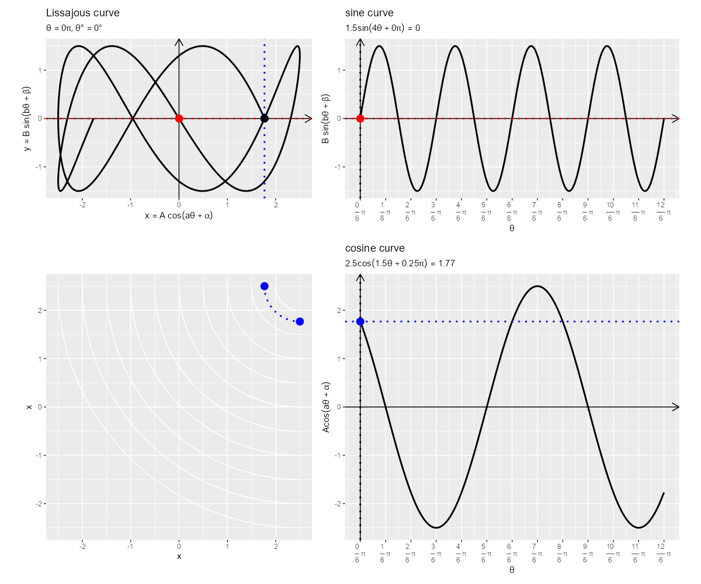

```{r setup, include=FALSE}
knitr::opts_chunk$set(
  echo = TRUE, 
  message = FALSE, error = FALSE, warning = FALSE # メッセージを非表示
)
```

----

【編集履歴】

- 2023/10/09：執筆開始
- 2023/10/14：「リサージュ曲線の可視化」を追加

----

# リサージュ曲線の可視化

　sin関数(サイン関数・sine function)とcos関数(コサイン関数・cosine function)を用いて定義されるリサージュ曲線(リサジュー曲線・Lissajous curve)をグラフで確認します。  
<br>

　利用するパッケージを読み込みます。

```{r, eval=FALSE}
# 利用パッケージ
library(tidyverse)
library(gganimate)
```

```{r, echo=FALSE}
### 資料作成用:(チェック用)

# 利用パッケージ
library(ggplot2)
```

　この記事では、基本的に `パッケージ名::関数名()` の記法を使うので、パッケージの読み込みは不要です。ただし、作図コードについてはパッケージ名を省略するので、 `ggplot2` を読み込む必要があります。  
　また、ネイティブパイプ演算子 `|>` を使います。`magrittr` パッケージのパイプ演算子 `%>%` に置き換えられますが、その場合は `magrittr` を読み込む必要があります。  
<br>


## 定義式の確認

　まずは、リサージュ曲線の定義式を確認します。  
　sin関数については「sin関数の可視化」、cos関数については「cos関数の可視化」、度数法と弧度法の角度については「円周の作図」を参照してください。  
<br>

　リサージュ曲線は、sin関数とcos関数を用いて、次の式で定義されます。

$$
\begin{align}
\left\{
\begin{aligned}
x  &= A \cos(a \theta + \alpha) \\
y  &= B \sin(b \theta)
\end{aligned}
\right.
\end{align}
$$

　変数 $\theta$ は弧度法における角度(ラジアン)です。度数法における角度を $\theta^{\circ}$ とすると、$\theta = \frac{2 \pi}{360^{\circ}} \theta^{\circ}$ の関係です。$\pi$ は円周率です。  
　曲線の形状は各定数(パラメータ)によって決まります。実数 $A, B$ は振幅(サイズ)、実数 $a, b$ は周期(往復回数)、ラジアン $\alpha$ は位相(平行移動)に影響します。  
　以降の作図ではパラメータと形状の関係を見るために、y座標の式についてラジアン $\beta$ を加えます。  
<br>


## リサージュ曲線の作図

　次は、リサージュ曲線のグラフを作成して、変数(ラジアン)と座標(曲線上の点)の関係を確認します。  
<br>


### 曲線の作図

　リサージュ曲線のグラフを作成します。  
<br>

　パラメータを指定して、曲線の描画用のデータフレームを作成します。

```{r}
# x軸方向のパラメータを指定
A     <- 1
a     <- 2
alpha <- 0

# y軸方向のパラメータを指定
B    <- 1
b    <- 3
beta <- 4/6 * pi

# リサージュ曲線の座標を作成
curve_df <- tibble::tibble(
  theta = seq(from = 0, to = 2*pi, length.out = 1001), # ラジアン
  x     = A * cos(a * theta + alpha), 
  y     = B * sin(b * theta + beta)
)
curve_df
```

　実数 $A, B, a, b$ とラジアン $\alpha, \beta$ を指定します。  
　$0$ から $2 \pi$ の範囲のラジアン $\theta$ を作成して、x軸の値 $x = A \cos(a \theta + \alpha)$ とy軸の値 $y = B \sin(b \theta + \beta)$ を計算します。  

　曲線のグラフを作成します。

```{r, fig.width=8, fig.height=8, dpi=100}
# ラベル用の文字列を作成
param_label <- paste0(
  "list(", 
  "A == ", A, ", ", 
  "a == ", a, ", ", 
  "alpha == ", round(alpha/pi, digits = 2), "*pi, ", 
  "B == ", B, ", ", 
  "b == ", b, ", ", 
  "beta == ", round(beta/pi, digits = 2), "*pi", 
  ")"
)

# リサージュ曲線を作図
ggplot() + 
  geom_segment(mapping = aes(x = c(-Inf, 0), y = c(0, -Inf), 
                             xend = c(Inf, 0), yend = c(0, Inf)), 
               arrow = arrow(length = unit(10, units = "pt"), ends = "last")) + # x・y軸線
  geom_path(data = curve_df, 
            mapping = aes(x = x, y = y), 
            linewidth = 1) + # 曲線
  coord_fixed(ratio = 1) + 
  labs(title = "Lissajous curve", 
       subtitle = parse(text = param_label), 
       x = expression(x == A ~ cos(a * theta + alpha)), 
       y = expression(y == B ~ sin(b * theta + beta)))
```

　(x軸方向に値が増減するため `geom_line()` ではなく、) `geom_path()` で曲線を描画します。  

　x軸・y軸それぞれで $\pm A, \pm B$ の範囲で値(座標)が変化します。  
<br>

　以上でリサージュ曲線を描画できました。次からは、変数やパラメータによる曲線への影響を確認していきます。  
<br>


### 変数と座標の関係

　リサージュ曲線上を移動する点のアニメーションを作成します。  
<br>

　フレーム数を指定して、曲線上の点の描画用のデータフレームを作成します。

```{r}
# フレーム数を指定
frame_num <- 300

# 曲線上の点の座標を作成
anim_point_df <- tibble::tibble(
  frame_i = 1:frame_num, # フレーム番号
  theta   = seq(from = 0, to = 2*pi, length.out = frame_num+1)[1:frame_num], # ラジアン
  x       = A * cos(a * theta + alpha), 
  y       = B * sin(b * theta + beta), 
  theta_label = paste0(
    "list(", 
    "theta == ", round(theta/pi, digits = 2), "*pi, ", 
    "theta*degree == ", round(theta/pi*180, digits = 2), "*degree", 
    ")"
  ) # 角度ラベル
)
anim_point_df
```

　フレーム数 `frame_num` を指定して、ラジアン $0 \leq \theta \leq 2$ の値を等間隔に `frame_num` 個作成します。最小値( `form` 引数)と最大値( `to` 引数)の範囲を $2 \pi$ の倍数にして、`frame_num + 1` 個の等間隔の値を作成し最後の値を除くと、(パラメータの設定によっては)最後のフレームと最初のフレームのグラフが繋がります。  

　曲線上の点のアニメーションを作成します。

```{r, eval=TRUE}
# 曲線上の点のアニメーションを作図
anim <- ggplot() + 
  geom_segment(mapping = aes(x = c(-Inf, 0), y = c(0, -Inf), 
                             xend = c(Inf, 0), yend = c(0, Inf)), 
               arrow = arrow(length = unit(10, units = "pt"), ends = "last")) + # x・y軸線
  geom_path(data = curve_df, 
            mapping = aes(x = x, y = y, color = theta/pi), 
            linewidth = 1) + # 曲線
  geom_vline(data = anim_point_df, 
             mapping = aes(xintercept = x), 
             color = "blue", linewidth = 1, linetype = "dotted") + # x軸の補助線
  geom_hline(data = anim_point_df, 
             mapping = aes(yintercept = y), 
             color = "red", linewidth = 1, linetype = "dotted") + # y軸の補助線
  geom_point(data = anim_point_df, 
             mapping = aes(x = x, y = 0), 
             color = "blue", size = 4) + # x軸線上の点
  geom_point(data = anim_point_df, 
             mapping = aes(x = 0, y = y), 
             color = "red", size = 4) + # y軸線上の点
  geom_point(data = anim_point_df, 
             mapping = aes(x = x, y = y), 
             size = 4) + # 曲線上の点
  geom_label(data = anim_point_df, 
             mapping = aes(x = -Inf, y = Inf, label = theta_label), 
             parse = TRUE, hjust = 0, vjust = 1, alpha = 0.5, label.r = unit(0, units = "pt")) + # ラジアンラベル
  gganimate::transition_manual(frames = frame_i) + # フレーム切替
  coord_fixed(ratio = 1) + 
  labs(title = "Lissajous curve", 
       subtitle = parse(text = param_label), 
       color = expression(frac(theta, pi)), 
       x = expression(x == A ~ cos(a * theta + alpha)), 
       y = expression(y == B ~ sin(b * theta + beta)))

# gif画像を作成
gganimate::animate(
  plot = anim, nframes = frame_num, fps = 30, 
  width = 600, height = 600
)
```

　`gganimate` パッケージを利用してアニメーション(gif画像)を作成します。  
　`transition_manual()` のフレーム制御の引数 `frames` にフレーム番号列 `frame_i` を指定します。  
　`animate()` の `plot` 引数にグラフオブジェクト、`nframes` 引数にフレーム数 `frame_num` を指定して、gif画像を作成します。また、`fps` 引数に1秒当たりのフレーム数を指定できます。  
<br>


## パラメータと形状の関係

　続いて、定数(パラメータ)の値の変化に応じたグラフを作成して、パラメータと曲線の形状の関係を確認します。  
<br>


### 2パラメータの比較

　2つのパラメータに関して複数の値の組み合わせごとの曲線を並べたグラフを作成します。ここでは、x軸・y軸に関する同じパラメータの組み合わせを比較します。他の組み合わせや1パラメータでも作図できます。  
<br>


#### 振幅の変化

　振幅パラメータとして複数の値を指定して、曲線の描画用のデータフレームを作成します。

```{r}
# 固定するパラメータを指定
a     <- 1
b     <- 1
alpha <- 0
beta  <- 0

# 比較するパラメータを指定
A_vals <- seq(from = -2, to = 2, length.out = 9)
B_vals <- seq(from = -2, to = 2, length.out = 9)

# リサージュ曲線の座標を作成
curve_df <- tidyr::expand_grid(
  A = A_vals, 
  B = B_vals, 
  theta = seq(from = 0, to = 2*pi, length.out = 1001)
) |> # パラメータの組み合わせごとにラジアンを複製
  dplyr::mutate(
    x = A * cos(a * theta + alpha), 
    y = B * sin(b * theta + beta)
  )
curve_df
```

　2つのパラメータ $A, B$ に関して複数の値を指定して、他のパラメータは固定します。  
　定数 $A, B$ の各値と、$2 \pi$ の範囲の変数 $\theta$ の全ての組み合わせを `expand_grid()` で作成します。パラメータの値の組み合わせごとに曲線用のラジアンを複製できます。  

　パラメータの組み合わせごとの曲線のグラフを作成します。

```{r, fig.width=12, fig.height=12, dpi=100}
# ラベル用の文字列を作成
param_label <- paste0(
  "list(", 
  "a == ", a, ", ", 
  "b == ", b, ", ", 
  "alpha == ", round(alpha/pi, digits = 2), "*pi, ", 
  "beta == ", round(beta/pi, digits = 2), "*pi", 
  ")"
)

# リサージュ曲線を作図
ggplot() + 
  geom_path(data = curve_df, 
            mapping = aes(x = x, y = y, color = theta/pi), 
            linewidth = 1) + # 曲線
  facet_grid(B ~ A, labeller = label_bquote(rows = B == .(round(B, 2)), 
                                            cols = A == .(round(A, 2)))) + # パラメータごとに分割
  coord_fixed(ratio = 1) + 
  labs(title = "Lissajous curve", 
       subtitle = parse(text = param_label), 
       color = expression(frac(theta, pi)), 
       x = expression(x == A ~ cos(a * theta + alpha)), 
       y = expression(y == B ~ sin(b * theta + beta)))
```

　`facet_grid()` にパラメータ列を指定して、パラメータの組み合わせごとにグラフを分割して描画します。  

　$A$ の絶対値が大きい(小さい)とx軸方向に拡大(縮小)します。同様に、$B$ の絶対値の大きさによりy軸方向に拡大・縮小します。それぞれが0のとき線の形になり、どちらも0のとき形を持ちません。  
　$A, B$ の正負によって全体の形状は変わりませんが、変数と座標の関係が対応する軸に対して反転しているのが分かります。  
<br>


#### 周期の変化

　周期パラメータとして複数の値を指定して、曲線の描画用のデータフレームを作成します。

```{r}
# 固定するパラメータを指定
A     <- 1
B     <- 1
alpha <- 0
beta  <- 0

# 比較するパラメータを指定
a_vals <- seq(from = -2, to = 2, length.out = 9)
b_vals <- seq(from = -2, to = 2, length.out = 9)

# リサージュ曲線の座標を作成
curve_df <- tidyr::expand_grid(
  a = a_vals, 
  b = b_vals, 
  theta = seq(from = 0, to = 2*pi, length.out = 1001)
) |> # パラメータの組み合わせごとにラジアンを複製
  dplyr::mutate(
    x = A * cos(a * theta + alpha), 
    y = B * sin(b * theta + beta)
  )
curve_df
```

　「振幅の変化」のときと同様に、パラメータの値の組み合わせごとに曲線の座標を計算します。  

　パラメータの組み合わせごとの曲線のグラフを作成します。

```{r, fig.width=12, fig.height=12, dpi=100}
# ラベル用の文字列を作成
param_label <- paste0(
  "list(", 
  "A == ", A, ", ", 
  "B == ", B, ", ", 
  "alpha == ", round(alpha/pi, digits = 2), "*pi, ", 
  "beta == ", round(beta/pi, digits = 2), "*pi", 
  ")"
)

# リサージュ曲線を作図
ggplot() + 
  geom_path(data = curve_df, 
            mapping = aes(x = x, y = y, color = theta/pi), 
            linewidth = 1) + # 曲線
  facet_grid(b ~ a, labeller = label_bquote(rows = b == .(round(b, 2)), 
                                            cols = a == .(round(a, 2)))) + # パラメータごとに分割
  coord_fixed(ratio = 1) + 
  labs(title = "Lissajous curve", 
       subtitle = parse(text = param_label), 
       color = expression(frac(theta, pi)), 
       x = expression(x == A ~ cos(a * theta + alpha)), 
       y = expression(y == B ~ sin(b * theta + beta)))
```

　$a$ の絶対値が大きい(小さい)とx軸方向に往復する回数が増え(減り)ます。同様に、$b$ の絶対値の大きさによりy軸方向に往復する回数が増減します。それぞれが0のとき線の形になり、どちらも0のとき形を持ちません。  
　$a, b$ の正負によって全体の形状は変わりませんが、変数と座標の関係が対応する軸に対して反転しているのが分かります。$a = k, b = k\ (k \geq 1)$ のとき(例えば $a = 2, b = 2$ と $a = 1, a = 1$ のとき)同じ形状ですが、$k$ 周しています(最後の1周分の変数の色が反映されています)。  
<br>


#### 位相の変化

　位相パラメータとして複数の値を指定して、曲線の描画用のデータフレームを作成します。

```{r}
# 固定するパラメータを指定
A <- 1
B <- 1
a <- 1
b <- 1

# 比較するパラメータを指定
alpha_vals <- seq(from = 0, to = 2*pi, length.out = 7)
beta_vals  <- seq(from = -pi, to = pi, length.out = 5)

# リサージュ曲線の座標を作成
curve_df <- tidyr::expand_grid(
  alpha = alpha_vals, 
  beta  = beta_vals, 
  theta = seq(from = 0, to = 2*pi, length.out = 1001)
) |> # パラメータの組み合わせごとにラジアンを複製
  dplyr::mutate(
    x = A * cos(a * theta + alpha), 
    y = B * sin(b * theta + beta)
  )
curve_df
```

　「振幅の変化」のときと同様に、パラメータの値の組み合わせごとに曲線の座標を計算します。  

　パラメータの組み合わせごとの曲線のグラフを作成します。

```{r, fig.width=12, fig.height=10, dpi=100}
# ラベル用の文字列を作成
param_label <- paste0(
  "list(", 
  "A == ", A, ", ", 
  "B == ", B, ", ", 
  "a == ", a, ", ", 
  "b == ", b, ", ", 
  ")"
)

# リサージュ曲線を作図
ggplot() + 
  geom_path(data = curve_df, 
            mapping = aes(x = x, y = y, color = theta/pi), 
            linewidth = 1) + # 曲線
  facet_grid(beta ~ alpha, labeller = label_bquote(rows = beta == .(round(beta/pi, 2)) * pi, 
                                                   cols = alpha == .(round(alpha/pi, 2)) * pi)) + # パラメータごとに分割
  coord_fixed(ratio = 1) + 
  labs(title = "Lissajous curve", 
       subtitle = parse(text = param_label), 
       color = expression(frac(theta, pi)), 
       x = expression(x == A ~ cos(a * theta + alpha)), 
       y = expression(y == B ~ sin(b * theta + beta)))
```

　$\alpha$ の値に応じてx軸方向に平行移動します。同様に、$\beta$ に応じてy軸方向に平行移動します。それぞれ $pi$ 変化すると反転した形状、$2 \pi$ 変化すると同じ形状になるのが分かります。  
<br>


### 変数の変化

　2つのパラメータに関する値の組み合わせごとの曲線を用いて、変数と座標(曲線上の点)の関係を確認します。  
　作図コードについては「lissajous.R」を参照してください。  
<br>


　同じ形状であってもパラメータの組み合わせによって変数と座標の座標の関係や周期が異なるのを確認できます。  
<br>


### パラメータの変化

　パラメータに応じて変化するリサージュ曲線のアニメーションを作成します。  
<br>

　フレーム数とパラメータを指定して、曲線の描画用のデータフレームを作成します。

```{r}
# フレーム数を指定
frame_num <- 301

# パラメータを指定
A_vals     <- seq(from = 1, to = 1, length.out = frame_num)
a_vals     <- seq(from = -3, to = 3, length.out = frame_num)
alpha_vals <- seq(from = 0*pi, to = 0*pi, length.out = frame_num)
B_vals     <- seq(from = 1, to = 1, length.out = frame_num)
b_vals     <- seq(from = 3, to = 3, length.out = frame_num)
beta_vals  <- seq(from = 4/6*pi, to = 4/6*pi, length.out = frame_num)

# リサージュ曲線の座標を作成
anim_curve_df <- tidyr::expand_grid(
  frame_i = 1:frame_num, # フレーム番号
  theta   = seq(from = 0, to = 2*pi, length.out = 1001)
) |> # フレームごとにラジアンを複製
  dplyr::mutate(
    A     = A_vals[frame_i], 
    a     = a_vals[frame_i], 
    alpha = alpha_vals[frame_i], 
    B     = B_vals[frame_i], 
    b     = b_vals[frame_i], 
    beta  = beta_vals[frame_i], 
    x     = A * cos(a * theta + alpha), 
    y     = B * sin(b * theta + beta)
  )
anim_curve_df
```

　フレーム数 `frame_num` を指定して、パラメータごとに `frame_num` 個の値を指定します。処理を簡単にするため、値を固定する場合も `frame_num` 個の同じ値としておきます。  
　フレーム番号( `1` から `frame_num` までの整数)とラジアンの値の組み合わせを `expand_grid()` で作成します。パラメータの値ごとに曲線用のラジアンを複製できます。  

　目安として用いる曲線上の点の描画用のデータフレームを作成します。

```{r}
# 点数を指定
#point_num <- 9
point_num <- 13

# 点用のラジアンを作成
theta_vals <- seq(from = 0, to = 2*pi, length.out = point_num)

# 曲線上の点の座標を作成
anim_point_df <- tidyr::expand_grid(
  frame_i = 1:frame_num, # フレーム番号
  theta   = theta_vals, 
) |> # フレームごとにラジアンを複製
  dplyr::mutate(
    A     = A_vals[frame_i], 
    a     = a_vals[frame_i], 
    alpha = alpha_vals[frame_i], 
    B     = B_vals[frame_i], 
    b     = b_vals[frame_i], 
    beta  = beta_vals[frame_i], 
    x     = A * cos(a * theta + alpha), 
    y     = B * sin(b * theta + beta)
  )
anim_point_df
```

　曲線の対応関係の確認用に、変数(ラジアン)に関して一定間隔に点を描画することにします。  
　点の数 `point_num` を指定し `point_num` 個のラジアンの値を作成して、曲線の座標計算と同様に処理します。  

　x軸の角度目盛の描画用のデータフレームを作成します。

```{r}
# x軸目盛ラベル用の文字列を作成:(A = 1で固定)
axis_x_df <- tibble::tibble(
  theta = theta_vals, 
  cos_t = round(cos(theta), digits = 5), # (数値誤差対策)
  rad_label = paste0(round(theta/pi, digits = 2), "*pi"),        # 弧度法の角度ラベル
  deg_label = paste0(round(theta/pi*180, digits = 1), "*degree") # 度数法の角度ラベル
) |> 
  dplyr::summarise(
    rad_label = paste(rad_label, collapse = ", "), 
    deg_label = paste(deg_label, collapse = ", "), 
    .by = cos_t
  ) |> # 同じ角度のラベルを結合
  dplyr::mutate(
    rad_label = paste0("list(", rad_label, ")"), 
    deg_label = paste0("list(", deg_label, ")")
  ) # expression記法に整形
axis_x_df
```

　$0 \leq \theta \leq 2 \pi$ の範囲を `point_num` 個に分割したラジアン $\theta$ に対応するx軸の値 $x = \cos \theta$ を計算します。  
　計算結果(x軸のプロット位置)が同じになるラジアンを結合して角度目盛ラベルとします。ただし、計算結果には数値誤差を含むため、値を丸めておきます。値を丸めすぎるとプロット位置に誤差が生じます。  

　y軸の角度目盛の描画用のデータフレームを作成します。

```{r}
# y軸目盛ラベル用の文字列を作成:(B = 1で固定)
axis_y_df <- tibble::tibble(
  theta = theta_vals, 
  sin_t = round(sin(theta), digits = 5), # (数値誤差対策)
  rad_label = paste0(round(theta/pi, digits = 2), "*pi"),        # 弧度法の角度ラベル
  deg_label = paste0(round(theta/pi*180, digits = 1), "*degree") # 度数法の角度ラベル
) |> 
  dplyr::summarise(
    rad_label = paste(rad_label, collapse = ", "), 
    deg_label = paste(deg_label, collapse = ", "), 
    .by = sin_t
  ) |> # 同じ角度のラベルを結合
  dplyr::mutate(
    rad_label = paste0("list(", rad_label, ")"), 
    deg_label = paste0("list(", deg_label, ")")
  ) # expression記法に整形
axis_y_df
```

　x軸目盛のときと同様に、`point_num` 個のラジアン $\theta$ に対応するy軸の値 $y = \sin \theta$ を計算して、角度目盛ラベルを作成します。  


　パラメータラベルの描画用のデータフレームを作成します。

```{r}
# パラメータラベル用の文字列を作成
anim_label_df <- tibble::tibble(
  frame_i = 1:frame_num, # フレーム番号
  A     = A_vals, 
  a     = a_vals, 
  alpha = alpha_vals, 
  B     = B_vals, 
  b     = b_vals, 
  beta  = beta_vals, 
  param_label = paste0(
    "list(", 
    "A == ", round(A, digits = 2), ", ", 
    "a == ", round(a, digits = 2), ", ", 
    "alpha == ", round(alpha/pi, digits = 2), " * pi, ", 
    "B == ", round(B, digits = 2), ", ", 
    "b == ", round(b, digits = 2), ", ", 
    "beta == ", round(beta/pi, digits = 2), " * pi", 
    ")"
  ) # パラメータラベル
)
anim_label_df
```

　フレームごとにパラメータラベル用の文字列を作成します。  

　リサージュ曲線のアニメーションを作成します。

```{r}
# リサージュ曲線のアニメーションを作図
anim <- ggplot() + 
  geom_vline(data = axis_x_df, 
             mapping = aes(xintercept = cos_t), 
             linetype = "dotted") + # x軸の角度目盛線
  geom_hline(data = axis_y_df, 
             mapping = aes(yintercept = sin_t), 
             linetype = "dotted") + # y軸の角度目盛線
  geom_segment(mapping = aes(x = c(-Inf, 0), y = c(0, -Inf), 
                             xend = c(Inf, 0), yend = c(0, Inf)), 
               arrow = arrow(length = unit(10, units = "pt"), ends = "last")) + # x・y軸線
  geom_path(data = anim_curve_df, 
            mapping = aes(x = x, y = y, color = theta/pi), 
            linewidth = 1) + # 曲線
  geom_point(data = anim_point_df, 
             mapping = aes(x = x, y = y, color = theta/pi), 
             size = 4) + # 曲線上の点
  geom_text(data = anim_label_df, 
            mapping = aes(x = -Inf, y = Inf, label = param_label), 
            parse = TRUE, hjust = 0, vjust = -5.5) + # パラメータラベル:(角度目盛ラベルを表示しない場合はvjust = -0.5)
  gganimate::transition_manual(frames = frame_i) + # フレーム切替
  scale_x_continuous(sec.axis = sec_axis(trans = ~., 
                                         breaks = axis_x_df[["cos_t"]], 
                                         labels = parse(text = axis_x_df[["deg_label"]]), 
                                         name = expression(a * theta + alpha))) + # x軸の角度目盛ラベル
  scale_y_continuous(sec.axis = sec_axis(trans = ~., 
                                         breaks = axis_y_df[["sin_t"]], 
                                         labels = parse(text = axis_y_df[["deg_label"]]), 
                                         name = expression(b * theta + beta))) + # y軸の角度目盛ラベル
  theme(axis.text.x.top = element_text(angle = 45, hjust = 0)) + 
  coord_fixed(ratio = 1, clip = "off") + 
  labs(title = "Lissajous curve", 
       subtitle = "", # (パラメータラベルの表示用)
       color = expression(frac(theta, pi)), 
       x = expression(x == A ~ cos(a * theta + alpha)), 
       y = expression(y == B ~ sin(b * theta + beta)))

# gif画像を作成
gganimate::animate(
  plot = anim, nframes = frame_num, fps = 30, 
  width = 600, height = 600
)
```

　`gganimate` を利用したフレーム切り替えでは、フレームに応じてサブタイトルを変更できますが、その際に `expression()` を使えないので `geom_text()` を使って疑似的にサブタイトルの位置に表示しています。  

　パラメータに応じて曲線の形状が変化するのを確認できます。  
　第2軸の目盛については参考書籍を参照してください。  
<br>


## リサージュ曲線とsin曲線・cos曲線の関係

　最後は、リサージュ曲線とsin関数・cos関数の曲線のグラフを作成して、変数(ラジアン)と座標・定数(パラメータ)と形状の関係を確認します。  
　作図コードについては「lissajous.R」、作図の解説については「cos関数の可視化」などを参照してください。  
<br>


### 変数と座標の関係

　変数に応じて移動するリサージュ曲線・sin曲線・cos曲線上の点のアニメーションを作成します。  
<br>




　リサージュ曲線上の点(黒色の点)のx軸方向の変化(青色の点)とy軸方向の変化(赤色の点)が、それぞれcos関数曲線上の点とsin関数曲線上の点に対応しているのを確認できます。リサージュ曲線のx軸方向の形状(振幅・周期・位相)とy軸方向の形状が、それぞれcos関数曲線の形状とsin関数曲線の形状に対応しているのを確認できます。  
<br>


### パラメータと形状の関係

　パラメータに応じて変化するリサージュ曲線・sin曲線・cos曲線のアニメーションを作成します。  
<br>


　対応関係の目安として、$\theta$ に応じて曲線を色付けし、また一定間隔で点を打っています。  
　sin曲線とcos曲線それぞれについて、振幅パラメータ $A, B$ によって波のサイズ、周期パラメータ $a, b$ によって波の間隔( $2 \pi$ の範囲における波の数)、位相パラメータ $\alpha, \beta$ によって波の位置(ラジアン軸方向の移動)が変化するのを確認できます。また、2つの関数曲線の形状とリサージュ曲線の形状が対応しているのを確認できます。  
<br>

　この記事では、リサージュ曲線のグラフを作成しました。次の記事からは、螺旋のグラフを作成します。  
<br>


# 参考書籍

- 結城 浩『数学ガールの秘密ノート 丸い三角関数』SBクリエイティブ,2014年.


