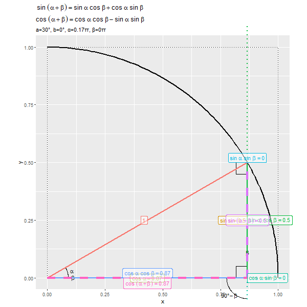

```{r setup, include=FALSE}
knitr::opts_chunk$set(
  echo = TRUE, 
  message = FALSE, error = FALSE, warning = FALSE # メッセージを非表示
)
```

----

【編集履歴】

- 2023/01/16：「2角の和」を追加

----


# 三角関数の加法定の可視化：その1(2角の和)

　三角関数における加法定理(2つの角の和のサインとコサイン)を可視化します。\
\

　利用するパッケージを読み込みます。

```{r, eval=FALSE}
# 利用パッケージ
library(tidyverse)
library(gganimate)
```

```{r, echo=FALSE}
### 資料作成用:(チェック用)

# 利用パッケージ
library(ggplot2)
```

　この記事では、基本的に`パッケージ名::関数名()`の記法を使うので、パッケージを読み込む必要はありません。ただし、作図コードがごちゃごちゃしないようにパッケージ名を省略しているため`ggplot2`を読み込む必要があります。\
　また、ネイティブパイプ演算子`|>`を使っています。`magrittr`パッケージのパイプ演算子`%>%`に置き換えても処理できますが、その場合は`magrittr`も読み込む必要があります。\
\


## 加法定理の公式

　三角関数の加法定理として、次の関係が成り立ちます。

$$
\begin{aligned}
\sin(\alpha + \beta)
   &= \sin \alpha \cos \beta
      + \cos \alpha \sin \beta
\\
\sin(\alpha - \beta)
   &= \sin \alpha \cos \beta
      - \cos \alpha \sin \beta
\\
\cos(\alpha + \beta)
   &= \cos \alpha \cos \beta
      - \sin \alpha \sin \beta
\\
\cos(\alpha - \beta)
   &= \cos \alpha \cos \beta
      + \sin \alpha \sin \beta
\\
\tan(\alpha + \beta)
   &= \frac{
          \tan \alpha + \tan \beta
      }{
          1 - \tan \alpha \tan \beta
      }
\\
\tan(\alpha - \beta)
   &= \frac{
          \tan \alpha - \tan \beta
      }{
          1 + \tan \alpha \tan \beta
      }
\end{aligned}
$$

　この記事では、$\sin(\alpha + \beta)$と$\cos(\alpha + \beta)$の式に関して可視化して確認します。\
\


## 加法定理の可視化

　三角関数の加法定理($\sin(\alpha + \beta), \cos(\alpha + \beta)$)をグラフで確認します。\
\


### グラフの作成

　まずは、角度を固定したグラフを作成します。\
\

　角度を指定して、ラジアンに変換します。

```{r}
# 角度を指定
a <- 30
b <- 45

# ラジアンに変換
alpha <- a / 180 * pi
beta  <- b / 180 * pi
alpha; beta
```

　度数法における角度$0^{\circ} \leq a \leq 90^{\circ}$、$0^{\circ} \leq b \leq 90^{\circ}$、$a + b \leq 90^{\circ}$を指定します。\
　指定した角度を、弧度法におけるラジアン$\alpha = a \frac{2 \pi}{360}$、$\beta = b \frac{2 \pi}{360}$に変換します。$\pi$は円周率で`pi`で扱えます。\

　(第1象限における)単位円を描画するためのデータフレームを作成します。

```{r}
# 単位円(の4分の1)の描画用
sector_df <- tibble::tibble(
  c = seq(from = 0, to = 90, by = 1), 
  theta = c / 180 * pi, 
  x = cos(theta), 
  y = sin(theta)
)
sector_df
```

　作図用の角度$0^{\circ} \leq c \leq 90^{\circ}$を作成して、ラジアン$\theta = c \frac{2 \pi}{360}$に変換します。\
　x軸の値は$x = \cos \theta$、y軸の値は$y = \sin \theta$で単位円を描くための点の座標を計算します。\

　単位正方形を描画するためのデータフレームを作成します。

```{r}
# 単位正方形の描画用
square_df <- tibble::tibble(
  x = c(0, 0, 1, 1, 0), 
  y = c(0, 1, 1, 0, 0)
)
square_df
```

　単位正方形の頂点の座標を格納します。\

　加法定理を構成する辺(線分)を描画するためのデータフレームを作成します。

```{r}
# 因子レベルを指定
fnc_level <- c(
  "r", "sin(a)", "cos(a)", 
  "sin(a) cos(b)", "cos(a) sin(b)", 
  "sin(a) sin(b)", "cos(a) cos(b)", 
  "sin(a+b)", "cos(a+b)"
)

# 辺の描画用
segment_df <- tibble::tribble(
  ~fnc,            ~type,    ~x_from,              ~y_from,              ~x_to,                ~y_to, 
  "r",             "main",   0,                    0,                    cos(alpha+beta),      sin(alpha+beta), 
  "sin(a)",        "main",   cos(alpha)*cos(beta), cos(alpha)*sin(beta), cos(alpha+beta),      sin(alpha+beta), 
  "cos(a)",        "main",   0,                    0,                    cos(alpha)*cos(beta), cos(alpha)*sin(beta), 
  "cos(a)",        "sub",    cos(alpha)*cos(beta), cos(alpha)*sin(beta), cos(beta),            sin(beta), 
  "sin(a) cos(b)", "main",   cos(alpha)*cos(beta), cos(alpha)*sin(beta), cos(alpha)*cos(beta), sin(alpha+beta), 
  "cos(a) sin(b)", "main",   cos(alpha)*cos(beta), 0,                    cos(alpha)*cos(beta), cos(alpha)*sin(beta), 
  "sin(a) sin(b)", "main",   cos(alpha+beta),      sin(alpha+beta),      cos(alpha)*cos(beta), sin(alpha+beta), 
  "cos(a) cos(b)", "main",   0,                    0,                    cos(alpha)*cos(beta), 0, 
  "sin(a+b)",      "target", cos(alpha+beta),      0,                    cos(alpha+beta),      sin(alpha+beta), 
  "cos(a+b)",      "target", 0,                    0,                    cos(alpha+beta),      0
) |> # 座標を格納
  dplyr::mutate(
    fnc = factor(fnc, levels = fnc_level) # 因子レベルを設定
  ) |> 
  dplyr::arrange(fnc) # 並びを統一
segment_df
```

　各辺の値を格納しやすいように、`tribble()`を使ってデータフレームを作成します。線分の始点の座標を`x_from, y_from`列、終点の座標を`x_to, y_to`列とします。次の「関数名ラベル」の関数の値は線分の長さであり、座標の値とは異なります。\
　各関数(辺)を区別するための`fnc`列、「2つの(角度の)三角形の辺」・「加法定理を示す線」・「補助線」を区別するための`type`列を作成します。`fnc`列は色分け、`type`列は線の装飾に使います。\

　線の描画順(重なり順)や色付け順は、`fnc`列の因子レベルに依存するので、`fnc_level`として指定しておきます。\

　線分ごとに関数名ラベルを描画するためのデータフレームを作成します。

```{r}
# 関数名ラベルの描画用
segment_label_df <- segment_df |> 
  dplyr::filter(type %in% c("main", "target")) |> # 補助線を除去
  dplyr::group_by(fnc) |> # 中点の計算用
  dplyr::mutate(
    # 線分の中点に配置
    x = median(c(x_from, x_to)), 
    y = median(c(y_from, y_to))
  ) |> 
  dplyr::ungroup() |> 
  dplyr::select(fnc, x, y) |> 
  tibble::add_column(
    # ラベルが重ならないように調整
    h = c(1.0, 1.0, 0.5, 0.0, 0.0, 0.5, 0.5, 0.5, 0.5), 
    v = c(0.5, 0.5, 0.5, 0.5, 0.5, 0.0, 0.0, 0.5, 1.0), 
    # ラベルを作成
    fnc_label = c(
      "r==1", 
      paste0("sin~alpha==", round(sin(alpha), digits = 2)), 
      paste0("cos~alpha==", round(cos(alpha), digits = 2)), 
      paste0("sin~alpha ~ cos~beta==", round(sin(alpha)*cos(beta), digits = 2)), 
      paste0("cos~alpha ~ sin~beta==", round(cos(alpha)*sin(beta), digits = 2)), 
      paste0("sin~alpha ~ sin~beta==", round(sin(alpha)*sin(beta), digits = 2)), 
      paste0("cos~alpha ~ cos~beta==", round(cos(alpha)*cos(beta), digits = 2)), 
      paste0("sin~(alpha+beta)==", round(sin(alpha+beta), digits = 2)), 
      paste0("cos~(alpha+beta)==", round(cos(alpha+beta), digits = 2))
    )
  )
segment_label_df
```

　補助線を取り除いて、各線分の中点にラベルを配置することにします。\
　辺ごとに(`fnc`列でグループ化して)、x軸の値は`x_from, x_to`列、y軸の値は`y_from, y_to`列の中央値を計算します。\
　ラベルとして数式を表示するには`expression()`の記法を使います。\

　直角を示すためのデータフレームを作成します。

```{r}
# 直角マークの描画用
d <- 0.05
right_angle_df <- tibble::tibble(
  x = c(
    cos(alpha+beta), cos(alpha+beta)-d, cos(alpha+beta)-d, 
    cos(alpha)*cos(beta), cos(alpha)*cos(beta)-d, cos(alpha)*cos(beta)-d, 
    cos(alpha)*cos(beta)-d, cos(alpha)*cos(beta)-d, cos(alpha)*cos(beta), 
    cos(alpha)*cos(beta) + c(cos(beta+0.5*pi)*d, cos(beta+0.5*pi)*d+cos(beta+pi)*d, cos(beta+pi)*d)
  ), 
  y = c(
    d, d, 0, 
    d, d, 0, 
    sin(alpha+beta), sin(alpha+beta)-d, sin(alpha+beta)-d, 
    cos(alpha)*sin(beta) + c(sin(beta+0.5*pi)*d, sin(beta+0.5*pi)*d+sin(beta+pi)*d, sin(beta+pi)*d)
  ), 
  group = rep(1:4, each = 3) # 角ラベル
)
right_angle_df
```

　直角マークの頂点の座標を計算して格納します。\

　鋭角を示すためのデータフレームを作成します。

```{r}
# 角度マーク(扇形)の描画用
d <- 0.09
angle_df <- tibble::tibble(
  # 原点を中心としたときの角度
  c = c(
    seq(from = 0, to = b, by = 1), 
    seq(from = b, to = a+b, by = 1), 
    seq(from = 90, to = 90+b, by = 1), 
    seq(from = 180+b, to = 270, by = 1)
  ), # 角度
  theta = c / 180 * pi, # ラジアン
  group = c(
    rep("b1", times = length(seq(from = 0, to = b, by = 1))), 
    rep("a", times = length(seq(from = b, to = a+b, by = 1))), 
    rep("b2", times = length(seq(from = 90, to = 90+b, by = 1))), 
    rep("90-b", times = length(seq(from = 180+b, to = 270, by = 1)))
  ) |> # 角ラベル
    factor(levels = c("b1", "a", "b2", "90-b")), # 因子レベルを設定
  # 原点を中心としたときの座標
  x = cos(theta) * d, 
  y = sin(theta) * d
) |> 
  dplyr::mutate(
    # 角ごとに配置
    x = x + c(
      rep(0, times = length(seq(from = 0, to = b, by = 1))), 
      rep(0, times = length(seq(from = b, to = a+b, by = 1))), 
      rep(cos(alpha)*cos(beta), times = length(seq(from = 90, to = 90+b, by = 1))), 
      rep(cos(alpha)*cos(beta), times = length(seq(from = 180+b, to = 270, by = 1)))
    ), 
    y = y + c(
      rep(0, times = length(seq(from = 0, to = b, by = 1))), 
      rep(0, times = length(seq(from = b, to = a+b, by = 1))), 
      rep(cos(alpha)*sin(beta), times = length(seq(from = 90, to = 90+b, by = 1))), 
      rep(cos(alpha)*sin(beta), times = length(seq(from = 180+b, to = 270, by = 1)))
    )
  )
angle_df
```

　4つの扇形(角度マーク)を描画するための点の角度$0^{\circ} \leq c \leq a + b$、$90^{\circ} \leq c \leq 90^{\circ} + b$、$180^{\circ} + b \leq c \leq 270^{\circ}$を作成して、それぞれラジアン$\theta = c \frac{2 \pi}{360}$に変換して、$x = \cos \theta, y = \sin \theta$で原点を頂点(円の中心)としたときの座標に変換し、角ごとに頂点の座標を加えてプロット位置を変更します。\
　`d`はサイズ調整用の値です。\

　角度ラベルを描画するためのデータフレームを作成します。

```{r}
# 角度ラベルの描画用
d <- 0.11
angle_label_df <- angle_df |> 
  dplyr::group_by(group) |> # 中点の計算用
  dplyr::summarise(
    # 角度の中点に配置
    c = median(c), .groups = "drop"
  ) |> 
  dplyr::mutate(
    # 原点を中心としたときの角度
    theta = c / 180 * pi, 
    label = c("beta", "alpha", "beta", "90*degree-beta"), # 角ラベル
    # 原点を中心としたときの座標
    x = cos(theta) * d, 
    y = sin(theta) * d, 
    # 角ごとに配置
    x = x + c(0, 0, cos(alpha)*cos(beta), cos(alpha)*cos(beta)), 
    y = y + c(0, 0, cos(alpha)*sin(beta), cos(alpha)*sin(beta))
  )
angle_label_df
```

　角ごとに角度の中点に配置することにします。\
　角ごとに(`group`列でグループ化して)、`summarise()`を使って角度の中央値を計算して、それぞれ座標を計算します。\

　加法定理の可視化グラフを作成します。

```{r, fig.width=8, fig.height=8}
# タイトル用のラベルを作成
title_label <- paste0(
  "atop(", 
  "sin~(alpha+beta) == sin~alpha ~ cos~beta + cos~alpha ~ sin~beta", 
  ", cos~(alpha+beta) == cos~alpha ~ cos~beta - sin~alpha ~ sin~beta", 
  ")"
)
ver_label <- paste0(
  "list(", 
  "a==", a, "*degree", ", b==", b, "*degree", 
  ", alpha==", round(a/180, 2), "*pi, beta==", round(b/180, 2), "*pi", 
  ")"
)

# 加法定理の可視化
ggplot() + 
  geom_path(data = sector_df, 
            mapping = aes(x = x, y = y), 
            size = 1) + # 単位円
  geom_path(data = square_df, 
            mapping = aes(x = x, y = y), 
            linetype = "dotted") + # 単位正方形
  geom_path(data = right_angle_df, 
            mapping = aes(x = x, y = y, group = group)) + # 直角マーク
  geom_path(data = angle_df, 
            mapping = aes(x = x, y = y, group = group)) + # 角度マーク
  geom_text(data = angle_label_df, 
            mapping = aes(x = x, y = y, label = label), parse = TRUE) + # 角度ラベル
  geom_segment(data = segment_df, 
               mapping = aes(x = x_from, y = y_from, xend = x_to, yend = y_to, 
                             color = fnc, size = type, linetype = type)) + # 関数の線分
  geom_label(data = segment_label_df, 
             mapping = aes(x = x, y = y, label = fnc_label, color = fnc, hjust = h, vjust = v), 
             parse = TRUE, alpha = 0.5, size = 4) + # 関数ラベル
  scale_size_manual(breaks = c("main", "sub", "target"), 
                    values = c(1, 1, 1.5)) + #  目的の線を強調
  scale_linetype_manual(breaks = c("main", "sub", "target"), 
                        values = c("solid", "dotted", "dashed")) + #  目的の線を強調
  theme(legend.position = "none") + # 凡例を非表示
  coord_fixed(ratio = 1, clip = "off") + # アスペクト比
  labs(title = parse(text = title_label), 
       subtitle = parse(text = ver_label), 
       x = "x", y = "y")
```

　単位円(扇形の線)を`geom_path()`、線分を`geom_segment()`、ラベル(文字列)を`geom_text()`または`geom_label()`で描画します。ラベルとして数式を描画する場合は、`parse`引数を`TRUE`にします。\

　2つの破線とそれぞれ平行な実線を比較すると、次の関係が成り立つのが分かります。

$$
\begin{aligned}
\sin(\alpha + \beta)
   &= \sin \alpha \cos \beta
      + \cos \alpha \sin \beta
\\
\cos(\alpha + \beta)
   &= \cos \alpha \cos \beta
      - \sin \alpha \sin \beta
\end{aligned}
$$

\ 


### アニメーションの作成

　次は、角度と加法定理の関係をアニメーションで確認します。\
\

　フレームごとに変化させる角度を指定して、ラジアンに変換します。

```{r}
# フレーム数を指定
frame_num <- 61

# 角度として利用する値を指定:(a,αを変化させる場合)
a_vals <- seq(from = 0, to = 60, length.out = frame_num)
b_vals <- rep(30, times = frame_num)

# 角度として利用する値を指定:(b,βを変化させる場合)
#a_vals <- rep(30, times = frame_num)
#b_vals <- seq(from = 0, to = 60, length.out = frame_num)

# ラジアンに変換
alpha_vals <- a_vals / 180 * pi
beta_vals  <- b_vals / 180 * pi
head(a_vals); head(b_vals); head(alpha_vals); head(beta_vals)
```

　フレーム数`frame_num`を指定して`frame_num`個の角度$a, b$を作成して`a_vals, b_vals`とします。$a$を変化させる場合は、`a_vals`を一定間隔の値にして、`b_vals`の値を固定します。$b$を変化させる場合は、`a_vals`の値を固定して、`b_vals`を一定間隔の値にします。\
　作成した角度をそれぞれラジアン$\alpha, \beta$に変換して`alpha_vals, beta_vals`とします。\

　辺を描画するためのデータフレームを作成します。

```{r}
# 辺の描画用
anim_segment_df <- tidyr::expand_grid(
  tibble::tibble(
    frame_i = 1:frame_num, # フレーム番号
    alpha = alpha_vals, 
    beta = beta_vals
  ), 
  tibble::tibble(
    fnc = c(
      "r", "sin(a)", "cos(a)", "cos(a)", 
      "sin(a) cos(b)", "sin(a) cos(b)", "cos(a) sin(b)", "cos(a) sin(b)", 
      "sin(a) sin(b)", "cos(a) cos(b)", 
      "sin(a+b)", "cos(a+b)"
    ) |> 
        factor(levels = fnc_level), # 因子レベルを設定
    type = c(
      "main", "main", "main", "sub", 
      "main", "sub", "main", "sub", 
      "main", "main", 
      "target", "target"
    )
  )
) |> # フレームごとに受け皿(行)を複製
  dplyr::group_by(frame_i) |> 
  dplyr::mutate(
    # 座標を計算
    x_from = c(
      0, cos(unique(alpha))*cos(unique(beta)), 0, cos(unique(alpha))*cos(unique(beta)), 
      cos(unique(alpha))*cos(unique(beta)), cos(unique(alpha))*cos(unique(beta)), cos(unique(alpha))*cos(unique(beta)), cos(unique(alpha))*cos(unique(beta)), 
      cos(unique(alpha)+unique(beta)), 0, 
      cos(unique(alpha)+unique(beta)), 0
    ), 
    y_from = c(
      0, cos(unique(alpha))*sin(unique(beta)), 0, cos(unique(alpha))*sin(unique(beta)), 
      cos(unique(alpha))*sin(unique(beta)), sin(unique(alpha)+unique(beta)), 0, 0, 
      sin(unique(alpha)+unique(beta)), 0, 
      0, 0
    ), 
    x_to = c(
      cos(unique(alpha)+unique(beta)), cos(unique(alpha)+unique(beta)), cos(unique(alpha))*cos(unique(beta)), cos(unique(beta)), 
      cos(unique(alpha))*cos(unique(beta)), cos(unique(alpha))*cos(unique(beta)), cos(unique(alpha))*cos(unique(beta)), cos(unique(alpha))*cos(unique(beta)), 
      cos(unique(alpha))*cos(unique(beta)), cos(unique(alpha))*cos(unique(beta)), 
      cos(unique(alpha)+unique(beta)), cos(unique(alpha)+unique(beta))
    ), 
    y_to = c(
      sin(unique(alpha)+unique(beta)), sin(unique(alpha)+unique(beta)), cos(unique(alpha))*sin(unique(beta)), sin(unique(beta)), 
      sin(unique(alpha)+unique(beta)), 1.1, cos(unique(alpha))*sin(unique(beta)), -0.1, 
      sin(unique(alpha)+unique(beta)), 0, 
      sin(unique(alpha)+unique(beta)), 0
    ), 
    # 変数ラベルを作成
    frame_label = paste0(
      "a=", a_vals[unique(frame_i)], "°, b=", b_vals[unique(frame_i)], "°", 
      ", α=", round(a_vals[unique(frame_i)]/180, 2), "π, β=", round(b_vals[unique(frame_i)]/180, 2), "π"
    ) |> 
      factor(
        levels = paste0(
          "a=", a_vals, "°, b=", b_vals, "°", 
          ", α=", round(a_vals/180, 2), "π, β=", round(b_vals/180, 2), "π"
        )
      ) # フレーム順序を設定
  ) |> 
  dplyr::ungroup() |> 
  dplyr::arrange(frame_i, fnc) # 並びを統一
anim_segment_df
```

　フレーム番号と対応する角度(ラジアン)を格納したデータフレームと、関数名(色分け用)と線分のタイプ(線の装飾用)を格納したデータフレームの、全ての行の組み合わせを`expand_grid()`で作成することで、フレームごとにラベル(値の受け皿となる行)を複製します。\
　フレームごとに(`frame_i`列でグループ化して)、線分の始点と終点の座標を計算します。処理の仕方は異なりますが「グラフの作成」のときと同様に計算します。ただし、角度列`alpha, beta`は行数分の値を持つので、`unique()`で1つの値にして計算に使います。\
　また、フレーム切替用のラベル列`frame_label`を作成します。因子のレベルがフレームの順番に対応します。\

　関数名ラベルを描画するためのデータフレームを作成します。

```{r}
# 関数名ラベルの描画用
anim_segment_label_df <- anim_segment_df |> 
  dplyr::filter(type %in% c("main", "target")) |> # 補助線を除去
  dplyr::group_by(frame_i, fnc) |> # 中点の計算用
  dplyr::mutate(
    # 線分の中点に配置
    x = median(c(x_from, x_to)), 
    y = median(c(y_from, y_to))
  ) |> 
  dplyr::select(frame_i, frame_label, fnc, alpha, beta, x, y) |> 
  dplyr::group_by(frame_i) |> 
  dplyr::mutate(
    # ラベルが重ならないように調整
    h = c(1.0, 1.0, 0.5, 0.0, 0.0, 0.5, 0.5, 0.5, 0.5), 
    v = c(0.5, 0.5, 0.5, 0.5, 0.5, 0.0, 0.0, 0.5, 1.0), 
    # ラベルを作成
    fnc_label = c(
      "r==1", 
      paste0("sin~alpha==", round(sin(unique(alpha)), digits = 2)), 
      paste0("cos~alpha==", round(cos(unique(alpha)), digits = 2)), 
      paste0("sin~alpha ~ cos~beta==", round(sin(unique(alpha))*cos(unique(beta)), digits = 2)), 
      paste0("cos~alpha ~ sin~beta==", round(cos(unique(alpha))*sin(unique(beta)), digits = 2)), 
      paste0("sin~alpha ~ sin~beta==", round(sin(unique(alpha))*sin(unique(beta)), digits = 2)), 
      paste0("cos~alpha ~ cos~beta==", round(cos(unique(alpha))*cos(unique(beta)), digits = 2)), 
      paste0("sin~(alpha+beta)==", round(sin(unique(alpha)+unique(beta)), digits = 2)), 
      paste0("cos~(alpha+beta)==", round(cos(unique(alpha)+unique(beta)), digits = 2))
    )
  ) |> 
  dplyr::ungroup() |> 
  dplyr::arrange(frame_i, fnc) # 並びを統一
anim_segment_label_df
```

　補助線を取り除いて、フレームと辺ごとに(`frame_i, fnc`列でグループ化して)、「グラフの作成」のときと同様に処理します。\

　直角を示すためのデータフレームを作成します。

```{r}
# 直角マークの描画用
d <- 0.05
anim_right_angle_df <- tidyr::expand_grid(
  tibble::tibble(
    frame_i = 1:frame_num, # フレーム番号
    alpha = alpha_vals, 
    beta = beta_vals
  ), 
  group = rep(1:4, each = 3) # 角ラベル
) |> 
  dplyr::group_by(frame_i) |> # 値の作成用
  dplyr::mutate(
    x = c(
      cos(unique(alpha)+unique(beta)), cos(unique(alpha)+unique(beta))-d, cos(unique(alpha)+unique(beta))-d, 
      cos(unique(alpha))*cos(unique(beta)), cos(unique(alpha))*cos(unique(beta))-d, cos(unique(alpha))*cos(unique(beta))-d, 
      cos(unique(alpha))*cos(unique(beta))-d, cos(unique(alpha))*cos(unique(beta))-d, cos(unique(alpha))*cos(unique(beta)), 
      cos(unique(alpha))*cos(unique(beta)) + c(cos(unique(beta)+0.5*pi)*d, cos(unique(beta)+0.5*pi)*d+cos(unique(beta)+pi)*d, cos(unique(beta)+pi)*d)
    ), 
    y = c(
      d, d, 0, 
      d, d, 0, 
      sin(unique(alpha)+unique(beta)), sin(unique(alpha)+unique(beta))-d, sin(unique(alpha)+unique(beta))-d, 
      cos(unique(alpha))*sin(unique(beta)) + c(sin(unique(beta)+0.5*pi)*d, sin(unique(beta)+0.5*pi)*d+sin(unique(beta)+pi)*d, sin(unique(beta)+pi)*d)
    ), 
    # 変数ラベルを作成
    frame_label = paste0(
      "a=", a_vals[unique(frame_i)], "°, b=", b_vals[unique(frame_i)], "°", 
      ", α=", round(a_vals[unique(frame_i)]/180, 2), "π, β=", round(b_vals[unique(frame_i)]/180, 2), "π"
    ) |> 
      factor(
        levels = paste0(
          "a=", a_vals, "°, b=", b_vals, "°", 
          ", α=", round(a_vals/180, 2), "π, β=", round(b_vals/180, 2), "π"
        )
      ) # フレーム順序を設定
  ) |> 
  dplyr::ungroup()
anim_right_angle_df
```

　フレームごとに角度に応じて、直角マークの頂点の座標を計算します。\
　先に作成したフレーム切り替え用のラベル列と一致するようにラベルを作成します。\

　鋭角を示すためのデータフレームを作成します。

```{r}
# 角度マーク(扇形)の描画用
d <- 0.09
anim_angle_df <- tibble::tibble(
  frame_i = 1:frame_num, # フレーム番号
  a = a_vals, 
  b = b_vals, 
  alpha = alpha_vals, 
  beta = beta_vals
) |> 
  dplyr::group_by(frame_i, a, b, alpha, beta) |> # 値の作成用
  dplyr::summarise(
    # 原点を中心としたときの角度
    c = c(
      seq(from = 0, to = b, by = 1), 
      seq(from = b, to = a+b, by = 1), 
      seq(from = 90, to = 90+b, by = 1), 
      seq(from = 180+b, to = 270, by = 1)
    ), 
    .groups = "drop"
  ) |> 
  dplyr::group_by(frame_i) |> 
  dplyr::mutate(
    # 原点を中心としたときの角度
    theta = c / 180 * pi, 
    group = c(
      rep("b1", times = length(seq(from = 0, to = unique(b), by = 1))), 
      rep("a", times = length(seq(from = unique(b), to = unique(a)+unique(b), by = 1))), 
      rep("b2", times = length(seq(from = 90, to = 90+unique(b), by = 1))), 
      rep("90-b", times = length(seq(from = 180+unique(b), to = 270, by = 1)))
    ) |> # 角ラベル
      factor(levels = c("b1", "a", "b2", "90-b")), # 因子レベルを設定
    # 原点を中心としたときの座標
    x = cos(theta) * d, 
    y = sin(theta) * d, 
    # 角ごとに配置
    x = x + c(
      rep(0, times = length(seq(from = 0, to = unique(b), by = 1))), 
      rep(0, times = length(seq(from = unique(b), to = unique(a)+unique(b), by = 1))), 
      rep(cos(unique(alpha))*cos(unique(beta)), times = length(seq(from = 90, to = 90+unique(b), by = 1))), 
      rep(cos(unique(alpha))*cos(unique(beta)), times = length(seq(from = 180+unique(b), to = 270, by = 1)))
    ), 
    y = y + c(
      rep(0, times = length(seq(from = 0, to = unique(b), by = 1))), 
      rep(0, times = length(seq(from = unique(b), to = unique(a)+unique(b), by = 1))), 
      rep(cos(unique(alpha))*sin(unique(beta)), times = length(seq(from = 90, to = 90+unique(b), by = 1))), 
      rep(cos(unique(alpha))*sin(unique(beta)), times = length(seq(from = 180+unique(b), to = 270, by = 1)))
    ), 
    # 変数ラベルを作成
    frame_label = paste0(
      "a=", unique(a), "°, b=", unique(b), "°", 
      ", α=", round(a_vals[unique(frame_i)]/180, 2), "π, β=", round(b_vals[unique(frame_i)]/180, 2), "π"
    ) |> 
      factor(
        levels = paste0(
          "a=", a_vals, "°, b=", b_vals, "°", 
          ", α=", round(a_vals/180, 2), "π, β=", round(b_vals/180, 2), "π"
        )
      ) # フレーム順序を設定
  ) |> 
  dplyr::ungroup() |> 
  dplyr::arrange(frame_i, group) # 並びを統一
anim_angle_df
```

　フレームごとに角度に応じて、角度マークを描画するための点の角度を`summarise()`で作成して、それぞれ座標を計算します。\

　角度ラベルを描画するためのデータフレームを作成します。

```{r}
# 角度ラベルの描画用
d <- 0.11
anim_angle_label_df <- anim_angle_df |> 
  dplyr::group_by(frame_i, frame_label, alpha, beta, group) |> # 中点の計算用
  dplyr::summarise(
    # 角度の中点に配置
    c = median(c), .groups = "drop"
  ) |> 
  dplyr::mutate(
    # 原点を中心としたときの座標
    theta = c / 180 * pi, 
    x = cos(theta) * d, 
    y = sin(theta) * d
  ) |> 
  dplyr::group_by(frame_i) |> 
  dplyr::mutate(
    # 角ごとに配置
    x = x + c(0, 0, cos(unique(alpha))*cos(unique(beta)), cos(unique(alpha))*cos(unique(beta))), 
    y = y + c(0, 0, cos(unique(alpha))*sin(unique(beta)), cos(unique(alpha))*sin(unique(beta))), 
    label = c("beta", "alpha", "beta", "90*degree-beta") # 角ラベル
  ) |> 
  dplyr::ungroup()
anim_angle_label_df
```

　フレームと角ごとに(`frame_i, group`列と中央値の計算後に利用する列でグループ化して)、`summaraise()`で角度の中点を計算して、それぞれ座標を計算します。\

　加法定理の可視化アニメーションを作成します。

```{r}
# 加法定理の可視化アニメーションの作図
anim <- ggplot() + 
  geom_path(data = sector_df, 
            mapping = aes(x = x, y = y), 
            size = 1) + # 単位円
  geom_path(data = square_df, 
            mapping = aes(x = x, y = y), 
            linetype = "dotted") + # 単位正方形
  geom_path(data = anim_right_angle_df, 
            mapping = aes(x = x, y = y, group = group)) + # 直角マーク
  geom_path(data = anim_angle_df, 
            mapping = aes(x = x, y = y, group = group)) + # 角度マーク
  geom_text(data = anim_angle_label_df, 
            mapping = aes(x = x, y = y, label = label), parse = TRUE) + # 角度ラベル
  geom_segment(data = anim_segment_df, 
               mapping = aes(x = x_from, y = y_from, xend = x_to, yend = y_to, 
                             color = fnc, size = type, linetype = type)) + # 関数の線分
  geom_label(data = anim_segment_label_df, 
             mapping = aes(x = x, y = y, label = fnc_label, color = fnc, hjust = h, vjust = v), 
             parse = TRUE, alpha = 0.5, size = 4) + # 関数ラベル
  gganimate::transition_manual(frame = frame_label) + 
  scale_size_manual(breaks = c("main", "sub", "target"), 
                    values = c(1, 1, 1.5)) + #  目的の線を強調
  scale_linetype_manual(breaks = c("main", "sub", "target"), 
                        values = c("solid", "dotted", "dashed")) + #  目的の線を強調
  theme(legend.position = "none") + # 凡例を非表示
  coord_fixed(ratio = 1, clip = "off", xlim = c(0, 1), ylim = c(0, 1)) + # アスペクト比
  labs(title = parse(text = title_label), 
       subtitle = "{current_frame}")

# gif画像を作成
gganimate::animate(plot = anim, nframe = frame_num, fps = 10, width = 600, height = 600)
```

　`transition_manual()`にフレームの順序を表す列を指定します。この例では、因子型のラベルのレベルの順に描画されます。\
　`animate()`の`nframes`引数にフレーム数、`fps`引数に1秒当たりのフレーム数を指定します。`fps`引数の値が大きいほどフレームが早く切り替わります。ただし、値が大きいと意図通りに動作しません。\



　$\alpha + \beta$が$0^{\circ}$から$90^{\circ}$に近付くほど、$\sin(\alpha + \beta)$が0から1に、$\cos(\alpha + \beta)$が1から0に近付くのを確認できます。\
\

　この記事では、2角の和について可視化しました。次の記事では、2角の差について可視化します。\
\


# 参考書籍

- 『三角関数(改定第3版)』(Newton別冊)ニュートンプレス,2022年.


