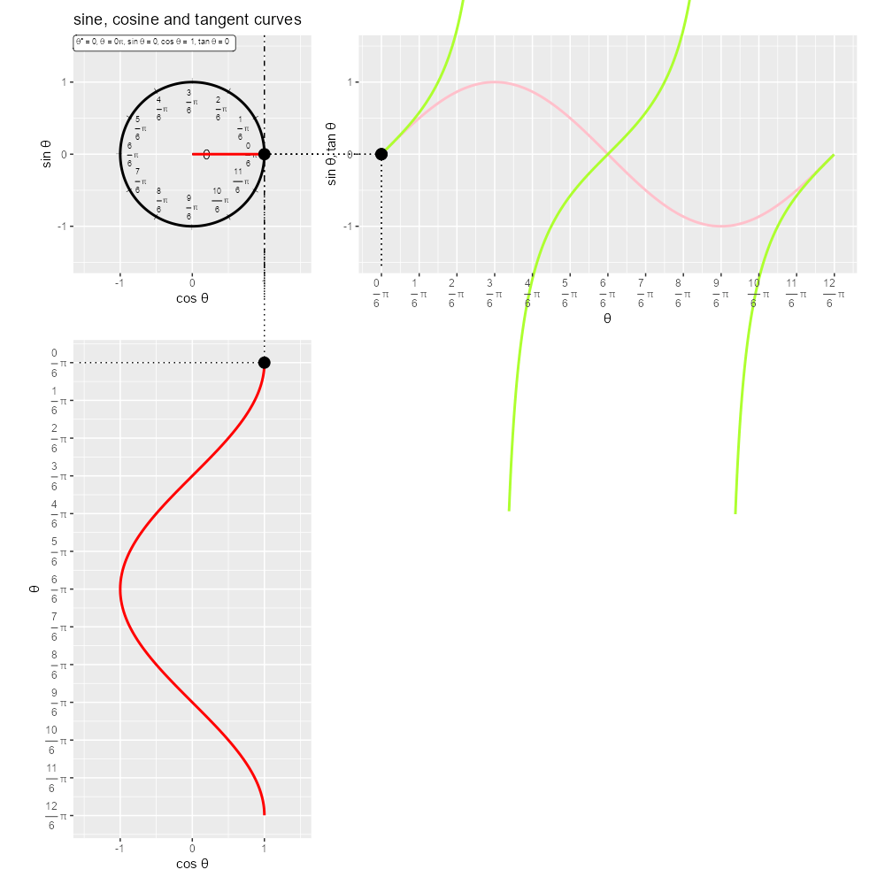

```{r setup, include=FALSE}
knitr::opts_chunk$set(
  echo = TRUE, 
  message = FALSE, error = FALSE, warning = FALSE # メッセージを非表示
)
```

----

【編集履歴】

- 2023/01/07：「三角関数の可視化」を追加

----


# 三角関数の可視化

　単位円における角度とsin関数(サイン波・正弦波)・cos関数(コサイン波・余弦波)・tan関数(タンジェント波・正接波)の関係をグラフで可視化します。\
\

　利用するパッケージを読み込みます。

```{r, eval=FALSE}
# 利用パッケージ
library(tidyverse)
library(patchwork)
library(magick)
```

```{r, echo=FALSE}
### 資料作成用:(チェック用)

# 利用パッケージ
library(ggplot2)
```

　この記事では、基本的に`パッケージ名::関数名()`の記法を使うので、パッケージを読み込む必要はありません。ただし、作図コードがごちゃごちゃしないようにパッケージ名を省略しているため`ggplot2`を読み込む必要があります。\
　また、ネイティブパイプ演算子`|>`を使っています。`magrittr`パッケージのパイプ演算子`%>%`に置き換えても処理できますが、その場合は`magrittr`も読み込む必要があります。\
\


## グラフの作成

　角度を固定したグラフで確認します。\
\


### 単位円・三角関数の作図

　まずは、単位円と3つの関数のグラフを作成します。\
\

　角度として用いる値を作成して、ラジアンに変換します。

```{r}
# 角度の値を作成
alpha_vals <- seq(from = 0, to = 360, by = 1)

# ラジアンに変換
theta_vals <- alpha_vals / 180 * pi
head(alpha_vals); head(theta_vals)
```

　度数法における角度を$\alpha$(図の中では$\theta^{\circ}$と表記します)とすると、弧度法におけるラジアンは$\theta = \alpha \frac{\pi}{180}$で計算できます。$\pi$は円周率で、Rでは`pi`で扱えます。\
　$0^{\circ} \leq \alpha \leq 360^{\circ}$の値を作成して、それぞれラジアンに変換します。\

　あるいは直接、ラジアンとして用いる値を作成します。

```{r}
# ラジアンの値を作成
theta_vals <- seq(from = 0, to = 2*pi, by = 0.01)
head(theta_vals)
```

　$0^{\circ} = 0 \frac{\pi}{180} = 0$、$360^{\circ} = 360 \frac{\pi}{180} = 2 \pi$なので、$0 \leq \theta \leq 2 \pi$の値を作成します。\

　$\theta$を三角関数の変数として、3つの関数を計算します。

```{r}
# サイン波・コサイン波・単位円の描画用
curve_df <- tibble::tibble(
  theta = theta_vals, 
  sin_theta = sin(theta_vals), 
  cos_theta = cos(theta_vals), 
  tan_theta = tan(theta)
)
curve_df
```

　sin関数$\sin(\theta)$、cos関数$\cos(\theta)$、tan関数$\tan(\theta)$を計算して、$\theta$の値と共に格納します。\

　単位円のグラフを作成します。

```{r, fig.width=5, fig.height=5}
# 半径の描画用
radius_df <- tibble::tibble(
  xstart = 0, 
  ystart = 0, 
  xend = 1, 
  yend = 0
)

# 半径ラベルの描画用
radius_label_df <- tibble::tibble(
  x = 0.5, 
  y = 0, 
  label = "r = 1"
)

# 単位円を作図
ggplot() + 
  geom_path(data = curve_df, 
            mapping = aes(x = cos_theta, y = sin_theta)) + # 単位円
  geom_segment(data = radius_df, 
               mapping = aes(x = xstart, y = ystart, xend = xend, yend = yend)) + # 半径
  geom_label(data = radius_label_df, 
             mapping = aes(x = x, y = y, label = label), 
             hjust = 0.5, vjust = 0) + # 半径ラベル
  coord_fixed(ratio = 1) + # アスペクト比
  labs(title = "unit circle", 
       x = expression(cos~theta), y = expression(sin~theta))
```

　横軸を$\cos \theta$、縦軸を$\sin \theta$として、(`geom_line()`ではなく)`geom_path()`で曲線(円)を描画します。綺麗な円を描画するには`coord_***()`の`ratio`引数を`1`にします。\
　また目安として、`geom_segment()`で線分(半径)を描画しています。\

　サイン波のグラフを作成します。

```{r, fig.width=10, fig.height=5}
# サイン波を作図
ggplot() + 
  geom_line(data = curve_df, 
            mapping = aes(x = theta, y = sin_theta)) + # 関数
  coord_fixed(ratio = 1) + # アスペクト比
  labs(title = "sine curve", 
       x = expression(theta), y = expression(sin~theta))
```

　横軸を$\theta$、縦軸を$\sin \theta$として描画します。`geom_line()`または`geom_path()`で曲線を描画します。\

　同様に、コサイン波のグラフを作成します。

```{r, fig.width=10, fig.height=5}
# コサイン波を作図
ggplot() + 
  geom_line(data = curve_df, 
            mapping = aes(x = theta, y = cos_theta)) + # 関数
  coord_fixed(ratio = 1) + # アスペクト比
  labs(title = "cosine curve", 
       x = expression(theta), y = expression(cos~theta))
```

　縦軸を$\cos \theta$にします。\

　タンジェント波を描画する前にデータを加工します。

```{r}
# 閾値を指定
threshold <- 5

# タンジェント波の描画用
tan_curve_df <- curve_df |> 
  dplyr::select(theta, tan_theta) |> 
  dplyr::mutate(
    tan_theta = dplyr::if_else(
      (tan_theta >= -threshold & tan_theta <= threshold), 
      true = tan_theta, 
      false = NA_real_
    )
  )# 閾値外の値を欠損値に置換
tan_curve_df
```

　閾値`threshold`を指定して、`-threshold`未満または`threshold`より大きい値を欠損値`NA`(実数型の欠損値`NA_real_`)に置き換えます。\

　タンジェント波のグラフを作成します。

```{r, fig.width=10, fig.height=8}
# タンジェント波を作図
ggplot() + 
  geom_line(data = tan_curve_df, 
            mapping = aes(x = theta, y = tan_theta)) + # 関数
  coord_cartesian(ylim = c(-threshold, threshold), expand = FALSE) + # 描画範囲
  labs(title = "tangent curve", 
       x = expression(theta), y = expression(tan~theta))
```

　縦軸を$\tan \theta$にします。欠損値に置き換えなかった場合は、上に突き抜けた後の点と下から伸びる前の点を繋ぐような線が描画されます。\
\


### 度数法と弧度法の関係

　次は、単位円を用いて、度数法における角度と弧度法における角度(ラジアン)の関係を確認します。\
\

　角度目盛を描画するためのデータフレームを作成します。

```{r}
# 角度目盛ラベルを作成
rad_label_vec   <- paste0("frac(", 0:12, ", 6)~pi")
angle_label_vec <- paste0(0:12*30, "*degree == frac(", 0:12, ", 6)~pi")

# 角度目盛ラベルの描画用
rad_label_df <- tibble::tibble(
  alpha = 0:11 * 30, 
  theta = 0:11 / 6 * pi, 
  x = cos(theta), 
  y = sin(theta), 
  rad_label = rad_label_vec[1:12], 
  angle_label = angle_label_vec[1:12]
)
rad_label_df
```

　$30^{\circ} = 30 \frac{\pi}{180} = \frac{\pi}{6}$間隔で目盛を表示することにします。\
　単位円のときと同様に、縦軸と横軸の値を計算して、ラベルと合わせて格納します。ラベルとして数式を表示する場合は、`expression()`の記法で指定します。\

　角度とラジアンの対応ラベルを単位円に重ねて描画します。

```{r, fig.width=6, fig.height=6}
# 単位円のグラフを作成
d <- 1.1
ggplot() + 
  geom_path(data = curve_df, 
            mapping = aes(x = cos_theta, y = sin_theta)) + # 単位円
  geom_text(data = rad_label_df, 
            mapping = aes(x = x, y = y, angle = alpha+90), 
            label = "|", size = 2) + # 角度目盛
  geom_text(data = rad_label_df, 
            mapping = aes(x = x*d, y = y*d, label = angle_label, hjust = 1-(x*0.5+0.5), vjust = 1-(y*0.5+0.5)), 
            parse = TRUE) + # 角度目盛ラベル
  geom_segment(data = rad_label_df, 
               x = 0, y = 0, mapping = aes(xend = x, yend = y), 
               linetype = "dashed") + # 角度目盛グリッド
  coord_fixed(ratio = 1, xlim = c(-d-0.3, d+0.3), ylim = c(-d-0.2, d+0.2)) + # 描画領域
  labs(title = "degree and radian", 
       x = expression(cos~theta), y = expression(sin~theta))
```

　ラベル配置位置の調整用の値を`d`とします。\
　また、横・縦方向の配置位置の調整用の引数`hjust, yjust`に、`x, y`列の値を使って指定しています。`x, y`列($\sin(\theta), \cos(\theta)$)は―1から1の値をとります。0.5を掛けると-0.5から0.5の値となり、さらに0.5を足すと0から1の値になります。(`hjust, vjust`を指定せずに`d`を少し大きくしても同様の図になります。)\

　角度が$30^{\circ}$変化するとラジアンが$\frac{\pi}{6}$変化するのを確認できます。また、$0^{\circ} = 0 = 2 \pi$です。\
\


### 角度とサイン波・コサイン波の関係

　では、角度と単位円、sin関数・cos関数のグラフの関係を可視化します。\
\

　角度を指定して、ラジアンに変換します。

```{r}
# 角度を指定
alpha <- 120

# ラジアンに変換
theta <- alpha / 180 * pi
theta
```

　$0^{\circ} \leq \alpha \leq 360^{\circ}$または$0 \leq \theta \leq 2 \pi$の範囲で1つの値を指定します。\

　関数曲線上の点を描画するためのデータフレームを作成します。

```{r}
# 曲線上の点の描画用
point_df <- tibble::tibble(
  theta = theta, 
  sin_theta = sin(theta), 
  cos_theta = cos(theta), 
  tan_theta = tan(theta)
)
point_df
```

　指定した角度と三角関数の値を格納します。\

　角度を示すために、半径を描画するためのデータフレームを作成します。

```{r}
# 半径の描画用
radius_df <- tibble::tibble(
  xstart = c(0, 0), 
  ystart = c(0, 0), 
  xend = c(1, cos(theta)), 
  yend = c(0, sin(theta))
)
radius_df
```

　$0^{\circ}$と$\alpha$において、原点と単位円上の点を結ぶ線分の座標を格納します。始点の座標を`xstart, ystart`、終点の座標を`xend, yend`列とします。\

　角度マークを描画するためのデータフレームを作成します。

```{r}
# 角度マークの描画用
d <- 0.1
angle_df <- tibble::tibble(
  deg = seq(from = 0, to = alpha, by = 1), 
  rad = deg / 180 * pi, 
  x = cos(rad) * d, 
  y = sin(rad) * d
)
angle_df
```

　扇形(角度マーク)を描画するための点の角度$0^{\circ} \leq c \leq \alpha$を作成して、単位円のときと同様に処理します。\

　角度ラベルを描画するためのデータフレームを作成します。

```{r}
# 角度ラベルの描画用
d <- 0.2
angle_label_df <- tibble::tibble(
  deg = 0.5 * alpha, 
  rad = deg / 180 * pi, 
  x = cos(rad) * d, 
  y = sin(rad) * d
)
angle_label_df
```

　角度の中点に配置することにします。\

　単位円上の点とsin関数・cos関数上の点を結ぶ線(の半分)を描画するためのデータフレームを作成します。

```{r}
# サイン波・コサイン波との対応用
l <- 2
segment_circle_df <- tibble::tibble(
  xstart = c(cos(theta), cos(theta)), 
  ystart = c(sin(theta), sin(theta)), 
  xend = c(l, cos(theta)), 
  yend = c(sin(theta), -l)
)
segment_circle_df
```

　単位円上の点から縦軸・横軸への垂線を引くように座標を指定します。作図時に、隣のグラフに届かないような長さ`l`を指定します。\

　角度に関する装飾をした単位円のグラフを作成します。

```{r, fig.width=6, fig.height=6}
# 関数ラベルを作成
fnc_label <- paste0(
  "list(", 
  "theta*degree==", alpha, 
  ", theta==", round(alpha/180, digits = 2), "*pi", 
  ", sin~theta==", round(sin(theta), digits = 2), 
  ", cos~theta==", round(cos(theta), digits = 2), 
  ")"
)

# 単位円を作図
d <- 0.9
circle_graph <- ggplot() + 
  geom_path(data = curve_df, 
            mapping = aes(x = cos_theta, y = sin_theta, color = theta), 
            size = 1) + # 単位円
  geom_segment(data = radius_df, 
               mapping = aes(x = xstart, y = ystart, xend = xend, yend = yend), 
               size = 1) + # 半径
  geom_path(data = angle_df, 
            mapping = aes(x = x, y = y)) + # 角度マーク
  geom_text(data = angle_label_df, 
            mapping = aes(x = x, y = y), 
            label = "theta", parse = TRUE) + # 角度ラベル
  geom_text(data = rad_label_df, 
            mapping = aes(x = x, y = y, angle = alpha+90), 
            label = "|", size = 2) + # ラジアン目盛
  geom_text(data = rad_label_df, 
            mapping = aes(x = x*d, y = y*d, label = rad_label, hjust = x*0.5+0.5, vjust = y*0.5+0.5), 
            parse = TRUE, size = 2.5) + # ラジアン目盛ラベル
  geom_segment(data = segment_circle_df, 
               mapping = aes(x = xstart, y = ystart, xend = xend, yend = yend), 
               linetype = "dashed") + # サイン波・コサイン波との対応線
  geom_point(data = point_df, 
             mapping = aes(x = cos_theta, y = sin_theta), 
             size = 4) + # 関数曲線上の点
  theme(legend.position = "none") + # 凡例を非表示
  coord_fixed(ratio = 1, clip = "off", xlim = c(-1, 1), ylim = c(-1, 1)) + # 描画領域
  labs(title = "sine and cosine curves", 
       subtitle = parse(text = fnc_label), 
       x = expression(cos~theta), y = expression(sin~theta))
circle_graph
```

　他の関数(曲線)との対応関係が分かりやすいように、`color`引数に`theta`の値を指定して、$\theta$が大きいほど薄い色になるようにしています。\

　先ほどと同様に、sin関数上の点と単位円上の点を結ぶ線(の半分)を描画するためのデータフレームを作成します。

```{r}
# 横軸(角度)・単位円との対応用
l <- 1.1
segment_sin_df <- tibble::tibble(
  xstart = c(theta, theta), 
  ystart = c(sin(theta), sin(theta)), 
  xend = c(theta, min(theta_vals)-l), 
  yend = c(-l, sin(theta))
)
segment_sin_df
```

\ 

　サイン波のグラフを作成します。

```{r, fig.width=8, fig.height=6}
# サイン波を作図
sin_graph <- ggplot() + 
  geom_line(data = curve_df, 
            mapping = aes(x = theta, y = sin_theta, color = theta), 
            size = 1) + # 関数
  geom_point(data = point_df, 
             mapping = aes(x = theta, y = sin_theta), 
             size = 4) + # 関数曲線上の点
  geom_segment(data = segment_sin_df, 
               mapping = aes(x = xstart, y = ystart, xend = xend, yend = yend), 
               linetype = "dashed") + # 単位円との対応線
  theme(legend.position = "none") + # 凡例を非表示
  scale_x_continuous(breaks = 0:12/6*pi, labels = parse(text = rad_label_vec)) + 
  coord_fixed(ratio = 2, clip = "off", xlim = c(min(theta_vals), max(theta_vals)), ylim = c(-1, 1)) + # 描画領域
  labs(x = expression(theta), y = expression(sin~theta))
sin_graph
```

　完成図の見やすさのためアスペクト比を調整しています。\

　cos関数上の点と単位円上の点を結ぶ線(の半分)を描画するためのデータフレームを作成します。

```{r}
# 縦軸(角度)・単位円との対応用
l <- 1.1
segment_cos_df <- tibble::tibble(
  xstart = c(cos(theta), cos(theta)), 
  ystart = c(theta, theta), 
  xend = c(-l, cos(theta)), 
  yend = c(theta, min(theta_vals)-l)
)
segment_cos_df
```

\ 

　縦向きのコサイン波のグラフを作成します。

```{r, fig.width=6, fig.height=8}
# コサイン波を作図
cos_graph <- ggplot() + 
  geom_path(data = curve_df, 
            mapping = aes(x = cos_theta, y = theta, color = theta), 
            size = 1) + # 関数
  geom_point(data = point_df, 
             mapping = aes(x = cos_theta, y = theta), 
             size = 4) + # 関数曲線上の点
  geom_segment(data = segment_cos_df, 
               mapping = aes(x = xstart, y = ystart, xend = xend, yend = yend), 
               linetype = "dashed") + # 単位円との対応線
  theme(legend.position = "none") + # 凡例を非表示
  scale_y_reverse(breaks = 0:12/6*pi, labels = parse(text = rad_label_vec)) + # y軸を反転
  coord_fixed(ratio = 0.5, clip = "off", xlim = c(-1, 1), ylim = c(max(theta_vals), min(theta_vals))) + # 描画領域
  labs(x = expression(cos~theta), y = expression(theta))
cos_graph
```

　単位円との対応関係のため、横軸を$\cos \theta$、縦軸を反転させた$\theta$とします。\

　3つのグラフを並べて描画します。

```{r, fig.width=10, fig.height=10}
# グラフを並べて描画
patchwork::wrap_plots(
  circle_graph, sin_graph, cos_graph, patchwork::plot_spacer(), 
  nrow = 2, ncol = 2
)
```

　`patchwork`パッケージの`wrap_plots()`を使ってグラフを並べます。`plot_spacer()`で空白を指定できます。\

　単位円における横軸の値がコサイン波(cos関数)、縦軸の値がサイン波(sin関数)に対応しているのを確認できます。\
\


### 角度とタンジェント波

　続いて、角度と単位円、tan関数のグラフの関係を可視化します。\
\

　単位円上の点とtan関数上の点を結ぶ線(の半分)を描画するためのデータフレームを作成します。

```{r}
# タンジェント波との対応用
l <- 2
segment_circle_df <- tibble::tibble(
  xstart = c(cos(theta), 1), 
  ystart = c(sin(theta), tan(theta)), 
  xend = c(1, l), 
  yend = c(tan(theta), tan(theta))
)
segment_circle_df
```

　単位円上の点$(\cos \theta, \sin \theta)$と縦軸が1の点$(1, \tan \theta)$を結ぶ線分と、点$(1, \tan \theta)$から縦軸への垂線を引くように座標を指定します。\

　閾値を指定して、範囲外の値を欠損値に置き換えます。

```{r}
# 閾値を指定
threshold <- 2

# タンジェント波の描画用
tan_curve_df <- curve_df |> 
  dplyr::select(theta, tan_theta) |> 
  dplyr::mutate(
    tan_theta = dplyr::if_else(
      (tan_theta >= -threshold & tan_theta <= threshold), 
      true = tan_theta, 
      false = NA_real_
    )
  )# 閾値外の値を欠損値に置換
tan_curve_df
```

　「単位円・三角関数の作図」のときと同じ処理です。\

　角度に関する装飾をした単位円のグラフを作成します。

```{r, fig.width=6, fig.height=7}
# 関数ラベルを作成
fnc_label <- paste0(
  "list(", 
  "theta*degree==", alpha, 
  ", theta==", round(alpha/180, digits = 2), "*pi", 
  ", tan~theta==", round(tan(theta), digits = 2), 
  ")"
)

# 単位円のグラフを作成
d <- 0.9
circle_graph <- ggplot() + 
  geom_path(data = curve_df, 
            mapping = aes(x = cos_theta, y = sin_theta, color = theta), 
            size = 1) + # 単位円
  geom_segment(data = radius_df, 
               mapping = aes(x = xstart, y = ystart, xend = xend, yend = yend), 
               size = 1) + # 半径
  geom_path(data = angle_df, 
            mapping = aes(x = x, y = y)) + # 角度マーク
  geom_text(data = angle_label_df, 
            mapping = aes(x = x, y = y), 
            label = "theta", parse = TRUE) + # 角度ラベル
  geom_text(data = rad_label_df, 
            mapping = aes(x = x, y = y, angle = alpha+90), 
            label = "|", size = 2) + # ラジアン目盛
  geom_text(data = rad_label_df, 
            mapping = aes(x = x*d, y = y*d, label = rad_label, hjust = x*0.5+0.5, vjust = y*0.5+0.5), 
            parse = TRUE, size = 2.5) + # ラジアン目盛ラベル
  geom_segment(data = segment_circle_df, 
               mapping = aes(x = xstart, y = ystart, xend = xend, yend = yend), 
               linetype = "dashed") + # タンジェント波との対応線
  geom_point(data = point_df, 
             mapping = aes(x = cos_theta, y = sin_theta), 
             size = 4) + # 関数曲線上の点
  geom_vline(xintercept = 1, linetype = "dotdash") + # x=1の軸線
  theme(legend.position = "none") + # 凡例を非表示
  coord_fixed(ratio = 1, clip = "off", xlim = c(-1.5, 1.5), c(-threshold, threshold)) + # アスペクト比
  labs(title = "tangent curve", 
       subtitle = parse(text = fnc_label), 
       x = expression(cos~theta), y = expression(sin~theta))
circle_graph
```

　tan関数の値が分かりやすいように、横軸が1の垂直線を`geom_vline()`で描画します。\

　tan関数上の点と単位円上の点を結ぶ線(の半分)を描画するためのデータフレームを作成します。

```{r}
# 横軸(角度)・単位円との対応用
l <- 1.1
segment_tan_df <- tibble::tibble(
  xstart = c(theta, theta), 
  ystart = c(tan(theta), tan(theta)), 
  xend = c(theta, min(theta_vals)-l), 
  yend = c(-threshold*l, tan(theta))
)
segment_tan_df
```

\ 

　タンジェント波のグラフを作成します。

```{r, fig.width=8, fig.height=7}
# タンジェント波を作図
tan_graph <- ggplot() + 
  geom_line(data = tan_curve_df, 
            mapping = aes(x = theta, y = tan_theta, color = theta), 
            size = 1) + # 関数
  geom_point(data = point_df, 
             mapping = aes(x = theta, y = tan_theta), 
             size = 4) + # 関数曲線上の点
  geom_segment(data = segment_tan_df, 
               mapping = aes(x = xstart, y = ystart, xend = xend, yend = yend), 
               linetype = "dashed") + # 単位円との対応線
  theme(legend.position = "none") + # 凡例を非表示
  scale_x_continuous(breaks = 0:12/6*pi, labels = parse(text = rad_label_vec)) + 
  coord_fixed(ratio = 1, clip = "off", xlim = c(min(theta_vals), max(theta_vals)), ylim = c(-threshold, threshold)) + # 描画領域
  labs(x = expression(theta), y = expression(tan~theta))
tan_graph
```

\ 

　2つのグラフを並べて描画します。

```{r, fig.width=10, fig.height=6}
# グラフを並べて描画
patchwork::wrap_plots(
  circle_graph, tan_graph, 
  nrow = 1, ncol = 2
)
```

\ 


## アニメーションの作成

　次は、角度を変化させたアニメーションで確認します。\
\


### 単位円と三角関数の関係

　角度の変化と単位円、sin関数・cos関数・tan関数の関係をアニメーションで可視化します。\
\

　フレーム数を指定して、角度として用いる値を作成します。

```{r}
# フレーム数を指定
frame_num <- 100

# 角度として使う値を作成
alpha_i <- seq(from = 0, to = 360, length.out = frame_num+1)[1:frame_num]
theta_i <- alpha_i / 180 * pi
head(alpha_i); head(theta_i)
```

　フレーム数`frame_num`を指定して、$0^{\circ} \leq \alpha < 360^{\circ}$と$0 \leq \theta < 2 \pi$の範囲でそれぞれ`frame_num`個の等間隔の値を作成します。\

<details><summary>・コード(クリックで展開)</summary>

　順番に値を取り出して作図し、グラフを書き出します。

```{r}
# 一時保存フォルダを指定
dir_path <- "trigonometric/figure/tmp_folder"

# 角度ごとに作図
for(i in 1:frame_num) {
  
  # i番目の値を取得
  alpha <- alpha_i[i]
  theta <- theta_i[i]
  
  # 曲線上の点の描画用
  point_df <- tibble::tibble(
    theta = theta, 
    sin_theta = sin(theta), 
    cos_theta = cos(theta), 
    tan_theta = tan(theta)
  )
  
  # 半径の描画用
  radius_df <- tibble::tibble(
    xstart = c(0, 0), 
    ystart = c(0, 0), 
    xend = c(1, cos(theta)), 
    yend = c(0, sin(theta))
  )
  
  # 角度マークの描画用
  d <- 0.1
  angle_df <- tibble::tibble(
    deg = seq(from = 0, to = alpha, by = 1), 
    rad = deg / 180 * pi, 
    x = cos(rad) * d, 
    y = sin(rad) * d
  )
  
  # 角度ラベルの描画用
  d <- 0.2
  angle_label_df <- tibble::tibble(
    deg = 0.5 * alpha, 
    rad = deg / 180 * pi, 
    x = cos(rad) * d, 
    y = sin(rad) * d
  )
  
  # 三角関数との対応用
  l <- 2
  segment_circle_df <- tibble::tibble(
    xstart = c(cos(theta), cos(theta), cos(theta), 1), 
    ystart = c(sin(theta), sin(theta), sin(theta), tan(theta)), 
    xend = c(l, cos(theta), 1, l), 
    yend = c(sin(theta), -l, tan(theta), tan(theta))
  )
  
  # 
  fnc_df <- tibble::tibble(
    xstart = c(cos(theta), 0, 1), 
    ystart = c(0, 0, 0), 
    xend = c(cos(theta), cos(theta), 1), 
    yend = c(sin(theta), 0, tan(theta)), 
    fnc = c("sin", "cos", "tan")
  )
  
  # 関数ラベルを作成
  fnc_label_df <- tibble::tibble(
    x = -Inf, 
    y = Inf, 
    fnc_label = paste0(
      "list(", 
      "theta*degree==", round(alpha, digits = 2), 
      ", theta==", round(alpha/180, digits = 2), "*pi", 
      ", sin~theta==", round(sin(theta), digits = 2), 
      ", cos~theta==", round(cos(theta), digits = 2), 
      ", tan~theta==", round(tan(theta), digits = 2), 
      ")"
    )
  )
  
  # 単位円のグラフを作成
  d <- 0.9
  l <- 1.5
  circle_graph <- ggplot() + 
    geom_path(data = curve_df, 
              mapping = aes(x = cos_theta, y = sin_theta), 
              size = 1) + # 単位円
    geom_segment(data = radius_df, 
                 mapping = aes(x = xstart, y = ystart, xend = xend, yend = yend)) + # 半径
    geom_path(data = angle_df, 
              mapping = aes(x = x, y = y)) + # 角度マーク
    geom_text(data = angle_label_df, 
              mapping = aes(x = x, y = y), 
              label = "theta", parse = TRUE) + # 角度ラベル
    geom_text(data = rad_label_df, 
              mapping = aes(x = x, y = y, angle = alpha+90), 
              label = "|", size = 2) + # ラジアン目盛
    geom_text(data = rad_label_df, 
              mapping = aes(x = x*d, y = y*d, label = rad_label, hjust = x*0.5+0.5, vjust = y*0.5+0.5), 
              parse = TRUE, size = 2.5) + # ラジアン目盛ラベル
    geom_segment(data = segment_circle_df, 
                 mapping = aes(x = xstart, y = ystart, xend = xend, yend = yend), 
                 linetype = "dotted") + # 関数との対応線
    geom_vline(xintercept = 1, linetype = "dotdash") + # x=1の軸線
    geom_segment(data = fnc_df, 
                 mapping = aes(x = xstart, y = ystart, xend = xend, yend = yend, color = fnc), 
                 size = 1) + # 単位円におけ関数の値
    geom_point(data = point_df, 
               mapping = aes(x = cos_theta, y = sin_theta), 
               size = 4) + # 関数曲線上の点
    geom_label(data = fnc_label_df, 
               mapping = aes(x = x, y = y, label = fnc_label), 
               parse = TRUE, hjust = 0, vjust = 1, size = 2.5) + # 関数ラベル
    scale_color_manual(breaks = c("sin", "cos", "tan"), values = c("pink", "red", "greenyellow")) + # 単位円におけ関数の色
    theme(legend.position = "none") + # 凡例を非表示
    coord_fixed(ratio = 1, clip = "off", xlim = c(-l, l), c(-l, l)) + # アスペクト比
    labs(title = "sine, cosine and tangent curves", 
         x = expression(cos~theta), y = expression(sin~theta))
  
  # 閾値外の値を欠損値に置換
  threshold <- 5
  tan_curve_df <- curve_df |> 
    dplyr::select(theta, tan_theta) |> 
    dplyr::mutate(
      tan_theta = dplyr::if_else(
        (tan_theta >= -threshold & tan_theta <= threshold), 
        true = tan_theta, 
        false = NA_real_
      )
    )
  
  # x軸(角度)・単位円との対応用
  l <- 1.6
  segment_sin_tan_df <- tibble::tibble(
    xstart = c(theta, theta, theta, theta), 
    ystart = c(sin(theta), sin(theta), tan(theta), tan(theta)), 
    xend = c(theta, min(theta_vals)-l, theta, min(theta_vals)-l), 
    yend = c(-l, sin(theta), -l, tan(theta))
  )
  
  # サイン波・タンジェント波を作図
  l <- 1.5
  sin_tan_graph <- ggplot() + 
    geom_line(data = curve_df, 
            mapping = aes(x = theta, y = sin_theta), 
            color = "pink", size = 1) + # サイン関数
    geom_point(data = point_df, 
               mapping = aes(x = theta, y = sin_theta), 
               size = 4) + # サイン関数曲線上の点
    geom_line(data = tan_curve_df, 
              mapping = aes(x = theta, y = tan_theta), 
              color = "greenyellow", size = 1) + # コサイン関数
    geom_point(data = point_df, 
               mapping = aes(x = theta, y = tan_theta), 
               size = 4) + # コサイン関数曲線上の点
    geom_segment(data = segment_sin_tan_df, 
                 mapping = aes(x = xstart, y = ystart, xend = xend, yend = yend), 
                 linetype = "dotted") + # 単位円との対応線
    theme(legend.position = "none") + # 凡例を非表示
    scale_x_continuous(breaks = 0:12/6*pi, labels = parse(text = rad_label_vec)) + 
    coord_fixed(ratio = 1, clip = "off", xlim = c(0, 2*pi), ylim = c(-l, l)) + # 描画領域
    labs(x = expression(theta), y = expression(list(sin~theta, tan~theta)))
  
  # y軸(角度)・単位円との対応用
  l <- 1.6
  segment_cos_df <- tibble::tibble(
    xstart = c(cos(theta), cos(theta)), 
    ystart = c(theta, theta), 
    xend = c(-l, cos(theta)), 
    yend = c(theta, min(theta_vals)-l)
  )

  # コサイン波を作図
  l <- 1.5
  cos_graph <- ggplot() + 
    geom_path(data = curve_df, 
              mapping = aes(x = cos_theta, y = theta), 
              color = "red", size = 1) + # 関数
    geom_point(data = point_df, 
               mapping = aes(x = cos_theta, y = theta), 
               size = 4) + # 関数曲線上の点
    geom_segment(data = segment_cos_df, 
                 mapping = aes(x = xstart, y = ystart, xend = xend, yend = yend), 
                 linetype = "dotted") + # 単位円との対応線
    theme(legend.position = "none") + # 凡例を非表示
    scale_y_reverse(breaks = 0:12/6*pi, labels = parse(text = rad_label_vec)) + # y軸を反転
    coord_fixed(ratio = 1, clip = "off", xlim = c(-l, l), ylim = c(2*pi, 0)) + # 描画領域
    labs(x = expression(cos~theta), y = expression(theta))
  
  # グラフを並べて描画
  graph <- patchwork::wrap_plots(
    circle_graph, sin_tan_graph, cos_graph, patchwork::plot_spacer(), 
    nrow = 2, ncol = 2
  )
  
  # ファイルを書き出し
  file_path <- paste0(dir_path, "/", stringr::str_pad(i, width = nchar(frame_num), pad = "0"), ".png") # widthはframe_numの桁数
  ggplot2::ggsave(filename = file_path, plot = graph, width = 1000, height = 1000, units = "px", dpi = 100)
  
  # 途中経過を表示
  #print(paste0(i, " / ", frame_num))
}
```

　変数の値(角度)ごとに同様に処理します。作成したグラフを`ggsave()`で保存します。\
　保存用のフォルダは空である必要があります。また、画像ファイルの読み込み時に、文字列基準で書き出した順番になるようなファイル名である必要があります。\
　(初回の作図では、`angle_df`が1行しか値を持たないため、`geom_path()`で描画できずメッセージが表示されます。)\

</details>

\ 

　アニメーション(gif画像)を作成します。

```{r}
# ファイル名を取得
file_name_vec <- list.files(dir_path)

# ファイルパスを作成
file_path_vec <- paste0(dir_path, "/", file_name_vec)

# gif画像を作成
file_path_vec |> 
  magick::image_read() |> 
  magick::image_animate(fps = 1, dispose = "previous") |> 
  magick::image_write_gif(path = "trigonometric/figure/curve.gif", delay = 0.1) -> tmp_path
```



　`list.files()`で`dir_path`フォルダ内のファイル名を取得して、ファイルパスを作成します。\
　`image_read()`で画像を読み込んで、`image_animate()`でgifファイルに変換して、`image_write_gif()`でgifファイルを書き出します。`delay`引数に1秒当たりのフレーム数の逆数を指定します。\

　描画範囲外の変数(角度)に関しても周期的に推移します。\
\

　この記事では、三角関数を可視化して確認しました。\
\

